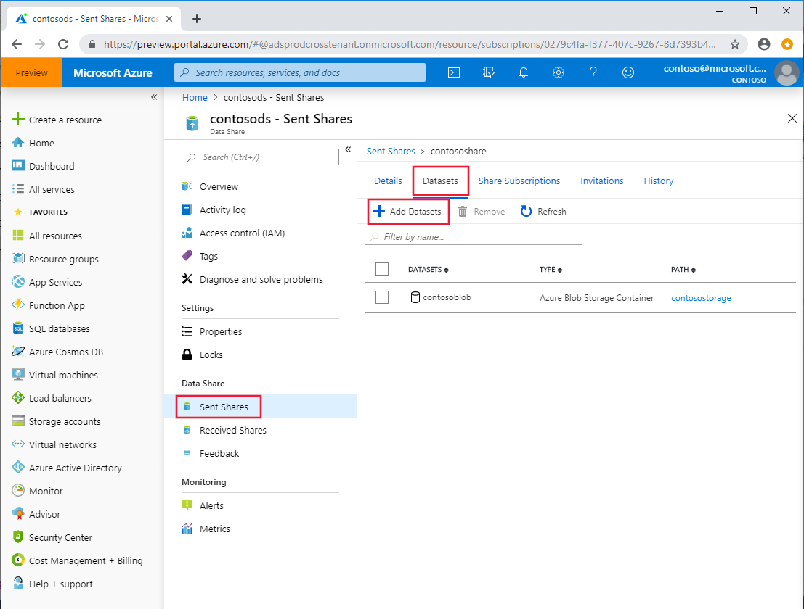

# How To: Add datasets to an existing data share

This how-to guide will show you how to add datasets to a pre-existing data share. 

For information on how to add datasets as you create a share, see the tutorial on creating a data share.

<!-- > [!NOTE]
> If you are new to Azure Data Share, see [Introduction to Azure Data Share](data-share-introduction.md) before doing this quickstart.  -->

## Add Datasets

1. Navigate to your **Data Share Account** and go to **Sent Shares**. 
2. Select the share to which you would like to add datasets. 
3. Click on the **Datasets** tab to view the datasets that are currently part of your share.
4. To add a new one, click **+ Add Datasets** underneath the tabs.
   
   

5. A panel will pop out on the right side of the page. Select the Dataset Type you would like to add and then click **Next**.
6. Select the subscription and resource group of your dataset(s).
7. Check the checkboxes of the datasets you would like to add to the share.
8. Click "Add Datasets".
9. Your new datasets have now been added to this data share.

Note: A snapshot must be triggered by your consumers in order for them to see the new datasets. If there's a synchronization schedule configured, consumers will see the new datasets once the next scheduled sync completes. Without a sync schedule configured, the consumer must manually trigger a full or incremental copy of the data to receive the updates.

<!-- (For more information on Snapshots see here (link to Concepts -> Azure Data Share Terminology -> Snapshot)) -->