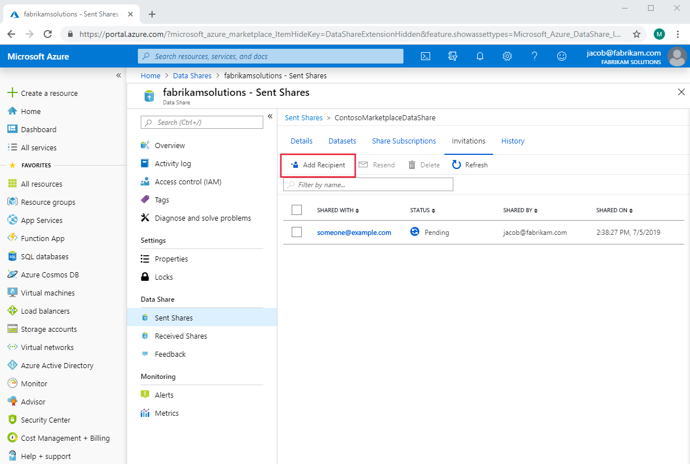
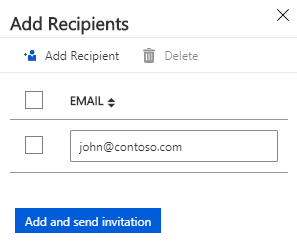

# How to add a recipient to an existing data share

This article will show you how to add recipients to a pre-existing data share. 

For information on how to add recipients as you create a share, see the [Share data](share-your-data.md) tutorial.

## Navigate to a sent data share

In the Azure Data Share service, navigate to your sent share and select the **Invitations** tab. Listed here are all of the recipients of invitations to this data share. To add a new one, click **Add Recipient**.

A panel will pop out on the right side of the page. Click **Add Recipient** and then fill in the email of your new recipient on the blank line. Add as many recipients as you would like.

Click **Add and send invitation**. The new recipient(s) will be sent invitation emails to this data share.

## Next steps
To learn about how to delete an invitation to a share, continue to the next how-to guide.

> [!div class="nextstepaction"]
> [Delete an Invitation](how-to-delete-invitation.md)