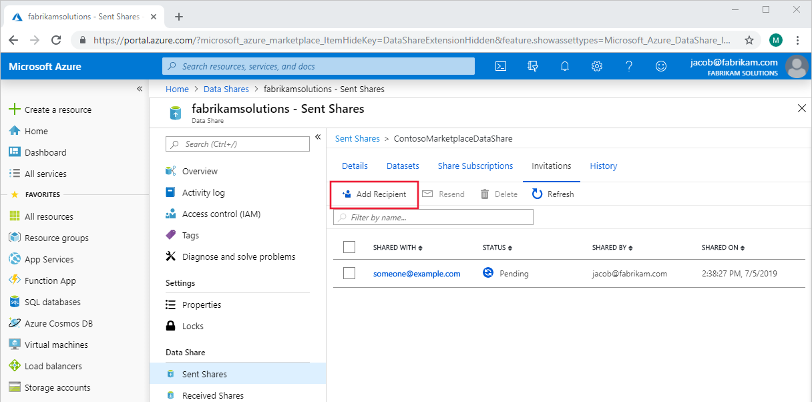
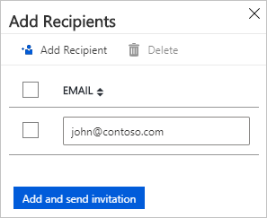

# How to add a recipient to your share

You can add recipient when you create a new share or to an existing share. From Azure Data Share UI, you can add recipient using the Azure sign-in email of the user.  From API, you can use a combination of user/service principal and tenant ID. When a tenant ID is specified, the invitation can only be accepted into this tenant. Also from API, you can create an invitation without sending an email to the recipient. 

## Add recipient to an existing share

In Azure Data Share, navigate to your sent share and select the **Invitations** tab. Listed here are all of the recipients of invitations to this data share. To add a new one, select **Add Recipient**.

A panel will pop out on the right side of the page. Select **Add Recipient** and then fill in the email of your new recipient on the blank line. Make sure to use recipient's Azure sign-in email (using their email alias won't work). 

Select **Add and send invitation**. The new recipient(s) will be sent invitation emails to this share.

## Next steps
Learn more about how to [delete an invitation to a share](how-to-delete-invitation.md).
