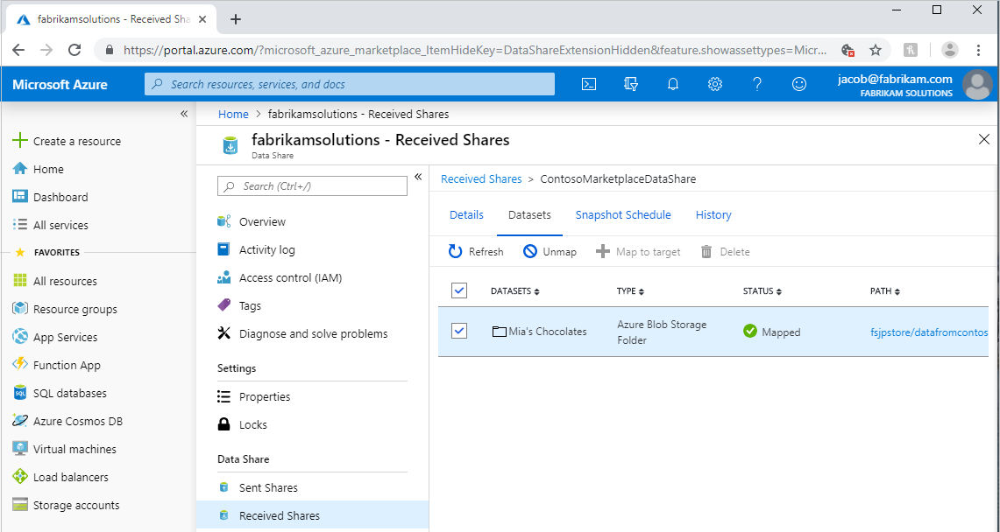
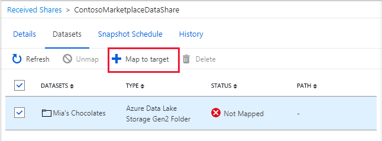
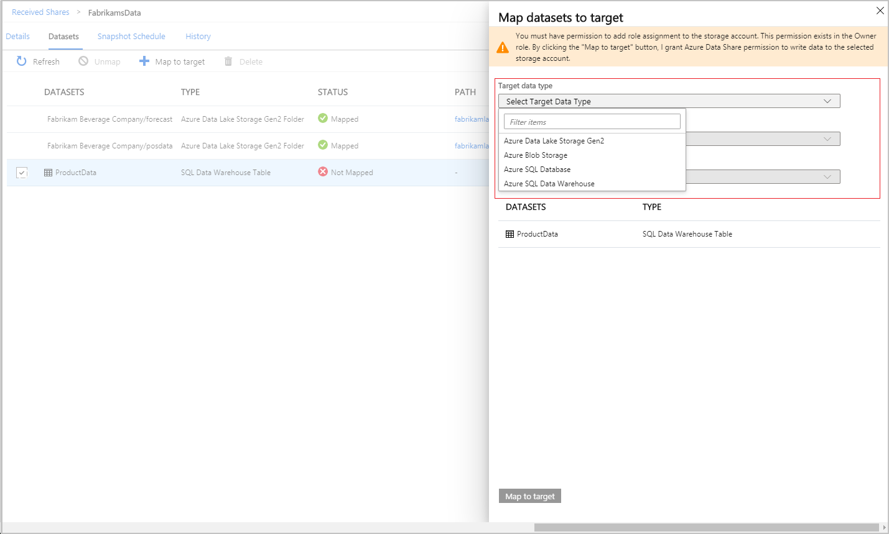
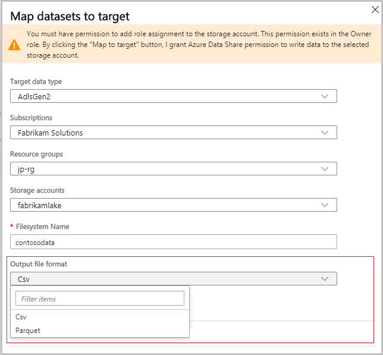

# How to configure a dataset mapping for a received share in Azure Data Share

This article explains how to configure a dataset mapping for a Received Share using Azure Data Share. You may want to configure a dataset mapping to specify a target data store where you want to receive data, or if you need to change the target data store.

## Navigate to a received data share

In the Azure Data Share service, navigate to your received share and select the **Datasets** tab. 

 

Check the box next to the dataset you'd like to assign a destination to. Select **+ Map to target** to choose a new destination store. Select **Unmap** first if the dataset is already mapped and you want to change the target data store.

 

## Select a target store

Select a target data store type that you'd like the data to land in. For snapshot-based sharing, any data that already exists in any previously mapped storage accounts will not be automatically moved to the new target store. For in-place sharing, select a data store in the Location specified. The Location is the Azure data center where data provider's source data store is located at.

 

## Select a file format (SQL sources only)

If the source data is from a SQL-based source and you want to receive it as a file, you can choose which format it is received in. 

## Next steps

To learn how to start sharing data, continue to the [share your data](share-your-data.md) tutorial.

