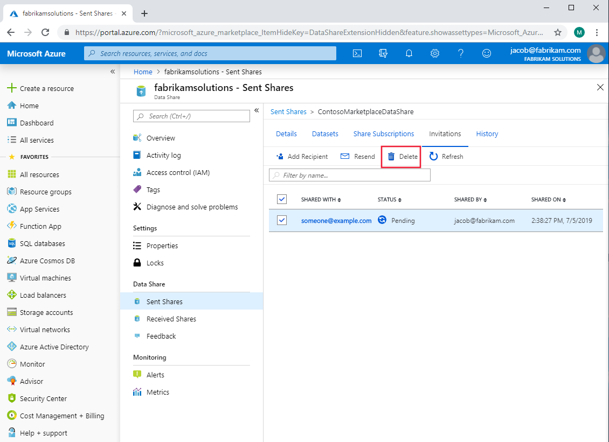

# How to delete an invitation to a recipient in Azure Data Share

This article explains how to delete an invitation to a recipient before they accept it. This will prevent them from creating a share subscription and they will never receive any shared data. If you delete the invitation to a consumer who has already created a share subscription, deleting their invitation won't have any impact.

## Navigate to a sent data share

In Azure Data Share, navigate to your sent share and select the **Invitations** tab. Listed here are all of the recipients of invitations to this data share. Click the boxes next to the recipients whose invitations you would like to delete and then click **Delete**.

## Next steps
Learn more about how to [revoke a share subscription](how-to-revoke-share-subscription.md).
