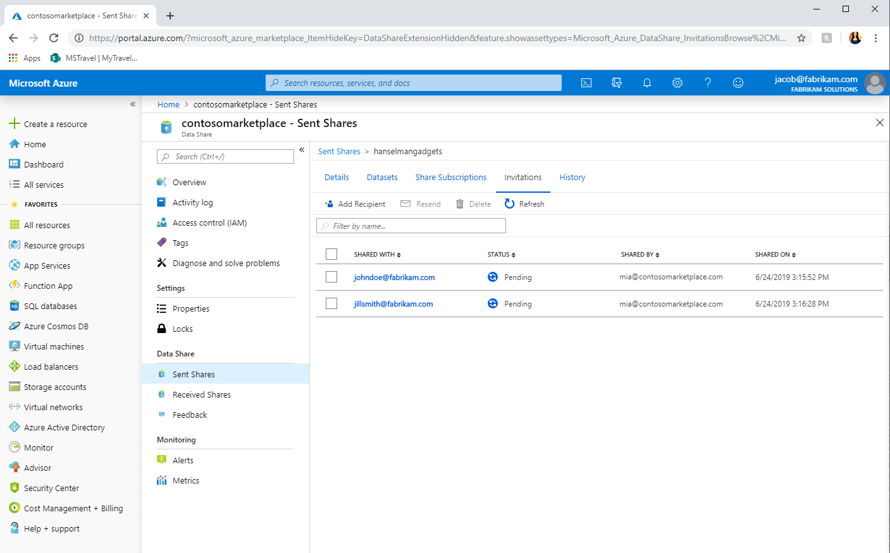
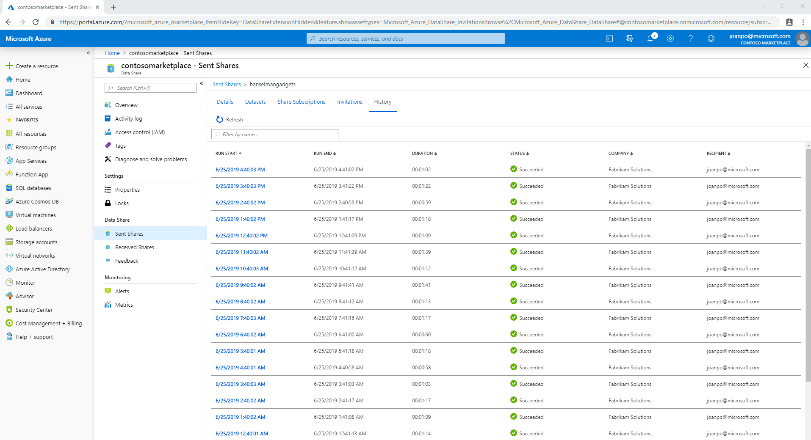
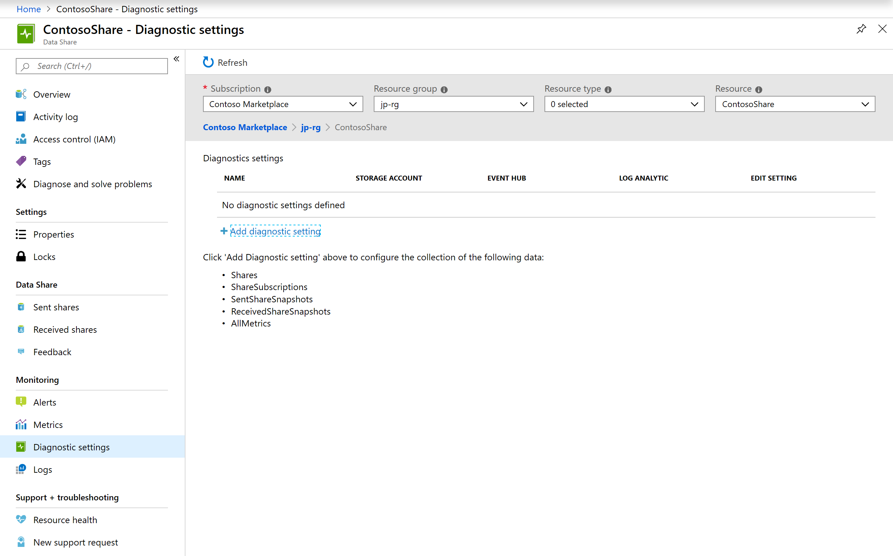

# Monitor Azure Data Share  

This article explains how you can monitor your data shares using Azure Data Share. As a data provider, you are able to monitor various aspects of your data sharing relationships. Details such as whether your data consumers have accepted your invitation to the data share, as well as whether they have created a share subscription and started to use your data are all available to monitor. 

As a data consumer, you can monitor the snapshots that have been triggered into your Azure subscription. 

## Monitor invitation status

View the status of your data share invitations by navigating to Sent shares -> Invitations. 

 

There are three states that your invitation can be in:

* Pending - Data share recipient has not yet accepted the invitation.
* Accepted - Data share recipient has accepted the invitation.
* Rejected - Data share recipient has rejected the invitation.

> [!IMPORTANT]
> If you delete an invitation after it has already been accepted, it is not equivalent to revoking access. If you would like to stop future snapshots from being copied into your data consumers storage account, you must revoke access through the *Share subscriptions* tab. 

## Monitor share subscriptions

View the status of your share subscriptions by navigating to Sent Shares -> Share Subscriptions. This will give you details about active subscriptions created by your data consumers after accepting your invitation. You can stop future updates to your data consumer by selecting the share subscription and selecting *Revoke*. 

## Snapshot history 

In the **History** tab of a share, you are able to view when data is copied from data provider to data consumer's data store. You are able to monitor the frequency, duration and status of each snapshot. 

 

You can view more details about each snapshot run by clicking on the run start date. Then click on the status for each dataset to view the amount of data transferred, number of files/records copied, duration of the snapshot, number of vCores used and error message if there is any. 

Up to 30 days of snapshot history is displayed. If you need to save and see more than 30 days worth of history, you can leverage diagnostic setting.

## Diagnostic setting

You can configure diagnostic setting to save log data or events. Navigate to Monitoring -> Diagnostic settings and select **Add diagnostic setting**. Select the log data or events that you are interested in, and where you want to store or send them. 

 

## Next Steps 

Learn more about [Azure Data Share terminology](terminology.md)
