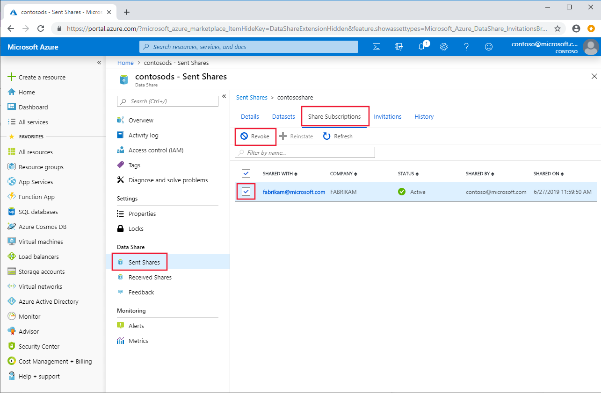

# How To: Revoke a consumer's share subscription

> This will prevent the consumer from triggering any more snapshots. If the consumer has not yet triggered a snapshot, they will never receive the data once the share subscription is deleted. If they have previously triggered a snapshot, the latest data that they have will remain in their account.

1. Navigate to your **Data Share Account** and go to **Sent Shares**. 
2. Select the share from which you would like to delete a share subscription. 
3. Click on the **Share Subscriptions** tab. Listed here are all of the share subscriptions to this data share.
4. Check the boxes next to the recipients whose share subscriptions you would like to delete.
5. Click **Revoke**

   

## Next steps
In this how-to guide, you learned about adding datasets to a pre-existing share. See Tutorials, Concepts, or Resources to learn more.