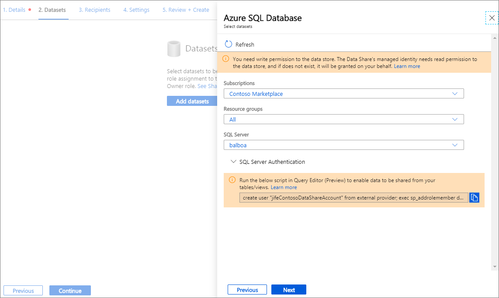

# Share and receive data from Azure SQL Database and Azure Synapse Analytics

[!INCLUDE[appliesto-sql](includes/appliesto-sql.md)]

Azure Data Share supports snapshot-based sharing Azure SQL Database and Azure Synapse Analytics (formerly Azure SQL DW). This article explains how to share and receive data from these sources.

Azure Data Share supports sharing of tables or views from Azure SQL Database and Azure Synapse Analytics (formerly Azure SQL DW). Data consumers can choose to accept the data into Azure Data Lake Storage Gen2 or Azure Blob Storage as csv or parquet file, as well as into Azure SQL Database and Azure Synapse Analytics as tables.

When accepting data into Azure Data Lake Store Gen2 or Azure Blob Storage, full snapshots overwrite the contents of the target file if already exists.
When data is received into table and if the target table does not already exist, Azure Data Share creates the SQL table with the source schema. If a target table already exists with the same name, it will be dropped and overwritten with the latest full snapshot. Incremental snapshots are not currently supported.

## Share data

### Prerequisites to share data

* Azure Subscription: If you don't have an Azure subscription, create a [free account](https://azure.microsoft.com/free/) before you begin.
* Your recipient's Azure login e-mail address (using their e-mail alias won't work).
* If the source Azure data store is in a different Azure subscription than the one you will use to create Data Share resource, register the [Microsoft.DataShare resource provider](concepts-roles-permissions.md#resource-provider-registration) in the subscription where the Azure data store is located. 

### Prerequisites for SQL source
Below is the list of prerequisites for sharing data from SQL source. You can also follow the [step by step demo](https://youtu.be/hIE-TjJD8Dc) to configure prerequisites.

* An Azure SQL Database or Azure Synapse Analytics (formerly SQL Data Warehouse) with tables and views that you want to share.
* Permission to write to the databases on SQL server, which is present in *Microsoft.Sql/servers/databases/write*. This permission exists in the Contributor role.
* Permission for the data share to access the data warehouse. This can be done through the following steps: 
    1. In Azure portal, navigate to the SQL server and set yourself as the Azure Active Directory Admin.
    1. Connect to the Azure SQL Database/Data Warehouse using [Query Editor](https://docs.microsoft.com/azure/azure-sql/database/connect-query-portal#connect-using-azure-active-directory) or SQL Server Management Studio with Azure Active Directory authentication. 
    1. Execute the following script to add the Data Share resource Managed Identity as a db_datareader. You must connect using Active Directory and not SQL Server authentication. 
    
        ```sql
        create user "<share_acct_name>" from external provider;     
        exec sp_addrolemember db_datareader, "<share_acct_name>"; 
        ```                   
       Note that the *<share_acc_name>* is the name of your Data Share resource. If you have not created a Data Share resource as yet, you can come back to this pre-requisite later.  

* An Azure SQL Database User with 'db_datareader' access to navigate and select the tables and/or views you wish to share. 

* SQL Server Firewall access. This can be done through the following steps: 
    1. In SQL server in Azure portal, navigate to *Firewalls and virtual networks*
    1. Click **Yes** for *Allow Azure services and resources to access this server*.
    1. Click **+Add client IP**. Client IP address is subject to change. This process might need to be repeated the next time you are sharing SQL data from Azure portal. You can also add an IP range.
    1. Click **Save**. 

### Sign in to the Azure portal

Sign in to the [Azure portal](https://portal.azure.com/).

### Create a Data Share Account

Create an Azure Data Share resource in an Azure resource group.

1. Select the menu button in the upper-left corner of the portal, then select **Create a resource** (+).

1. Search for *Data Share*.

1. Select Data Share and Select **Create**.

1. Fill out the basic details of your Azure Data Share resource with the following information. 

     **Setting** | **Suggested value** | **Field description**
    |---|---|---|
    | Subscription | Your subscription | Select the Azure subscription that you want to use for your data share account.|
    | Resource group | *test-resource-group* | Use an existing resource group or create a new resource group. |
    | Location | *East US 2* | Select a region for your data share account.
    | Name | *datashareaccount* | Specify a name for your data share account. |
    | | |

1. Select **Review + create**, then **Create** to provision your data share account. Provisioning a new data share account typically takes about 2 minutes or less. 

1. When the deployment is complete, select **Go to resource**.

### Create a share

1. Navigate to your Data Share Overview page.

     

1. Select **Start sharing your data**.

1. Select **Create**.   

1. Fill out the details for your share. Specify a name, share type, description of share contents, and terms of use (optional). 

     

1. Select **Continue**.

1. To add Datasets to your share, select **Add Datasets**. 

    

1. Select the dataset type that you would like to add. You will see a different list of dataset types depending on the share type (snapshot or in-place) you have selected in the previous step. 

        

1. Select your SQL server, provide credentials and select **Next** to navigate to the object you would like to share and select 'Add Datasets'. 

        

1. In the Recipients tab, enter in the email addresses of your Data Consumer by selecting '+ Add Recipient'. 

     

1. Select **Continue**.

1. If you have selected snapshot share type, you can configure snapshot schedule to provide updates of your data to your data consumer. 

     

1. Select a start time and recurrence interval. 

1. Select **Continue**.

1. In the Review + Create tab, review your Package Contents, Settings, Recipients, and Synchronization Settings. Select **Create**.

Your Azure Data Share has now been created and the recipient of your Data Share is now ready to accept your invitation. 

## Receive data

### Prerequisites to receive data
Before you can accept a data share invitation, you must provision a number of Azure resources, which are listed below. 

Ensure that all pre-requisites are complete before accepting a data share invitation. 

* Azure Subscription: If you don't have an Azure subscription, create a [free account](https://azure.microsoft.com/free/) before you begin.
* A Data Share invitation: An invitation from Microsoft Azure with a subject titled "Azure Data Share invitation from **<yourdataprovider@domain.com>**".
* Register the [Microsoft.DataShare resource provider](concepts-roles-permissions.md#resource-provider-registration) in the Azure subscription where you will create a Data Share resource and the Azure subscription where your target Azure data stores are located.

### Prerequisites for target storage account
If you choose to receive data into Azure Storage, below is the list of prerequisites.

* An Azure Storage account: If you don't already have one, you can create an [Azure Storage account](https://docs.microsoft.com/azure/storage/common/storage-quickstart-create-account). 
* Permission to write to the storage account, which is present in *Microsoft.Storage/storageAccounts/write*. This permission exists in the Contributor role. 
* Permission to add role assignment to the storage account, which is present in *Microsoft.Authorization/role assignments/write*. This permission exists in the Owner role.  

### Prerequisites for SQL target
If you choose to receive data into Azure SQL Database, Azure Synapse Analytics, below is the list of prerequisites. You can also follow the [step by step demo](https://youtu.be/aeGISgK1xro) to configure prerequisites.

* Permission to write to databases on the SQL server, which is present in *Microsoft.Sql/servers/databases/write*. This permission exists in the Contributor role. 
* Permission for the data share resource's managed identity to access the Azure SQL Database or Azure Synapse Analytics. This can be done through the following steps: 
    1. In Azure portal, navigate to the SQL server and set yourself as the Azure Active Directory Admin.
    1. Connect to the Azure SQL Database/Data Warehouse using [Query Editor](https://docs.microsoft.com/azure/azure-sql/database/connect-query-portal#connect-using-azure-active-directory) or SQL Server Management Studio with Azure Active Directory authentication. 
    1. Execute the following script to add the Data Share Managed Identity as a 'db_datareader, db_datawriter, db_ddladmin'. You must connect using Active Directory and not SQL Server authentication. 

        ```sql
        create user "<share_acc_name>" from external provider; 
        exec sp_addrolemember db_datareader, "<share_acc_name>"; 
        exec sp_addrolemember db_datawriter, "<share_acc_name>"; 
        exec sp_addrolemember db_ddladmin, "<share_acc_name>";
        ```      
        Note that the *<share_acc_name>* is the name of your Data Share resource. If you have not created a Data Share resource as yet, you can come back to this pre-requisite later.         

* SQL Server Firewall access. This can be done through the following steps: 
    1. In SQL server in Azure portal, navigate to *Firewalls and virtual networks*
    1. Click **Yes** for *Allow Azure services and resources to access this server*.
    1. Click **+Add client IP**. Client IP address is subject to change. This process might need to be repeated the next time you are sharing SQL data from Azure portal. You can also add an IP range.
    1. Click **Save**. 

### Sign in to the Azure portal

Sign in to the [Azure portal](https://portal.azure.com/).

### Open invitation

1. You can open invitation from email or directly from Azure portal. 

   To open invitation from email, check your inbox for an invitation from your data provider. The invitation is from Microsoft Azure, titled **Azure Data Share invitation from <yourdataprovider@domain.com>**. Click on **View invitation** to see your invitation in Azure. 

   To open invitation from Azure portal directly, search for **Data Share Invitations** in Azure portal. This takes you to the list of Data Share invitations.

    

1. Select the share you would like to view. 

### Accept invitation
1. Make sure all fields are reviewed, including the **Terms of Use**. If you agree to the terms of use, you'll be required to check the box to indicate you agree. 

    

1. Under *Target Data Share Account*, select the Subscription and Resource Group that you'll be deploying your Data Share into. 

   For the **Data Share Account** field, select **Create new** if you don't have an existing Data Share account. Otherwise, select an existing Data Share account that you'd like to accept your data share into. 

   For the **Received Share Name** field, you may leave the default specified by the data provide, or specify a new name for the received share. 

   Once you've agreed to the terms of use and specified a Data Share account to manage your received share, Select **Accept and configure**. A share subscription will be created. 

    

   This takes you to your the received share in your Data Share account. 

   If you don't want to accept the invitation, Select *Reject*. 

### Configure received share
Follow the steps below to configure where you want to receive data.

1. Select **Datasets** tab. Check the box next to the dataset you'd like to assign a destination to. Select **+ Map to target** to choose a target data store. 

    

1. Select a target data store that you'd like the data to land in. Any data files or tables in the target data store with the same path and name will be overwritten. 

    

1. For snapshot-based sharing, if the data provider has created a snapshot schedule to provide regular update to the data, you can also enable snapshot schedule by selecting the **Snapshot Schedule** tab. Check the box next to the snapshot schedule and select **+ Enable**.

   

### Trigger a snapshot
These steps only apply to snapshot-based sharing.

1. You can trigger a snapshot by selecting **Details** tab followed by **Trigger snapshot**. Here, you can trigger a full or  incremental snapshot of your data. If it is your first time receiving data from your data provider, select full copy. For SQL sources, only full snapshot is supported.

    

1. When the last run status is *successful*, go to target data store to view the received data. Select **Datasets**, and click on the link in the Target Path. 

    

### View history
This step only applies to snapshot-based sharing. To view history of your snapshots, select **History** tab. Here you'll find history of all snapshots that were generated for the past 30 days. 

## Supported data types
When you share data from SQL source, the following mapping are used from SQL Server data types to Azure Data Share interim data types during snapshot process. 

| SQL Server data type | Azure Data Share interim data type |
|:--- |:--- |
| bigint |Int64 |
| binary |Byte[] |
| bit |Boolean |
| char |String, Char[] |
| date |DateTime |
| Datetime |DateTime |
| datetime2 |DateTime |
| Datetimeoffset |DateTimeOffset |
| Decimal |Decimal |
| FILESTREAM attribute (varbinary(max)) |Byte[] |
| Float |Double |
| image |Byte[] |
| int |Int32 |
| money |Decimal |
| nchar |String, Char[] |
| ntext |String, Char[] |
| numeric |Decimal |
| nvarchar |String, Char[] |
| real |Single |
| rowversion |Byte[] |
| smalldatetime |DateTime |
| smallint |Int16 |
| smallmoney |Decimal |
| sql_variant |Object |
| text |String, Char[] |
| time |TimeSpan |
| timestamp |Byte[] |
| tinyint |Int16 |
| uniqueidentifier |Guid |
| varbinary |Byte[] |
| varchar |String, Char[] |
| xml |String |

>[!NOTE]
> 1. For data types that map to the Decimal interim type, currently snapshot supports precision up to 28. If you have data that requires precision larger than 28, consider converting to a string. 
> 1.  If you are sharing data from Azure SQL database to Azure Synapse Analytics, not all data types are supported. Refer to [Table data types in Synapse SQL pool](https://docs.microsoft.com/azure/synapse-analytics/sql-data-warehouse/sql-data-warehouse-tables-data-types) for details. 

## SQL Always Encrypted or Dynamic Data Masking
Currently, Azure Data Share does not support Azure SQL databases with Always Encrypted configured. 

For source SQL tables with dynamic data masking, data will appear masked on the recipient side.

## SQL snapshot performance
SQL snapshot performance is impacted by a number of factors. It is always recommended to conduct your own performance testing. Below are some example factors impacting performance.

* Hardware configuration (e.g. vCores, memory, DWU) of the source and target SQL data store. 
* Concurrent access to the source and target data stores. If you are sharing multiple tables and views from the same SQL data store, or receive multiple tables and views into the same SQL data store, performance will be impacted.   
* Location of source and target data stores. 

## Troubleshoot SQL snapshot failure
The most common cause of snapshot failure is that Data Share does not have permission to the source or target data store. In order to grant Data Share permission to the source or target SQL data store, you must run the provided SQL script when connecting to the SQL database using Azure Active Directory authentication. To troubleshoot additional SQL snapshot failure, refer to [Troubleshoot snapshot failure](data-share-troubleshoot.md#snapshot-failed).

## Next steps
You have learned how to share and receive data from SQL sources using Azure Data Share service. To learn more about sharing from other data sources, continue to [supported data stores](supported-data-stores.md).


