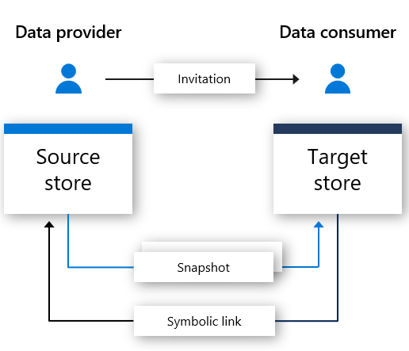

# What is Azure Data Share Preview?

In today's world, data is viewed as a key strategic asset that many organizations need to simply and securely share with their customers and partners. There are many ways that customers do this today, including through FTP, e-mail, APIs to name a few. Organizations can easily lose track of who they've shared their data with. Sharing data through FTP or through standing up their own API infrastructure is often expensive to provision and administer. There's management overhead associated with using these methods of sharing on a large scale. 

Many organizations need to be accountable for the data that they have shared. In addition to accountability, many organizations would like to be able to control, manage, and monitor all of their data sharing in a simple way. In today world, where data is expected to continue to grow at an exponential pace, organizations need a simple way to share big data. Customers demand the most up-to-date data to ensure that they are able to derive timely insights.

Azure Data Share Preview enables organizations to simply and securely share data with multiple customers and partners. In just a few clicks, you can provision a new data share account, add datasets, and invite your customers and partners to your data share. Data providers are always in control of the data that they have shared. Azure Data Share makes it simple to manage and monitor what data was shared, when and by whom. 

A data provider can stay in control of how their data is handled by specifying terms of use for their data share. The data consumer must accept these terms before being able to receive the data. Data providers can specify the frequency at which their data consumers receive updates. Access to new updates can be revoked at any time by the data provider. 

Azure Data Share helps enhance insights by making it easy to combine data from third parties to enrich analytics and AI scenarios. Easily use the power ot Azure analytics tools to prepare, process, and analyze data shared using Azure Data Share. 

## Scenarios for Azure Data Share

Azure Data Share can be used in a number of different industries. For example, a retailer may want to share recent point of sales data with their suppliers. Using Azure Data Share, a retailer can set up a data share containing point of sales data for all of their suppliers and share sales on an hourly or daily basis. 

Azure Data Share can also be used to establish a data marketplace for a specific industry. For example, a government or a research institution that regularly shares anonymized data about population growth with third parties. 

Another use case for Azure Data Share is establishing a data consortium. For example, a number of different research institutions can share data with a single trusted body. Data is analyzed, aggregated or processed using Azure analytics tools and then shared with interested parties. 

## How it works

Azure Data Share uses a snapshot-based sharing approach, where data moves from the data provider's Azure subscription and lands in the data consumer's Azure subscription. As a data provider, you provision a data share and invite recipients to the data share. Data consumers receive an invitation to your data share via e-mail. Once a data consumer accepts the invitation, they can trigger a full snapshot of the data shared you shared them. This data is received into the data consumers storage account. Data consumers can receive regular, incremental updates to the data shared with them so that they always have the latest version of the data. 

Data Providers can offer their data consumers incremental updates to the data shared with them through a snapshot schedule. Snapshot schedules are offered on an hourly or a daily basis. When a data consumer accepts and configures their data share, they can subscribe to a snapshot schedule. This is beneficial in scenarios where the shared data is updated on a regular basis, and the data consumer needs the most up-to-date data. 

When a data consumer accepts a data share, they are able to receive the data in a storage account of their choosing. For example, if the data provider shares data using Azure Blob Storage, the data consumer can receive this data in Azure Data Lake Store. 

## Key capabilities

Azure Data Share enables Data Providers to:

* Share data from Azure Storage and Azure Data Lake Store with customers and partners outside of your organization

* Keep track of who you have shared your data with

* How frequently your data consumers are receiving updates to your data

* Allow your customers to pull the latest version of your data as needed, or allow them to automatically receive incremental changes to your data at an interval defined by you

Azure Data Share enables Data Consumers to: 

* View a description of the type of data being shared

* View terms of use for the data

* Accept or reject an Azure Data Share invitation

* Trigger a full or incremental snapshot of a Data Share that an organization has shared with you

* Subscribe to a Data Share to receive the latest copy of the data through incremental snapshot copy

* Accept data shared with you into an Azure Blob Storage or Azure Data Lake Gen2 account

All key capabilities listed above are supported through the Azure or via REST APIs. For more details on using Azure Data Share through REST APIs, check out our reference documentation. 

## Security

Azure Data Share leverages the underlying security that Azure offers to protect data at rest and in transit. Data is encrypted at rest, where supported by the underlying storage mechanism. Data is also encrypted in transit. Metadata about a data share is also encrypted at rest and in transit. 

Access controls can be set on the Azure Data Share resource level to ensure it is accessed by those that are authorized. 

Azure Data Share leverages Managed Identities for Azure Resources (previously known as MSIs) for automatic identity management in Azure Active Directory. Managed identities for Azure Resources are leveraged for access to the storage accounts that are being used for data sharing. There is no exchange of credentials between a data provider and a data consumer. For more information, refer to the [Managed Identities for Azure Resources page](https://docs.microsoft.com/azure/active-directory/managed-identities-azure-resources/services-support-managed-identities). 

## Supported regions

For a list of Azure regions that make Azure Data Share available, please refer to the [products available by region](https://azure.microsoft.com/global-infrastructure/services/) page and search for Azure Data Share. 

Azure Data Share does not store any data itself. The data is stored in the underlying storage accounts that are being shared. For example, if a data producer stores their data in an Azure Data Lake Store account located in West US, that is where the data is stored. If they are sharing data with an Azure Storage account located in West Europe, the data is transferred directly to the Azure Storage account located in West Europe. 

The Azure Data Share service does not have to be available in your region to leverage the service. For example, if you have data stored in an Azure Storage account located in a region where Azure Data Share is not yet available, you can still leverage the service to share your data. 

## Next steps

To learn how to start sharing data, continue to the [share your data](share-your-data.md) tutorial.
