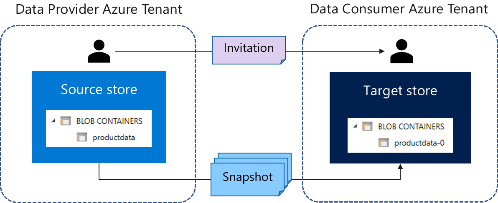

# What is Azure Data Share?

Azure Data Share enables data providers to easily and securely share their data with their customers and partners. It offers a way to centrally manage and monitor data sharing within your organization. 

Azure Data Share enables organizations to share data by adding Azure Data sources into data shares. A Data Share can then be shared with multiple recipients outside of your organization. Once those recipients accept your invitation for sharing data, they become your data consumers. 

Data consumers are able to receive regular, incremental updates to data through regular snapshots that are taken at an interval defined by the data provider. 

As a data provider, you can view the status of your invitation.

## Key capabilities

Azure Data Share enables Data Providers to:

* Share data from Azure Storage, Azure Data Lake Gen1 & Azure Data Lake Gen2 with customers and partners outside of your organization;

* Keep track of who you have shared your data with

* How frequently your data consumers are receiving updates to your data;

* Allow your customers to pull the latest version of your data as needed, or allow them to automatically receive         incremental changes to your data at an interval defined by you;

Azure Data Share enables Data Consumers to: 

* View a description of the type of data being shared; 

* View terms of use for the data;

* Accept or reject an Azure Data Share invitation;

* Trigger a full or incremental snapshot of a Data Share that an organization has shared with you;

* Subscribe to a Data Share to receive the latest copy of the data through incremental snapshot copy;

* Accept data shared with you into an Azure Blob Storage or Azure Data Lake Gen2 account; 

All key capabilities listed above are supported through the Azure or via REST APIs. For more details on using Azure Data Share through REST APIs, check out our reference documentation. 
    

