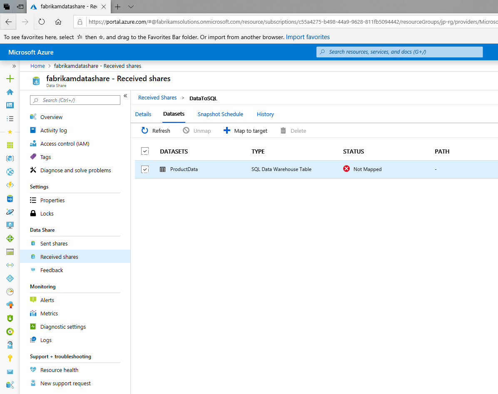
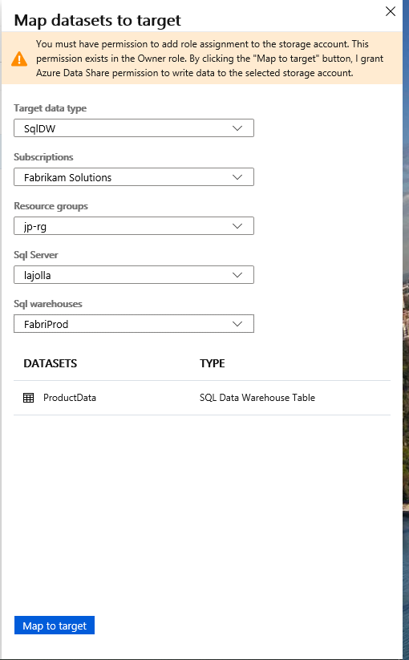

# Tutorial: Receive data from/to an Azure SQL-based sources 

In this tutorial you will learn how to receive data shared from SQL-based data sources into an Azure SQL Database or Azure SQL Data Warehouse. To learn how to receive data into a Storage account, visit [Accept and receive data](https://docs.microsoft.com/en-us/azure/data-share/subscribe-to-data-share).

In this tutorial, you'll learn how to:

> [!div class="checklist"]
> * Accept a data share invitation
> * Receive data into a SQL-based data source such as Azure SQL Database or Azure SQL Data Warehouse. 

## Prerequisites

* Azure Subscription: If you don't have an Azure subscription, create a [free account](https://azure.microsoft.com/free/) before you begin.
* An Azure SQL Database or Azure SQL Data Warehouse to receive data into.
* A Data Share Invitation from your Data Provider.
* Permission for the data share to access the Azure SQL Database or Data Warehouse. This can be done through the following steps: 
    1. Set yourself as the Azure Active Directory Admin for the server.
    1. Connect to the Azure SQL Database/Data Warehouse using Azure Active Directory.
    1. Use Query Editor (preview) to execute the following script to add the Data Share MSI as a db_owner. You must connect using Active Directory and not SQL Server authentication. 

```sql
            create user <share_acct_name> from external provider;
        
            exec sp_addrolemember db_owner, <share_acct_name>; 
```
    
Note that the *<share_acc_name>* is the name of your Data Share Account. If you have not created a Data Share account as yet, you can come back to this pre-requisite later.         

* Client IP SQL Server Firewall access: This can be done through the following steps: 
        1. Navigate to *Firewalls and Virtual Networks*
        1. Click the **on** toggle to allow access to Azure Services. 

Once these pre-requisites are complete, you are ready to receive data into your SQL Server. 

## Sign in to the Azure portal

Sign in to the [Azure portal](https://portal.azure.com/).

## Open invitation

Check your inbox for an invitation from your data provider. The invitation is from Microsoft Azure, titled **Azure Data Share invitation from <yourdataprovider@domain.com>**. Take note of the share name to ensure you're accepting the correct share if there are multiple invitations. 

Select on **View invitation** to see your invitation in Azure. This takes you to your Received Shares view.

 

Select the share you would like to view. 

## Accept and configure later
To receive data directly into a SQL table or view, you will need to accept the invitation and select the option to *Accept and configure later*. Make sure all fields are reviewed, including the **Terms of Use**. If you agree to the terms of use, you'll be required to check the box to indicate you agree. 

 

Under *Target Data Share Account*, select the Subscription and Resource Group that you'll be deploying your Data Share into. 

For the **Data Share Account** field, select **Create new** if you don't have an existing Data Share account. Otherwise, select an existing Data Share account that you'd like to accept your data share into. 

For the *Received Share Name* field, you may leave the default specified by the Data Provide, or specify a new name for the received share. 

 

Once you've agreed to the terms of use and specified a location for your share, Select on *Accept and Configure later*. Only choose this option if you would like to receive data directly into a SQL Server. If you prefer to receive data into a storage account, select *Accept and Configure* and designated a storage account to receive data into.

 

If you don't want to accept the invitation, Select *Reject*. 

## Map datasets to an Azure SQL Database or Data Warehouse
Navigate to Data Share -> Received Shares on the left side panel and select the share that you accepted. 



You will need to specify a destination for each dataset, which represents a table or a view that has been shared with you by the data provider. This can be done by selecting the dataset and selecting "+ Map to target".

On the right hand side, a new pane will be displayed. Select the Target data type you'd like to map to, and fill out all corresponding fields to designate a database or data warehouse to receive data into. 



You are now ready to receive data into your SQL Server. 

## Trigger a snapshot

You can trigger a snapshot in the Received Shares -> Details tab by selecting **Trigger snapshot**. Here, you can trigger a full snapshot only. Note that we do not support incremental copy for SQL-based data sources. Each time a snapshot is triggered, it will be the full copy of the originators table or view. 

 

When the last run status is *successful*, check your SQL Server to ensure that the table(s) and/or view(s) appear in your database. 

## Next steps
Check out our Troubleshooting guide. 

