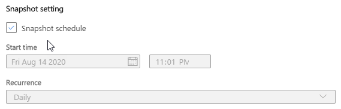

# Quickstart: Share data using Azure Data Share and ARM template

Learn how to set up a new Azure Data Share from an Azure storage account by using an Azure Resource Manager template (ARM template). And, start sharing your data with customers and partners outside of your Azure organization. For a list of the supported data stores, see [Supported data stores in Azure Data Share](./supported-data-stores.md).

[!INCLUDE [About Azure Resource Manager](../../includes/resource-manager-quickstart-introduction.md)]

If your environment meets the prerequisites and you're familiar with using ARM templates, select the **Deploy to Azure** button. The template will open in the Azure portal.

:::image type="content" source="~/reusable-content/ce-skilling/azure/media/template-deployments/deploy-to-azure-button.svg" alt-text="Button to deploy the Resource Manager template to Azure." border="false" link="https://portal.azure.com/#create/Microsoft.Template/uri/https%3A%2F%2Fraw.githubusercontent.com%2FAzure%2Fazure-quickstart-templates%2Fmaster%2Fquickstarts%2Fmicrosoft.datashare%2Fdata-share-share-storage-account%2Fazuredeploy.json":::

## Prerequisites

If you don't have an Azure subscription, create a [free account](https://azure.microsoft.com/free/) before you begin.

## Review the template

The template used in this quickstart is from [Azure Quickstart Templates](https://azure.microsoft.com/resources/templates/data-share-share-storage-account/).

:::code language="json" source="~/quickstart-templates/quickstarts/microsoft.datashare/data-share-share-storage-account/azuredeploy.json":::

The following resources are defined in the template:

* [Microsoft.Storage/storageAccounts](/azure/templates/microsoft.storage/storageaccounts):
* [Microsoft.Storage/storageAccounts/blobServices/containers](/azure/templates/microsoft.storage/storageaccounts/blobservices/containers)
* [Microsoft.DataShare/accounts](/azure/templates/microsoft.datashare/accounts)
* [Microsoft.DataShare/accounts/shares](/azure/templates/microsoft.datashare/accounts/shares)
* [Microsoft.Storage/storageAccounts/providers/roleAssignments](/azure/templates/microsoft.authorization/roleassignments)
* [Microsoft.DataShare/accounts/shares/dataSets](/azure/templates/microsoft.datashare/accounts/shares/datasets)
* [Microsoft.DataShare/accounts/shares/invitations](/azure/templates/microsoft.datashare/accounts/shares/invitations)
* [Microsoft.DataShare/accounts/shares/synchronizationSettings](/azure/templates/microsoft.datashare/accounts/shares/synchronizationsettings)

The template performs the following tasks:

* Create a storage account and a container used as the Data share data source.
* Create a Data share account and a Data share.
* Create a role assignment to grant the Storage Blob Data Reader role to the source data share resource. See [Roles and requirements for Azure Data Share](./concepts-roles-permissions.md).
* Add a dataset to the Date share.
* Add recipients to the Data share.
* Enable a snapshot schedule for the Data share.

This template is created for learning purposes. In practice, you usually have some data in an existing storage account. You would need to create the role assignment before running a template or a script to create the dataset. Sometimes, you might get the following error message when you deploy the template:

```plaintext
"Missing permissions for DataShareAcccount on resource 'subscriptions/<SUBSCRIPTION ID>/resourceGroups/<RESOURCE GROUP NAME>/providers/Microsoft.Storage/storageAccounts/<STORAGE ACCOUNT NAME>' (Code: 5006)"
```

It's because the deployment is trying to create the dataset before the Azure role assignment gets finalized. Despite the error message, the deployment could be successful. You would still be able to walk through [Review deployed resources](#review-deployed-resources).

## Deploy the template

1. Select the following image to sign in to Azure and open the template.

    :::image type="content" source="~/reusable-content/ce-skilling/azure/media/template-deployments/deploy-to-azure-button.svg" alt-text="Button to deploy the Resource Manager template to Azure." border="false" link="https://portal.azure.com/#create/Microsoft.Template/uri/https%3A%2F%2Fraw.githubusercontent.com%2FAzure%2Fazure-quickstart-templates%2Fmaster%2Fquickstarts%2Fmicrosoft.datashare%2Fdata-share-share-storage-account%2Fazuredeploy.json":::
1. Select or enter the following values:

    * **Subscription**: select an Azure subscription used to create the data share and the other resources.
    * **Resource group**: select **Create new** to create a new resource group or select an existing resource group.
    * **Location**: select a location for the resource group.
    * **Project Name**: enter a project name.  The project name is used for generating resource names.  See the variable definitions in the previous template.
    * **location**: select a location for the resources.  You can use the same location for the resource group.
    * **Invitation Email**: enter the data share recipient's Azure sign in email address.  Email alias doesn't work.

    Use the default value for the rest of the settings.
1. select **I agree to the terms and conditions stated above**, and the select **Purchase**.

## Review deployed resources

1. Sign in to the [Azure portal](https://portal.azure.com).
1. Open the data share account that you created.
1. From the left menu, select **Send Shares**.  You shall see the storage account listed.
1. Select the storage account.  Under **Details**, you shall see the synchronization setting as you configured in the template.

    
1. Select **Invitations** from the top. You shall see the email address that you specified when you deploy the template. The **Status** shall be **Pending**.

## Clean up resources

When no longer needed, delete the resource group, which deletes the resources in the resource group.

```azurepowershell-interactive
$resourceGroupName = Read-Host -Prompt "Enter the resource group name"
Remove-AzResourceGroup -Name $resourceGroupName
Write-Host "Press [ENTER] to continue..."
```

## Next steps

In this quickstart, you learnt how to create an Azure data share and invite recipients. To learn more about how a data consumer can accept and receive a data share, continue to the [accept and receive data](subscribe-to-data-share.md) tutorial.
