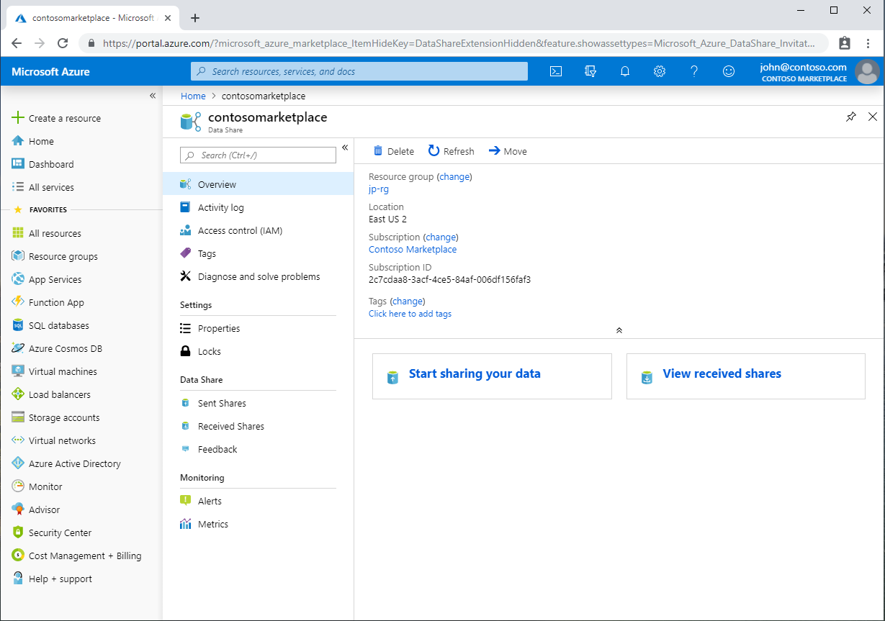

# Tutorial: Share your data

Learn how to share data from Azure Blob Storage or Azure Data Lake Store using Azure Data Share. 

In this tutorial, you'll learn how to:

> [!div class="checklist"]
> * Create a Data Share.
> * Add datasets to your Data Share.
> * Enable a synchronization schedule for your Data Share. 
> * Add recipients to your Data Share. 

## Prerequisites

* If you don't have an Azure subscription, create a [free Azure account](https://azure.microsoft.com/free/) before you begin.
* Azure Storage account, Azure Data Lake account or both

## Sign in to the Azure portal

Sign in to the [Azure portal](https://portal.azure.com/).

## Create a Data Share Account

Create an Azure Data Share resource in an Azure resource group.

1. Select the **Create a resource** button (+) in the upper-left corner of the  portal.

1. Search for *Azure Data Share*.

1. Under **Azure Data Share**, at the bottom of the screen, select **Create**.

1. Fill out the basic details of your Azure Data Share resource with the following information. 

     **Setting** | **Suggested value** | **Field description**
    |---|---|---|
    | Name | *datashareacount* | Specify a name for your data share account. |
    | Subscription | Your subscription | Select the Azure subscription that you want to use for your data share account.|
    | Resource group | *test-resource-group* | Use an existing resource group or create a new resource group. |
    | Location | *East US 2* | Select a region for your data share account.
    | | |

1. Select **New** to provision your data share account. Provisioning a new data share account typically takes about 1 minute or less. 

1. When the deployment is complete, select **Go to resource**.

## Create a Data Share

1. In your data share account, select 'Start sharing your data'. 

    

1. Select **Create**.
   

1. Fill out the details for your Data Share. Specify a name, description of share contents, and terms of use (optional). 

     

1. Click **Continue**

1. To add Datasets to your Data Share, click **Add Datasets**. 

    

1. Select the dataset type that you would like to add. Navigate to the object you would like to share and click 'Add Datasets'. 

1. Click **Continue**

1. In the Recipients tab, enter in the email addresses of your Data Consumer by selecting '+ Add Recipient'. 

1. Click **Continue**

1. If you would like to offer a synchronization schedule for your Data Consumer, enable the scheduled refresh slider shown below and select a recurrence interval. 

1. Select a start time and recurrence interval. 

1. Click **Continue**

1. In the Review + Create tab, review your Package Contents, Settings, Recipients, and Synchronization Settings. Click **Create**

Your Azure Data Share has now been created and the recipient of your Data Share is now ready to accept your invitation. 

## Next steps
Your Azure Data Share is now active. You can monitor the status of your invitation. You can also check to see if your data consumer has generated a snapshot of your data. 