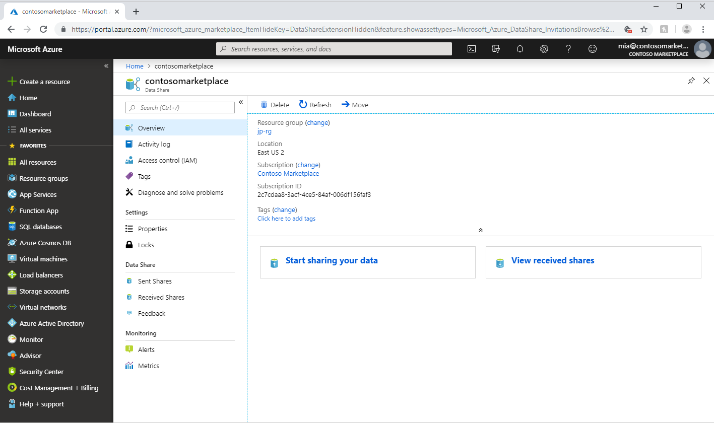
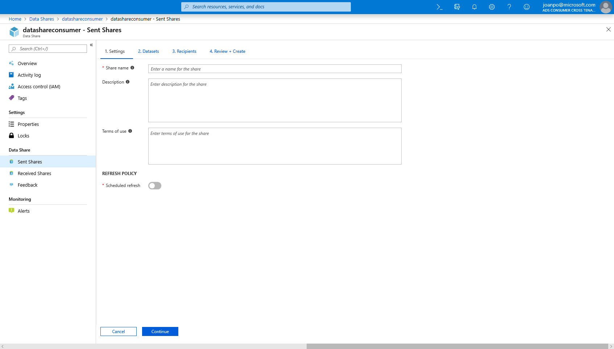
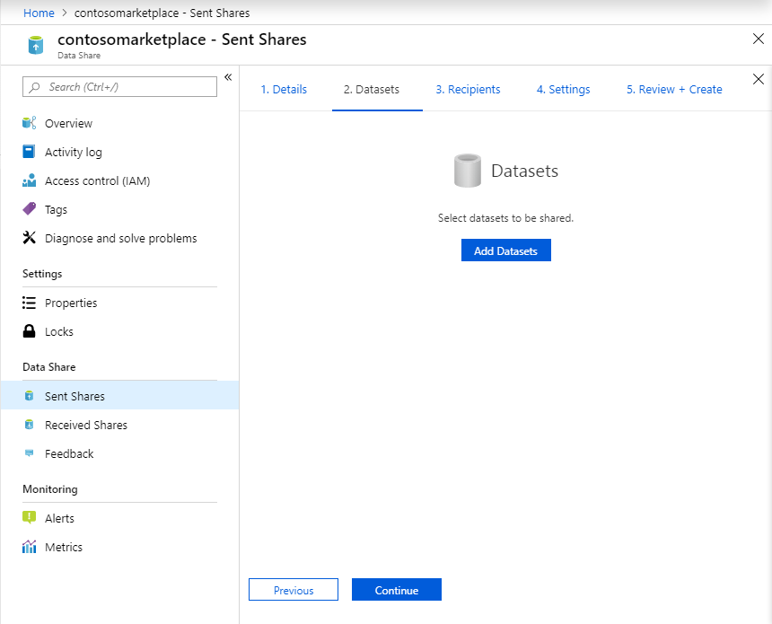
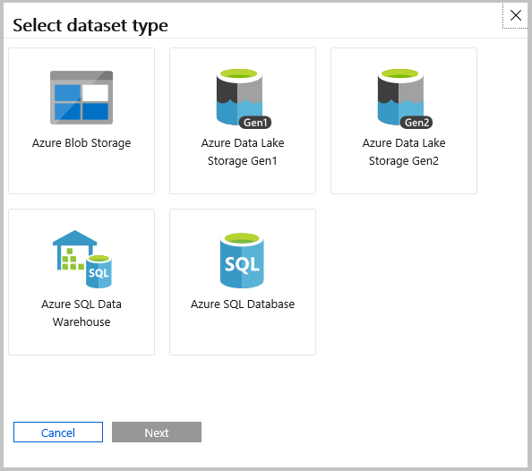
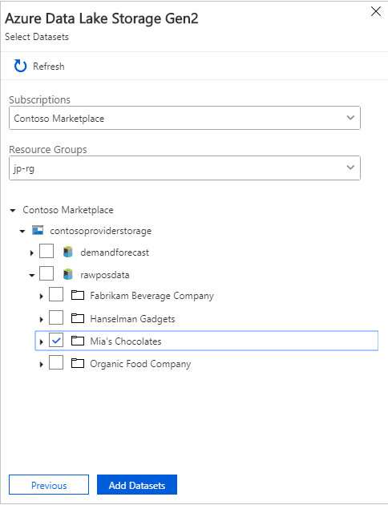
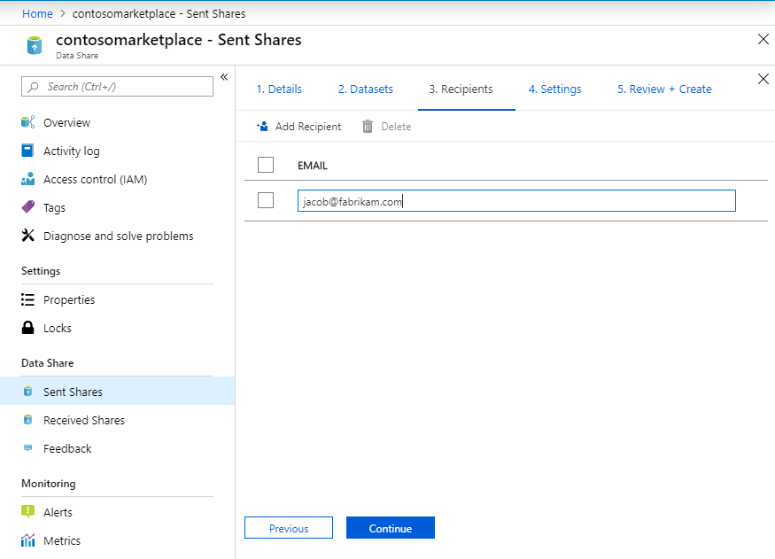
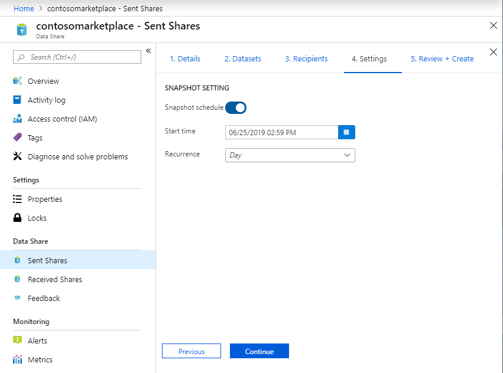

# Tutorial: Share your data using Azure Data Share Preview

In this tutorial you will learn how to set up a new Azure Data Share and start sharing your data with customers and partners outside of your Azure organization. 

In this tutorial, you'll learn how to:

> [!div class="checklist"]
> * Create a Data Share.
> * Add datasets to your Data Share.
> * Enable a synchronization schedule for your Data Share. 
> * Add recipients to your Data Share. 

## Prerequisites

* Azure Subscription: If you don't have an Azure subscription, create a [free account](https://azure.microsoft.com/free/) before you begin.
* An Azure Storage account: If you don't already have one, you can create an [Azure Storage account](https://docs.microsoft.com/azure/storage/common/storage-quickstart-create-account)
* Permission to add role assignment to the storage account, which is present in the *Microsoft.Authorization/role assignments/write* permission. This permission exists in the owner role. 
* Your recipients Azure login e-mail address (using their e-mail alias won't work).

## Sign in to the Azure portal

Sign in to the [Azure portal](https://portal.azure.com/).

## Create a Data Share Account

Create an Azure Data Share resource in an Azure resource group.

1. Select the **Create a resource** button (+) in the upper-left corner of the  portal.

1. Search for *Data Share*.

1. Select Data Share (preview) and Select **Create**.

1. Fill out the basic details of your Azure Data Share resource with the following information. 

     **Setting** | **Suggested value** | **Field description**
    |---|---|---|
    | Name | *datashareacount* | Specify a name for your data share account. |
    | Subscription | Your subscription | Select the Azure subscription that you want to use for your data share account.|
    | Resource group | *test-resource-group* | Use an existing resource group or create a new resource group. |
    | Location | *East US 2* | Select a region for your data share account.
    | | |

1. Select **Create** to provision your data share account. Provisioning a new data share account typically takes about 2 minutes or less. 

1. When the deployment is complete, select **Go to resource**.

## Create a Data Share

1. Navigate to your Data Share Overview page.

     

1. Select **Start sharing your data**.

1. Select **Create**.   

1. Fill out the details for your Data Share. Specify a name, description of share contents, and terms of use (optional). 

     

1. Select **Continue**

1. To add Datasets to your Data Share, select **Add Datasets**. 

    

1. Select the dataset type that you would like to add. 

        

1. Navigate to the object you would like to share and select 'Add Datasets'. 

        

1. In the Recipients tab, enter in the email addresses of your Data Consumer by selecting '+ Add Recipient'. 

     

1. Select **Continue**

1. If you'd like your data consumer to be able to get incremental updates of your data, enable the snapshot schedule. 

     

1. Select a start time and recurrence interval. 

1. Select **Continue**

1. In the Review + Create tab, review your Package Contents, Settings, Recipients, and Synchronization Settings. Select **Create**

Your Azure Data Share has now been created and the recipient of your Data Share is now ready to accept your invitation. 

## Next steps

In this tutorial, you learnt how to create an Azure Data Share and invite recipients. To learn about how a Data Consumer can accept and receive a data share, continue to the [accept and receive data](subscribe-to-data-share.md) tutorial. 