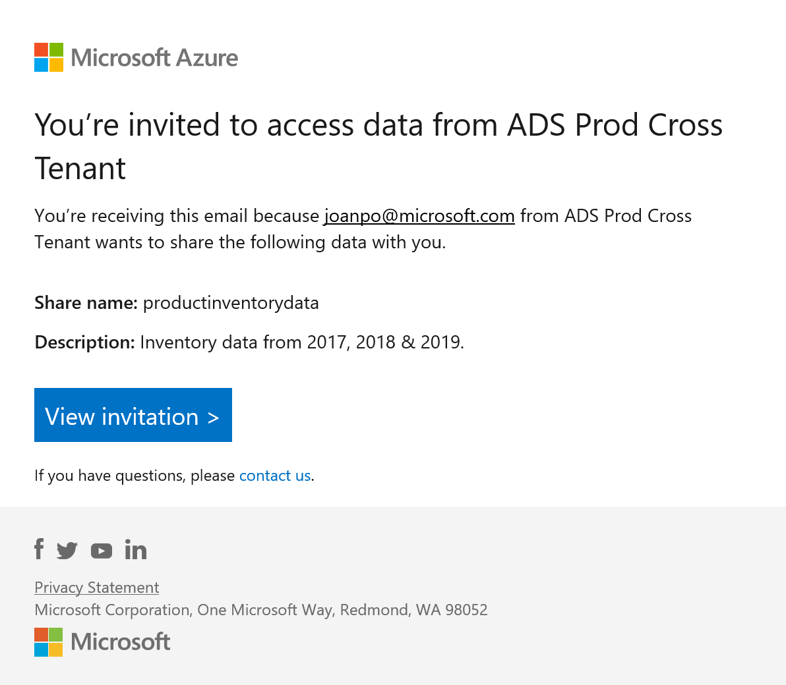
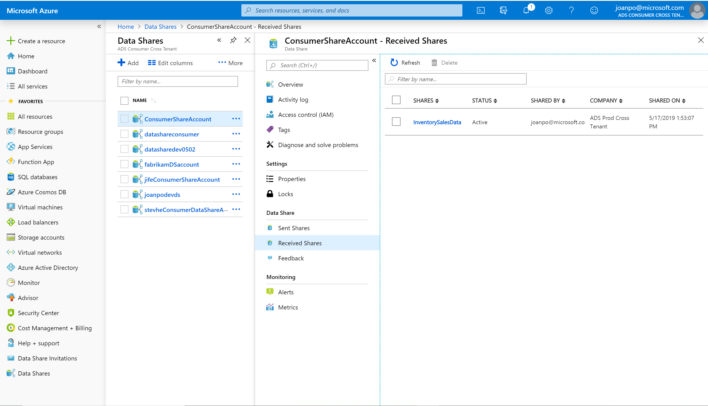
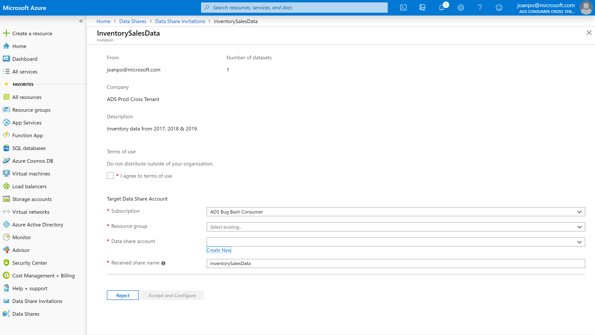
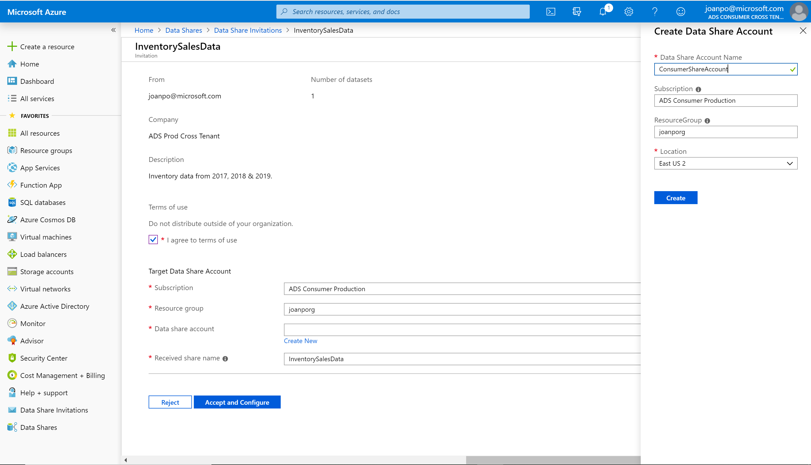

# Tutorial: Subscribe to an Azure Data Share 

This tutorial will teach you:

* How to accept a Data Share invitation;
* Create a Data Share account
* Specify a destination for your data
* Create a subscription to your data share for scheduled refresh

## Prerequisites

* Azure Subscription
* Azure Storage account or Azure Data Lake account
* An e-mail invitation from the Data Provider 

## Sign in to the Azure portal

Sign in to the [Azure portal](https://portal.azure.com/).

## Locate the invitation that was sent to you by the Data Provider 

Check your inbox for an invitation from your data provider. The invitation is from Microsoft Azure, titled **Azure Data Share invitation from <yourdataprovider@domain.com>**. Take note of the share name to ensure you're accepting the correct share if there are multiple invitations. 

 

Click on **View invitation** to see your invitation in Azure. This takes you to your Received Shares view.

 

Select the share you would like to view. 

## Accept the invitation
Make sure all fields are reviewed, including the **Terms of Use**. If you agree to the terms of use, you'll be required to check the box to indicate you agree. 

 

Under *Target Data Share Account*, select the Subscription and Resource Group that you'll be deploying your Data Share into. 

For the **Data Share Account** field, select **Create new** if you don't have an existing Data Share account. Otherwise, select an existing Data Share account that you'd like to accept your data share into. 

 

For the *Received Share Name* field, you may leave the default specified by the Data Provide, or specify a new name for the received share. 

Once you've agreed to the terms of use and specified a location for your share, click on *Accept and Configure*. 

## Configure target storage for your Data Share
Under *Target Storage Settings*, select the Subscription, Resource group, and storage account that you'd like to receive your data into. 

Your Data Provider may have offered a synchronization setting for you to subscribe to. To receive regular refreshes of your data, make sure you enable the synchronization setting. If you don't see one, contact your Data Provider. 

## Trigger a snapshot
You can trigger a snapshot in the Received Shares -> Details tab by selecting **Trigger snapshot**. Here, you can trigger a full or  incremental snapshot of your data. If it is your first time receiving data from your data provider, select full copy. 

## Enable a synchronization schedule
To enable or disable a synchronization schedule, navigate to Received Shares -> Synchronization Schedule and select the synchronization interval that you would like to enable. 

Click **Enable** to enable a synchronization schedule, or if you'd like to stop data from being refreshed, click **Disable**. 

## View a history of your snapshots
To view a history of your snapshots, navigate to Received Shares -> History. Here you'll find a history of all snapshots that were generated for the past 60 days. 

## Next steps
You are now ready to consume your data. 

To navigate to the data that has been shared with you, select Received Shares -> Datasets. Under **Path**, you'll see a link to the path that contains your received data. Wait until a snapshot has been successful before you can see your data. Information about the status of your snapshot can be seen in the Details tab, or the History tab. 
