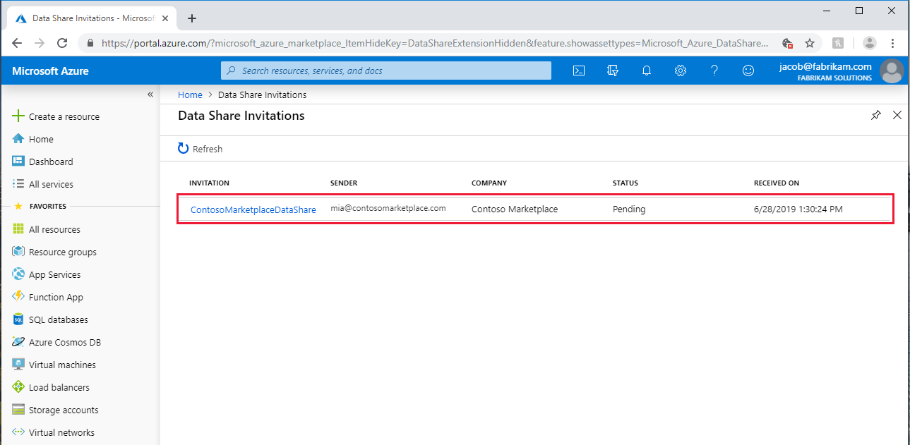
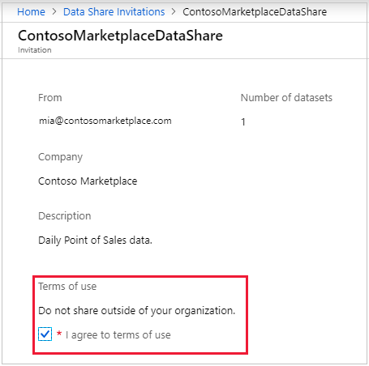
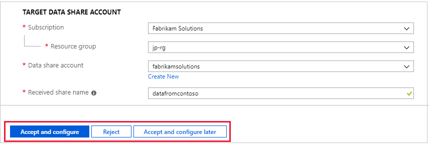
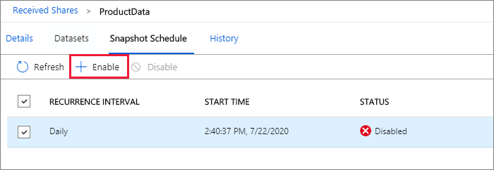
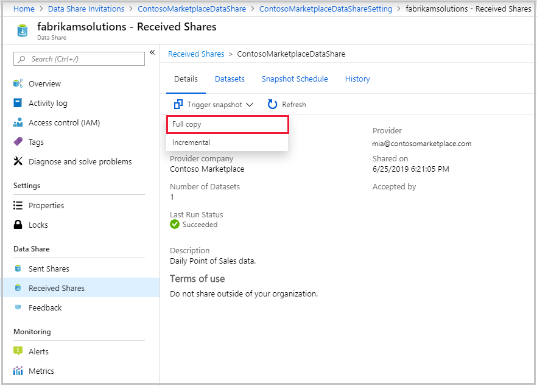
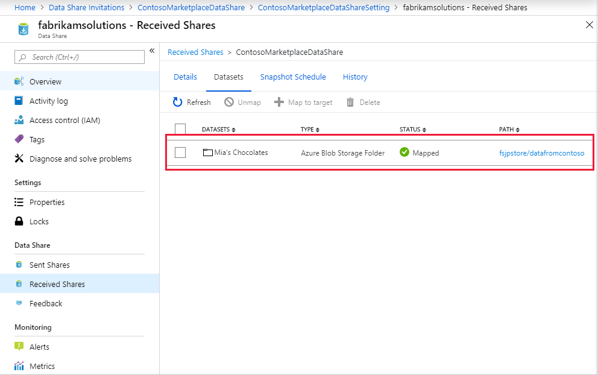

# Tutorial: Accept and receive data using Azure Data Share  

In this tutorial, you will learn how to accept a data share invitation using Azure Data Share. You will learn how to receive data being shared with you, as well as how to enable a regular refresh interval to ensure that you always have the most recent snapshot of the data being shared with you. 

> [!div class="checklist"]
> * How to accept an Azure Data Share invitation
> * Create an Azure Data Share account
> * Specify a destination for your data
> * Create a subscription to your data share for scheduled refresh

## Prerequisites
Before you can accept a data share invitation, you must provision a number of Azure resources, which are listed below. 

Ensure that all pre-requisites are complete before accepting a data share invitation. 

* Azure Subscription: If you don't have an Azure subscription, create a [free account](https://azure.microsoft.com/free/) before you begin.
* A Data Share invitation: An invitation from Microsoft Azure with a subject titled "Azure Data Share invitation from **<yourdataprovider@domain.com>**".
* Register the [Microsoft.DataShare resource provider](concepts-roles-permissions.md#resource-provider-registration) in the Azure subscription where you will create a Data Share resource and the Azure subscription where your target Azure data stores are located.

### Receive data into a storage account

* An Azure Storage account: If you don't already have one, you can create an [Azure Storage account](../storage/common/storage-account-create.md). 
* Permission to write to the storage account, which is present in *Microsoft.Storage/storageAccounts/write*. This permission exists in the Contributor role. 
* Permission to add role assignment to the storage account, which is present in *Microsoft.Authorization/role assignments/write*. This permission exists in the Owner role.  

### Receive data into a SQL-based target
If you choose to receive data into Azure SQL Database, Azure Synapse Analytics, below is the list of prerequisites. 

#### Prerequisites for receiving data into Azure SQL Database or Azure Synapse Analytics (formerly Azure SQL DW)

* An Azure SQL Database or Azure Synapse Analytics (formerly Azure SQL DW).
* Permission to write to databases on the SQL server, which is present in *Microsoft.Sql/servers/databases/write*. This permission exists in the **Contributor** role. 
* **Azure Active Directory Admin** of the SQL server
* SQL Server Firewall access. This can be done through the following steps: 
    1. In SQL server in Azure portal, navigate to *Firewalls and virtual networks*
    1. Click **Yes** for *Allow Azure services and resources to access this server*.
    1. Click **+Add client IP**. Client IP address is subject to change. This process might need to be repeated the next time you are sharing SQL data from Azure portal. You can also add an IP range.
    1. Click **Save**. 
 
#### Prerequisites for receiving data into Azure Synapse Analytics (workspace) SQL pool

* An Azure Synapse Analytics (workspace) dedicated SQL pool. Receiving data into serverless SQL pool is not currently supported.
* Permission to write to the SQL pool in Synapse workspace, which is present in *Microsoft.Synapse/workspaces/sqlPools/write*. This permission exists in the **Contributor** role.
* Permission for the Data Share resource's managed identity to access the Synapse workspace SQL pool. This can be done through the following steps: 
    1. In Azure portal, navigate to Synapse workspace. Select SQL Active Directory admin from left navigation and set yourself as the **Azure Active Directory admin**.
    1. Open Synapse Studio, select *Manage* from the left navigation. Select *Access control* under Security. Assign yourself **SQL admin** or **Workspace admin** role.
    1. In Synapse Studio, select *Develop* from the left navigation. Execute the following script in SQL pool to add the Data Share resource Managed Identity as a 'db_datareader, db_datawriter, db_ddladmin'. 
    
        ```sql
        create user "<share_acc_name>" from external provider; 
        exec sp_addrolemember db_datareader, "<share_acc_name>"; 
        exec sp_addrolemember db_datawriter, "<share_acc_name>"; 
        exec sp_addrolemember db_ddladmin, "<share_acc_name>";
        ```                   
       Note that the *<share_acc_name>* is the name of your Data Share resource. If you have not created a Data Share resource as yet, you can come back to this pre-requisite later.  

* Synapse workspace Firewall access. This can be done through the following steps: 
    1. In Azure portal, navigate to Synapse workspace. Select *Firewalls* from left navigation.
    1. Click **ON** for *Allow Azure services and resources to access this workspace*.
    1. Click **+Add client IP**. Client IP address is subject to change. This process might need to be repeated the next time you are sharing SQL data from Azure portal. You can also add an IP range.
    1. Click **Save**. 

### Receive data into an Azure Data Explorer cluster: 

* An Azure Data Explorer cluster in the same Azure data center as the data provider's Data Explorer cluster: If you don't already have one, you can create an [Azure Data Explorer cluster](/azure/data-explorer/create-cluster-database-portal). If you don't know the Azure data center of the data provider's cluster, you can create the cluster later in the process.
* Permission to write to the Azure Data Explorer cluster, which is present in *Microsoft.Kusto/clusters/write*. This permission exists in the Contributor role. 

## Sign in to the Azure portal

Sign in to the [Azure portal](https://portal.azure.com/).

## Open invitation

### [Portal](#tab/azure-portal)

1. You can open invitation from email or directly from Azure portal. 

   To open invitation from email, check your inbox for an invitation from your data provider. The invitation is from Microsoft Azure, titled **Azure Data Share invitation from <yourdataprovider@domain.com>**. Click on **View invitation** to see your invitation in Azure. 

   To open invitation from Azure portal directly, search for **Data Share Invitations** in Azure portal. This action takes you to the list of Data Share invitations.

    

1. Select the share you would like to view. 

### [Azure CLI](#tab/azure-cli)

Prepare your Azure CLI environment and then view your invitations.

Start by preparing your environment for the Azure CLI:

[!INCLUDE [azure-cli-prepare-your-environment-no-header.md](../../includes/azure-cli-prepare-your-environment-no-header.md)]

Run the [az datashare consumer invitation list](/cli/azure/datashare/consumer/invitation#az_datashare_consumer_invitation_list) command to see your current invitations:

```azurecli
az datashare consumer invitation list --subscription 11111111-1111-1111-1111-111111111111
```

Copy your invitation ID for use in the next section.

---

## Accept invitation

### [Portal](#tab/azure-portal)

1. Make sure all fields are reviewed, including the **Terms of Use**. If you agree to the terms of use, you'll be required to check the box to indicate you agree. 

    

1. Under *Target Data Share Account*, select the Subscription and Resource Group that you'll be deploying your Data Share into. 

   For the **Data Share Account** field, select **Create new** if you don't have an existing Data Share account. Otherwise, select an existing Data Share account that you'd like to accept your data share into. 

   For the **Received Share Name** field, you may leave the default specified by the data provide, or specify a new name for the received share. 

   Once you've agreed to the terms of use and specified a Data Share account to manage your received share, Select **Accept and configure**. A share subscription will be created. 

    

   This action takes you to the received share in your Data Share account. 

   If you don't want to accept the invitation, Select *Reject*. 

### [Azure CLI](#tab/azure-cli)

Use the [az datashare consumer share-subscription create](/cli/azure/datashare/consumer/share-subscription#az_datashare_consumer_share_subscription_create) command to create the Data Share.

```azurecli
az datashare consumer share-subscription create --resource-group share-rg \
  --name "Fabrikam Solutions" --account-name FabrikamDataShareAccount \
  --invitation-id 89abcdef-0123-4567-89ab-cdef01234567 \
  --source-share-location "East US 2" --subscription 11111111-1111-1111-1111-111111111111
```

---

## Configure received share

### [Portal](#tab/azure-portal)

Follow the steps below to configure where you want to receive data.

1. Select **Datasets** tab. Check the box next to the dataset you'd like to assign a destination to. Select **+ Map to target** to choose a target data store. 

    

1. Select a target data store type that you'd like the data to land in. Any data files or tables in the target data store with the same path and name will be overwritten. If you are receiving data into Azure SQL Database or Azure Synapse Analytics (formerly Azure SQL DW), check the checkbox **Allow Data Share to run the above 'create user' script on my behalf**.

   For in-place sharing, select a data store in the Location specified. The Location is the Azure data center where data provider's source data store is located at. Once dataset is mapped, you can follow the link in the Target Path to access the data.

    

1. For snapshot-based sharing, if the data provider has created a snapshot schedule to provide regular update to the data, you can also enable snapshot schedule by selecting the **Snapshot Schedule** tab. Check the box next to the snapshot schedule and select **+ Enable**. Note that the first scheduled snapshot will start within one minute of the schedule time and subsequent snapshots will start within seconds of the scheduled time.

   

### [Azure CLI](#tab/azure-cli)

Use these commands to configure where you want to receive data.

1. Run the [az datashare consumer share-subscription list-source-dataset](/cli/azure/datashare/consumer/share-subscription#az_datashare_consumer_share_subscription_list_source_dataset) command to get the data set ID:

   ```azurecli
   az datashare consumer share-subscription list-source-dataset \
     --resource-group "share-rg" --account-name "FabrikamDataShareAccount" \
     --share-subscription-name "Fabrikam Solutions" \
     --subscription 11111111-1111-1111-1111-111111111111 --query "[0].dataSetId"
   ```

1. Run the [az storage account create](/cli/azure/storage/account#az_storage_account_create) command to create a storage account for this Data Share:

   ```azurecli
   az storage account create --resource-group "share-rg" --name "FabrikamDataShareAccount" \
     --subscription 11111111-1111-1111-1111-111111111111
   ```

1. Use the [az storage account show](/cli/azure/storage/account#az_storage_account_show) command to get the storage account ID:

   ```azurecli
   az storage account show --resource-group "share-rg" --name "FabrikamDataShareAccount" \
     --subscription 11111111-1111-1111-1111-111111111111 --query "id"
   ```

1. Use the following command to get the account principal ID:

   ```azurecli
   az datashare account show --resource-group "share-rg" --name "cli_test_consumer_account" \
     --subscription 11111111-1111-1111-1111-111111111111 --query "identity.principalId"
   ```

1. Use the [az role assignment create](/cli/azure/role/assignment#az_role_assignment_create) command to create a role assignment for the account principal:

   ```azurecli
   az role assignment create --role "01234567-89ab-cdef-0123-456789abcdef" \
     --assignee-object-id 6789abcd-ef01-2345-6789-abcdef012345 
     --assignee-principal-type ServicePrincipal --scope 456789ab-cdef-0123-4567-89abcdef0123 \
     --subscription 11111111-1111-1111-1111-111111111111
   ```

1. Create a variable for the mapping based on the dataset ID:

   ```azurecli
   $mapping='{\"data_set_id\":\"' + $dataset_id + '\",\"container_name\":\"newcontainer\",
     \"storage_account_name\":\"datashareconsumersa\",\"kind\":\"BlobFolder\",\"prefix\":\"consumer\"}'
   ```

1. Use the [az datashare consumer dataset-mapping create](/cli/azure/datashare/consumer/dataset-mapping#az_datashare_consumer_dataset_mapping_create) command to create the dataset mapping:

   ```azurecli
   az datashare consumer dataset-mapping create --resource-group "share-rg" \
     --name "consumer-data-set-mapping" --account-name "FabrikamDataShareAccount" \
     --share-subscription-name "Fabrikam Solutions" --mapping $mapping \
     --subscription 11111111-1111-1111-1111-111111111111
   ```

1. Run the [az datashare consumer share-subscription synchronization start](/cli/azure/datashare/consumer/share-subscription/synchronization#az_datashare_consumer_share_subscription_synchronization_start) command to start dataset synchronization.

   ```azurecli
   az datashare consumer share-subscription synchronization start \
     --resource-group "share-rg" --account-name "FabrikamDataShareAccount"  \
     --share-subscription-name "Fabrikam Solutions" --synchronization-mode "Incremental" \
     --subscription 11111111-1111-1111-1111-111111111111
   ```

   Run the [az datashare consumer share-subscription synchronization list](/cli/azure/datashare/consumer/share-subscription/synchronization#az_datashare_consumer_share_subscription_synchronization_list) command to see a list of your synchronizations:

   ```azurecli
   az datashare consumer share-subscription synchronization list \
     --resource-group "share-rg" --account-name "FabrikamDataShareAccount" \
     --share-subscription-name "Fabrikam Solutions" \
     --subscription 11111111-1111-1111-1111-111111111111
   ```

   Use the [az datashare consumer share-subscription list-source-share-synchronization-setting](/cli/azure/datashare/consumer/share-subscription#az_datashare_consumer_share_subscription_list_source_share_synchronization_setting) command to see synchronization settings set on your share.

   ```azurecli
   az datashare consumer share-subscription list-source-share-synchronization-setting \
     --resource-group "share-rg" --account-name "FabrikamDataShareAccount" \
     --share-subscription-name "Fabrikam Solutions" --subscription 11111111-1111-1111-1111-111111111111
   ```

---

## Trigger a snapshot

### [Portal](#tab/azure-portal)

These steps only apply to snapshot-based sharing.

1. You can trigger a snapshot by selecting **Details** tab followed by **Trigger snapshot**. Here, you can trigger a full or  incremental snapshot of your data. If it is your first time receiving data from your data provider, select full copy. 

    

1. When the last run status is *successful*, go to target data store to view the received data. Select **Datasets**, and click on the link in the Target Path. 

    

### [Azure CLI](#tab/azure-cli)

Run the [az datashare consumer trigger create](/cli/azure/datashare/consumer/trigger#az_datashare_consumer_trigger_create) command to trigger a snapshot:

```azurecli
az datashare consumer trigger create --resource-group "share-rg" \
  --name "share_test_trigger" --account-name "FabrikamDataShareAccount" \
  --share-subscription-name "Fabrikam Solutions" --recurrence-interval "Day" \
  --synchronization-time "2020-04-23 18:00:00 +00:00" --kind ScheduleBased \
  --subscription 11111111-1111-1111-1111-111111111111
```

> [!NOTE]
> Use this command only for snapshot-based sharing.

---

## View history
This step only applies to snapshot-based sharing. To view history of your snapshots, select **History** tab. Here you'll find history of all snapshots that were generated for the past 30 days.

## Clean up resources

When the resource is no longer needed, go to the **Data Share Overview** page and select **Delete** to remove it.

## Next steps
In this tutorial, you learned how to accept and receive an Azure Data Share. To learn more about Azure Data Share concepts, continue to Azure Data Share Terminology.

> [!div class="nextstepaction"]
> [Azure Data Share Concepts](terminology.md)