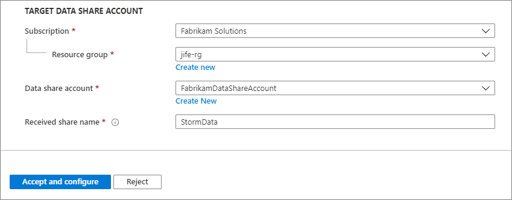
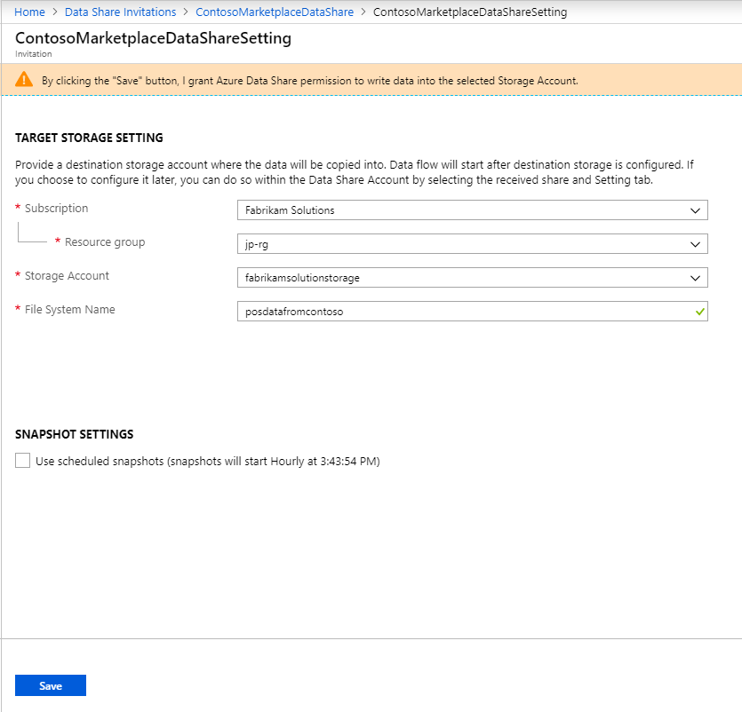
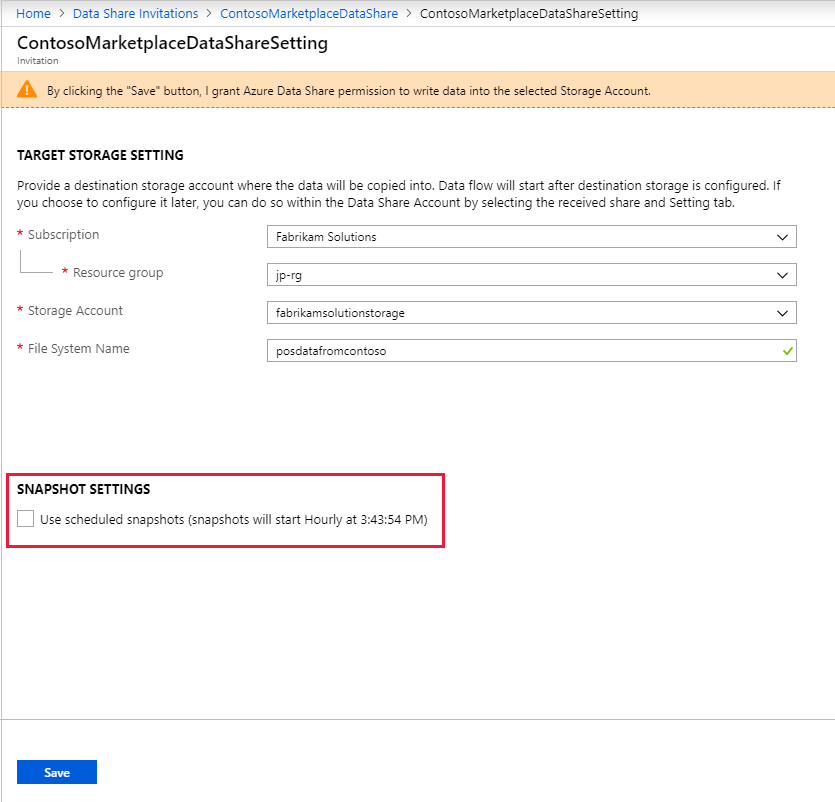

# Tutorial: Accept and receive data using Azure Data Share  

In this tutorial, you will learn how to accept a data share invitation using Azure Data Share. You will learn how to receive data being shared with you, as well as how to enable a regular refresh interval to ensure that you always have the most recent snapshot of the data being shared with you. 

> [!div class="checklist"]
> * How to accept an Azure Data Share invitation
> * Create an Azure Data Share account
> * Specify a destination for your data
> * Create a subscription to your data share for scheduled refresh

## Prerequisites
Before you can accept a data share invitation, you must provision a number of Azure resources, which are listed below. 

Ensure that all pre-requisites are complete before accepting a data share invitation. 

* Azure Subscription: If you don't have an Azure subscription, create a [free account](https://azure.microsoft.com/free/) before you begin.
* A Data Share invitation: An invitation from Microsoft Azure with a subject titled "Azure Data Share invitation from **<yourdataprovider@domain.com>**".
* Register the [Microsoft.DataShare resource provider](concepts-roles-permissions.md#resource-provider-registration) in the Azure subscription where you will create a Data Share resource and the Azure subscription where your target Azure data stores are located.

### Receive data into a storage account: 

* An Azure Storage account: If you don't already have one, you can create an [Azure Storage account](https://docs.microsoft.com/azure/storage/common/storage-quickstart-create-account). 
* Permission to write to the storage account, which is present in *Microsoft.Storage/storageAccounts/write*. This permission exists in the Contributor role. 
* Permission to add role assignment to the storage account, which is present in *Microsoft.Authorization/role assignments/write*. This permission exists in the Owner role.  

### Receive data into a SQL-based source:

* Permission to write to databases on the SQL server, which is present in *Microsoft.Sql/servers/databases/write*. This permission exists in the Contributor role. 
* Permission for the data share resource's managed identity to access the Azure SQL Database or Azure SQL Data Warehouse. This can be done through the following steps: 
    1. Set yourself as the Azure Active Directory Admin for the SQL server.
    1. Connect to the Azure SQL Database/Data Warehouse using Azure Active Directory.
    1. Use Query Editor (preview) to execute the following script to add the Data Share Managed Identity as a 'db_datareader, db_datawriter, db_ddladmin'. You must connect using Active Directory and not SQL Server authentication. 

        ```sql
        create user "<share_acc_name>" from external provider; 
        exec sp_addrolemember db_datareader, "<share_acc_name>"; 
        exec sp_addrolemember db_datawriter, "<share_acc_name>"; 
        exec sp_addrolemember db_ddladmin, "<share_acc_name>";
        ```      
        Note that the *<share_acc_name>* is the name of your Data Share resource. If you have not created a Data Share resource as yet, you can come back to this pre-requisite later.         

* Client IP SQL Server Firewall access. This can be done through the following steps: 
    1. In SQL server in Azure portal, navigate to *Firewalls and virtual networks*
    1. Click the **on** toggle to allow access to Azure Services.
    1. Click **+Add client IP** and click **Save**. Client IP address is subject to change. This process might need to be repeated the next time you are receiving data into a SQL target from Azure portal. You can also add an IP range. 


### Receive data into an Azure Data Explorer cluster: 

* An Azure Data Explorer cluster in the same Azure data center as the data provider's Data Explorer cluster: If you don't already have one, you can create an [Azure Data Explorer cluster](https://docs.microsoft.com/azure/data-explorer/create-cluster-database-portal). If you don't know the Azure data center of the data provider's cluster, you can create the cluster later in the process.
* Permission to write to the Azure Data Explorer cluster, which is present in *Microsoft.Kusto/clusters/write*. This permission exists in the Contributor role. 
* Permission to add role assignment to the Azure Data Explorer cluster, which is present in *Microsoft.Authorization/role assignments/write*. This permission exists in the Owner role. 

## Sign in to the Azure portal

Sign in to the [Azure portal](https://portal.azure.com/).

## Open invitation

1. You can open invitation from email or directly from Azure portal. 

   To open invitation from email, check your inbox for an invitation from your data provider. The invitation is from Microsoft Azure, titled **Azure Data Share invitation from <yourdataprovider@domain.com>**. Click on **View invitation** to see your invitation in Azure. 

   To open invitation from Azure portal directly, search for **Data Share Invitations** in Azure portal. This takes you to the list of Data Share invitations.

    

1. Select the share you would like to view. 

## Accept invitation
1. Make sure all fields are reviewed, including the **Terms of Use**. If you agree to the terms of use, you'll be required to check the box to indicate you agree. 

    

1. Under *Target Data Share Account*, select the Subscription and Resource Group that you'll be deploying your Data Share into. 

   For the **Data Share Account** field, select **Create new** if you don't have an existing Data Share account. Otherwise, select an existing Data Share account that you'd like to accept your data share into. 

   For the **Received Share Name** field, you may leave the default specified by the data provide, or specify a new name for the received share. 

    

1. Once you've agreed to the terms of use and specified a location for your share, Select on *Accept and configure*. A share subscription will be created.

   For snapshot-based sharing, the next screen will ask you to select a target storage account for your data to be copied into. 

    

   If you prefer to accept the invitation now but configure your target data store at a later time, select *Accept and configure later*. To continue configuring your storage later, see [configure dataset mappings](how-to-configure-mapping.md) page for detailed steps on how to resume your data share configuration. 

   For in-place sharing, see [configure dataset mappings](how-to-configure-mapping.md) page for detailed steps on how to resume your data share configuration. 

   If you don't want to accept the invitation, Select *Reject*. 

## Configure storage
1. Under *Target Storage Settings*, select the Subscription, Resource group, and storage account that you'd like to receive your data into. 

    

1. To receive regular update of your data, make sure you enable the snapshot settings. Note that you will only see a snapshot setting schedule if your data provider has included it in the data share. 

    

1. Select *Save*. 

> [!IMPORTANT]
> If you are receiving SQL-based data and would like to receive that data into a SQL-based source, visit [configure a dataset mapping](how-to-configure-mapping.md) how-to guide to learn how to configure a SQL Server as the destination for your dataset. 

## Trigger a snapshot
These steps only apply to snapshot-based sharing.

1. You can trigger a snapshot in the Received Shares -> Details tab by selecting **Trigger snapshot**. Here, you can trigger a full or  incremental snapshot of your data. If it is your first time receiving data from your data provider, select full copy. 

    

1. When the last run status is *successful*, go to target data store to view the received data. Select **Datasets**, and click on the link in the Target Path. 

    

## View history
To view a history of your snapshots, navigate to Received Shares -> History. Here you'll find a history of all snapshots that were generated for the past 60 days. 

## Next steps
In this tutorial, you learned how to accept and receive an Azure Data Share. To learn more about Azure Data Share concepts, continue to [Concepts: Azure Data Share Terminology](terminology.md).