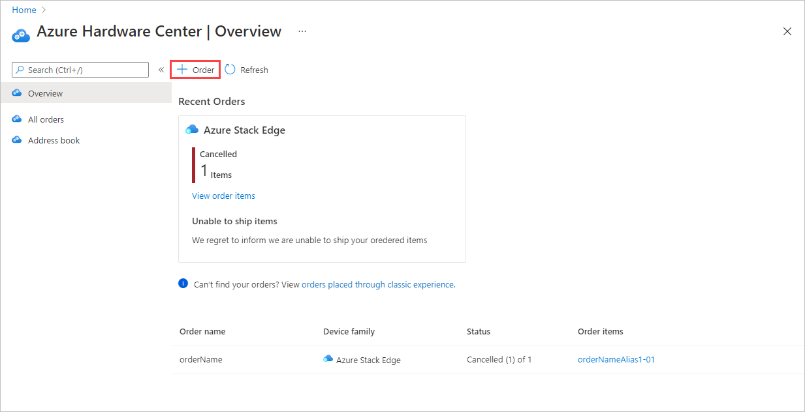

# Order Azure Stack Edge devices from Azure Edge Hardware Center

This article describes how to order Azure Stack Edge, Azure Stack Hub, or Azure Stack Edge Zone Enterprise devices centrally, from the Azure Edge Hardware Center. You can order multiple devices in one order, ship them to multiple addresses, and reuse addresses.

Each order can include multiple devices from a single hardware group and configuration. You can ship the devices to different locations within the same country/region. For more information about the Azure Stack Edge Hardware Center, see Azure Stack Edge Hardware Center overview *(link to come)*.

*I will add an "About" section if we need to provide any more detail about the new service. `Alpa` will write an "Overview" article.*

### Prerequisites

Before you begin, make sure that:<!--Anam to provide updated Prerequisites in Support doc by 06/21.-->

- Your Microsoft Azure subscription is enabled for an Azure Stack Edge resource. Make sure that you used a supported subscription such as [Microsoft Enterprise Agreement (EA)](https://azure.microsoft.com/overview/sales-number/), [Cloud Solution Provider (CSP)](/partner-center/azure-plan-lp), or [Microsoft Azure Sponsorship](https://azure.microsoft.com/offers/ms-azr-0036p/). Pay-as-you-go subscriptions aren't supported. To identify the type of Azure subscription you have, see [What is an Azure offer?](../cost-management-billing/manage/switch-azure-offer.md#what-is-an-azure-offer).
- You have owner or contributor access at resource group level for the Azure Stack Edge Pro/Data Box Gateway, IoT Hub, and Azure Storage resources.

    - To create any Azure Stack Edge / Data Box Gateway resource, you should have permissions as a contributor (or higher) scoped at resource group level. 
    - You also need to make sure that the `Microsoft.EdgeOrder` provider is registered. *QUESTION: Azure Stack Edge also requires the `Microsoft.DataBoxEdge` and `Microsoft.KeyVault` resource providers. For IoT Hub resources, the `Microsoft.Devices` provider also is required. Should these providers be included?*<!--STILL REQUIRED? You also need to make sure that the Microsoft.DataBoxEdge and MicrosoftKeyVault resource providers are registered. To create any IoT Hub resource, Microsoft.Devices`provider should be registered.-->
        - To register a resource provider, in the Azure portal, go to **Home > Subscriptions > Your-subscription > Resource providers**.
        - Search for the specific resource provider, for example, Microsoft.DataBoxEdge, and register the resource provider.
    - To create a Storage account resource, again you need contributor or higher access scoped at the resource group level. Azure Storage is by default a registered resource provider. *QUESTION: Requirements from Azure Stack Edge. Still applicable?*
- You have admin or user access to Azure Active Directory Graph API for generating activation key or credential operations such as share creation that uses a storage account. For more information, see [Azure Active Directory Graph API](/previous-versions/azure/ad/graph/howto/azure-ad-graph-api-permission-scopes#default-access-for-administrators-users-and-guest-users-). *QUESTION: Is this bullet the solution to the requirement to "Make sure no policies are preventing access during ordering?*

## Create new order in Azure Hardware Center

<!--Make screen updates Mon, 06/21, when new test portal version has all the latest features.-->

1. Use your Microsoft Azure credentials to sign in to the Azure portal at this URL: [https://portal.azure.com](https://portal.azure.com).

1. Search for and select **Azure Hardware Center**.<!--To become Azure Edge Hardware Center.-->

    

1. In the Azure Edge Hardware Center (preview) portal, select **+ Order**.<!--Click View to open the Azure Edge Hardware Center homepage. Will use that info later.-->

    

1. Select a subscription, and then select **Next**.

    

1. To start your order, select **Order** beside the product family that you want to order - for example, for **Azure Stack Edge**. If you don't see the product family, you may need to use a different subscription.

     

1. Select the country or region that will be the shipping destination for your order. *QUESTION: At release, will customers be able to order from the US West country/region? Our example addresses are on the West Coast.*<!--Recommended destination for testing: SEA (Azure region).-->

    

1.  On the **Order hardware** page, use the **Select** button to select the hardware product to order.  

    

1.  On the next pane, select a device configuration, and then choose **Select**.

    <!--Remove pricing info from final graphic-->

    The **Create order** wizard opens.

1.  On the **Basics** tab, provide an **Order name** and **Resource group**. Then select **Next: Shipping + quantity**.

    
  
1. On the **Shipping + quantity** tab, you'll start by specifying a ship to address for the order. 

    - If this is your first order through the Azure Edge Hardware Center, select **Add a new address**.  

       

       A required **Address alias** field on the **New address** screen identifies the address for later use. Select **Add** when you finish filling in the address fields. 

       

       If you're ordering more than one device, add a ship address for each location you want to ship to.

    - To use a ship to address from a previous order, choose **Select address(es)**. On the **Select address(es)**, select one or more addresses, and choose **Select** screen**.
    
       If you're ordering multiple devices, select each address you'll ship to.

       

    The **Shipping + quantity** tab now has a separate item for each ship to address.

1. For each address, enter the **Quantity** of devices to ship.

    When you enter a quantity of more than one, a **+1 more** label is added to the end of the order item name. Select ****+ 1 more** to view the individual order items for that address.

    

    Each order item name includes a name prefix (the order name followed by the address alias), with an item number for each device that is shipped to that address.

1. If you want to change the names of order items, select and click the order item name to open the **Rename order item** pane. If you're shipping more than one item to an address, select **+n more**.

    You can make two types of name change:

    - Use a different name prefix for all of the order items, edit the **Name prefix** and then select **Apply**.

    - Edit each order item name individually. 

    When you finish updating order item names, select **Done**.

    

    Select **Next: Notification>** to continue.

1. If you want to receive status notifications as your order progresses, enter as many as 20 the email addresses of recipients on the **Notifications** tab. To add an email address, enter the address, and select **Add**. You can add up to 20 email addresses.

    

    When you finish, select **Review + create** to continue.

1. Review your order:

    - The order is automatically validated when you open this screen. If you see a **Validation failed** banner, you'll have to fix the issues before you create the order.
    - Review the **Privacy terms**, and select the check box to agree to them.
 
    Then select **Create**.

    

    While the order is being deployed, the order opens in the Azure portal, showing the status of each order item. After deployment completes, you may need to click the Down arrow by **Deployment details** to see the status of individual items.

    

    <!--Click the Down arrow to display **Deployment details**.

    -->

1.  To review all of the orders in the resource group, click **Next step: View orders for the resource group.** *QUESTION: What do we expect customers to do from the resource group?*

    

## Create management resource for device

To manage the devices that you order through the Azure Edge Hardware Center, you need to create a management resource for each order item.

When you activate the device, the new resource is associated with your order. You'll be able to open the order from the device and open the device from the order.

To create a management resource, do these steps:

*TO BE DEVELOPED.*

## Activate device

*TO BE DEVELOPED.*

*- For steps, link to existing "Reset or reorder device" procedure.* 
*- Show how to open the order from the device and vice versa.*

## Next steps

- To learn how to deploy virtual machines on your Azure Stack Edge Pro device, see [Deploy virtual machines via the Azure portal](azure-stack-edge-gpu-deploy-virtual-machine-portal.md).
