# Order Azure Stack Edge devices from Azure Edge Hardware Center

This article explains how to place an order for one or more Azure Stack Edge devices from the Azure Edge Hardware Center.
       
## About the Azure Edge Hardware Center

BRIEF OVERVIEW - just what they need to know to take advantage of the new order capabilities. 

### Prerequisites

Before you begin, make sure that:

- Your Microsoft Azure subscription is enabled for an Azure Stack Edge resource. Make sure that you used a supported subscription such as [Microsoft Enterprise Agreement (EA)](https://azure.microsoft.com/overview/sales-number/), [Cloud Solution Provider (CSP)](/partner-center/azure-plan-lp), or [Microsoft Azure Sponsorship](https://azure.microsoft.com/offers/ms-azr-0036p/). Pay-as-you-go subscriptions aren't supported. To identify the type of Azure subscription you have, see [What is an Azure offer?](../cost-management-billing/manage/switch-azure-offer.md#what-is-an-azure-offer).
- You have owner or contributor access at resource group level for the Azure Stack Edge Pro/Data Box Gateway, IoT Hub, and Azure Storage resources.

    - To create any Azure Stack Edge / Data Box Gateway resource, you should have permissions as a contributor (or higher) scoped at resource group level. 
    - You also need to make sure that the `Microsoft.EdgeOrder` provider is registered.<!--STILL REQUIRED? You also need to make sure that the Microsoft.DataBoxEdge and MicrosoftKeyVault resource providers are registered. To create any IoT Hub resource, Microsoft.Devices`provider should be registered.-->
        - To register a resource provider, in the Azure portal, go to **Home > Subscriptions > Your-subscription > Resource providers**.
        - Search for the specific resource provider, for example, Microsoft.DataBoxEdge, and register the resource provider.
    - To create a Storage account resource, again you need contributor or higher access scoped at the resource group level. Azure Storage is by default a registered resource provider.<!--N/A?-->
- You have admin or user access to Azure Active Directory Graph API for generating activation key or credential operations such as share creation that uses a storage account. For more information, see [Azure Active Directory Graph API](/previous-versions/azure/ad/graph/howto/azure-ad-graph-api-permission-scopes#default-access-for-administrators-users-and-guest-users-).<!--Is this the equivalent of making sure no policies are preventing access during ordering?-->

## Create a new Azure Hardware Center order

1. Use your Microsoft Azure credentials to sign in to the Azure portal at this URL: [https://portal.azure.com](https://portal.azure.com).

1. Select **+ Create a resource**. Search for and select **Azure Edge Hardware Center**. 

    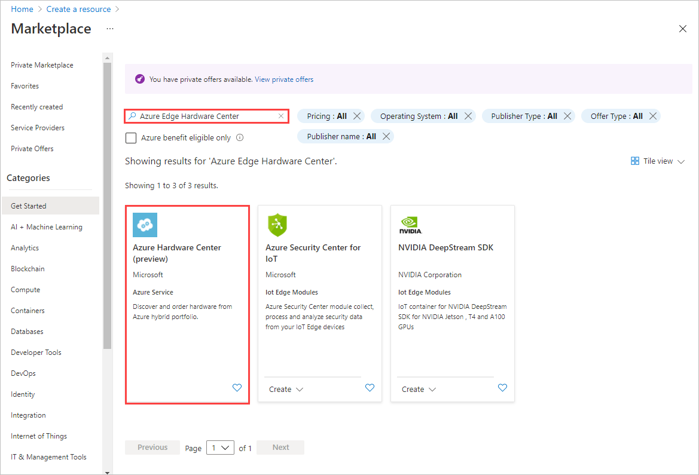

1. On the Azure Hardware Center (preview), select **Create**.

    

1. Select a subscription, and then select **Next**.

    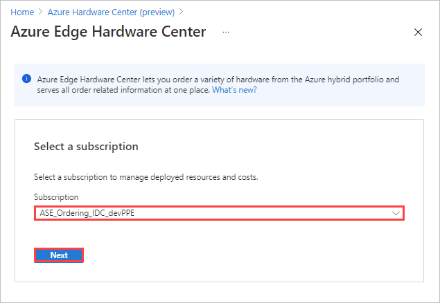

1. To start your order, select **Order** by the product family for the device(s) you want to order - for example, for **Azure Stack Edge**. If you don't see the product family, you may need to use a different subscription.

    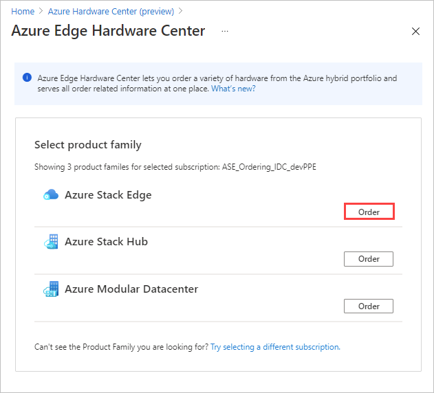 

1. Select the country or region that will be the shipping destination for your order. DESTINATION DEPENDS ON THE SUBSCRIPTION? NOTE THAT THEY CAN CHANGE THE SUBSCRIPTION IF NEEDED?

     

1.  On the **Order hardware** page, use the **Select** button to select a device type.  

    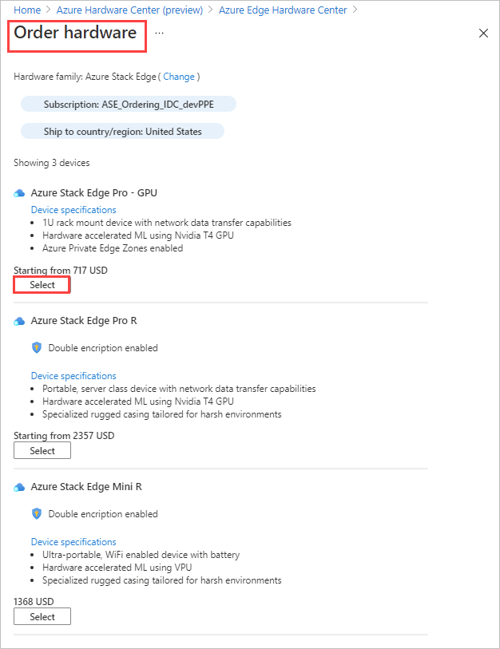 

1.  A pane opens, showing the available models of the device type you selected. Select the model you want to order, and then choose **Select**.

    

    When you select a device model, the **Create order** wizard opens.

1.  On the **Basics** tab, provide an **Order name** and **Resource group**. Then select **Next: Shipping + quantity**.

   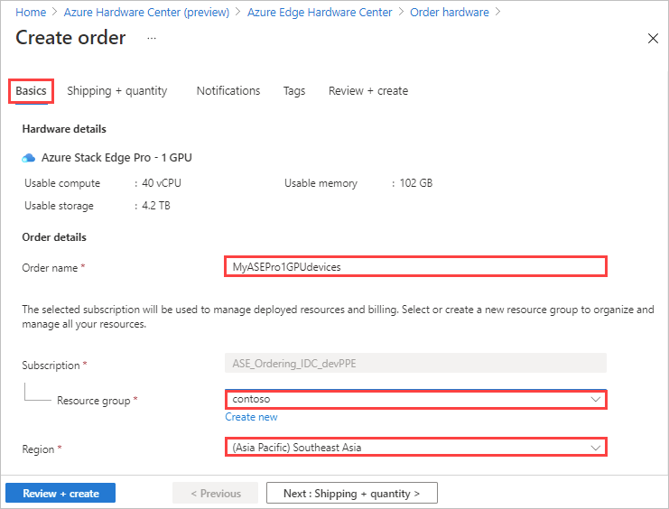
  
1. First order of business in **Shipping + quantity** is to specify a ship to address. In the Azure Hardware Center, you can reuse ship to addresses instead of manually entering an address for each order. If you haven't already used the address, select **Add a new address**.

   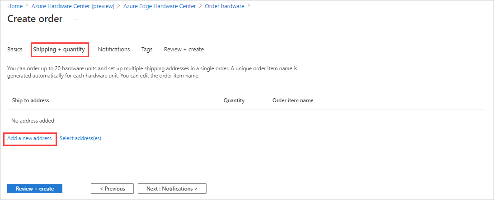

1.  You'll see the familiar screen for entering a ship to address. In addition to the usual address fields, you'll need to provide an **Address alias**, which is used to select the address for later orders. When you finish filling in the address fields, select **Add**.

   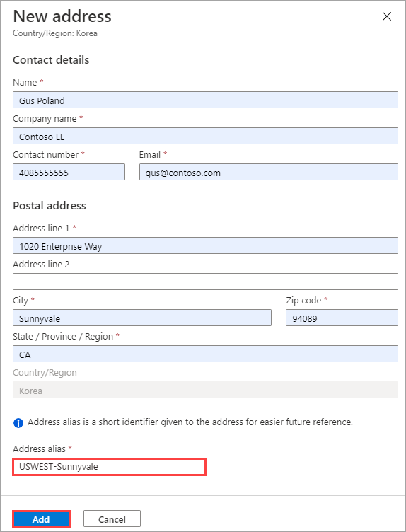

   You'll see the ship to address for one device.

    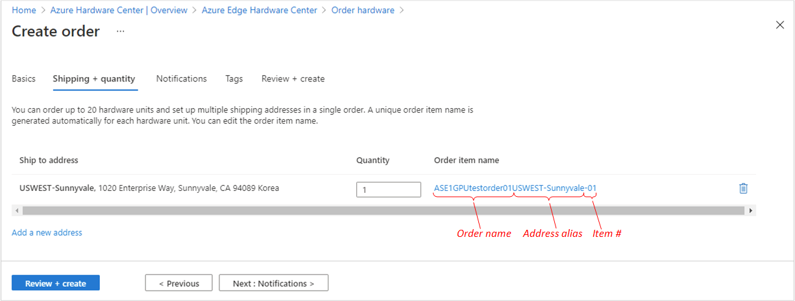    

1. If you want to order more than one device, change the **Quantity**. You'll notice that a **+n more** label is added after the order item name. Select **+n more** to set an order item name for each device.

    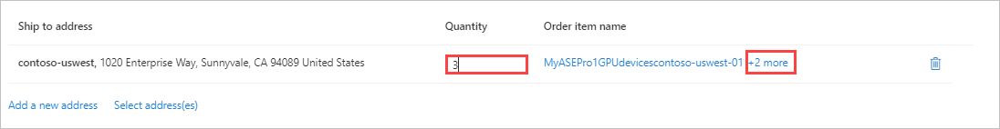

1. On the **Rename order item** screen, you can change the device order names for the devices. You'll be able to manage the order for each device separately. By default, a name prefix, consisting of the order name followed by the address alias, is used. A number is appended for each device. To use a different name prefix, edit the **Name prefix** and select **Apply**. You can also edit each order item name individually. When you finish updating names, select **Done**.

    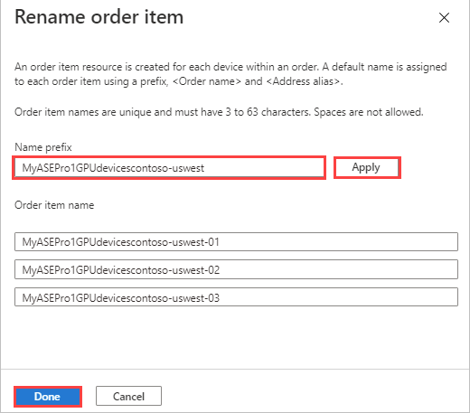

    Select **Next: Notifications >** to continue.

1. If you want to receive notifications of the order status as it progresses, enter as many as 20 email addresses on the **Notifications** tab. You;ll need to enter one email at a time. To add an email, enter the address, and select **Add**. When you finish, select **Review + create**.

    

1. Review your order. *VALIDATION?* Review the **Privacy terms**. Select the check box to agree to them. Then select **Create**.

    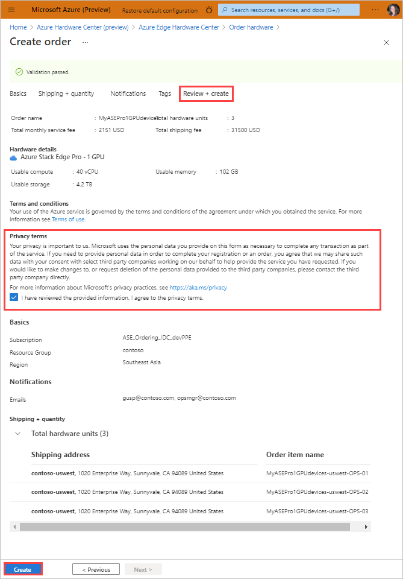

    The portal shows the status of the order.

    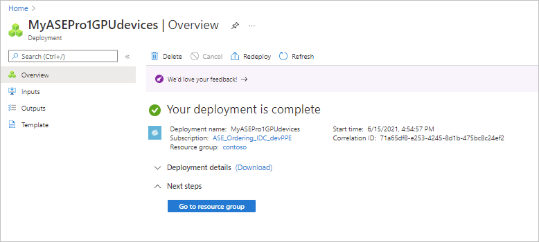

    Click the Down arrow to display **Deployment details**.

    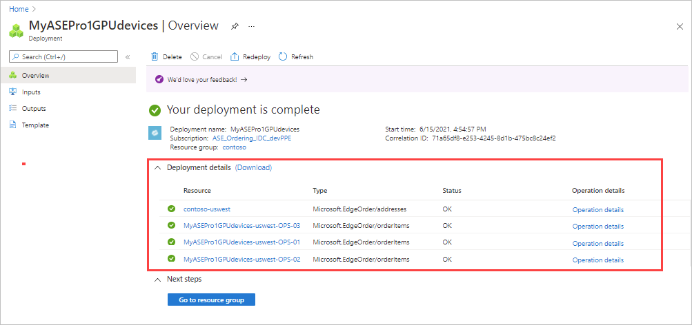

1.  Next step: View orders for the resource group.

    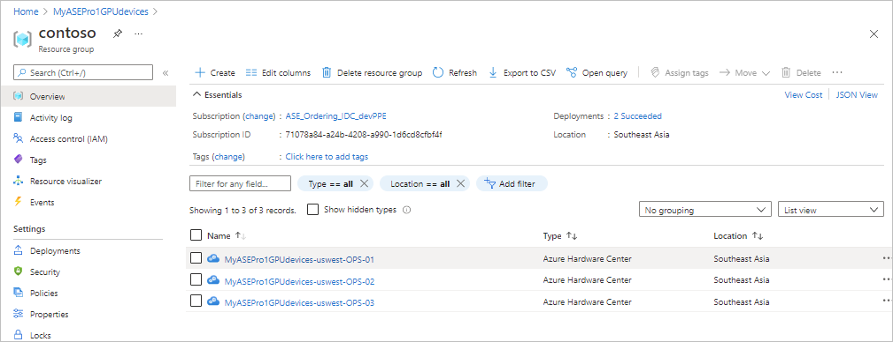    

STOPPED HERE: 06/15 PM

## Create a new Classic order

*STEPS FROM deploy-prep > portal. Not yet updated beyond STOPPED HERE. Text AND PNGs are from deploy-prep.*

When you're using the familiar method to create an individual resource in Azure Stack Edge, Azure Stack Hub, or such - now known as a Classic order - you can switch to the Azure Hardware Center to complete your order.

To switch to the Azure Hardware Center while creating a Classic order, do these steps:

1. Use your Microsoft Azure credentials to sign in to the Azure portal at this URL: [https://portal.azure.com](https://portal.azure.com).

   1. In the left-pane, select **+ Create a resource**. Search for and select **Azure Stack Edge / Data Box Gateway**. Select **Create**.

   1. Select **Try Azure Hardware Center**.

      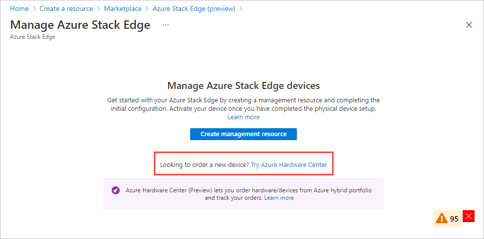<!--From here on out, is the process identical? Not yet tested.-->

   1. Select a product family from the selected subscriptions. For example, select **Azure Stack Edge**.<!--1) What determines "selected subscriptions"? 2) Find out all available product families.-->

     

STOPPED HERE - 06/14/2021

3. Pick the subscription that you want to use for the Azure Stack Edge Pro device. Select the country to where you want to ship this physical device. Select **Show devices**.

    

4. Select device type. Under **Azure Stack Edge Pro**, choose **Azure Stack Edge Pro with GPU** and then choose **Select**. If you see any issues or are unable to select the device type, go to [Troubleshoot order issues](azure-stack-edge-troubleshoot-ordering.md).

    

5. Based on your business need, you can select Azure Stack Edge Pro with 1 or 2 Graphical Processing Units (GPUs) from Nvidia. 

    

6. On the **Basics** tab, enter or select the following **Project details**.
    
    |Setting  |Value  |
    |---------|---------|
    |Subscription    |The subscription is automatically populated based on the earlier selection. Subscription is linked to your billing account. |
    |Resource group  |Select an existing group or create a new group. Learn more about [Azure Resource Groups](../azure-resource-manager/management/overview.md).     |

7. Enter or select the following **Instance details**.

    |Setting  |Value  |
    |---------|---------|
    |Name   | A friendly name to identify the resource. The name has from 2 to 50 characters containing letters, numbers, and hyphens.  Name starts and ends with a letter or a number.        |
    |Region     |For a list of all the regions where the Azure Stack Edge resource is available, see [Azure products available by region](https://azure.microsoft.com/global-infrastructure/services/?products=databox&regions=all). If using Azure Government, all the government regions are available as shown in the [Azure regions](https://azure.microsoft.com/global-infrastructure/regions/).  Choose a location closest to the geographical region where you want to deploy your device.|

    

8. Select **Next: Shipping address**.

    - If you already have a device, select the combo box for **I already have a device**.

        

    - If this is the new device that you're ordering, enter the contact name, company, address to ship the device, and contact information.

        

9. Select **Next: Tags**. Optionally provide tags to categorize resources and consolidate billing. Select **Next: Review + create**.

10. On the **Review + create** tab, review the **Pricing details**, **Terms of use**, and the details for your resource. Select the combo box for **I have reviewed the privacy terms**.

     

    You are also notified that during the resource creation, a Managed Service Identity (MSI) is enabled that lets you authenticate to cloud services. This identity exists for as long as the resource exists.

11. Select **Create**.

    The resource creation takes a few minutes. An MSI is also created that lets the Azure Stack Edge device communicate with the resource provider in Azure.

    After the resource is successfully created and deployed, you're notified. Select **Go to resource**.

    

After the order is placed, Microsoft reviews the order and contacts you (via email) with shipping details.

> [!NOTE]
> If you want to create multiple orders at one time or clone an existing order, you can use the [scripts in Azure Samples](https://github.com/Azure-Samples/azure-stack-edge-order). For more information, see the README file.<!--When new preview features are released, update this note in deploy-prep. Azure Edge Hardware Center method will be easier. Scripts were a stop-gap measure.-->

If you run into any issues during the order process, see [Troubleshoot order issues](azure-stack-edge-troubleshoot-ordering.md).<!--LATER: Closer to general release, will need to create separate troubleshooting for order through Azure Edge Hardware Center.-->

## Initiate an order in Azure Edge Hardware Center

PLACEHOLDER: Will step through how to start by choosing "Azure Edge Hardware Center" as the new resource type.

## Next steps

To learn how to deploy virtual machines on your Azure Stack Edge Pro device, see [Deploy virtual machines via the Azure portal](azure-stack-edge-gpu-deploy-virtual-machine-portal.md).
