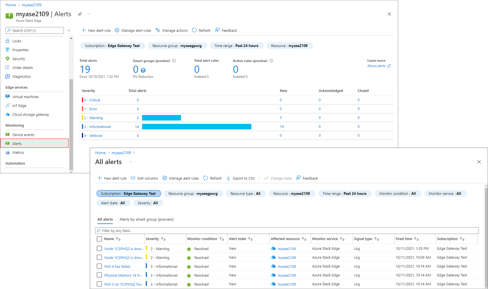

# Review alerts on Azure Stack Edge

[!INCLUDE [applies-to-GPU-and-pro-r-and-mini-r](../../includes/azure-stack-edge-applies-to-gpu-pro-r-mini-r-sku.md)]

This article describes how to view alerts and interpret alert severity for events on your Azure Stack Edge devices. The alerts generate notifications in the Azure portal. The article includes a quick-reference for Azure Stack Edge alerts.

## Overview

The Alerts blade for an Azure Stack Edge device lets you review Azure Stack Edge device–related alerts in real-time. From this blade, you can centrally monitor the health issues of your Azure Stack Edge devices and the overall Microsoft Azure Stack Edge solution.

The initial display is a high-level summary of alerts at each severity level. You can drill down to see individual alerts at each severity level.

### Alert severity levels

Alerts have different severity levels, depending on the impact of the alert situation and the need for a response to the alert. The severity levels are:

- **Critical** – This alert is in response to a condition that is affecting the successful performance of your system. Action is required to ensure that Azure Stack Edge service is not interrupted.
- **Warning** – This condition could become critical if not resolved. You should investigate the situation and take any action required to resolve the issue.
- **Informational** – This alert contains information that can be useful in tracking and managing your system.

### Configure alert notifications

You can also send alert notifications by email for events on your Azure Stack Edge devices. To manage these alert notifications, you create action rules. The action rules can trigger or suppress alert notifications for device events within a resource group, an Azure subscription, or on a device. For more information, see [Using action rules to manage alert notifications](azure-stack-edge-gpu-manage-device-event-alert-notifications.md).

## Alerts quick-reference

The following tables list some of the Azure Stack Edge alerts that you might run across, with descriptions and recommended actions. The alerts are grouped in the following categories:

* [Cloud connectivity alerts](#cloud-connectivity-alerts)
* [Edge compute alerts](#edge-compute-alerts)
* [Local Azure Resource Manager alerts](#local-azure-resource-manager-arm-alerts)
* [Performance alerts](#performance-alerts)
* [Storage alerts](#storage-alerts)
* [Security alerts](#security-alerts)
* [Key vault alerts](#key-vault-alerts)
* [Hardware alerts](#hardware-alerts)
* [Update alerts](#update-alerts)
* [Virtual machine alerts](#virtual-machine-alerts)

> [!NOTE]
> In the alerts tables below, some alerts are triggered by more than one event type. If the events have different recommended actions, the table has an alert entry for each of the events.

## Cloud connectivity alerts

The following alerts are raised by a failed connection to an Azure Stack Edge device or when no heartbeat is detected.

| Alert text                       | Severity | Description / Recommended action |
|----------------------------------|----------|----------------------------------|
| Could not connect to the Azure.  | Critical | Check your internet connection. In the local web UI of the device, go to **Troubleshooting** > **Diagnostic tests**. Run the **Internet connectivity** diagnostic test. |
| Lost heartbeat from your device. | Critical | If your device is offline, then the device is not able to communicate with the Azure service. This could be due to one of the following reasons:<ul><li>The Internet connectivity is broken. Check your internet connection. In the local web UI of the device, go to **Troubleshooting** > **Diagnostic tests**. Run the diagnostic tests. Resolve the reported issues.</li><li>The device is turned off or paused on the hypervisor. Turn on your device! For more information, go to [Manage power](..\databox-gateway\data-box-gateway-manage-access-power-connectivity-mode.md#manage-power).</li><li>Your device could have rebooted due to an update. Wait a few minutes and try to reconnect.</li></ul>|

## Edge compute alerts

The following alerts are raised for Edge compute or the compute acceleration card, which can be a Graphical Processing Unit (GPU) or Vision Processing Unit (VPU) depending on the device model.

|Alert text |Severity |Description / Recommended action |
|-----------|---------|---------------------------------|
|Edge compute is unhealthy. |Critical | Restart your device to resolve the issue. In the local web UI of your device, go to **Maintenance** > **Power settings** and click **Restart**. If the problem persists, [contact Microsoft Support](azure-stack-edge-contact-microsoft-support.md). |
|Edge compute ran into an issue with name resolution. |Critical |Ensure that your DNS server {15} is online and reachable. If the problem persists, contact your network administrator. |
|Compute acceleration card configuration has an issue.* |Critical |We've detected an unsupported compute acceleration card configuration. Before you contact Microsoft Support, follow these steps:<ol><li>In the local web UI, go to **Troubleshooting** > **Support**.</li><li>Create and download a support package.</li><li>[Create a Support request](azure-stack-edge-contact-microsoft-support.md#create-a-support-request).</li><li>Attach the package to the support request.</li></ol> |
|Compute acceleration card configuration has an issue.* |Critical |We've detected an unsupported compute acceleration card. Before you contact Microsoft Support, follow these steps:<ol><li>In the local web UI, go to **Troubleshooting** > **Support**.</li><li>Create and download a support package.</li><li>[Create a Support request](azure-stack-edge-contact-microsoft-support.md#create-a-support-request).</li><li>Attach the package to the support request.</li></ol> |
|Compute acceleration card configuration has an issue.* |Critical |This may be due to one of the following reasons:<ol><li>If the card is an FPGA, the image is not valid.</li><li>Compute acceleration card isn't seated properly.</li><li>Underlying issues with the compute acceleration driver.</li></ol>To resolve the issue, redeploy the Azure IoT Edge module. Once the issue is resolved, the alert goes away. If the issue persists, do the following: <ol><li>In the local web UI, go to **Troubleshooting** > **Support**.</li><li>Create and download a support package.</li>[Create a Support request](azure-stack-edge-contact-microsoft-support.md#create-a-support-request).</li><li>Attach the package to the support request.</li></ol> |
|Compute acceleration card configuration has an issue.* |Critical |This is due to an internal error. Before you contact Microsoft Support, follow these steps:<ol><li>In the local web UI, go to **Troubleshooting** > **Support**.</li><li>Create and download a support package.</li>[Create a Support request](azure-stack-edge-contact-microsoft-support.md#create-a-support-request).</li><li>Attach the package to the support request.</li></ol> |
|Compute acceleration card configuration has an issue.* |Critical |As your Azure IoT Machine Learning module starts up, you may see this transient issue. Wait a few minutes to see if the issue resolves. If the issue persists, do the following:<ol><li>In the local web UI, go to **Troubleshooting** > **Support**.</li><li>Create and download a support package.</li>[Create a Support request](azure-stack-edge-contact-microsoft-support.md#create-a-support-request).</li><li>Attach the package to the support request.</li></ol> |
|Compute acceleration card driver software is not running. |Critical |This is due to an internal error. Before you contact Microsoft Support, follow these steps:<ol><li>In the local web UI, go to **Troubleshooting** > **Support**.</li><li>Create and download a support package.</li><li>[Create a Support request](azure-stack-edge-contact-microsoft-support.md#create-a-support-request).</li><li>Attach the package to the support request.</li></ol> |
|Compute acceleration card on your device is unhealthy. |Critical |This is due to an internal error. Before you contact Microsoft Support, follow these steps:<ol><li>In the local web UI, go to **Troubleshooting** > **Support**.</li><li>Create and download a support package.</li><li>[Create a Support request](azure-stack-edge-contact-microsoft-support.md#create-a-support-request).</li><li>Attach the package to the support request.</li></ol> |
|Shutting down the compute acceleration card as the card temperature has exceeded the operating limit! |Critical |This is due to an internal error. Before you contact Microsoft Support, follow these steps:<ol><li>In the local web UI, go to **Troubleshooting** > **Support**.</li><li>Create and download a support package.</li><li>[Create a Support request](azure-stack-edge-contact-microsoft-support.md#create-a-support-request).</li><li>Attach the package to the support request.</li></ol> |
|Compute acceleration card performance is degraded. |Warning |This might be because the compute acceleration card has a high usage. Consider stopping or reducing the workload on the Azure IoT Machine Learning module. Before you contact Microsoft Support, follow these steps:<ol><li>In the local web UI, go to **Troubleshooting** > **Support**.</li><li>Create and download a support package.</li><li>[Create a Support request](azure-stack-edge-contact-microsoft-support.md#create-a-support-request).</li><li>Attach the package to the support request.</li></ol> |
|Compute acceleration card temperature is rising. |Warning |This might be because the compute acceleration card has a high usage. Consider stopping or reducing the workload on the Azure IoT Machine Learning module. Before you contact Microsoft Support, follow these steps:<ol><li>In the local web UI, go to **Troubleshooting** > **Support**.</li><li>Create and download a support package.</li><li>[Create a Support request](azure-stack-edge-contact-microsoft-support.md#create-a-support-request).</li><li>Attach the package to the support request.</li></ol> |
|Edge compute couldn’t access data on share {16}. |Warning |Verify that you can access share {16}. If you can access the share, it indicates an issue with Edge compute.   To resolve the issue, restart your device. In the local web UI of your device, go to **Maintenance** > **Power settings** and click **Restart**.   If the issue persists, [contact Microsoft Support](azure-stack-edge-contact-microsoft-support.md). |
|Edge compute couldn’t access data on share {16}. This may be because the share doesn’t exist anymore. |Warning |If the share does not {16} exist, restart your device to resolve the issue. In the local web UI of your device, go to **Maintenance** > **Power settings** and click **Restart**.   If the problem persists, [contact Microsoft Support](azure-stack-edge-contact-microsoft-support.md). |
|IoT Edge agent is not running. |Warning |Restart your device to resolve the issue. In the local web UI of your device, go to **Maintenance** > **Power settings** and click **Restart**.   If the problem persists, [contact Microsoft Support](azure-stack-edge-contact-microsoft-support.md).md). |
|IoT Edge service is not running. |Warning |Restart your device to resolve the issue. In the local web UI of your device, go to **Maintenance** > **Power settings** and click **Restart**.   If the problem persists, [contact Microsoft Support](azure-stack-edge-contact-microsoft-support.md).md). |
|Storage used by Edge compute is getting full. | Warning | [Contact Microsoft Support](azure-stack-edge-contact-microsoft-support.md) for next steps. |
|Your Edge compute module {20} is disconnected from IoT Edge |Warning |Restart your device to resolve the issue. In the local web UI of your device, go to **Maintenance** > **Power settings** and click **Restart**.   If the problem persists, [contact Microsoft Support](azure-stack-edge-contact-microsoft-support.md). |
|Your Edge compute module(s) may be using a local mount point {15} that is different than the local mountpoint used by a share. |Warning |Ensure that the local mountpoint {15} used is the one that is mapped to the share.<ul><li>In the Azure portal, go to **Shares** in your Data Box Edge resource.</li><li>Select a share to view the local mount point for Edge compute module.</li><li>Ensure that this path is used in the module and deploy the module again.</li></ol>Restart the device. In the local web UI of your device, go to **Maintenance** > **Power settings** and click **Restart**.   If the alert persists, [contact Microsoft Support](azure-stack-edge-contact-microsoft-support.md). |

* This alert is triggered by more than one event type, with different recommended actions.

## Local Azure Resource Manager (ARM) alerts

The following alerts are raised by the local Azure Resource Manager (ARM), which is used to connect to the local APIs on Azure Stack Edge devices.

|Alert text |Severity |Description / Recommended action |
|-----------|---------|---------------------------------|
|Specified service authentication certificate with thumbprint '{0}' does not have a private key |Critical |If the issue persists, [contact Microsoft Support](azure-stack-edge-contact-microsoft-support.md). |
|Certificate with thumbprint '{0}' at location '{1}' is not found or not accessible. |Critical |If the issue persists, [contact Microsoft Support](azure-stack-edge-contact-microsoft-support.md). |
|Unable to connect endpoint: '{0}' |Critical |If the issue persists, [contact Microsoft Support](azure-stack-edge-contact-microsoft-support.md). |
|Error occurred during web request: '{0}' |Critical |If the issue persists, [contact Microsoft Support](azure-stack-edge-contact-microsoft-support.md). |
|Request timed out for url: '{0}' |Critical |If the issue persists, [contact Microsoft Support](azure-stack-edge-contact-microsoft-support.md). |
|Unable to get Token using login endpoint '{0}' for resource '{1}' |Critical |If the issue persists, [contact Microsoft Support](azure-stack-edge-contact-microsoft-support.md). |
|Unknown error occurred. ErrorCode:'{0}'. Details: '{1}' | Critical |If the issue persists, [contact Microsoft Support](azure-stack-edge-contact-microsoft-support.md). |
|Could not start the VM service on the device. |Critical | If you see this alert, [contact Microsoft Support](azure-stack-edge-contact-microsoft-support.md). |
|VM service is not running on the device. |Critical |If you see this alert, [contact Microsoft Support](azure-stack-edge-contact-microsoft-support.md). |

## Performance alerts

The following alerts indicate performance issues related to storage or to CPU, memory, or disk usage on an Azure Stack Edge device.

|Alert text |Severity |Description / Recommended action |
|-----------|---------|---------------------------------|
|The CPU utilization on your device has exceeded the threshold for an extended duration. |Critical |Reduce workloads or modules running on your device. If the problem persists, [contact Microsoft Support](azure-stack-edge-contact-microsoft-support.md). |
|The CPUs reserved for the virtual machines on your device exceeds the configured threshold. |Critical |Take one of the following steps:<ol><li>Reduce CPU reservation for the virtual machines running on your device.</li><li>Remove some virtual machines off your device.</li></ol> |
|The memory used by the virtual machines on your device exceeds the configured threshold. |Critical |Take one of the following steps:<ol><li>Reduce memory allocated for the virtual machines running on your device.</li><li>Remove some virtual machines off your device.</li></ol> |
|The data volume on the device is {0}% full. Writes into the device are being throttled. |Critical                    |<ol><li>Distribute your data ingestion to target off-peak hours.</li><li>This may be due to a slow network. In the local web UI of the device, go to **Troubleshooting** > **Diagnostic tests** and click **Run diagnostic tests**. Resolve the reported issues.</li></ol>If the issue persists, [contact Microsoft Support](azure-stack-edge-contact-microsoft-support.md). |
|The memory used by the virtual machines on node {0} of your device exceeds the configured threshold. |Critical |The device will try to balance load across other nodes. Consider reducing some virtual machine workloads from your device. If the problem persists, [contact Microsoft Support](azure-stack-edge-contact-microsoft-support.md). |
|Your device is almost out of storage space. If a disk fails, then you may not be able to restore data on this device. |Critical |Delete data to free up capacity on your device. |
|The CPU utilization on node {0} of your device has exceeded the threshold for an extended duration.* |Warning |The device will try to balance load across other nodes. Consider reducing some virtual machine workloads from your device. If the problem persists, [contact Microsoft Support](azure-stack-edge-contact-microsoft-support.md). |
|The CPU utilization on node {0} of your device has exceeded the threshold for an extended duration.* |Warning |Reduce workloads or modules running on your device. If the problem persists, [contact Microsoft Support](azure-stack-edge-contact-microsoft-support.md). |
|The node {0} on your device is using more memory than expected. |Warning |If the problem persists, [contact Microsoft Support](azure-stack-edge-contact-microsoft-support.md). |
|The CPUs reserved for the virtual machines on node {0} of your device exceeds the configured threshold. |Warning |Take one of the following steps:<ol><li>Reduce CPU reservation for the virtual machines running on your device.</li><li>Remove some virtual machines off your device.</li></ol> |
|The memory used by the virtual machines on your device exceeds the configured threshold. |Warning |Take one of the following steps:<ol><li>Reduce memory allocated for the virtual machines running on your device.</li><li>Remove some virtual machines off your device.</li></ol> |
|Too many virtual machines are active on node {0} of your device. |Warning |The device will try to balance load across other nodes. Consider reducing some virtual machine workloads from your device. If the problem persists, [contact Microsoft Support](azure-stack-edge-contact-microsoft-support.md). |
|The virtual hard disk {0} is nearing its capacity. |Warning |Delete some data to free capacity. |

* This alert is triggered by more than one event type, with different recommended actions.

## Storage alerts

The following alerts are for issues that occur when accessing or uploading data to Azure Storage.

|Alert text |Severity |Description / Recommended action |
|-----------|---------|---------------------------------|
|Could not access volume {0}.* |Critical |This could happen when the volume is offline, or too many drives or servers have failed or are disconnected. Take the following steps:<ol><li>Reconnect missing drives and bring up servers that are down.</li><li>Allow the sync to complete.</li><li>Replace any failed drives and restore lost data from backup.</li></ol> |
|Could not access volume {0}.* |Critical |In the local web UI of the device, go to **Troubleshooting** > **Diagnostic tests**, and click **Run diagnostic tests**. Resolve the reported issues. If the issue persists, [contact Microsoft Support](azure-stack-edge-contact-microsoft-support.md). |
|Could not find volume {0}.* |Critical |If the issue persists, [contact Microsoft Support](azure-stack-edge-contact-microsoft-support.md). |
|Could not find volume {0}.* |Critical Warning |Expand the volume or migrate workloads to other volumes. |
|Some data on this volume {0} is not fully resilient. It remains accessible. |Informational |Restoring resiliency of the data. |
|Could not upload {0} files(s) from share {1}. |Critical |This could be due to one of the following reasons:<ol><li>Due to violations of Azure Storage naming and sizing conventions. For more information, go to [Naming conventions](../azure-resource-manager/management/resource-name-rules.md).</li><li>Because the uploaded files were modified in the cloud by other applications outside of the device.<ul><li>{2} inside the {1} share, or</li><li>{3} inside the {4} account.</li></ol></ul> |
|Could not connect to the storage account '{0}'.* |Critical |This may be because the storage account access keys have been regenerated. If the keys have been regenerated, you will need to synchronize the new keys. To fix the issue, in the Azure portal go to **Shares**, select the share, and refresh the storage keys. |
|Could not connect to the storage account '{0}'.* |Critical |This may be due to Internet connectivity issues. The device is not able to communicate with the storage account service. In the local web UI of the device, go to **Troubleshooting** > **Diagnostic tests** and click **Run diagnostic tests**. Resolve the reported issues. |
|The device has {0} files. A maximum of {1} files are supported. |Critical |Consider deleting some files from the device. |
|Low throughput to and from Azure Storage detected. |Warning  |In the local web UI of the device, go to **Troubleshooting** > **Diagnostic tests** and click **Run diagnostic tests**. Resolve the reported issues. If the issue persists, [contact Microsoft Support](azure-stack-edge-contact-microsoft-support.md). |

* This alert is triggered by more than one event type, with different recommended actions.

## Security alerts

The following alerts signal access issues related to passwords, certificates, or keys, or report attempts to access an Azure Stack Edge device.

|Alert text |Severity |Description / Recommended action |
|-----------|---------|---------------------------------|
|{0} from {1} expires in {2} days. |Critical Warning |Check your certificate and upload a new certificate before the expiration date. |
|{0} of type {1} is not valid. |Critical |Check your certificate. If the certificate is not valid, upload a new certificate. |
|Internal certificate rotation failure |Critical |Couldn't rotate the internal certificates. If services are impaired, [contact Microsoft Support](azure-stack-edge-contact-microsoft-support.md). |
|Could not login '{0}'. Number of failed attempts : '{1}'. |Critical Warning Informational |Make sure that you have entered the correct password. An authorized user may be attempting to connect to your device with an incorrect password. Verify that these attempts were from a legitimate source. If you continue to see failed login attempts, contact your network administrator. |
|Rotate SED key protector on node {0}, did not complete in time. |Warning |The attempt to rotate SED key protector to the new default has not completed in time. Please check if node and physical disks are in healthy state. System will retry again. |
|Device password has changed |Informational |The device administrator password has changed. This is a required action as part of the first-time device setup or regular password reset. No further action is required. |
|A support session is enabled. |Informational |This is an information alert to ensure that administrators can ensure that the enabling the support session is legitimate. No action is needed. |
|A support session has started. |Informational |This is an information alert to ensure that administrators can ensure that the support session is legitimate. No action is needed. |

## Key Vault alerts

The following alerts relate to your Azure Key Vault configuration.

|Alert text |Severity |Description / Recommended action |
|-----------|---------|---------------------------------|
|Key Vault is not configured* |Critical Warning |<ol><li>Verify that the Key Vault is not deleted.</li><li>Assign the appropriate permissions for your device to get and set the secrets. For detailed steps, see [Prerequisites for an Azure Stack Edge resource](azure-stack-edge-gpu-deploy-prep.md#prerequisites).</li><li>If secrets are soft deleted, follow the steps [here](../key-vault/general/key-vault-recovery.md#list-recover-or-purge-soft-deleted-secrets-keys-and-certificates) to recover the secrets.</li><li>Refresh the Key Vault details to clear the alert.</li></ol> |
|Key Vault is not configured* |Warning |Configure the Key Vault for your Azure Stack Edge resource. For detailed steps, see [Create a key vault](../key-vault/general/quick-create-portal.md). |
|Key Vault is deleted |Critical |If the key vault is deleted and the purge protection duration of 90 days hasn't elapsed, follow the steps to [Recover your key vault](../key-vault/general/key-vault-recovery.md#list-recover-or-purge-a-soft-deleted-key-vault). |
|Couldn’t retrieve secret(s) from the Key Vault |Critical |<ol><li>Verify that the Key Vault is not deleted.</li><li>Assign the appropriate permissions for your device to get and set the secrets. The required permissions are present [here](azure-stack-edge-gpu-deploy-prep.md#prerequisites).</li><li>Refresh the Key Vault details to clear the alert.</li></ol> |
|Couldn’t access the Key Vault |Critical |<ol><li>Verify that the Key Vault is not deleted.</li><li>Assign the appropriate permissions for your device to get and set the secrets. For more information, see the [detailed steps](azure-stack-edge-gpu-deploy-prep.md#prerequisites).</li><li>Refresh the Key Vault details to clear the alert.</li></ol> |

* This alert is triggered by more than one event type, with different recommended actions.

## Hardware alerts

The following alerts indicate an issue with a hardware component, such as physical disk, NIC, or power supply unit, on an Azure Stack Edge device.

|Alert text |Severity |Description / Recommended action |
|-----------|---------|---------------------------------|
|{0} on {1} has failed. |Critical |This is because the power supply is not connected properly or has failed. Take the following steps to resolve this issue:<ol><li>Make sure that the power supply connection is proper.</li><li>[Contact Microsoft Support](azure-stack-edge-contact-microsoft-support.md) to order a replacement power supply unit. |
|Could not reach {1}. |Critical      |If the controller is turned off, restart the controller. Make sure that the power supply is functional. For information on monitoring the power supply LEDs, go to https://www.microsoft.com/.<!--Need new link target. This one goes nowhere--> If the issue persists, [contact Microsoft Support](azure-stack-edge-contact-microsoft-support.md). |
|{0} is powered off. |Warning |Connect the Power Supply Unit to a Power Distribution Unit. |
|One or more device components are not working properly. |Critical |[Contact Microsoft Support](azure-stack-edge-contact-microsoft-support.md) for next steps. |
|Could not replace {0}. |Warning |[Contact Microsoft Support](azure-stack-edge-contact-microsoft-support.md) for next steps. |
|Started the replacement of {0}. |Informational |No action is required from you. |
|Successfully replaced {0} |Informational |No action is required from you. |
|{0} is disconnected. |Warning |Verify that '{0}' is cabled properly and the network interface is up. |
|{0} has failed.* |Critical |The device needs to be replaced. [Contact Microsoft Support](azure-stack-edge-contact-microsoft-support.md) to replace the device. |
|{0} has failed.* |Critical |Verify that '{0}' is cabled properly and the network interface is up. In the local web UI of the device, go to **Troubleshooting** > **Diagnostic tests** and click **Run diagnostic tests**. Resolve the reported issues. If the issue persists, contact Microsoft Support at [https://aka.ms/getazuresupport](azure-stack-edge-contact-microsoft-support.md). |
|Some data on the cache physical disk {0} on node {1} can't be read, preventing us from moving it onto capacity drives. |Warning |Replace the physical disk. |
|The cache physical disk {0} on node {1} failed some reads or writes, so to protect your data we've moved it onto capacity drives. |Warning | Replace the physical disk. |
|The physical disk {0} on node {1} failed to read or write multiple times in the last couple of days. If this keeps happening, it could mean that the drive is malfunctioning, damaged, or beginning to fail. |Warning |If the issue persists, consider replacing the physical disk. |
|The physical disk {0} on node {1} has issues with reads or writes. |Warning |If the issue persists, consider replacing the physical disk. |
|The physical disk {0} on node {1} has reached 100% of its rated write endurance and is now read-only, meaning it cannot perform any more writes. |Warning |Consider replacing the physical disk. |
|The physical disk {0} on node {1} has failed. |Warning |Replace the physical disk. |
|The physical disk {0} on node {1} has issues.* |Warning |The physical disk has encountered multiple bad blocks during writes in the last couple of days. This could mean that the drive is malfunctioning, damaged, or beginning to fail. If the issue persists, consider replacing the physical disk. |
|The physical disk {0} on node {1} has issues.* |Warning |The physical disk {0} on node {1} encountered multiple bad blocks during writes in the last couple of days. This could mean that the drive is malfunctioning, damaged, or beginning to fail. If the issue persists, consider replacing the physical disk. |
|The physical disk {0} on node {1} has problems. |Warning |If the issue persists, consider replacing the physical disk. |
|The physical disk {0} on node {1} is wearing out. It may become read-only, meaning it cannot perform any more writes, when it reaches 100% of its rated endurance. |Warning |Consider replacing the physical disk. |
|The physical disk {0} on node {1} is performing slowly. |Warning |If the issue persists, consider replacing the physical disk. |
|There is no connectivity to the physical disk {0} on node {1}. |Warning |Make sure that the physical disk is working and is properly connected.| 
|{0} has failed or is missing. |Critical |Your device is degraded. The device will become unhealthy if one more disk fails. [Contact Microsoft Support](azure-stack-edge-contact-microsoft-support.md) to order a replacement disk. Replace the disk. |
|The physical disk {0} on node {1} could fail soon. |Warning |Replace the physical disk. |
|A disk replacement operation is being performed. PercentComplete = {0}, Disk = {2}. |Critical |This is an informational event. No action is required at this time. |
|The physical disk {0} on node {1} has failed. |Warning |Replace the physical disk. |
|The physical disk {0} on node {1} is not responding intermittently. |Warning |Replace the physical disk. |
|The physical disk {0} on node {1} does not have current default SED key protector set on it. |Warning |System will attempt to update the SED key protector to latest. If issue persists, check if drive is in healthy state. |
|The physical disk {0} on node {1} has failed rotation of SED key protector. |Warning |The attempt to rotate SED key protector to the new default has failed. Please check if physical disk is in healthy state. System will retry again, if issue persists, please replace the drive. |
|The physical disk {0} on node {1} has unrecognized metadata. |Critical |The disk may contain data from an unknown storage pool. Replace this disk with a Microsoft supported disk for your device that does not contain any data. |
|The physical disk {0} on node {1} is running an unsupported firmware version. |Warning |[Contact Microsoft Support](azure-stack-edge-contact-microsoft-support.md). |
|The physical disk {0} on node {1} is not a supported disk. |Warning |Replace the physical disk with supported hardware. |
|The temperature sensor on the motherboard of server {0} has raised a warning. |Warning |Check the node temperature. |

* This alert is triggered by more than one event type, with different recommended actions.

## Update alerts

The following alerts relate to Microsoft updates and firmware updates for physical device components.

|Alert text |Severity |Description / Recommended action |
|-----------|---------|---------------------------------|
|Could not download the updates. Error message : '{0}'. |Critical |{0} |
|Could not install the updates. Error message : '{0}'. |Critical |Resolve the error : {0} |
|Could not scan for updates. Error message : '{0}'. |Critical |Resolve the error : {0} |
|{0} update(s) available. |Informational |We strongly recommend that you install these updates. For more information, refer [How to install updates](azure-stack-edge-gpu-install-update.md). |
|Could not update the disk firmware. |Critical |[Contact Microsoft Support](azure-stack-edge-contact-microsoft-support.md) for next steps. |
|Could not update the firmware on physical disk {0} on node {1}. |Warning |[Contact Microsoft Support](azure-stack-edge-contact-microsoft-support.md). |
|Could not make progress as a firmware rollout is in progress. |Warning |Verify all storage spaces are healthy, and that no fault domain is currently in maintenance mode. |
|Canceled the firmware rollout due to unreadable or unexpected version information after applying the firmware update. |Warning |Restart the firmware rollout after the firmware issue is resolved. |
|Canceled the firmware rollout as firmware update on too many physical disks failed. |Warning |Restart the firmware rollout after the firmware issue is resolved. |
|Started a disk firmware update. |Informational |No action is required from you. |
|Successfully updated the disk firmware. |Informational |No action is required from you. |
|A physical disk firmware rollout is in progress. PercentComplete = {0}. |Informational |This is an informational event. No action is required at this time. |

## Virtual machine alerts

The following alerts are raised for virtual machines on an Azure Stack Edge device.

|Alert text |Severity |Description / Recommended action |
|-----------|---------|---------------------------------|
|The virtual machine {0} is not healthy. |Warning  |To troubleshoot the virtual machine, see https://aka.ms/vmtroubleshoot. |
|The virtual machine {0} is not operating properly. |Warning  |To troubleshoot the virtual machine, see https://aka.ms/vmtroubleshoot. |
|Your virtual machine {0} is not running. |Warning  |If the issue persists, delete and redeploy the virtual machine.|
|The guest operating system in the virtual machine {0} is unhealthy. |Warning  |To troubleshoot the virtual machine, see https://aka.ms/vmtroubleshoot. |
|Your virtual machine {0} is almost out of memory. |Warning  |Reduce the memory usage on your virtual machine. |
|Your virtual machine {0} is not responding to host requests. |Warning |To troubleshoot the virtual machine, see https://aka.ms/vmtroubleshoot. |

## Next steps

- [Create action rules to manage alert notifications](azure-stack-edge-gpu-manage-device-event-alert-notifications.md).
- [Use metrics charts](azure-stack-edge-monitor.md#view-metrics).
- [Set up Azure Monitor](azure-stack-edge-gpu-enable-azure-monitor.md).
