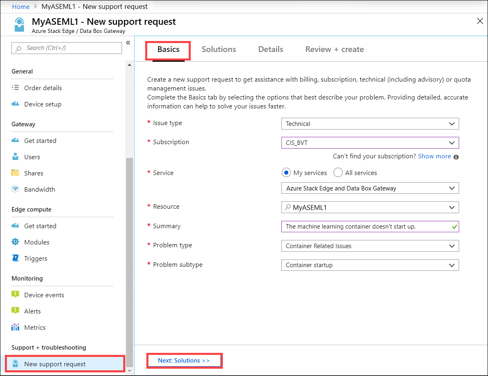
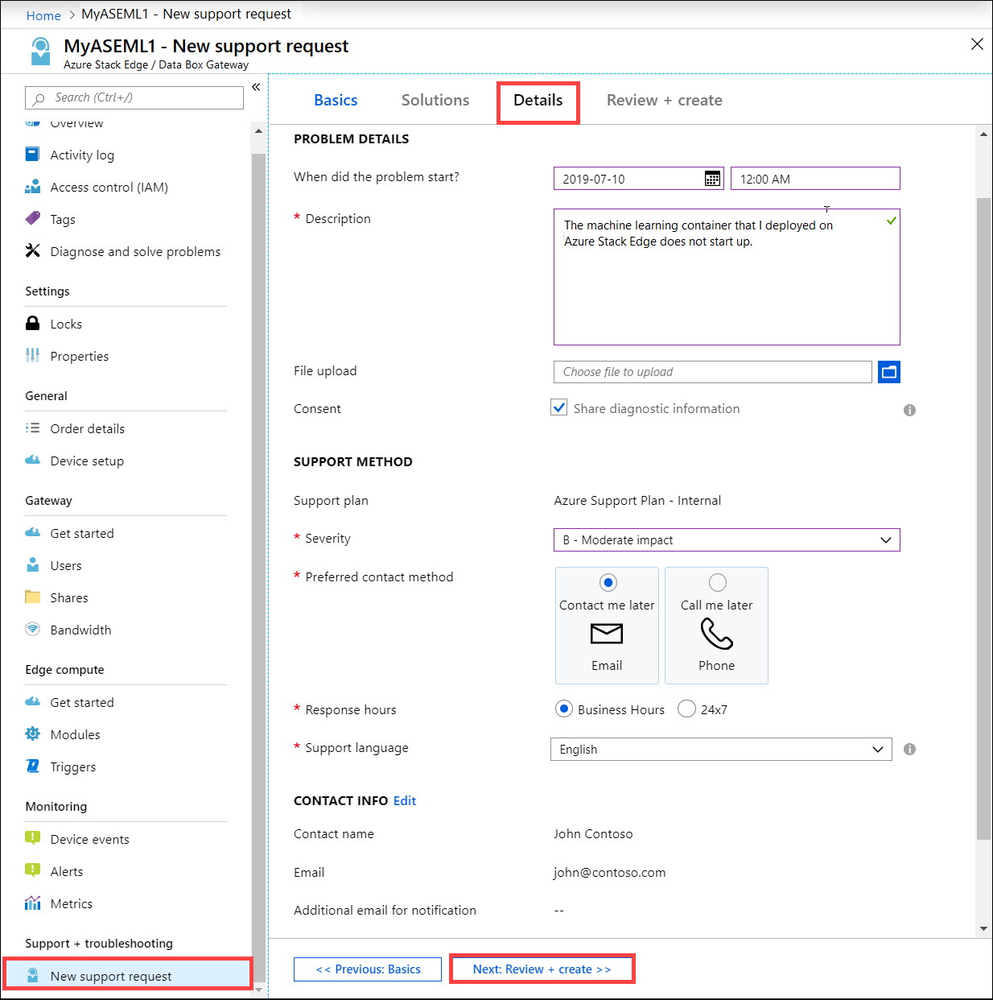
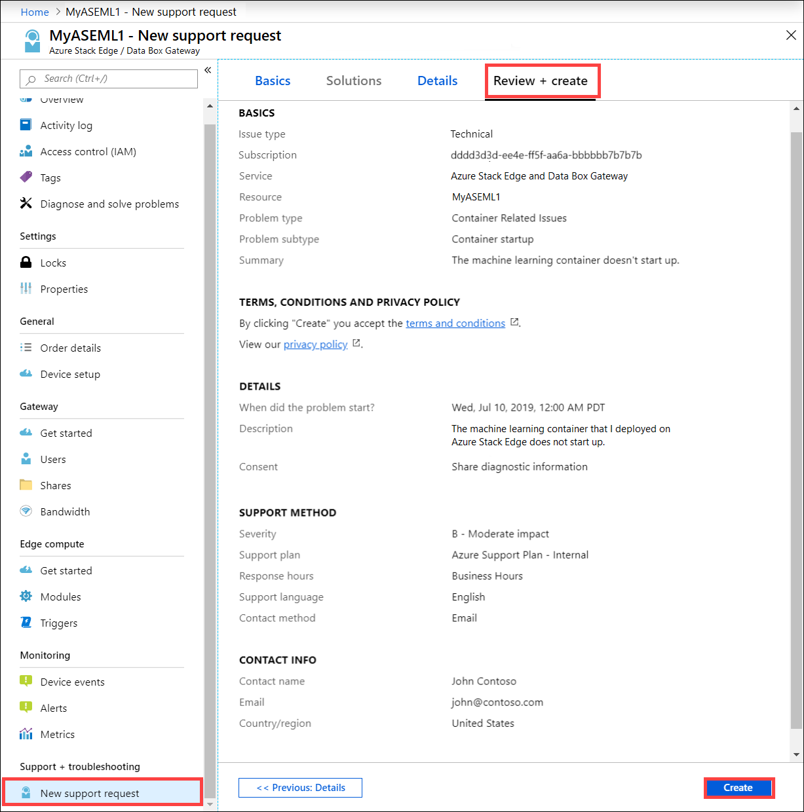
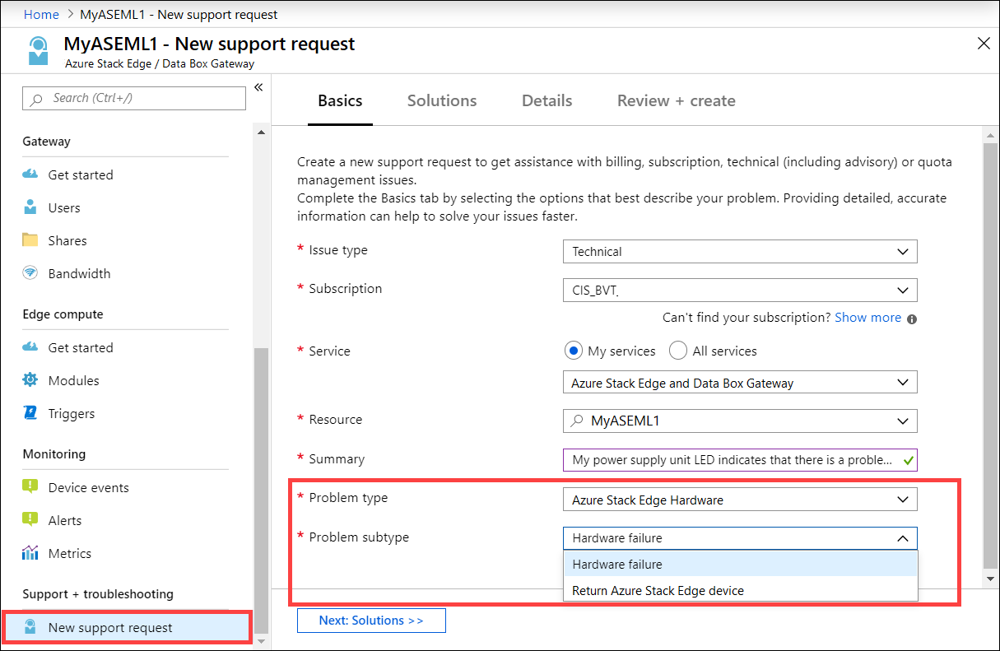
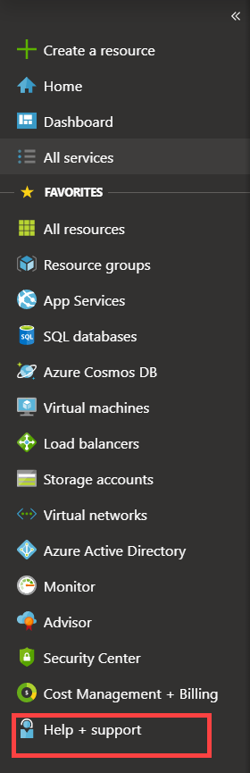

# Open a support ticket for Azure Stack Edge and Azure Data Box Gateway

[!INCLUDE [applies-to-GPU-and-pro-r-and-mini-r-fpga-databox-gateway-skus](../../includes/azure-stack-edge-applies-to-gpu-pro-r-mini-r-fpga-databox-gateway-sku.md)]

This article applies to Azure Stack Edge and Azure Data Box Gateway both of which are managed by the Azure Stack Edge / Azure Data Box Gateway service. If you encounter any issues with your service, you can create a service request for technical support. This article walks you through:

* How to create a support request.
* How to manage a support request lifecycle from within the portal.

## Create a support request

Do the following steps to create a support request:

1. Go to your Azure Stack Edge or Data Box Gateway order. Navigate to **Support + troubleshooting** section and then select **New support request**.

2. In **New support request**, on the **Basics** tab, take the following steps:

    1. From the **Issue type** dropdown list, select **Technical**.
    2. Choose your **Subscription**.
    3. Under **Service**, check **My Services**. From the dropdown list, select **Azure Stack Edge and Data Box Gateway**.
    4. Select your **Resource**. This corresponds to the name of your order.
    5. Give a brief **Summary** of the issue you are experiencing. 
    6. Select your **Problem type**.
    7. Based on the problem type you selected, choose a corresponding **Problem subtype**.
    8. Select **Next: Solutions >>**.

        

3. On the **Details** tab, take the following steps:

    1. Provide the start date and time for the problem.
    2. Supply a **Description** for your problem.
    3. In the **File upload**, select the folder icon to browse any other files you want to upload.
    4. Check **Share diagnostic information**.
    5. Based on your subscription, a **Support plan** is automatically populated.
    6. From the dropdown list, select the **Severity**.
    7. Specify a **Preferred contact method**.
    8. The **Response hours** are automatically selected based on your subscription plan.
    9. Provide the language you prefer for Support.
    10. In the **Contact information**, provide your name, email, phone, optional contact, country/region. Microsoft Support uses this information to reach out to you for further information, diagnosis, and resolution. 
    11. Select **Next: Review + Create >>**.

        

4. On the **Review + Create** tab, review the information related to Support ticket. Select **Create**. 

    

    After you create the Support ticket, a Support engineer will contact you as soon as possible to proceed with your request.

## Get hardware support

This information only applies to Azure Stack device. The process to report hardware issues is as follows:

1. Open a Support ticket from the Azure portal for a hardware issue. Under **Problem type**, select **Azure Stack Hardware**. Choose the **Problem subtype** as **Hardware failure**.

    

    After you have created the Support ticket, a Support engineer will contact you as soon as possible to proceed with your request.

2. If Microsoft Support determines that this is a hardware issue, then one of the following actions occurs:

    * A Field Replacement Unit (FRU) for the failed hardware part is sent. Currently, power supply units and solid-state drives are the only supported FRUs.
    * Only FRUs are replaced within the next business day, everything else requires a full system replacement (FSR) to be shipped.

3. If it is determined that a FRU replacement is needed by 1 PM local time (Monday to Friday), an onsite technician is dispatched the next business day to your location to perform a FRU replacement. A full system replacement typically will take much longer because the parts are shipped from our factory and could be subject to transportation and customs delays.

## Manage a support request

After creating a support ticket, you can manage the lifecycle of the ticket from within the portal.

### To manage your support requests

1. To get to the help and support page, navigate to **Browse > Help + support**.

    

2. A tabular listing of **Recent support requests** is displayed in **Help + support**.

    <!--[Manage support requests](./media/azure-stack-edge-contact-microsoft-support/data-box-edge-support-request-1.png)--> 

3. Select and click a support request. You can view the status and the details for this request. Click **+ New message** if you want to follow up on this request.

## Next steps

- [Troubleshoot issues related to Azure Stack Edge FPGA](azure-stack-edge-troubleshoot.md).
- [Troubleshoot device issues for Azure Stack Edge Pro GPU](azure-stack-edge-gpu-troubleshoot.md).
- [Troubleshoot issues related to Data Box Gateway](../databox-gateway/data-box-gateway-troubleshoot.md).