# Create a VM image from Azure Marketplace or Azure storage account

[!INCLUDE [applies-to-GPU-sku](../../includes/azure-stack-edge-applies-to-gpu-sku.md)]

This article describes how to create a VM image using source images from Azure Marketplace or images from an Azure Storage account. These VM images can then be used to create a VM on your Azure Stack Edge device.

The audience for this guide is IT administrators familiar with existing Azure Stack Edge solutions. 

## Scenarios covered 

The following scenarios are described in this article:

- Add a VM image from an image in Azure Marketplace via Azure portal.  
- Add a VM image from a VHD/VHDX loaded in an Azure Storage account via Azure portal. 
- View VM image properties. 
- Delete a VM. 
- Add a VM. 

## Review the prerequisites  

Before you begin, make sure that:

1. You have a Microsoft account with credentials to access Azure portal.
1. Your Azure Stack Edge subscription is enabled for this feature.
1. You have access to an Azure Stack Edge device that is deployed, registered, and connected to Azure.
1. Your Azure Stack Edge device is running version 2307 or later.
1. Verify that, if you're using custom images, you have a VHD loaded in your Azure Storage account. For detailed steps, see [Upload a VHD image in your Azure Storage account](azure-stack-edge-gpu-create-virtual-machine-image.md?tabs=windows#copy-vhd-to-storage-account-using-azcopy).
1. Verify that your VMs are running. Go to the **Overview** page for your Azure Stack Edge device. **Deployed edge services** must show **Virtual machines** as **Running**.

    [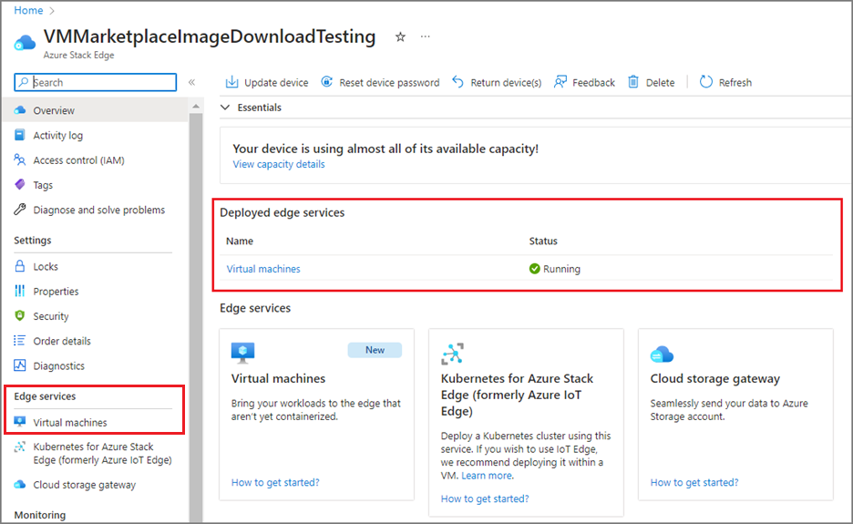](./media/azure-stack-edge-create-a-vm-from-azure-marketplace/azure-stack-edge-deployed-edge-services-vm-running-01.png#lightbox)

   To enable your VM, use the steps in [Deploy VMs on your Azure Stack Edge device](azure-stack-edge-gpu-deploy-virtual-machine-portal.md#add-a-vm-image). 

## Add a VM image from Azure Marketplace

Use the following steps to create a VM image starting from an Azure Marketplace image. You can use the VM image to deploy VMs on your Azure Stack Edge cluster.

1. Go to the Azure Stack Edge cluster resource in Azure portal. Select **Virtual machines** > **Images** > **+ Add image**. Select **Add VM image from Azure Marketplace**. 

    [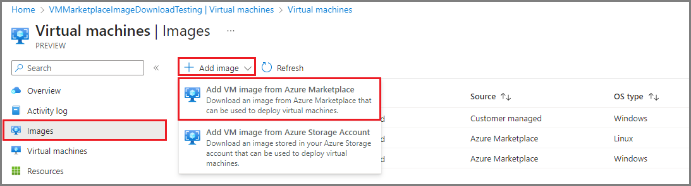](./media/azure-stack-edge-create-a-vm-from-azure-marketplace/azure-stack-edge-add-vm-image-from-azure-marketplace-02.png#lightbox)  

2. On the **Add image** page, select an image from the **Image to download** dropdown menu and then select **Add**.

    [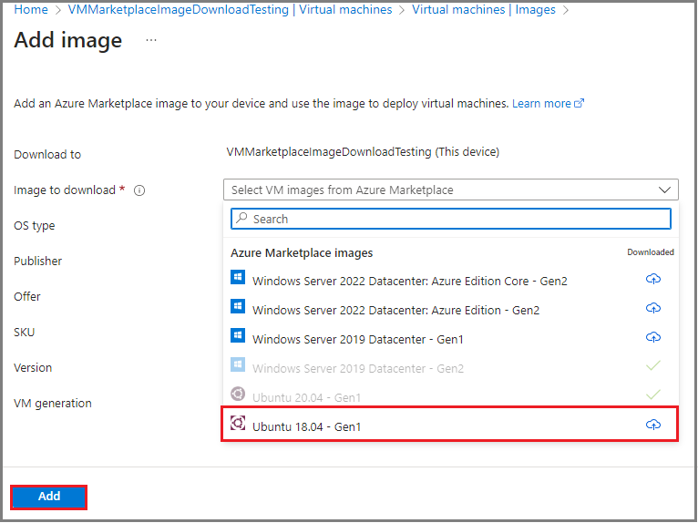](./media/azure-stack-edge-create-a-vm-from-azure-marketplace/azure-stack-edge-add-marketplace-image-03.png#lightbox)

3.	On the **Create an Image** dialog, review VM details and then select **Create**.

4.	When the image download is complete, the VM image shows up in the list of images, and **Status** shows **Downloaded** with **Source** from **Azure Marketplace**. You'll also see a notification that the operation completed successfully.

    [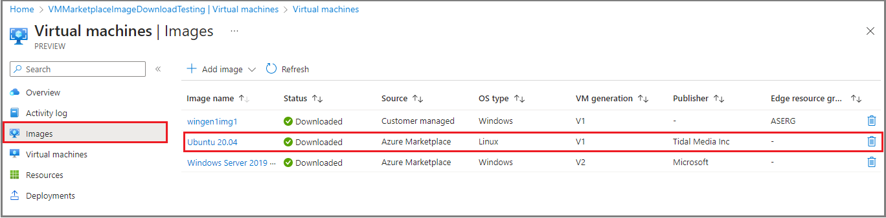](./media/azure-stack-edge-create-a-vm-from-azure-marketplace/azure-stack-edge-downloaded-marketplace-image-04.png#lightbox)

## Add a VM image from an Azure storage account

You can create a VM image by downloading an image from an Azure Storage account and then use that VM image to deploy a VM.

In your Azure Stack Edge cluster resource, perform the following steps:

1.	Go to **Images**. 

2.	Select **+ Add image** and then from the dropdown list, select **Add VM image from Azure Storage Account**. 

    [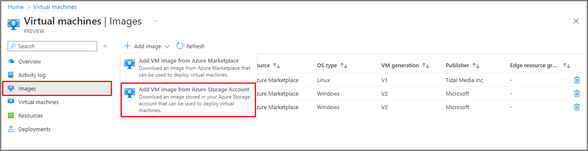](./media/azure-stack-edge-create-a-vm-from-azure-marketplace/azure-stack-edge-add-vm-image-from-azure-storage-account-05.png#lightbox)

3. On the **Add image** page, provide the following information:

   1. **Storage blob** – Select a storage blob source for your VM image.
   1. **Resource group** – Create a new or select an existing resource group to associate with the VM image.
   1. **Save image as** – Provide a name for your VM image.
   1. **OS type** – Specify the OS associated with the image in your Storage account, either Windows or Linux.
   1. **VM generation** – Select the Generation of the VM image.
   1. Select **Add** to create your VM image.

       [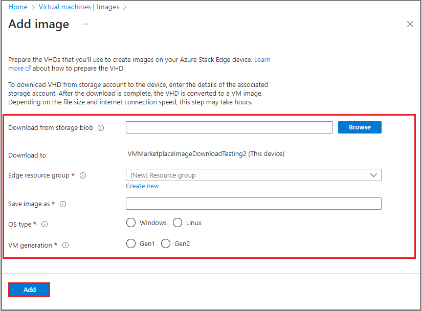](./media/azure-stack-edge-create-a-vm-from-azure-marketplace/azure-stack-edge-add-vm-image-from-azure-storage-account-06.png#lightbox)

4.	An Azure Resource Manager template deployment job starts for the VM image. The image deployment takes a few minutes to complete. The time taken to download the image depends on the size of the custom image and the network bandwidth available for the download.

    You can track the image deployment on the VM image grid. You can see the list of VM images that are already downloaded and the ones that are being downloaded on the cluster.

5.	When the image download is complete, the VM image shows up in the list of images, and the **Status** shows as **Downloaded**. To view more details about any image, select the VM image name from the list of VM images.

## View VM image properties

You may want to view the properties of VM images before you use the image to create a VM. To do so, perform the following steps in the Azure Stack Edge cluster resource:

1.	Select **Images** and then select the VM image in the **Image name** column.

    [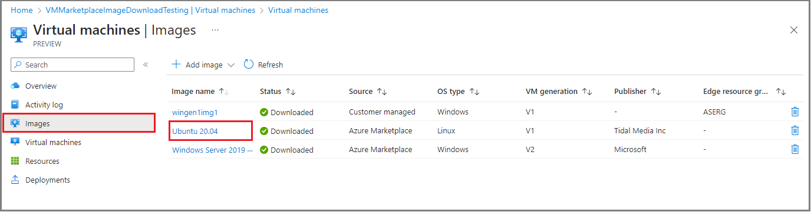](./media/azure-stack-edge-create-a-vm-from-azure-marketplace/azure-stack-edge-vm-image-list-view-07.png#lightbox)

2. View VM image properties at right.

    [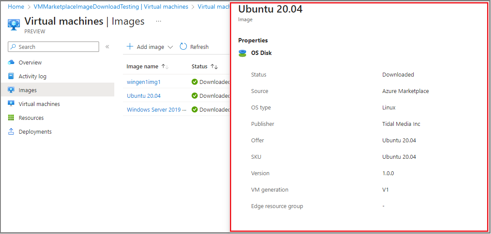](./media/azure-stack-edge-create-a-vm-from-azure-marketplace/azure-stack-edge-vm-image-properties-08.png#lightbox)

## Delete a VM image

You may want to delete a VM image if it's no longer needed. To delete a VM from your Azure Stack Edge resource, perform the following steps:

1.	Select **Images**.

2.	From the list of VM images displayed in the right-pane, select the **trash can** icon for the VM image you want to delete.

    [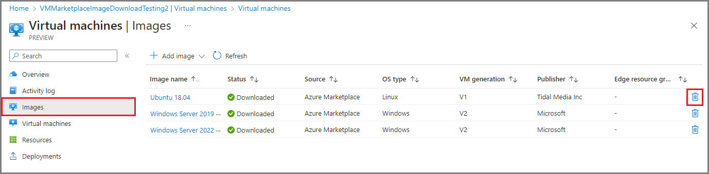](./media/azure-stack-edge-create-a-vm-from-azure-marketplace/azure-stack-edge-vm-image-delete-09.png#lightbox)

3. When prompted to confirm deletion, type the image name and then select **Delete**.

    [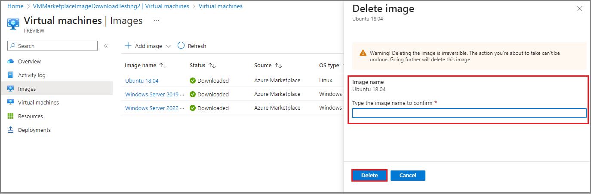](./media/azure-stack-edge-create-a-vm-from-azure-marketplace/azure-stack-edge-delete-vm-confirmation-10.png#lightbox)

4.	Once the VM image is deleted, the list view of VM images will refresh.

## Add a VM

Use the VM image you created earlier to deploy a virtual machine. 

To add a VM to your Azure Stack Edge resource, perform the following steps:

1.	Go to **Virtual machines** > **Virtual machines**.

2.	From the top command bar, select **+ Add virtual machine**.

    [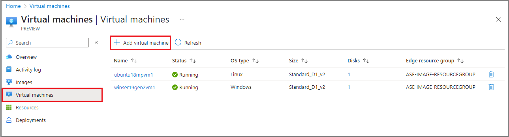](./media/azure-stack-edge-create-a-vm-from-azure-marketplace/azure-stack-edge-add-vm-option-11.png#lightbox)

3.	In the **Add a virtual machine** wizard, on the **Basics** tab, specify the following parameters:
    1. **Virtual machine name** – Specify a name for your VM. The name must follow naming conventions for Azure virtual machines.
    1. **Edge resource group** – Create a new or choose an existing resource group where you'll deploy the resources associated with your VM.
    1. **Image** – Use the dropdown menu to select the Azure Marketplace or customer managed image to create the VM image.
    1. **Size** – Select a VM size appropriate for the workloads you'll deploy.
    1. **Administrator account** – Specify administrator authentication type, username, and SSH public key.
4. To continue, select **Review + create**.

    
 
5. Review the details for the VM you intend to create. To start the VM creation job, select **Create**.

6. VM creation takes several minutes. Once the VM is created, go to **Virtual machines** > **Virtual machines**. The newly created VM is included in the list of VMs.

## Next steps

- [Deploy VMs on your Azure Stack Edge Pro GPU device](azure-stack-edge-gpu-deploy-virtual-machine-portal.md).
