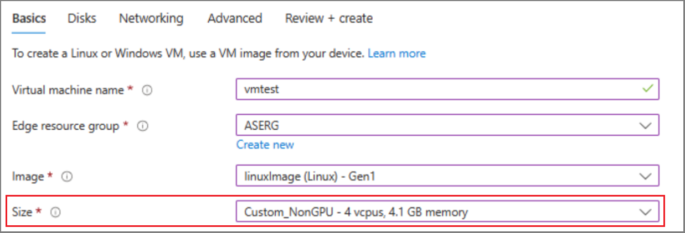

# Update custom VM size

[!INCLUDE [applies-to-GPU-and-pro-r-and-mini-r-skus](../../includes/azure-stack-edge-applies-to-gpu-pro-r-mini-r-sku.md)]

This article describes how to modify a VM size with a custom number of cores, memory, and GPU count, which can be used to create a VM image for Azure Stack Edge.

## Get existing custom VM sizes

Use the following steps to get custom VM sizes for Azure Stack Edge.

1. Connect to the PowerShell interface of your Azure Stack Edge device. For detailed steps, see [Connect to the PowerShell interface](azure-stack-edge-gpu-connect-powershell-interface.md#connect-to-the-powershell-interface).

1. Run the following command to see available VM sizes on your device, including custom sizes:

   ```azurepowershell
   Get-AzVmSize -Location dbelocal 
   ``` 

1. Run the following command to see the names and current values for custom VM sizes on your device:

   ```azurepowershell
   Get-HcsVMCustomSizes
   ```
 
   Here's example output for a machine with a T4 GPU:

   ```Output
   [DBE-BNVGF33.microsoftdatabox.com]: PS>Get-HcsVMCustomSizes 

   [{'Name':'Custom_NonGPU','Cores':8,'MemoryMb':14336},{'Name':'Custom_GPU_T4_v3','Cores':8,'MemoryMb':28672,'GpuCount': 1}] 
   ``` 

   Here's example output for a machine with an A2 GPU: 

   ```Output
   [DBE-BNVGF33.microsoftdatabox.com]: PS>Get-HcsVMCustomSizes 

   [{'Name':'Custom_NonGPU','Cores':8,'MemoryMb':14336},{'Name':'Custom_GPU_A2','Cores':8,'MemoryMb':28672,'GpuCount': 1}] 
   ```

## Update custom VM size

1. Run the following command to update the **Custom VM size** with the `Cores` or `MemoryMb` values for a VM you deploy to your device.
 
   Consider the following requirements and restrictions:
   - The `Name` for these sizes cannot be modified.
   - `GpuCount` can only be a value compatible with the number of GPUs on your device, which is 1 or 2.
   - Make sure to modify the correct GPU custom size that corresponds with the GPU on your device.
   - Once a VM is deployed with a custom size, you cannot modify that custom size again. To make a change, you will have to remove that VM first.
   - Once an operation kicks off, wait at least five minutes before you deploy any other VMs or workloads; this command takes about 5 minutes to complete.
   
   The following table shows default values for available custom SKUs.

   | Size | vCPU | Memory (GiB) | Temp storage | Max OS disk | Max temp storage | Max data disk throughput | Max data disk | Max NICs |
   |-------|-----|------------ |-------------|--------------|-----|-----|-----|----|
   |Custom_NonGPU |8 |14 |64 |2000 |64000 |2300 |64 |8 |

   | Size | vCPU | Memory (GiB) | Temp storage | Max OS disk | Max temp storage | Max data disk throughput | Max data disk | Max NICs | GPU | GPU memory |
   |-------|-----|------------ |-------------|--------------|-----|-----|-----|----|-----|-----|
   |Custom_GPU_T4_v3 |8 |28 |352 |2000 |48000 |2300 |16 |8 |1 |16 |
   |Custom_GPU_A2    |8 |28 |352 |2000 |48000 |2300 |16 |8 |1 |16 |

      ```azurepowershell
      Set-HcsVMCustomSizes -CustomVMSizesJson <string> [-JsonFormat]
      ```

      Here's example output where `Custom_NonGPU` is modified to have four cores and 4096 MiB of memory. 

      ```Output
      [DBE-BNVGF33.microsoftdatabox.com]: PS>Set-HcsVMCustomSizes -CustomVMSizesJson "[{'Name':'Custom_NonGPU','Cores':4,'MemoryMb':4096},{'Name':'Custom_GPU_T4_v3','Cores':8,'MemoryMb':28672,'GpuCount':2}]"

      [{'Name':'Custom_NonGPU','Cores':4,'MemoryMb':4096},{'Name':'Custom_GPU_T4_v3','Cores':8,'MemoryMb':28672,'GpuCount':2}]
      ```

1. Run the following command again to verify that the changes propagated successfully. 

   ```azurepowershell
   Get-AzVmSize -Location dbelocal
   ```

   In Azure portal, the VM size dropdown will update in about five minutes with the new VM options you just created.

   [](./media/azure-stack-edge-create-vm-with-custom-size/azure-stack-edge-custom-vm-size.png#lightbox)

## Next steps

 - [Create a VM](azure-stack-edge-gpu-virtual-machine-overview.md#create-a-vm).
