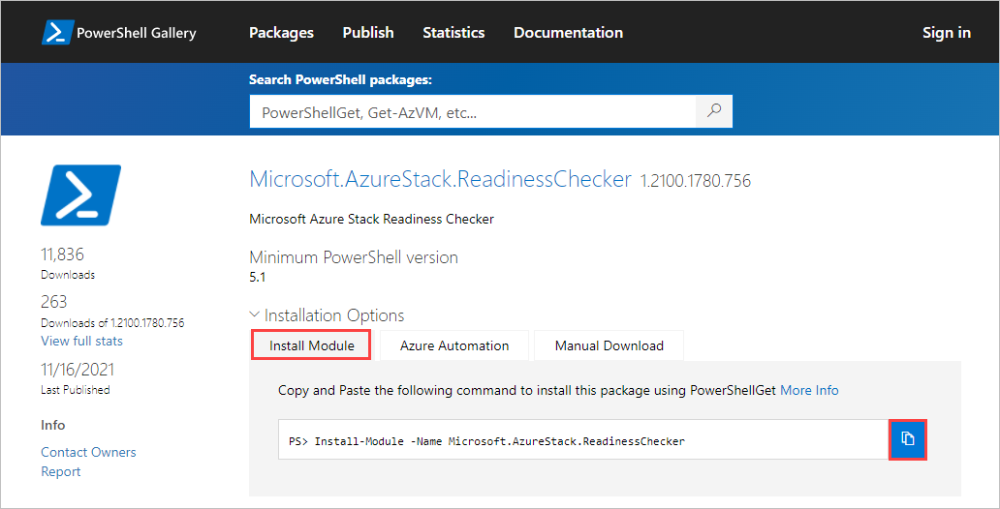

# Check network readiness for Azure Stack Edge devices

[!INCLUDE [applies-to-GPU-and-pro-r-and-mini-r-skus](../../includes/azure-stack-edge-applies-to-gpu-pro-r-mini-r-sku.md)]

This article describes how to check to see how ready your network is for deployment of Azure Stack Edge devices.

You'll use the Azure Stack Network Readiness Checker, a PowerShell tool that runs a series of tests to check mandatory and optional settings on the network where you deploy your Azure Stack Edge devices. The tool returns Pass/Fail status for each test and saves a log file and report file with more detail.

You can run the tool from any computer on the network where you'll deploy the Azure Stack Edge devices. The tool works with PowerShell 5.1, which is built into Windows.

## About the tool

The Azure Stack Network Readiness Checker can check whether a network meets the following prerequisites:

- The Domain Name System (DNS) server is available and functioning.

- The Network Time Protocol (NTP) server is available and functioning.

- Azure endpoints are available and respond on HTTPS, with or without a proxy server.<!--Ask Shijo: HTTPS isn't supported on a proxy server. Does the Network Readiness Checker tool check proxy server connections?-->

- The Windows Update server - either the customer-provided Windows Server Update services (WSUS) server or the public Windows Update server - is available and functioning.

- The network path has a Maximum Transmission Unit (MTU) of at least 1,500 bytes, as required by the Azure Stack Edge service.

- There are no overlapping IP addresses for Edge Compute.

- DNS resource records for Azure Stack Edge can be resolved.

#### Report file

The tool saves a report, `AzsReadinessCheckerReport.json`, with detailed diagnostics that are collected during each test. This information can be helpful if you need to [contact Microsoft Support](azure-stack-edge-contact-microsoft-support.md).

For example, the report provides:

- A list of network adapters on the machine used to run the tests, with the driver version, MAC address, and connection state for each network adapter.

- IP configuration of the machine used to run the tests.

- Detailed DNS response properties that the DNS server returned for each test.

- Detailed HTTP response for each test of a URL.<!--Verify: Should this also be HTTPS instead of HTTP? Does the tool check connections when a proxy server is in use?-->

- Network route trace for each test.

## Prerequisites

Before you begin, complete the following tasks:

- Review network requirements in the [Deployment checklist for your Azure Stack Edge Pro GPU device](azure-stack-edge-gpu-deploy-checklist.md).

- Make sure you have access to a client computer that is running on the network where you'll deploy your Azure Stack Edge devices.

- Install the Azure Stack Network Readiness Checker tool in PowerShell by following the steps in [Install Network Readiness Checker](#install-network-readiness-checker), below.


## Install Network Readiness Checker

To install the Azure Stack Network Readiness Checker on the client computer, do these steps:

1. Open PowerShell on the client computer. If you need to install PowerShell, see [Installing PowerShell on Windows](/powershell/scripting/install/installing-powershell-on-windows).

1. In a browser, go to [Microsoft.AzureStack.ReadinessChecker](https://www.powershellgallery.com/packages/Microsoft.AzureStack.ReadinessChecker/1.2100.1780.756) in the PowerShell Gallery. Version 1.2100.1780.756 of the Microsoft.AzureStack.ReadinessChecker module is displayed.

1. On the **Install Module** tab, select the Copy icon to copy the Install-Module command that installs version 1.2100.1396.426 of the Microsoft.AzureStack.ReadinessChecker.

    

1. Paste in the command at the PowerShell command prompt, and press **Enter**.

1. Press **Y** (Yes) or **A** (Yes to All) at the following prompt to install the module.

   ```powershell
   Untrusted repository
   You are installing the modules from an untrusted repository. If you trust this repository, change its InstallationPolicy value by running the Set-PSRepository cmdlet. Are you sure you want to install the modules from 'PSGallery'?
   [Y] Yes  [A] Yes to All  [N] No  [L] No to All  [S] Suspend  [?] Help (default is "N"):
   ```


## Run a network readiness check

When you run the Azure Stack Network Readiness Checker tool, you'll need to provide network and device information from the [Deployment checklist for your Azure Stack Edge Pro GPU device](azure-stack-edge-gpu-deploy-checklist.md).

To run a network readiness check, do these steps:

1. Open PowerShell on a client computer running on the network where you'll deploy the Azure Stack Edge device.

1. Run a network readiness check by entering the following command:

    ```powershell
    Invoke-AzsNetworkValidation -DnsServer <string[]> -DeviceFqdn <string> [-TimeServer <string[]>] `
      [-Proxy <uri>] [-ProxyCredential <pscredential>] [-WindowsUpdateServer <uri[]>] [-CustomUrl <url[]>] `
      [-AzureEnvironment {AzureCloud | AzureChinaCloud | AzureGermanCloud | AzureUSGovernment | CustomCloud}] `
      [-SkipTests {LinkLayer | IPConfig | DnsServer | TimeServer | PathMtu | DuplicateIP | AzureEndpoint | WindowsUpdateServer | DnsRegistration}] `
      [-OutputPath <string>]
    ```

   To get meaningful Network Readiness Checker results that find key issues in your network setup, you need to include all of the following parameters that apply to your environment.

   |Parameter|Description|
   |---------|-----------|
   |`-DnsServer`|IP addresses of the DNS servers (for example, your primary and secondary DNS servers).|
   |`-DeviceFqdn`|Fully qualified domain name (FQDN) that you plan to use for the Azure Stack Edge device.|
   |`-TimeServer`|FQDN of one or more Network Time Protocol (NTP) servers. (Recommended)|
   |`-Proxy`|URI for the proxy server, if you're using a proxy server. (Optional)|
   |`-ProxyCredential`|[PSCredential object](/powershell/module/microsoft.powershell.security/get-credential) containing the username and password used on the proxy server. (Required if proxy server requires user authentication)|
   |`-WindowsUpdateServer`|URIs for one or more Windows Server Update Services (WSUS) servers. (Optional)|
   |`-ComputeIPs`|The Compute IP range to be used by Kubernetes. Specify the Start IP and End IP separated by a hyphen.|
   |`-CustomUrl`|Lists other URLs that you want to test HTTP access to. (Optional)|
   |`-AzureEnvironment`|Indicates the Azure environment. Required if the device is deployed to an environment other than the Azure public cloud (Azure Cloud).|
   |`-SkipTests`|Can be used to exclude tests. (Optional)<br>Separate test names with a comma.|
   |`-OutputPath`|Tells where to store the log file and report from the tests. (Optional)<br>If you don't use this path, the files are stored in the following path: `C:\Users\<username>\AppData\Local\Temp\AzsReadinessChecker\`<br>Each run of the Network Readiness Checker overwrites the existing report.|

## Sample output

The following samples are the output from successful and unsuccessful runs of the Azure Stack Network Readiness Checker tool.

### Sample output: Successful test

The following sample is the output from a successful run of the Network Readiness Checker tool with these parameters:

```powershell
Invoke-AzsNetworkValidation -DnsServer '10.50.10.50', '10.50.50.50' -DeviceFqdn 'aseclient.contoso.com' -TimeServer 'pool.ntp.org' -Proxy 'http://proxy.contoso.com:3128/' -SkipTests DuplicateIP -WindowsUpdateServer 'http://ase-prod.contoso.com' -OutputPath `C:\ase-network-tests`
```
<!--Query: Add beginning single quote to the output path string or remove the final one? No end quote in sample return data.-->

The tool returned this output:

```powershell
PS C:\Users\Administrator> Invoke-AzsNetworkValidation -DnsServer '10.50.10.50', '10.50.50.50' -DeviceFqdn 'aseclient.contoso.com' -TimeServer 'pool.ntp.org' -Proxy 'http://proxy.contoso.com:3128/' -SkipTests DuplicateIP -WindowsUpdateServer 'http://ase-prod.contoso.com' -OutputPath C:\ase-network-tests

Invoke-AzsNetworkValidation v1.2100.1396.426 started.
The following tests will be executed: LinkLayer, IPConfig, DnsServer, PathMtu, TimeServer, AzureEndpoint, WindowsUpdateServer, DnsRegistration, Proxy
Validating input parameters
Validating Azure Stack Edge Network Readiness
        Link Layer: OK
        IP Configuration: OK
 Using network adapter name 'vEthernet (corp-1g-Static)', description 'Hyper-V Virtual Ethernet Adapter'
        DNS Server 10.50.10.50: OK
        DNS Server 10.50.50.50: OK
        Network Path MTU: OK
        Time Server pool.ntp.org: OK
        Proxy Server 10.57.48.80: OK
        Azure ARM Endpoint: OK
        Azure Graph Endpoint: OK
        Azure Login Endpoint: OK
        Azure ManagementService Endpoint: OK
        Azure AseService Endpoint: OK
        Azure AseServiceBus Endpoint: OK
        Azure AseStorageAccount Endpoint: OK
        Windows Update Server ase-prod.contoso.com port 80: OK
        DNS Registration for aseclient.contoso.com: OK
        DNS Registration for login.aseclient.contoso.com: OK
        DNS Registration for management.aseclient.contoso.com: OK
        DNS Registration for *.blob.aseclient.contoso.com: OK
        DNS Registration for compute.aseclient.contoso.com: OK

Log location (contains PII): C:\ase-network-tests\AzsReadinessChecker.log
Report location (contains PII): C:\ase-network-tests\AzsReadinessCheckerReport.json
Invoke-AzsNetworkValidation Completed
```

### Sample output: Failed test

If a test fails, the Network Readiness Checker returns information to help you resolve the issue, as shown in the sample output below.

The following sample is the output from this command:

```powershell
Invoke-AzsNetworkValidation -DnsServer '10.50.10.50' -TimeServer 'time.windows.com' -DeviceFqdn aseclient.contoso.com -ComputeIPs 10.10.52.1-10.10.52.20 -CustomUrl 'http://www.nytimes.com','http://fakename.fakeurl.com'
```

The tool returned this output:

```powershell
PS C:\Users\Administrator> Invoke-AzsNetworkValidation -DnsServer '10.50.10.50' -TimeServer 'time.windows.com' -DeviceFqdn aseclient.contoso.com -ComputeIPs 10.10.52.1-10.10.52.20 -CustomUrl 'http://www.nytimes.com','http://fakename.fakeurl.com'

Invoke-AzsNetworkValidation v1.2100.1396.426 started.
Validating input parameters
The following tests will be executed: LinkLayer, IPConfig, DnsServer, PathMtu, TimeServer, AzureEndpoint, WindowsUpdateServer, DuplicateIP, DnsRegistration, CustomUrl
Validating Azure Stack Edge Network Readiness
        Link Layer: OK
        IP Configuration: OK
        DNS Server 10.50.10.50: OK
        Network Path MTU: OK
        Time Server time.windows.com: OK
        Azure ARM Endpoint: OK
        Azure Graph Endpoint: OK
        Azure Login Endpoint: OK
        Azure ManagementService Endpoint: OK
        Azure AseService Endpoint: OK
        Azure AseServiceBus Endpoint: OK
        Azure AseStorageAccount Endpoint: OK
        URL http://www.nytimes.com/: OK
        URL http://fakename.fakeurl.com/: Fail
        Windows Update Server windowsupdate.microsoft.com port 80: OK
        Windows Update Server update.microsoft.com port 80: OK
        Windows Update Server update.microsoft.com port 443: OK
        Windows Update Server download.windowsupdate.com port 80: OK
        Windows Update Server download.microsoft.com port 443: OK
        Windows Update Server go.microsoft.com port 80: OK
        Duplicate IP: Warning
        DNS Registration for aseclient.contoso.com: OK
        DNS Registration for login.aseclient.contoso.com: Fail
        DNS Registration for management.aseclient.contoso.com: Fail
        DNS Registration for *.blob.aseclient.contoso.com: Fail
        DNS Registration for compute.aseclient.contoso.com: Fail
Details:
[-] URL http://fakename.fakeurl.com/: fakename.fakeurl.com : DNS name does not exist
[-] Duplicate IP: Some IP addresses allocated to Azure Stack may be active on the network. Check the output log for the detailed list.
[-] DNS Registration for login.aseclient.contoso.com: login.aseclient.contoso.com : DNS name does not exist
[-] DNS Registration for management.aseclient.contoso.com: management.aseclient.contoso.com : DNS name does not exist
[-] DNS Registration for *.blob.aseclient.contoso.com: testname.aseclient.contoso.com : DNS name does not exist
[-] DNS Registration for compute.aseclient.contoso.com: compute.aseclient.contoso.com : DNS name does not exist
Additional help URL http://aka.ms/azsnrc

Log location (contains PII): C:\Users\[*redacted*]\AppData\Local\Temp\AzsReadinessChecker\AzsReadinessChecker.log
Report location (contains PII): C:\Users\[*redacted*]\AppData\Local\Temp\AzsReadinessChecker\AzsReadinessCheckerReport.json
Invoke-AzsNetworkValidation Completed
```

## Review log and report

For more information, you can review the log and report. By default, both files are saved in the following location:

- Log: `C:\Users\<username>\AppData\Local\Temp\AzsReadinessChecker\AzrReadinessChecker.log`
- Report: `C:\Users\<username>\AppData\Local\Temp\AzsReadinessChecker\AzrReadinessCheckerReport.json`

## Next steps

- Learn how to connect to your Azure Stack Edge device: [Pro GPU device](azure-stack-edge-gpu-deploy-connect.md), [Pro R device](azure-stack-edge-pro-r-deploy-connect.md), [Mini R device](azure-stack-edge-mini-r-deploy-connect.md).
- Review a deployment checklist for your device: [Pro GPU checklist](azure-stack-edge-gpu-deploy-checklist.md), [Pro R checklist](azure-stack-edge-pro-r-deploy-checklist.md), [Mini R checklist](azure-stack-edge-mini-r-deploy-checklist.md).
- [Contact Microsoft Support](azure-stack-edge-contact-microsoft-support.md).
