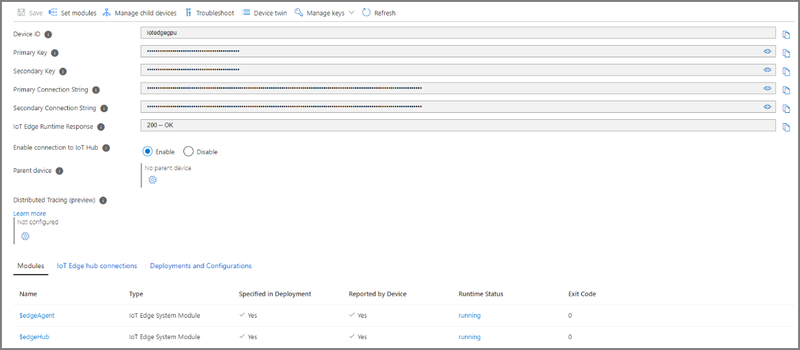
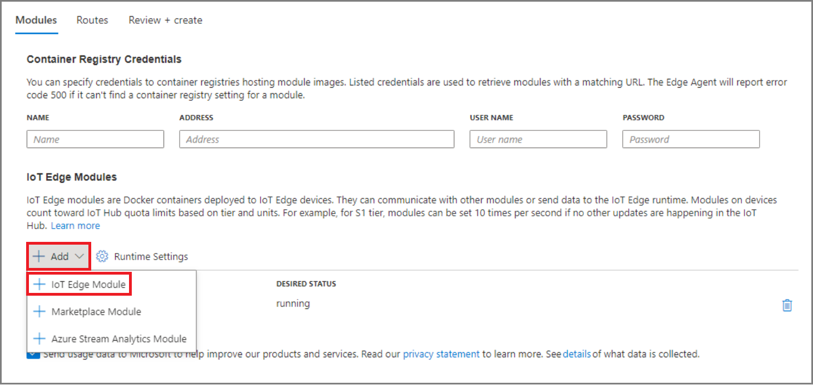

# Deploy the Nvidia DeepStream module on Ubuntu VM on Azure Stack Edge Pro with GPU

[!INCLUDE [applies-to-GPU-and-pro-r-and-mini-r-skus](../../includes/azure-stack-edge-applies-to-gpu-pro-r-mini-r-sku.md)]

This article walks you through deploying Nvidia’s DeepStream module. This content only applies to GPU environments. 

## Prerequisites

Before you begin, make sure you have:

- A VM that is set up for GPU during VM creation.

## Get module from IoT Edge Module Marketplace

1. From **IoT Hub** > select **set modules**.

    

1. Select **Add** > **IoT Edge Module**.

    

1. Search for **NVIDIA DeepStream SDK 5.1 for x86/AMD64** and then select it. 

    

1. Select **Review + Create**, and then select **Create module**.

## Verify runtime status of the module

1. Verify that the module is running.  

     

1. Verify that the module provides the following output in the troubleshooting page of the IoT Edge device on IoT Hub:

    

    
    
1. After a certain period of time, the module runtime will complete and quit, causing the module status to return an error. This error condition is expected behavior.

    