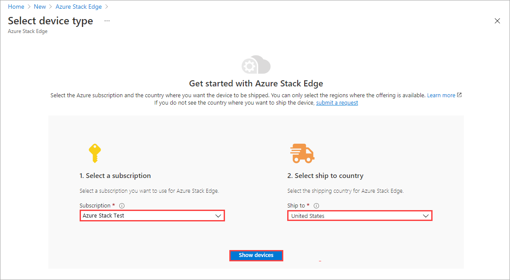
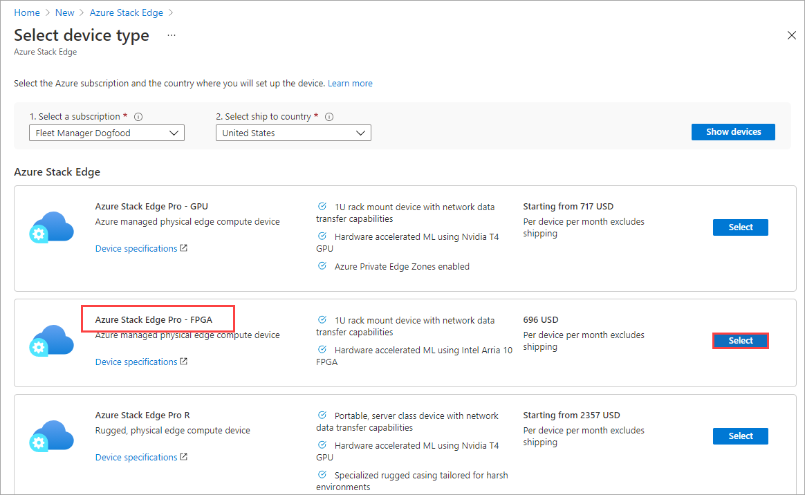
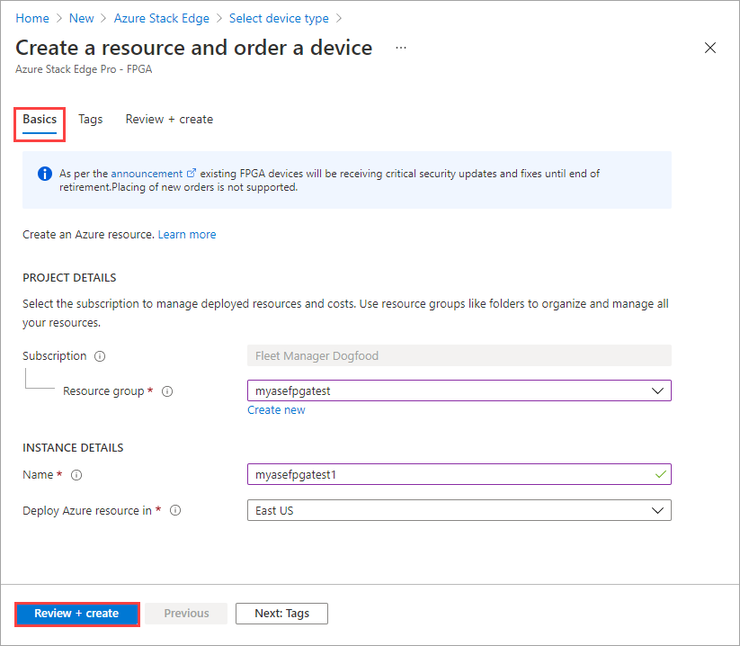
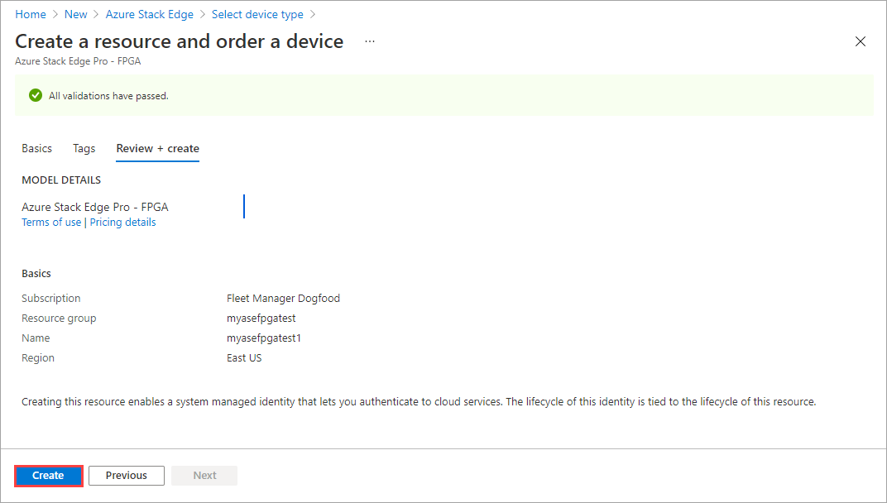
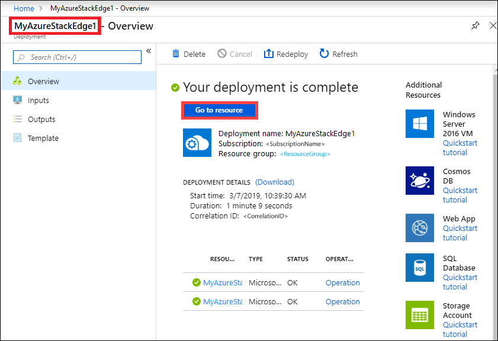
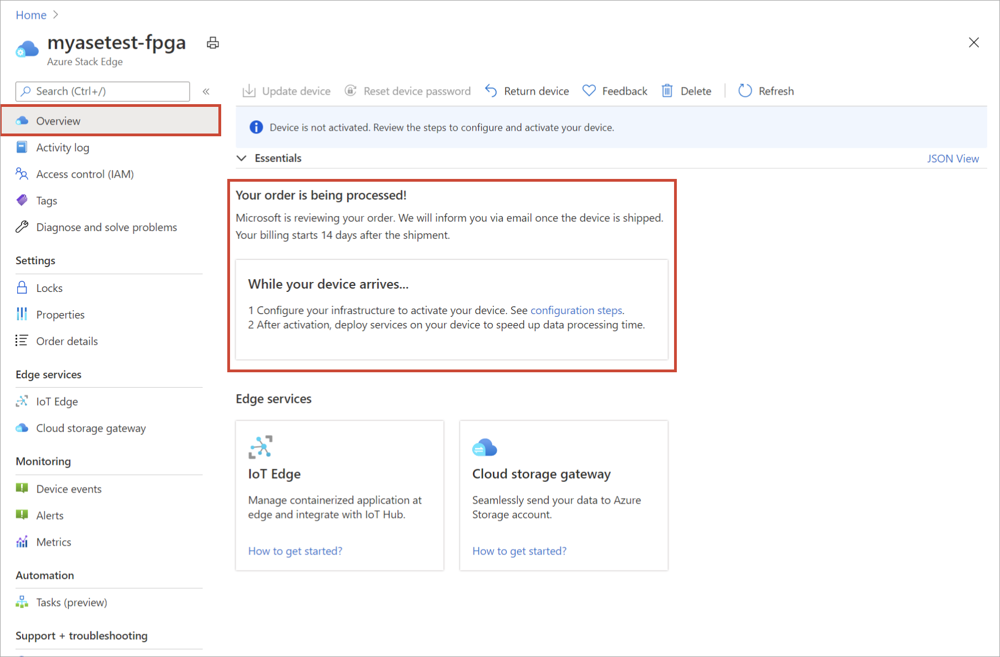
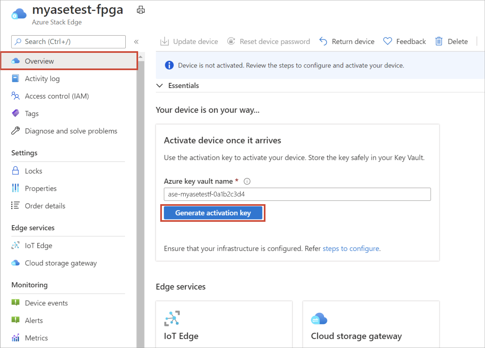

# Tutorial: Prepare to deploy Azure Stack Edge Pro FPGA  

This is the first tutorial in the series of deployment tutorials that are required to completely deploy Azure Stack Edge Pro FPGA. This tutorial describes how to prepare the Azure portal to deploy an Azure Stack Edge resource. 

You need administrator privileges to complete the setup and configuration process. The portal preparation takes less than 10 minutes.  

In this tutorial, you learn how to:

> [!div class="checklist"]
>
> * Create a new resource
> * Get the activation key

If you don't have an Azure subscription, create a [free account](https://azure.microsoft.com/free/?WT.mc_id=A261C142F) before you begin.

## Get started

To deploy Azure Stack Edge Pro FPGA, refer to the following tutorials in the prescribed sequence.

| **#** | **In this step** | **Use these documents** |
| --- | --- | --- | 
| 1. |**[Prepare the Azure portal for Azure Stack Edge Pro FPGA](azure-stack-edge-deploy-prep.md)** |Create and configure your Azure Stack Edge resource before you install an Azure Stack Box Edge physical device. |
| 2. |**[Install Azure Stack Edge Pro FPGA](azure-stack-edge-deploy-install.md)**|Unpack, rack, and cable the Azure Stack Edge Pro FPGA physical device.  |
| 3. |**[Connect, set up, and activate Azure Stack Edge Pro FPGA](azure-stack-edge-deploy-connect-setup-activate.md)** |Connect to the local web UI, complete the device setup, and activate the device. The device is ready to set up SMB or NFS shares.  |
| 4. |**[Transfer data with Azure Stack Edge Pro FPGA](azure-stack-edge-deploy-add-shares.md)** |Add shares and connect to shares via SMB or NFS. |
| 5. |**[Transform data with Azure Stack Edge Pro FPGA](azure-stack-edge-deploy-configure-compute.md)** |Configure compute modules on the device to transform the data as it moves to Azure. |

You can now begin to set up the Azure portal.

## Prerequisites

Following are the configuration prerequisites for your Azure Stack Edge resource, your Azure Stack Edge Pro FPGA device, and the datacenter network.

### For the Azure Stack Edge resource

Before you begin, make sure that:

* Your Microsoft Azure subscription is enabled for an Azure Stack Edge resource. Make sure that you used a supported subscription such as [Microsoft Enterprise Agreement (EA)](https://azure.microsoft.com/overview/sales-number/), [Cloud Solution Provider (CSP)](/partner-center/azure-plan-lp), or [Microsoft Azure Sponsorship](https://azure.microsoft.com/offers/ms-azr-0036p/). Pay-as-you-go subscriptions aren't supported.

* RBAC roles: You have the following role assignments in Azure role-based access control (RBAC):

  * To create Azure Stack Edge, IoT Hub, and Azure storage resources, a user must have the Contributor or Owner role at resource group scope.

  * To assign the Contributor role to a user at resource group scope, you must have the Owner role at subscription scope.

  For detailed steps, see [Assign Azure roles using the Azure portal](../role-based-access-control/role-assignments-portal.md).

* Resource providers: The following resource providers are registered: 

  * To create an Azure Stack Edge/Data Box Gateway resource, make sure the `Microsoft.DataBoxEdge`provider is registered.

  * To create an IoT Hub resource, make sure the `Microsoft.Devices` provider is registered.

  * To create an Azure Storage resource, make sure Azure Storage is registered. The Azure Storage Resource Provider (SRP) is by default a registered resource provider, but in some cases registration may be needed.

  **To register a resource provider, you must have been assigned the related RBAC role, above.**

  For information on how to register, see [Register resource provider](azure-stack-edge-manage-access-power-connectivity-mode.md#register-resource-providers).

* You have admin or user access to Azure Active Directory Graph API. For more information, see [Azure Active Directory Graph API](/previous-versions/azure/ad/graph/howto/azure-ad-graph-api-permission-scopes#default-access-for-administrators-users-and-guest-users-).

* You have your Microsoft Azure storage account with access credentials.

* You are not blocked by any Azure Policy assignment set up by your system administrator. For more information about Azure Policy, see [Quickstart: Create a policy assignment to identify non-compliant resources](../governance/policy/assign-policy-portal.md).

### For the Azure Stack Edge Pro FPGA device

Before you deploy a physical device, make sure that:

* You've reviewed the safety information that was included in the shipment package.
* You have a 1U slot available in a standard 19" rack in your datacenter for rack mounting the device.
* You have access to a flat, stable, and level work surface where the device can rest safely.
* The site where you intend to set up the device has standard AC power from an independent source or a rack power distribution unit (PDU) with an uninterruptible power supply (UPS).
* You have access to a physical device.

### For the datacenter network

Before you begin, make sure that:

* The network in your datacenter is configured per the networking requirements for your Azure Stack Edge Pro FPGA device. For more information, see [Azure Stack Edge Pro FPGA System Requirements](azure-stack-edge-system-requirements.md).

* For normal operating conditions of your Azure Stack Edge Pro FPGA, you have:

  * A minimum of 10 Mbps download bandwidth to ensure the device stays updated.
  * A minimum of 20 Mbps dedicated upload and download bandwidth to transfer files.

## Create new resource for existing device

If you're an existing Azure Stack Edge Pro FPGA customer, use the following procedure to create a new resource if you need to replace or reset your existing device.

If you're a new customer, we recommend that you explore using Azure Stack Edge Pro - GPU devices for your workloads. For more information, go to [What is Azure Stack Edge Pro with GPU](azure-stack-edge-gpu-overview.md). For information about ordering an Azure Stack Edge Pro with GPU device, go to [Create a new resource for Azure Stack Edge Pro - GPU](azure-stack-edge-gpu-deploy-prep.md#create-a-new-resource).

To create a new Azure Stack Edge resource for an existing device, take the following steps in the Azure portal.

1. Use your Microsoft Azure credentials to sign in to:

    - The Azure portal at this URL: [https://portal.azure.com](https://portal.azure.com).
    - Or, the Azure Government portal at this URL: [https://portal.azure.us](https://portal.azure.us). For more details, go to [Connect to Azure Government using the portal](../azure-government/documentation-government-get-started-connect-with-portal.md).

1. Select **+ Create a resource**. Search for and select **Azure Stack Edge**. Then select **Create**.

1. Select the subscription for the Azure Stack Edge Pro FPGA device and the country/region to ship the device to in **Ship to**.

   

1. In the list of device types that is displayed, select **Azure Stack Edge Pro - FPGA**. Then choose **Select**. 

   The **Azure Stack Edge Pro - FPGA** device type is only displayed if you have an existing device. If you need to order a new device, go to [Create a new resource for Azure Stack Edge Pro - GPU](azure-stack-edge-gpu-deploy-prep.md?tabs=azure-portal#create-a-new-resource).

   

1. On the **Basics** tab:

   1. Enter or select the following **Project details**.
    
       |Setting  |Value  |
       |---------|---------|
       |Subscription    |This value is automatically populated based on the earlier selection. Subscription is linked to your billing account. |
       |Resource group  |Select an existing group or create a new group. Learn more about [Azure Resource Groups](../azure-resource-manager/management/overview.md).     |

   1. Enter or select the following **Instance details**.

       |Setting  |Value  |
       |---------|---------|
       |Name   | A friendly name to identify the resource. The name has from 2 and 50 characters, including letters, numbers, and hyphens.  Name starts and ends with a letter or a number.        |
       |Region     |For a list of all the regions where the Azure Stack Edge resource is available, see [Azure products available by region](https://azure.microsoft.com/global-infrastructure/services/?products=databox&regions=all). If using Azure Government, all the government regions are available as shown in the [Azure regions](https://azure.microsoft.com/global-infrastructure/regions/).  Choose a location closest to the geographical region where you want to deploy your device.|

   1. Select **Review + create**.

    

1. On the **Review + create** tab, review the **Terms of use**, **Pricing details**, and the details for your resource. Then select **Create**.

    

1. The resource creation takes a few minutes. After the resource is successfully created and deployed, you're notified. Select **Go to resource**.

   

After the order is placed, Microsoft reviews the order and contacts you (via email) with shipping details.

## Get the activation key

After the Azure Stack Edge resource is up and running, you'll need to get the activation key. This key is used to activate and connect your Azure Stack Edge Pro FPGA device with the resource. You can get this key now while you are in the Azure portal.

1. Go to the resource that you created, and select **Overview**. You'll see a notification to the effect that your order is being processed.

    

2. After the order is processed and the device is on your way, the **Overview** updates. Accept the default **Azure Key Vault name** or enter a new one. Select **Generate activation key**. Select the copy icon to copy the key and save it for later use.

    

> [!IMPORTANT]
>
> * The activation key expires three days after it is generated.
> * If the key has expired, generate a new key. The older key is not valid.

## Next steps

In this tutorial, you learned about Azure Stack Edge Pro FPGA topics such as:

> [!div class="checklist"]
>
> * Create a new resource
> * Get the activation key

Advance to the next tutorial to learn how to install Azure Stack Edge Pro FPGA.

> [!div class="nextstepaction"]
> [Install Azure Stack Edge Pro FPGA](./azure-stack-edge-deploy-install.md)