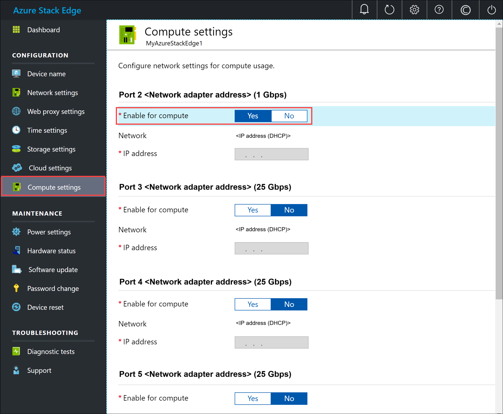
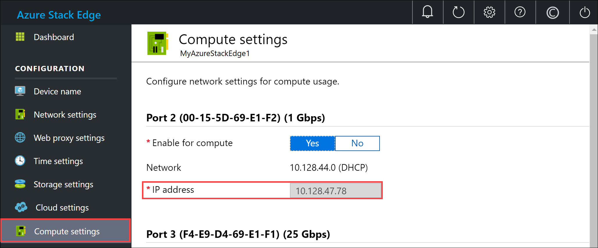
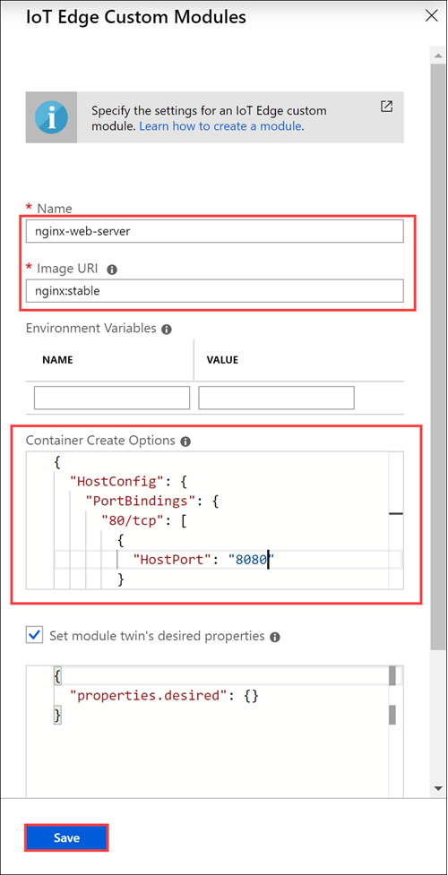
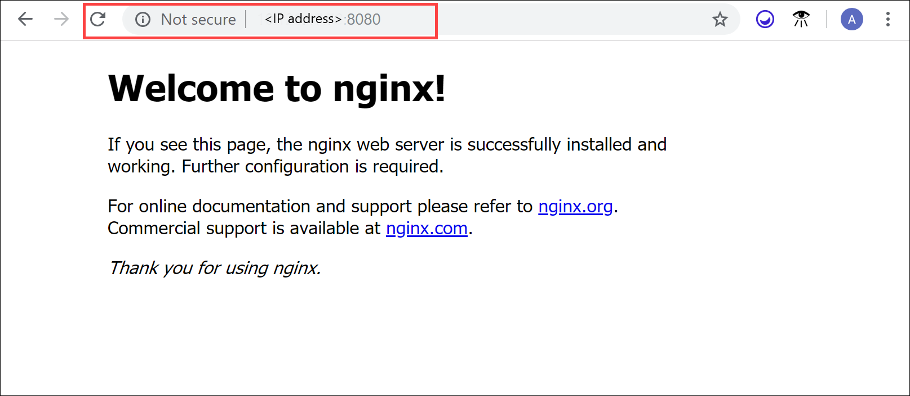

# Enable compute network on your Azure Stack Edge Pro

This article describes how the modules running on your Azure Stack Edge Pro can access the compute network enabled on the device.

To configure the network, you'll take the following steps:

- Enable a network interface on your Azure Stack Edge Pro device for compute
- Add a module to access compute network on your Azure Stack Edge Pro
- Verify the module can access the enabled network interface

In this tutorial, you'll use a webserver app module to demonstrate the scenario.

## Prerequisites

Before you begin, you'll need:

- An Azure Stack Edge Pro device with device setup completed.
- You've completed **Configure compute** step as per the [Tutorial: Transform data with Azure Stack Edge Pro](azure-stack-edge-deploy-configure-compute-advanced.md#configure-compute) on your device. Your device should have an associated IoT Hub resource, an IoT device, and an IoT Edge device.

## Enable network interface for compute

To access the modules running on your device via an external network, you'll need to assign an IP address to a network interface on your device. You can manage these compute settings from your local web UI.

Take the following steps on your local web UI to configure compute settings.

1. In the local web UI, go to **Configuration > Compute settings**.  

2. **Enable** the network interface that you want to use to connect to a compute module that you'll run on the device.

    - If using static IP addresses, enter an IP address for the network interface.
    - If using DHCP, the IP addresses are automatically assigned. This example uses DHCP.

    

3. Select **Apply** to apply the settings. Make a note of the IP address assigned to the network interface if using DHCP.

    

## Add webserver app module

Take the following steps to add a webserver app module on your Azure Stack Edge Pro device.

1. Go to the IoT Hub resource associated with your Azure Stack Edge Pro device and then select **IoT Edge device**.
2. Select the IoT Edge device associated with your Azure Stack Edge Pro device. On the **Device details**, select **Set modules**. On **Add modules**, select **+ Add** and then select **IoT Edge Module**.
3. In the **IoT Edge custom modules** blade:

    1. Specify a **Name** for your webserver app module that you want to deploy.
    2. Provide an **Image URI** for your module image. A module matching the provided name and tags is retrieved. In this case, `mcr.microsoft.com/oss/nginx/nginx:1.15.5-alpine` will pull an nginx image (tagged as `1.15.5-alpine`) from the public `mcr.microsoft.com` registry.
    3. In the **Container Create Options**, paste the following sample code:  

        ```
        {
            "HostConfig": {
                "PortBindings": {
                    "80/tcp": [
                        {
                            "HostPort": "8080"
                        }
                    ]
                }
            }
        }
        ```

        This configuration lets you access the module using the compute network IP over *http* on TCP port 8080 (with the default webserver port being 80).

        

    4. Select **Save**.

## Verify module access

1. Verify the module is successfully deployed and is running. On the **Device Details** page, on the **Modules** tab, the runtime status of the module should be **running**.  
2. Connect to the web server app module. Open a browser window and type:

    `http://<compute-network-IP-address>:8080`

    You should see that the webserver app is running.

    

## Next steps

- Learn how to [Manage users via Azure portal](azure-stack-edge-manage-users.md).
