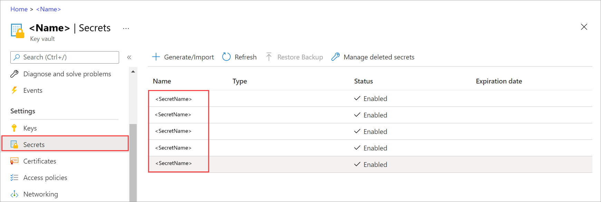

# Manage Azure Stack Edge secrets using Azure Key Vault 

[!INCLUDE [applies-to-GPU-and-pro-r-and-mini-r-skus](../../includes/azure-stack-edge-applies-to-gpu-pro-r-mini-r-sku.md)]

Azure Key Vault is integrated with Azure Stack Edge resource for secret management. This article provides details on how an Azure Key Vault is created for Azure Stack Edge resource during device activation and is then used for secret management. 

## About key vault and Azure Stack Edge

Azure Key Vault cloud service is used to securely store and control access to tokens, passwords, certificates, API keys, and other secrets. Key Vault also makes it easy to create and control the encryption keys used to encrypt your data. 

For Azure Stack Edge service, the integration with key vault provides the following benefits:

- Stores customer secrets. One of the secrets used for the Azure Stack Edge service is Channel Integrity Key (CIK). This key allows you to encrypt your secrets and is securely stored in the key vault. Device secrets such as BitLocker recovery key and Baseboard Management Controller (BMC) user password are also stored in the key vault. 

    For more information, see [Securely store secrets and keys](../key-vault/general/overview.md#securely-store-secrets-and-keys).
- Passes encrypted customer secrets to the device.
- Displays device secrets for easy access if the device is down.

## Generate activation key and create key vault

A key vault is created for Azure Stack Edge resource during the process of activation key generation. The key vault is created in the same resource group where the Azure Stack Edge resource is present. Contributor permission is required on the key vault. 

### Prerequisites for key vault

Prior to the key vault creation during activation, the following prerequisites must be satisfied:

- Register the *Microsoft.KeyVault* resource provider before you create the Azure Stack Edge resource. The resource provider is automatically registered if you have owner or contributor access to the subscription. The key vault is created in the same subscription and the resource group as the Azure Stack Edge resource. 

- When you create an Azure Stack Edge resource, a system-assigned managed identity is also created that persists for the lifetime of the resource and communicates with the resource provider on the cloud. 

    When the managed identity is enabled, Azure creates a trusted identity for the Azure Stack Edge resource.

### Key vault creation

After you have created the resource, you need to activate the resource with the device. To do so, you'll generate an activation key from the Azure portal. 

When you generate an activation key, the following events occur: 

- You request an activation key in the Azure portal. The request is then sent to key vault resource provider. 
- A standard tier key vault with access policy is created and is locked by default. 
    - This key vault uses the default name or a 3 to 24 character long custom name that you specified. You cannot use a key vault that is already in use. 
    - The key vault details are stored in the service. This key vault is used for secret management and persists for as long as the Azure Stack Edge resource exists. 

        
- A resource lock is enabled on the key vault to prevent accidental deletion. A soft-delete is also enabled on the key vault that allows the key vault to be restored within 90 days if there is an accidental deletion. For more information, see [Azure Key Vault soft-delete overview](../key-vault/general/soft-delete-overview.md).
- A system-assigned managed identity that was created when you created the Azure Stack Edge resource, is now enabled.
- A channel integrity key (CIK) is generated and placed in the key vault. The CIK details are displayed in the service.
- A Zone redundant storage account (ZRS) is also created in the same scope as the Azure Stack Edge resource and a lock is placed on the account. 
    - This account is used to store the audit logs. 
    - The storage account creation is a long running process and takes a few minutes.
    - The storage account is tagged with the key vault name.
- A diagnostics setting is added to the key vault and the logging is enabled. 
- The managed identity is added to the key vault access policy to allow access to the key vault as the device uses the key vault to store and retrieve secrets. 
- The key vault authenticates the request with managed identity to generate activation key. The activation key is returned to the Azure portal. You can then copy this key and use it in the local UI to activate your device.

> [!NOTE]
> - If you had an existing Azure Stack Edge resource before the Azure Key Vault was integrated with Azure Stack Edge resource, you are not affected. You can continue to use your existing Azure Stack Edge resource.
> -  The creation of key vault and storage account adds to the overall resource cost. For more information about allowed transactions and corresponding charges, see [Pricing for Azure Key Vault](https://azure.microsoft.com/pricing/details/key-vault/) and [Pricing for Storage account](https://azure.microsoft.com/pricing/details/storage/blobs/).

If you run into any issues related to key vault and device activation, see [Troubleshoot device activation issues](azure-stack-edge-gpu-troubleshoot-activation.md).

## View key vault properties

After the activation key is generated and key vault is created, you may want to access the key vault to view the secrets, access policies, diagnostics, and insights. The following procedure describes each of these operations.

### View secrets

After the activation key is generated and key vault is created, you may want to access the key vault. 

To access the key vault and view the secrets, follow these steps:

1. In the Azure portal for your Azure Stack Edge resource, go to **Security**. 
1. In the right-pane, under **Security**, you can view the **Secrets**. 
1. You can also navigate to the key vault associated with your Azure Stack Edge resource. Select **Key vault name**. 

    

1. To view the secrets stored in your key vault, go to **Secrets**. Channel integrity key, BitLocker recovery key and Baseboard management controller (BMC) user passwords are stored in the key vault. If the device goes down, the portal provides easy access to BitLocker recovery key and BMC user password.
    
    

### View managed identity access policies

To access the access policies for your key vault and managed identity, follow these steps:

1. In the Azure portal for your Azure Stack Edge resource, go to **Security**. 
1. Select the link corresponding to **Key vault name** to navigate to the key vault associated with your Azure Stack Edge resource. 

    

1. To view the access policies associated with your key vault, go to **Access policies**. You can see that the managed identity has been given access. Select **Secret permissions**. You can see that the managed identity access is restricted only to the **Get** and **Set** of the secret. 
    
    

    
### View audit logs

To access the key vault and view the diagnostics settings and the audit logs, follow these steps:

1. In the Azure portal for your Azure Stack Edge resource, go to **Security**. 
1. Select the link corresponding to **Key vault name** to navigate to the key vault associated with your Azure Stack Edge resource. 

    

1. To view the diagnostics settings associated with your key vault, go to **Diagnostics settings**. This setting lets you monitor how and when your key vaults are accessed, and by whom. You can see that a diagnostics setting has been created. Logs are flowing into the storage account that was also created. Audit events are also created in the key vault.
    
    

If you have configured a different storage target for logs on the key vault, then you can view the logs directly in that storage account.

### View insights 

To access the key vault insights including the operations performed on the key vault, follow these steps:

1. In the Azure portal for your Azure Stack Edge resource, go to **Security**. 
1. Select the link corresponding to **Key vault diagnostics**. 

    

1. The **Insights** blade gives an overview of the operations performed on the key vault.

     

### View managed identity status

To view the status of the system-assigned managed identity associated with your Azure Stack Edge resource, follow these steps:

1. In the Azure portal for your Azure Stack Edge resource, go to **Security**. 
1. In the right-pane, go to **system-assigned managed identity** to view if the system-assigned managed identity is enabled or disabled.

    

### View key vault locks

To access the key vault and view the locks, follow these steps:

1. In the Azure portal for your Azure Stack Edge resource, go to **Security**. 
1. Select the link corresponding to **Key vault name** to navigate to the key vault associated with your Azure Stack Edge resource. 

    
1. To view the locks on your key vault, go to **Locks**. To prevent accidental deletion, a resource lock is enabled on the key vault. 
    
    

## Regenerate activation key

In certain instances, you may need to regenerate activation key. When you regenerate an activation key, the following events occur:

1. You request to regenerate an activation key in the Azure portal. 
1. The activation key is returned to the Azure portal. You can then copy this key and use it. 

The key vault is not accessed when you regenerate the activation key. 

## Recover device secrets

If the CIK is accidentally deleted or secrets (for example, BMC user password) have become stale in the key vault, then you would need to push secrets from the device to update the key vault secrets. 

Follow these steps to sync device secrets:  

1. In the Azure portal, go to your Azure Stack Edge resource and then go to **Security**.
1. In the right-pane, from the top command bar, select **Sync device secrets**.
1. The device secrets are pushed to the key vault to restore or update the secrets in the key vault. You'll see a notification when the sync is completed.

    

## Delete key vault

There are two ways to delete the key vault associated with the Azure Stack Edge resource:

- Delete the Azure Stack Edge resource and choose to delete the associated key vault at the same time.
- Accidentally deleted the key vault directly.

When your Azure Stack Edge resource is deleted, the key vault is also deleted with the resource. You are prompted for confirmation. If you are storing other keys in this key vault and do not intend to delete this key vault, you can choose to not provide consent. Only the Azure Stack Edge resource is deleted leaving the key vault intact. 

Follow these steps to delete the Azure Stack Edge resource and the associated key vault:

1. In the Azure portal, go to your Azure Stack Edge resource and then go to **Overview**.
1. In the right pane, select **Delete**. This action will delete the Azure Stack Edge resource.

     

1. You'll see a confirmation blade. Type your Azure Stack Edge resource name. To confirm the deletion of the associated key vault, type **Yes**.

       
1. Select **Delete**.

The Azure Stack Edge resource and the key vault are deleted.

The key vault may be deleted accidentally when the Azure Stack Edge resource is in use. If this happens, a critical alert is raised in the **Security** page for your Azure Stack Edge resource. You can navigate to this page to recover your key vault. 

## Recover key vault

You can recover the key vault associated with your Azure Stack Edge resource if it is deleted accidentally or purged. If this key vault was used to store other keys, then you will need to recover those keys by restoring the key vault.

- Within 90 days of deletion, you can restore the key vault that was deleted.
- If the purge-protection period of 90 days has already elapsed, you can't restore the key vault. Instead you'll need to create a new key vault.

Within 90 days of deletion, follow these steps to recover your key vault:

- In the Azure portal, go to the **Security** page of your Azure Stack Edge resource. You'll see a notification to the effect that the key vault associated with your resource was deleted. You can select the notification or select **Reconfigure** against the key vault name under **Security preferences** to recover your key vault.

     

- In the **Recover key vault** blade, select **Configure**. The following operations are performed as a part of the recovery:  

     

    - A key vault is recovered with the same name and a lock is placed on the key vault resource. 
    
        > [!NOTE]
        > If your key vault is deleted, and the purge-protection period of 90 days hasn't elapsed, then in that time period, the key vault name can't be used to create a new key vault.
    - A storage account is created to store the audit logs. 
    - The system-assigned managed identity is granted access to the key vault.
    - Device secrets are pushed to the key vault. 
    
    Select **Configure**. 
 
      

    The key vault is recovered and when the recovery is complete, a notification is shown to that effect.

If the key vault is deleted and the purge-protection period of 90 days has elapsed, then you'll have the option of creating a new key vault through the [Recover key procedure](#recover-key-vault) described above. In this case, you'll provide a new name for your key vault. A new storage account is created, managed identity is granted access to this key vault, and device secrets are pushed to this key vault.
  
<!--To recover the key vault using the follow these steps to [Recover your key vault](../key-vault/general/key-vault-recovery.md#list-recover-or-purge-soft-deleted-secrets-keys-and-certificates).-->

## Recover managed identity access

If the system-assigned managed identity access policy is deleted, an alert is raised when the device is unable to resync the key vault secrets. If the managed identity doesn't have access to the key vault, again a device alert is raised. Select the alert in each case to open the **Recover key vault blade** and reconfigure. This process should restore the managed identity access. 

## Next steps

- Learn more about how to [Generate activation key](azure-stack-edge-gpu-deploy-prep.md#get-the-activation-key).
- [Troubleshoot key vault errors](azure-stack-edge-gpu-troubleshoot-activation.md) on your Azure Stack Edge device.
