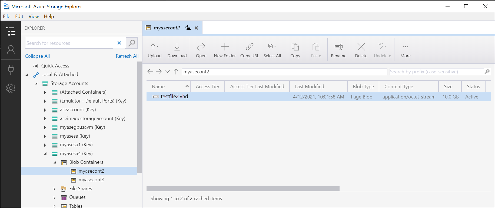

# Back up VM disks on Azure Stack Edge Pro GPU via Azure PowerShell

[!INCLUDE [applies-to-GPU-and-pro-r-and-mini-r-skus](../../includes/azure-stack-edge-applies-to-gpu-pro-r-mini-r-sku.md)]

This article describes how to create backups of virtual machine disks on Azure Stack Edge Pro GPU device using Azure PowerShell.

> [!IMPORTANT]
> This procedure is meant to be used for VMs that are stopped. To back up running VMs, we recommend that you use a third-party backup tool.

## Workflow

The following steps summarize the high-level workflow to back up a VM disk on your device:

1. Stop the VM.
1. Take a snapshot of the VM disk.
1. Copy the snapshot to a local storage account as a VHD.
1. Upload the VHD to an external target.

## Prerequisites

Before you back up VMs, make sure that:

- You've access to a client that you'll use to connect to your device.
    - Your client runs a [Supported OS](azure-stack-edge-gpu-system-requirements.md#supported-os-for-clients-connected-to-device).
    - Your client is configured to connect to the local Azure Resource Manager of your device as per the instructions in [Connect to Azure Resource Manager for your device](azure-stack-edge-gpu-connect-resource-manager.md).

## Verify connection to local Azure Resource Manager

[!INCLUDE [azure-stack-edge-gateway-verify-azure-resource-manager-connection](../../includes/azure-stack-edge-gateway-verify-azure-resource-manager-connection.md)]

## Back up a VM Disk

1. Get a list of the VMs running on your device. Identify the VM that you want to stop.

    ```powershell
    Get-AzureRMVM
    ```

    Here is an example output:

    ```powershell
    PS C:\Users\user> Get-AzureRMVM

    ResourceGroupName    Name         Location  VmSize         OsType   NIC         ProvisioningState Zone
    -----------------    ----         --------  ------         ------   ---         ----------------- ----
    MYASERG           myasewindowsvm1 dbelocal Standard_D1_v2  Linux myasewindowsvm1nic  Succeeded
    MYASERG1            myaselinuxvm1 dbelocal Standard_D1_v2  Linux   myaselinuxvm1nic  Succeeded
    MYASERG2             myasetestvm1 dbelocal Standard_D1_v2  Linux    myasetestvm1nic  Succeeded

    PS C:\Users\user>
    ```
    
1. Stop the VM.

    ```powershell
    Stop-AzureRMVM –ResourceGroupName <Resource group name> -Name <VM name>
    ```

    Here is an example output:

    ```powershell
    PS C:\Users\user> Stop-AzureRMVM -ResourceGroupName myaserg2 -Name myasetestvm1

    Virtual machine stopping operation
    This cmdlet will stop the specified virtual machine. Do you want to continue?
    [Y] Yes  [N] No  [S] Suspend  [?] Help (default is "Y"): Y
    
    OperationId :
    Status      : Succeeded
    StartTime   : 4/9/2021 8:43:47 AM
    EndTime     : 4/9/2021 8:44:27 AM
    Error       :
    
    PS C:\Users\user>
    ```
    You can also stop the VM from the Azure portal.
 

2. Take a snapshot of the VM disk and save the snapshot to a local resource group. You can use this procedure for both OS and data disks.

   1. Get the list of disks on your device, or in a specific resource group. Make a note of the name of the disk to back up.

        ```powershell
        Get-AzureRMDisk -ResourceGroupName <Resource group name>
        ```   
        Here is an example output:

        ```powershell
        PS C:\Users\user> $Disk = Get-AzureRMDisk -ResourceGroupName myaserg2
        PS C:\Users\user> $Disk.Name
        myasetestdisk1
        myasetestvm1_disk1_0ed91809927f4023b7aceb6eeca51c05
        PS C:\Users\user>
        ```
   1. Create a local resource group to serve as the destination for the VM snapshot.

        ```powershell
        PS C:\Users\user> New-AzureRmResourceGroup -ResourceGroupName myaserg3 -Location dbelocal
    
        ResourceGroupName : myaserg3
        Location          : dbelocal
        ProvisioningState : Succeeded
        Tags              :
        ResourceId        : /subscriptions/992601bc-b03d-4d72-598e-d24eac232122/resourceGroups/myaserg3
        
        PS C:\Users\user>
        ```

   1. Set some parameters.

      ```powershell
      $DiskResourceGroup = <Disk resource group>
      $DiskName = <Disk name>
      $SnapshotName = <Snapshot name>
      $DestinationRG = <Snapshot destination resource group>
      ```

   3. Set the snapshot configuration and take the snapshot.

        ```powershell
        $Disk = Get-AzureRmDisk -ResourceGroupName $DiskResourceGroup -DiskName $DiskName
        $SnapshotConfig = New-AzureRmSnapshotConfig -SourceUri $Disk.Id -CreateOption Copy -Location 'dbelocal'
        $Snapshot = New-AzureRmSnapshot -Snapshot $SnapshotConfig -SnapshotName $SnapshotName -ResourceGroupName $DestinationRG
        ```
        Verify that the snapshot is created in the destination resource group.

        ```powershell
        Get-AzureRMSnapshot -ResourceGroupName $DestinationRG
        ```
        Here is an example output:

        ```powershell
        PS C:\Users\user> $DiskResourceGroup = "myaserg2"
        PS C:\Users\user> $DiskName = "myasetestdisk1"
        PS C:\Users\user> $SnapshotName = "myasetestdisk1_ss"
        PS C:\Users\user> $DestinationRG = "myaserg3"
        PS C:\Users\user> $Disk = Get-AzureRmDisk -ResourceGroupName $DiskResourceGroup -DiskName $DiskName
        PS C:\Users\user> $SnapshotConfig = New-AzureRmSnapshotConfig -SourceUri $Disk.Id -CreateOption Copy -Location 'dbelocal'
        PS C:\Users\user> $Snapshot=New-AzureRmSnapshot -Snapshot $SnapshotConfig -SnapshotName $SnapshotName -ResourceGroupName $DestinationRG
        PS C:\Users\user> Get-AzureRMSnapshot -ResourceGroupName $DestinationRG
        
        ResourceGroupName  : myaserg3
        ManagedBy          :
        Sku                : Microsoft.Azure.Management.Compute.Models.DiskSku
        TimeCreated        : 4/9/2021 4:23:21 PM
        OsType             :
        CreationData       : Microsoft.Azure.Management.Compute.Models.CreationData
        DiskSizeGB         : 10
        EncryptionSettings :
        ProvisioningState  : Succeeded
        Id                 : /subscriptions/992601bc-b03d-4d72-598e-d24eac232122/resourceGroups/myaserg3/providers/Microsoft.Compute/snapshots/myasetestdisk1_ss
        Name               : myasetestdisk1_ss
        Type               : Microsoft.Compute/snapshots
        Location           : DBELocal
        Tags               : {}
        
        PS C:\Users\user>
        ```

## Copy the snapshot into a local storage account

   Copy the snapshots to a local storage account on your device. 

1. Set some parameters. 

    ```powershell
    $StorageAccountRG = <Local storage account resource group>
    $StorageAccountName = <Storage account name>
    $StorageEndpointSuffix = <Connection string in format: DeviceName.DnsDomain.com>
    $DestStorageContainer = <Destination storage container>
    $DestFileName = <Blob file name> 
    ```

1. Create a local storage account on your device. 

    ```powershell
    New-AzureRmStorageAccount -Name <Storage account name> -ResourceGroupName <Storage account resource group> -Location DBELocal -SkuName Standard_LRS
    ```

    Here is an example output: 

    ```powershell
    PS C:\Users\user> New-AzureRmStorageAccount -Name myasesa4 -ResourceGroupName myaserg4 -Location DBELocal -SkuName Standard_LRS
    StorageAccountName ResourceGroupName Location SkuName     Kind    AccessTier CreationTime        ProvisioningState EnableHttpsTrafficOnly
    ------------------ ----------------- -------- -------     ----    ---------- ------------        ----------------- ---------------
    myasesa4           myaserg4          DBELocal StandardLRS Storage            4/9/2021 6:02:56 PM Succeeded         False
    
    PS C:\Users\user>
    ```

1. Create a container in the local storage account that you created. 

    ```powershell
    $keys = Get-AzureRmStorageAccountKey -ResourceGroupName $StorageAccountRG -Name $StorageAccountName
    $keyValue = $keys[0].Value
    $storageContext = New-AzureStorageContext -StorageAccountName $StorageAccountName -StorageAccountKey $keyValue -Protocol Http -Endpoint $StorageEndpointSuffix;
    $container = New-AzureStorageContainer -Name $DestStorageContainer -Context $storageContext -Permission Container -ErrorAction Ignore;    
    ```
    Here is an example output:

    ```powershell
    PS C:\Users\user> $StorageAccountName = "myasesa4"                                                              
    PS C:\Users\user> $StorageAccountRG = "myaserg4"
    PS C:\Users\user> $DestStorageContainer = "myasecont2"
    PS C:\Users\user> $StorageEndpointSuffix = "myasegpudev.wdshcsso.com"
    PS C:\Users\user> $DestFileName = "testfile1"

    PS C:\Users\user> $keys = Get-AzureRmStorageAccountKey -ResourceGroupName $StorageAccountRG -Name $StorageAccountName
    PS C:\Users\user> $keyValue = $keys[0].Value
    PS C:\Users\user> $storageContext = New-AzureStorageContext -StorageAccountName $StorageAccountName -StorageAccountKey $keyValue -Protocol Http -Endpoint $StorageEndpointSuffix;                                                                                   
    PS C:\Users\user> $storagecontext 
    StorageAccountName : myasesa4                                                                                      
    BlobEndPoint       : http://myasesa4.blob.myasegpudev.wdshcsso.com/                                                
    TableEndPoint      : http://myasesa4.table.myasegpudev.wdshcsso.com/
    QueueEndPoint      : http://myasesa4.queue.myasegpudev.wdshcsso.com/
    FileEndPoint       : http://myasesa4.file.myasegpudev.wdshcsso.com/
    Context            : Microsoft.WindowsAzure.Commands.Storage.AzureStorageContext
    Name               :
    StorageAccount     : BlobEndpoint=http://myasesa4.blob.myasegpudev.wdshcsso.com/;QueueEndpoint=http://myasesa4.que
                         ue.myasegpudev.wdshcsso.com/;TableEndpoint=http://myasesa4.table.myasegpudev.wdshcsso.com/;Fi
                         leEndpoint=http://myasesa4.file.myasegpudev.wdshcsso.com/;AccountName=myasesa4;AccountKey=[ke
                         y hidden]
    EndPointSuffix     : myasegpudev.wdshcsso.com/
    ConnectionString   : BlobEndpoint=http://myasesa4.blob.myasegpudev.wdshcsso.com/;QueueEndpoint=http://myasesa4.que
                         ue.myasegpudev.wdshcsso.com/;TableEndpoint=http://myasesa4.table.myasegpudev.wdshcsso.com/;Fi
                         leEndpoint=http://myasesa4.file.myasegpudev.wdshcsso.com/;AccountName=myasesa4;AccountKey=GSK
                         FuTCJi5Dby6A6C1F4jB4bYS/gBNslb7/FAdlh/0VWUg3Vxd1kHsbwN8sw85pMqdKG1AajoeiwzhievHPnlQ==
    ExtendedProperties : {}
    
    PS C:\Users\user> $container = New-AzureStorageContainer -Name $DestStorageContainer -Context $storageContext -Permission Container -ErrorAction Ignore;
    PS C:\Users\user> $container
    Blob End Point: http://myasesa4.blob.myasegpudev.wdshcsso.com/
    
    Name                 PublicAccess         LastModified
    ----                 ------------         ------------
    myasecont2           Container            4/12/2021 4:46:03 PM +00:00
    
    PS C:\Users\user>
    ```    

    You can also use Azure Storage Explorer to [Create a local storage account](azure-stack-edge-gpu-deploy-virtual-machine-templates.md#create-a-storage-account) and then [Create a container in the local storage account](azure-stack-edge-gpu-deploy-virtual-machine-templates.md#use-storage-explorer-for-upload) on your device. 


1. Download the snapshot into the local storage account.

   ```powershell
   $sassnapshot = Grant-AzureRmSnapshotAccess -ResourceGroupName $DestinationRG -SnapshotName $SnapshotName -Access 'Read' -DurationInSecond 3600
   $destContext = New-AzureStorageContext –StorageAccountName $StorageAccountName -StorageAccountKey $keyValue 
   Start-AzureStorageBlobCopy -AbsoluteUri $sassnapshot.AccessSAS -DestContainer $DestStorageContainer -DestContext $destContext -DestBlob $DestFileName
   ```

    Here is an example output:

    ```powershell
    PS C:\Users\user> $sassnapshot= Grant-AzureRmSnapshotAccess -ResourceGroupName $DestinationRG -SnapshotName $SnapshotName -Access 'Read' -DurationInSecond 3600
    PS C:\Users\user> $sassnapshot
       
    AccessSAS : https://md-2.blob.myasegpudev.wdshcsso.com/3d95ae10d9924e6fb84de408d071f22d/abcd.vhd?sv=2017-04-17&sr=
    b&si=2535bf98-f87f-4738-9142-594e3c1150fc&sk=system-1&sig=4wrtYzWg6ePWBdrXlodrVgT76q7PIueCbw3bbShKCGs%3D   
    
    PS C:\Users\user> $destContext = New-AzureStorageContext -StorageAccountName $StorageAccountName -StorageAccountKey $keyValue
    PS C:\Users\user> $destContext
        
    StorageAccountName : myasesa4
    BlobEndPoint       : https://myasesa4.blob.myasegpudev.wdshcsso.com/
    TableEndPoint      : https://myasesa4.table.myasegpudev.wdshcsso.com/
    QueueEndPoint      : https://myasesa4.queue.myasegpudev.wdshcsso.com/
    FileEndPoint       : https://myasesa4.file.myasegpudev.wdshcsso.com/
    Context            : Microsoft.WindowsAzure.Commands.Storage.AzureStorageContext
    Name               :
    StorageAccount     : BlobEndpoint=https://myasesa4.blob.myasegpudev.wdshcsso.com/;QueueEndpoint=https://myasesa4.q
                         ueue.myasegpudev.wdshcsso.com/;TableEndpoint=https://myasesa4.table.myasegpudev.wdshcsso.com/;FileEndpoint=https://myasesa4.file.myasegpudev.wdshcsso.com/;AccountName=myasesa4;AccountKey=[key hidden]                                  EndPointSuffix     : myasegpudev.wdshcsso.com/                                                                     ConnectionString   : BlobEndpoint=https://myasesa4.blob.myasegpudev.wdshcsso.com/;QueueEndpoint=https://myasesa4.q
                         ueue.myasegpudev.wdshcsso.com/;TableEndpoint=https://myasesa4.table.myasegpudev.wdshcsso.com/
                         ;FileEndpoint=https://myasesa4.file.myasegpudev.wdshcsso.com/;AccountName=myasesa4;AccountKey
                         =GSKFuTCJi5Dby6A6C1F4jB4bYS/gBNslb7/FAdlh/0VWUg3Vxd1kHsbwN8sw85pMqdKG1AajoeiwzhievHPnlQ==
    ExtendedProperties : {}

    PS C:\Users\user> Start-AzureStorageBlobCopy -AbsoluteUri $sassnapshot.AccessSAS -DestContainer $DestStorageContainer -DestContext $destContext -DestBlob $DestFileName
    
    
       Container Uri: https://myasesa4.blob.myasegpudev.wdshcsso.com/myasecont2
    
    Name                 BlobType  Length          ContentType                    LastModified         AccessTier Snapshot Time
    ----                 --------  ------          -----------                    ------------         ---------- ----
    testfile1            BlockBlob -1                                             2021-04-12 17:01:58Z
 
    PS C:\Users\user>
    ```

    You can also use Storage Explorer to verify that the snapshot was copied correctly to the storage account.

    

## Download VHD to external target

To move your backups to an external location, you can use Azure Storage Explorer or AzCopy.

- Use the following AzCopy command to download VHD to an external target.

    ```powershell
    azcopy copy "https://<local storage account name>.blob.<device name>.<DNS domain>/<container name>/<filename><SAS query string>" <destination target>
    ```

- To set up and use Azure Storage Explorer with Azure Stack Edge, see the instructions in [Use Storage Explorer for upload](azure-stack-edge-gpu-deploy-virtual-machine-templates.md#use-storage-explorer-for-upload).

## Next steps

[Deploy virtual machines on your Azure Stack Edge Pro GPU device using templates](azure-stack-edge-gpu-deploy-virtual-machine-templates.md).