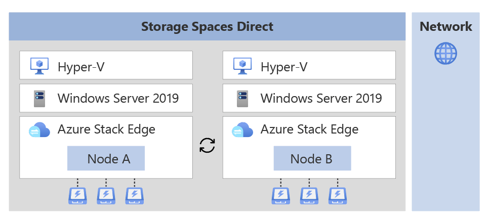
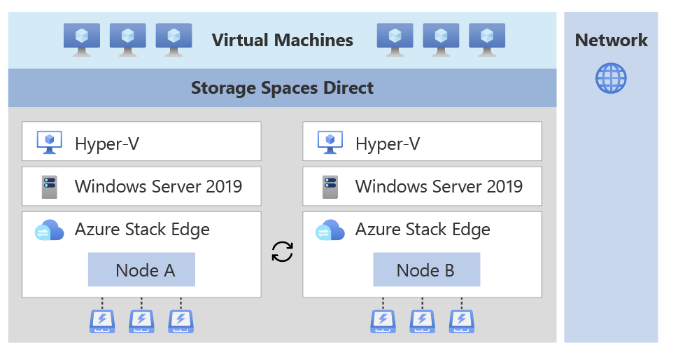
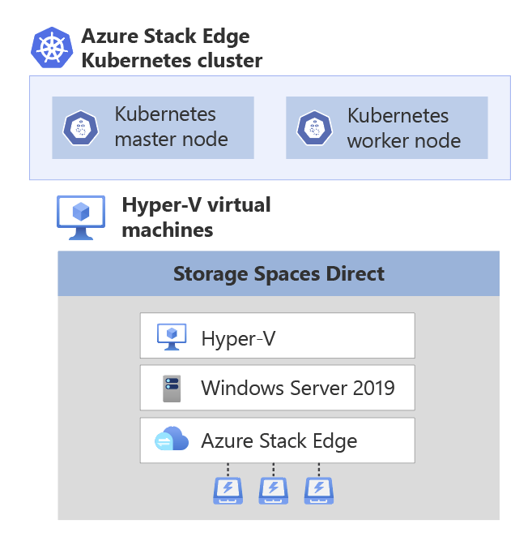
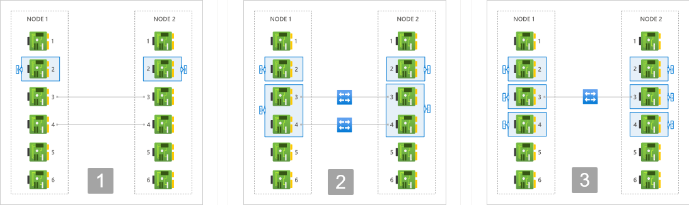
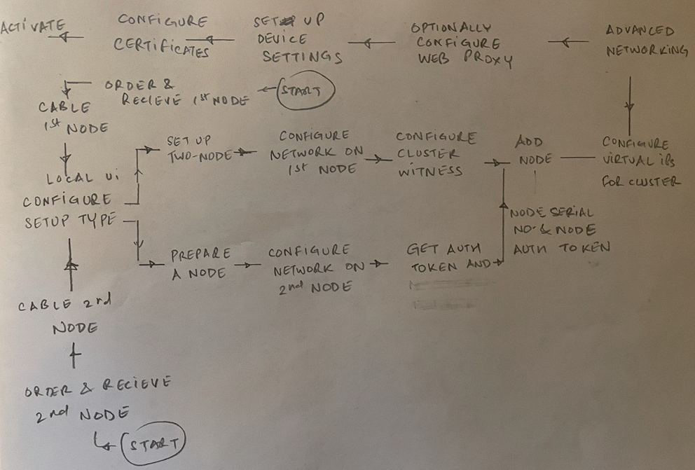

# Clustering on your Azure Stack Edge Pro GPU device

[!INCLUDE [applies-to-gpu-and-pro-2-skus](../../includes/azure-stack-edge-applies-to-gpu-pro-2-sku.md)]

This article provides a brief overview of clustering on your Azure Stack Edge device.  

## About failover clustering

Azure Stack Edge can be set up as a single standalone device or a two-node cluster. A two-node cluster consists of two independent Azure Stack Edge devices that are connected by physical cables and by software. These nodes when clustered work together as in a Windows failover cluster, provide high availability for applications and services that are running on the cluster. 

If one of the clustered nodes fails, the other node begins to provide service (the process is known as failover). The clustered roles are also proactively monitored to make sure that they’re working properly. If they aren’t working, they’re restarted or moved to the second node.

Azure Stack Edge uses Windows Server Failover Clustering for its two-node cluster. For more information, see [Failover clustering in Windows Server](/windows-server/failover-clustering/failover-clustering-overview).

## Cluster quorum and witness

A quorum is always maintained on your Azure Stack Edge cluster to remain online in the event of a failure. If one of the nodes fails, then the majority of the surviving nodes must verify that the cluster remains online. The concept of majority only exists for clusters with an odd number of nodes. For more information on cluster quorum, see [Understand quorum](/windows-server/storage/storage-spaces/understand-quorum).

For an Azure Stack Edge cluster with two nodes, if a node fails, then a cluster witness provides the third vote so that the cluster stays online (since the cluster is left with two out of three votes - a majority). A cluster witness is required on your Azure Stack Edge cluster. You can set up the witness in the cloud or in a local fileshare using the local UI of your device. 

 - For more information about the cluster witness, see [Cluster witness on Azure Stack Edge](azure-stack-edge-gpu-cluster-witness-overview.md).
 - For more information about witness in the cloud, see [Configure cloud witness](azure-stack-edge-gpu-manage-cluster.md#configure-cloud-witness).
 - For detailed steps to deploy a cloud witness, see [Deploy cloud witness for a failover cluster](https://learn.microsoft.com/windows-server/failover-clustering/deploy-cloud-witness?tabs=windows#to-create-an-azure-storage-account).

## Infrastructure cluster

The infrastructure cluster on your device provides persistent storage and is shown in the following diagram: 

- The infrastructure cluster consists of the two independent nodes running Windows Server operating system with a Hyper-V layer. The nodes contain physical disks for storage and network interfaces that are connected back-to-back or with switches.
- The disks across the two nodes are used to create a logical storage pool. The storage spaces direct on this pool provides mirroring and parity for the cluster. 
- You can deploy your application workloads on top of the infrastructure cluster. 

    - Non-containerized workloads such as VMs can be directly deployed on top of the infrastructure cluster.

        

    - Containerized workloads use Kubernetes for workload deployment and management. A Kubernetes cluster that consists of a master VM and two worker VMs (one for each node) is deployed on top of the infrastructure cluster.   

        <!---->
   
    The Kubernetes cluster allows for application orchestration whereas the infrastructure cluster provides persistent storage.

## Supported networking topologies

Based on the use-case and workloads, you can select how the two Azure Stack Edge device nodes will be connected. The networking topologies available will differ depending on whether you use an Azure Stack Edge Pro GPU device or an Azure Stack Edge Pro 2 device.

The supported network topologies for each of the device types are described here.

### [Azure Stack Edge Pro GPU](#tab/1) 

On your Azure Stack Edge Pro GPU device node: 

- Port 2 is used for management traffic.
- Port 3 and Port 4 are used for storage and cluster traffic. This traffic includes that needed for storage mirroring and Azure Stack Edge cluster heartbeat traffic that is required for the cluster to be online.  

The following network topologies are available:

1. **Switchless** - Use this option when you don't have high speed switches available in the environment for storage and cluster traffic. 

    In this option, Port 3 and Port 4 are connected back-to-back without a switch. These ports are dedicated to storage and Azure Stack Edge cluster traffic and aren't available for workload traffic. <!--For example, these ports can't be enabled for compute--> Optionally you can also provide IP addresses for these ports.

1. **Using switches and NIC teaming** - Use this option when you have high speed switches available for use with your device nodes for storage and cluster traffic. 

    Each of ports 3 and 4 of the two nodes of your device are connected via an external switch. The Port 3 and Port 4 are teamed on each node and a virtual switch and two virtual NICs are created that allow for port-level redundancy for storage and cluster traffic. These ports can be used for workload traffic as well.

 
1. **Using switches and without NIC teaming** - Use this option when you need an extra dedicated port for workload traffic and port-level redundancy isn’t required for storage and cluster traffic. 

    Port 3 on each node is connected via an external switch. If Port 3 fails, the cluster may go offline. Separate virtual switches are created on Port 3 and Port 4. 

For more information, see how to [Choose a network topology for your device node](azure-stack-edge-gpu-deploy-configure-network-compute-web-proxy.md#configure-network).

### [Azure Stack Edge Pro 2](#tab/2) 

On your Azure Stack Edge Pro 2 device node: 

- Port 1 is used for initial configuration. Port 1 is then reconfigured and assigned an IP address that may or may not be in the same subnet as the Port 2. Port 1 and Port 2 are used for clustering, storage and management traffic. 
- Port 3 and Port 4 may be used for are used for Private Multi-Access Edge Computing workload deployment or for storage traffic.

The following network topologies are available:

- **Switchless** - Use this option when you don't have high speed switches available in the environment for storage and cluster traffic. There are further sub-options:

    - **With Port 1 and Port 2 in separate subnets** - This is the default option. In this case, Port 1 and Port 2 have separate virtual switches and are connected to separate subnets.
    
    - **With Port 1 and Port 2 in same subnets** - In this case, Port 1 and Port 2 have a teamed virtual switch and both the ports are in the same subnet.

    In each case, Port 3 and Port 4 are connected back-to-back directly without a switch. These ports are dedicated to storage and Azure Stack Edge cluster traffic and aren't available for workload traffic. 

- **Using external switches** - Use this option when you have high speed switches (10 GbE switches) available for use with your device nodes for storage and cluster traffic. There are further sub-options:

    - **With Port 1 and Port 2 in separate subnets** - This is the default option. In this case, Port 1 and Port 2 have separate virtual switches and are connected to separate subnets.
    
    - **With Port 1 and Port 2 in same subnets** - In this case, Port 1 and Port 2 have a teamed virtual switch and both the ports are in the same subnet.

    In each case, Port 3 and Port 4 are reserved for Private Multi-Access Edge Computing workload deployments. 

The pros and cons for each of the above supported topologies can be summarized as follows:

|     Local web UI option                                                           | Advantages                                                               | Disadvantages                                                         |
|----------------------------------------------------------------|--------------------------------------------------------------------------|-----------------------------------------------------------------------|
| Switchless,   Port 1 and Port 2 in separate subnet, separate virtual switches             | Redundant paths for management   and storage traffic.                     | Clients need to reconnect if   Port 1 or Port 2 fails.                |
|                                                                | No single point of failure   within the device.                          |                                                                       |
|                                                                | Lots of bandwidth for storage   and cluster traffic across the nodes.    |                                                                       |
|                                                                | Can be deployed with Port 1 and   Port 2 in different subnets.           |                                                                       |
|                                                                |                                                                          |                                                                       |
| Switchless,   Port 1 and Port 2 in the same subnet, teamed virtual switch             | Redundant paths for management   and storage traffic.                    | Teamed virtual switch is a   single point of failure in the software. |
|                                                                | Lots of bandwidth for storage   and cluster traffic across the nodes.    |                                                                       |
|                                                                | Higher fault tolerance.                                                  |                                                                       |
|                                                                |                                                                          |                                                                       |
| Using   external switch, Port 1 and Port 2 in separate subnet, separate virtual switches | Two independent virtual switches   and network paths provide redundancy. | Clients need to reconnect if   Port 1 or Port 2 fails.                |
|                                                                | No single point of failure with   the device.                            |                                                                       |
|                                                                | Port 1 and Port 2 can be   connected to different subnets.               |                                                                       |
|                                                                |                                                                          |                                                                       |
| Using   external switch, Port 1 and Port 2 in same subnet, teamed virtual switch     | Load balancing.                                                          | Teamed switch is a single point   of failure in software.             |
|                                                                | Higher fault toelerance.                                                 | Can't be deployed in an   environment with different subnets.         |
|                                                                | Two independent, redundant paths   between the nodes.                    |                                                                       |
|                                                                | Clients do not need to   reconnect.                                      |                                                                       |

---

## Cluster deployment

### [Azure Stack Edge Pro GPU](#tab/1)   

Before you configure clustering on your device, you must cable the devices as per one of the supported network topologies that you intend to configure. To deploy a two-node infrastructure cluster on your Azure Stack Edge devices, follow these high-level steps:

1. Order two independent Azure Stack Edge devices. For more information, see [Order an Azure Stack Edge device](azure-stack-edge-gpu-deploy-prep.md#create-a-new-resource).
1. Cable each node independently as you would for a single node device. Based on the workloads that you intend to deploy, cross connect the network interfaces on these devices via cables, and with or without switches. For detailed instructions, see [Cable your two-node cluster device](azure-stack-edge-gpu-deploy-install.md?pivots=twonode#cable-the-device).
1. Start cluster creation on the first node. Choose the network topology that conforms to the cabling across the two nodes. The chosen topology would dictate the storage and clustering traffic between the nodes. See detailed steps in [Configure network and web proxy on your device](azure-stack-edge-gpu-deploy-configure-network-compute-web-proxy.md).
1. Prepare the second node. Configure the network on the second node the same way you configured it on the first node. Ensure that port settings match between same port name on each appliance. Get the authentication token on this node.
1. Use the authentication token from the prepared node and join this node to the first node to form a cluster.
1. Set up a cloud witness using an Azure Storage account or a local witness on an SMB fileshare.
1. Assign a virtual IP to provide an endpoint for Azure Consistent Services or when using NFS. 
1. Assign compute or management intents to the virtual switches created on the network interfaces. You may also configure Kubernetes node IPs and Kubernetes service IPs here for the network interface enabled for compute.
1. Optionally configure web proxy, set up device settings, configure certificates and then finally, activate the device.

For more information, see the two-node device deployment tutorials starting with [Get deployment configuration checklist](azure-stack-edge-gpu-deploy-checklist.md).

### [Azure Stack Edge Pro 2](#tab/2) 

Before you configure clustering on your device, you must cable the devices as per one of the supported network topologies that you intend to configure. To deploy a two-node infrastructure cluster on your Azure Stack Edge devices, follow these high-level steps:

1. Order two independent Azure Stack Edge devices. For more information, see [Order an Azure Stack Edge device](azure-stack-edge-pro-2-deploy-prep.md#create-a-new-resource).
1. Cable each node independently as you would for a single node device. Based on the workloads that you intend to deploy, cross connect the network interfaces on these devices via cables, and with or without switches. For detailed instructions, see [Cable your two-node cluster device](azure-stack-edge-pro-2-deploy-install.md#cable-the-device).
1. Start cluster creation on the first node. Choose the network topology that conforms to the cabling across the two nodes. The chosen topology would dictate the storage and clustering traffic between the nodes. See detailed steps in [Configure network and web proxy on your device](azure-stack-edge-pro-2-deploy-configure-network-compute-web-proxy.md).
1. Prepare the second node. Configure the network on the second node the same way you configured it on the first node. Ensure that port settings match between same port name on each appliance. Get the authentication token on this node.
1. Use the authentication token from the prepared node and join this node to the first node to form a cluster.
1. Set up a cloud witness using an Azure Storage account or a local witness on an SMB fileshare.
1. Assign a virtual IP to provide an endpoint for Azure Consistent Services or when using NFS. 
1. Assign compute or management intents to the virtual switches created on the network interfaces. You may also configure Kubernetes node IPs and Kubernetes service IPs here for the network interface enabled for compute.
1. Optionally configure web proxy, set up device settings, configure certificates and then finally, activate the device.

For more information, see the two-node device deployment tutorials starting with [Get deployment configuration checklist](azure-stack-edge-pro-2-deploy-checklist.md).

---

## Clustering workloads

On your two-node cluster, you can deploy non-containerized workloads or containerized workloads.

- **Non-containerized workloads such as VMs**: The two-node cluster will ensure high availability of the virtual machines that are deployed on the device cluster. <!--Your two-node device actively manages capacity to ensure successful failover of the deployed VMs.--> Live migration of VMs isn’t supported.

- **Containerized workloads such as Kubernetes or IoT Edge**: The Kubernetes cluster deployed on top of the device cluster consists of one Kubernetes master VM and two Kubernetes worker VMs. Each Kubernetes node has a worker VM that is pinned to each Azure Stack Edge node. Failover results in the failover of Kubernetes master VM (if needed) and Kubernetes-based rebalancing of pods on the surviving worker VM.
 
    For more information, see [Kubernetes on a clustered Azure Stack Edge device](azure-stack-edge-gpu-kubernetes-failover-scenarios.md).

## Cluster management

You can manage the Azure Stack Edge cluster via the PowerShell interface of the device, or through the local UI. Some typical management tasks are:

- [Undo node preparation](azure-stack-edge-gpu-manage-cluster.md#undo-node-preparation)
- [Configure cloud witness](azure-stack-edge-gpu-manage-cluster.md#configure-cloud-witness)
- [Set up a local witness](azure-stack-edge-gpu-manage-cluster.md#configure-local-witness)
- [Configure virtual IP settings](azure-stack-edge-gpu-manage-cluster.md#configure-virtual-ips)
- [Remove the cluster](azure-stack-edge-gpu-manage-cluster.md#remove-the-cluster)

## Cluster updates

A two-node clustered device upgrade will first apply the device updates followed by the Kubernetes cluster updates. Rolling updates to device nodes ensure minimal downtime of workloads. 

When you apply these updates via the Azure portal, you only have to start the process on one node and both the nodes are updated.For step-by-step instructions, see [Apply updates to your two-node Azure Stack Edge device](azure-stack-edge-gpu-install-update.md).

## Billing

If you deploy an Azure Stack Edge two-node cluster, each node is billed separately. For more information, see [Pricing page for Azure Stack Edge](https://azure.microsoft.com/pricing/details/azure-stack/edge/#pricing).

## Next steps

- Learn about [Cluster witness for your Azure Stack Edge](azure-stack-edge-gpu-cluster-witness-overview.md).
- See [Kubernetes for your Azure Stack Edge](azure-stack-edge-gpu-kubernetes-overview.md)
- Understand [Cluster failover scenarios](azure-stack-edge-gpu-cluster-failover-scenarios.md)

