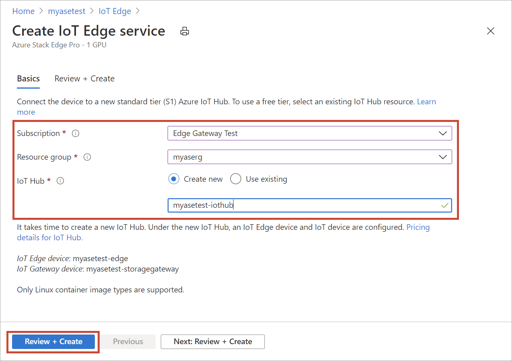
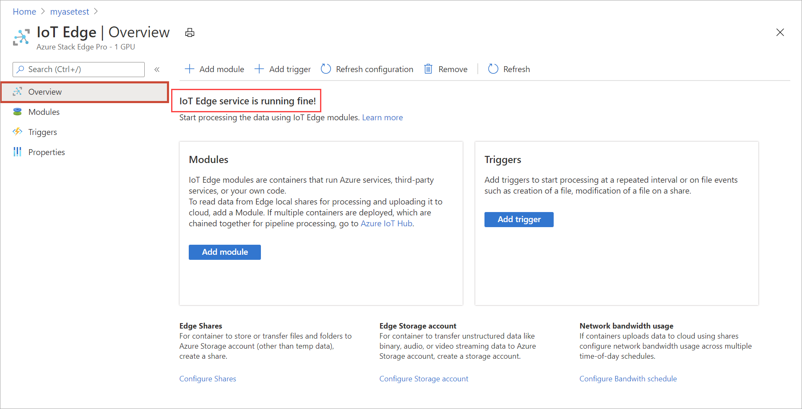
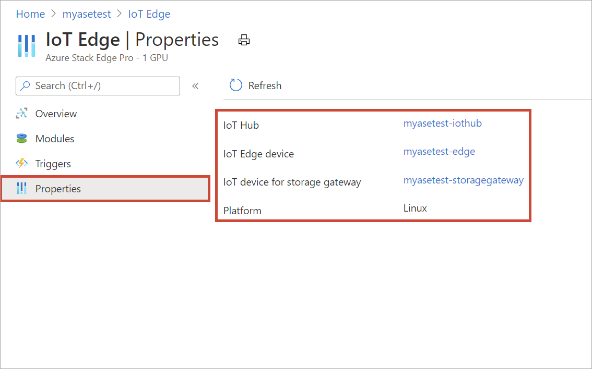
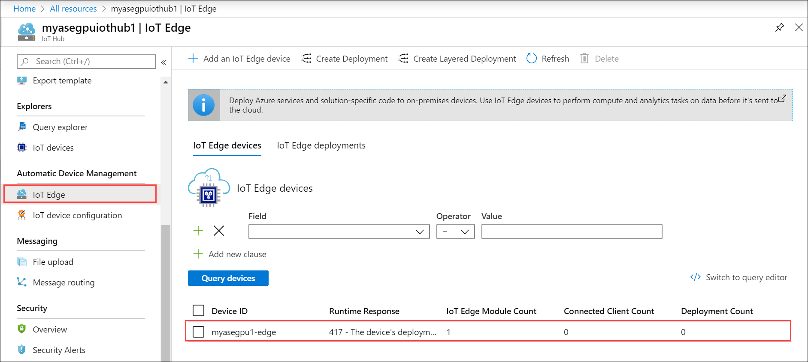
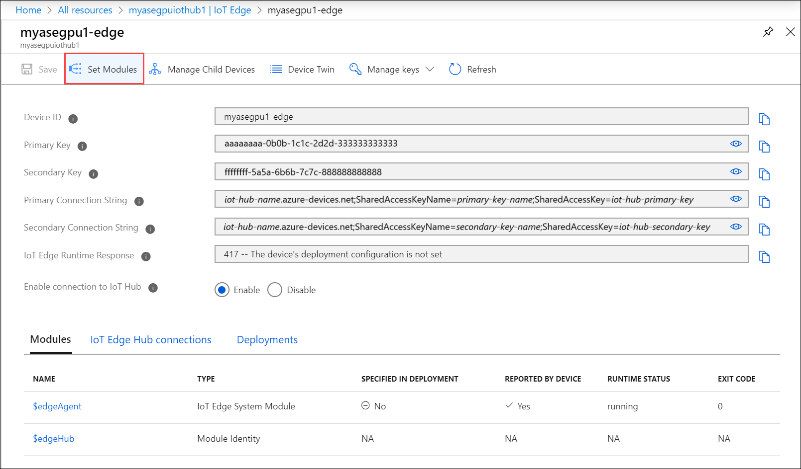
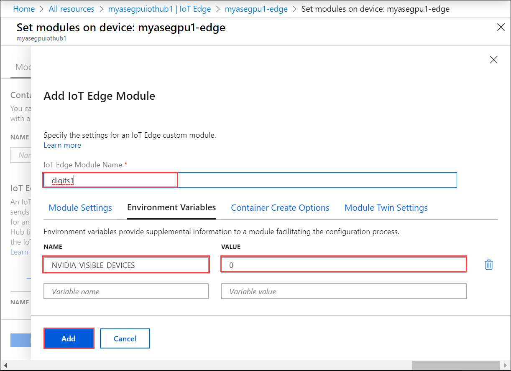
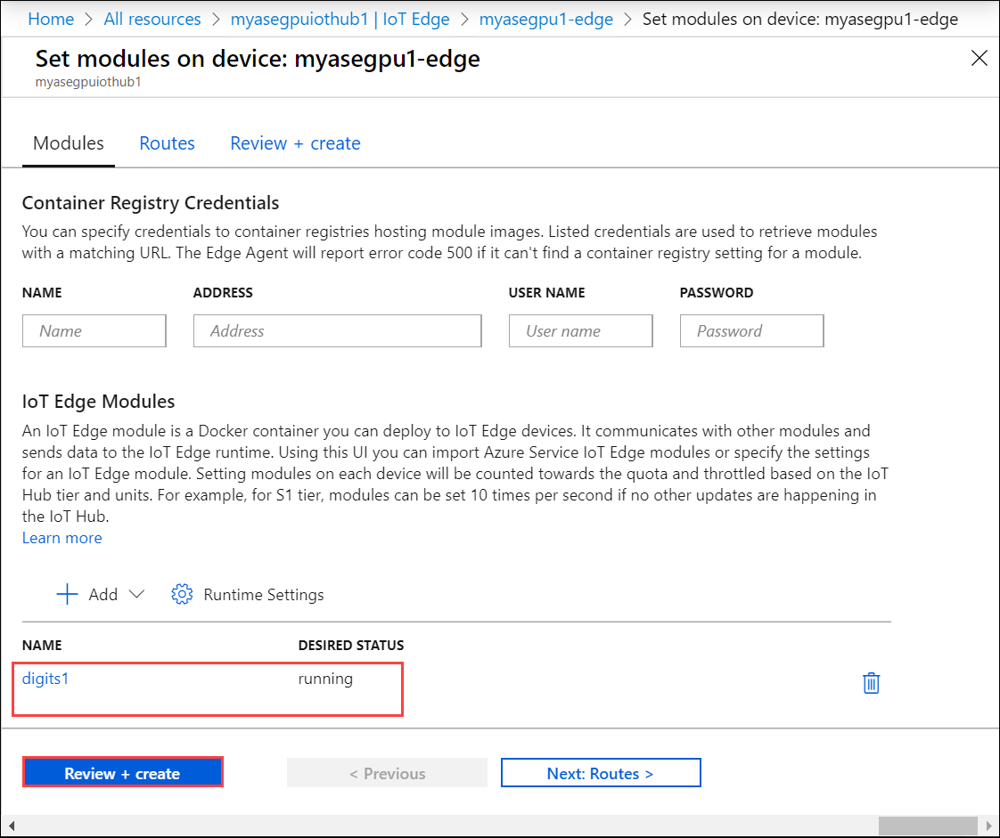
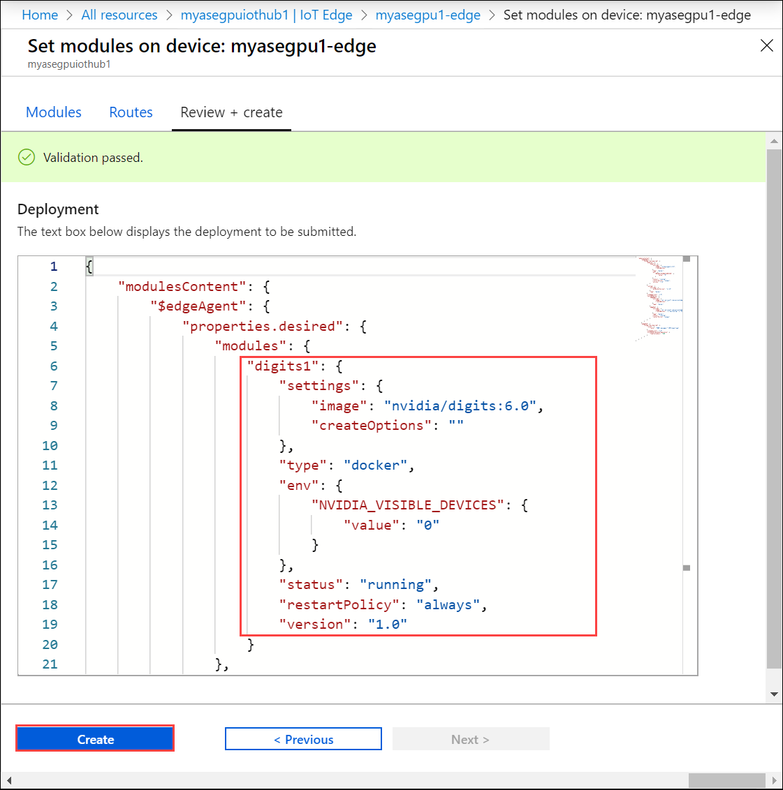
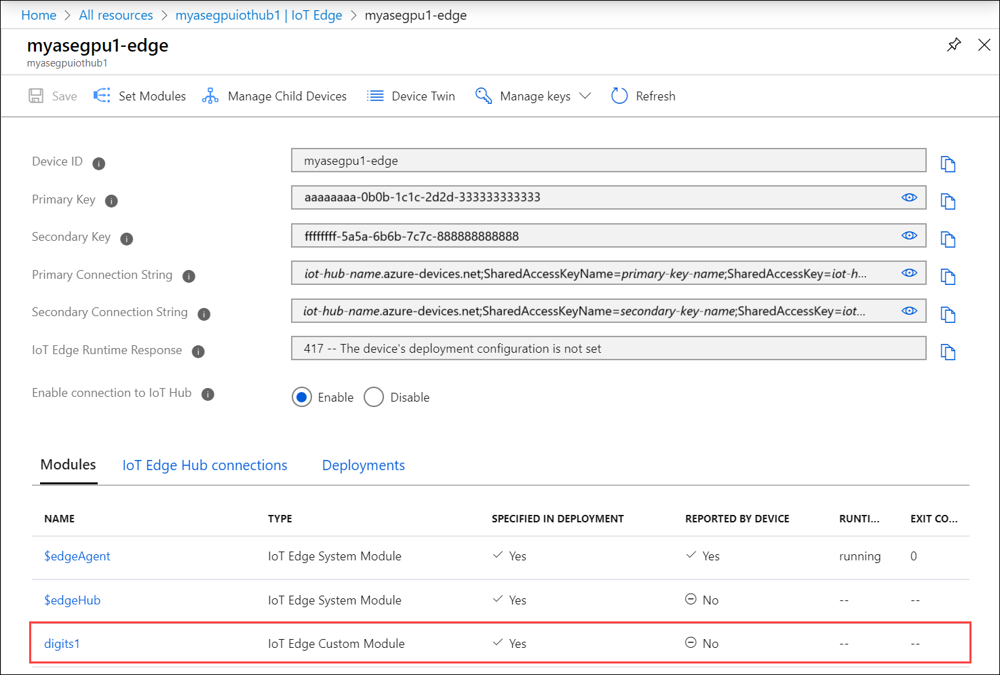
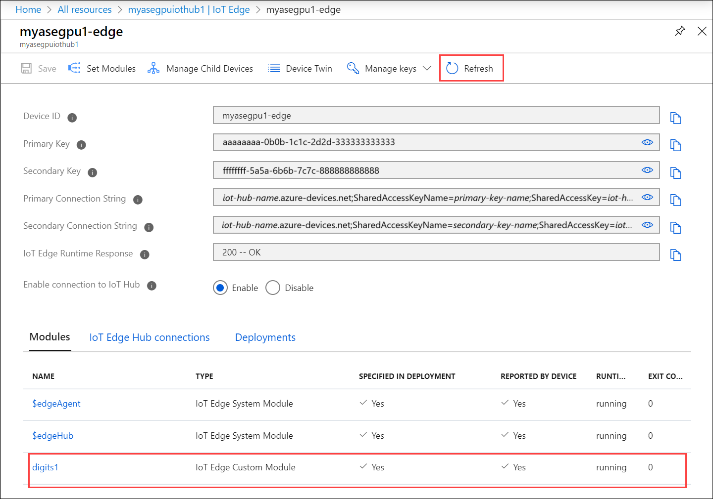

# Configure and run a module on GPU on Azure Stack Edge Pro device

[!INCLUDE [applies-to-GPU-and-pro-r-skus](../../includes/azure-stack-edge-applies-to-gpu-pro-r-sku.md)]

> [!NOTE]
> We strongly recommend that you deploy the latest IoT Edge version in a Linux VM. The managed IoT Edge on Azure Stack Edge uses an older version of IoT Edge runtime that doesn’t have the latest features and patches. For instructions, see how to [Deploy an Ubuntu VM](azure-stack-edge-gpu-deploy-iot-edge-linux-vm.md). For more information on other supported Linux distributions that can run IoT Edge, see [Azure IoT Edge supported systems – Container engines](../iot-edge/support.md#linux-containers).

Your Azure Stack Edge Pro device contains one or more Graphics Processing Unit (GPU). GPUs are a popular choice for AI computations as they offer parallel processing capabilities and are faster at image rendering than Central Processing Units (CPUs). For more information on the GPU contained in your Azure Stack Edge Pro device, go to [Azure Stack Edge Pro device technical specifications](azure-stack-edge-gpu-technical-specifications-compliance.md).

This article describes how to configure and run a module on the GPU on your Azure Stack Edge Pro device. In this article, you will use a publicly available container module **Digits** written for Nvidia T4 GPUs. This procedure can be used to configure any other modules published by Nvidia for these GPUs.

## Prerequisites

Before you begin, make sure that:

1. You've access to a GPU enabled 1-node Azure Stack Edge Pro device. This device is activated with a resource in Azure.  

## Configure module to use GPU

To configure a module to use the GPU on your Azure Stack Edge Pro device to run a module,<!--Can it be simplified? "To configure a module to be run by the GPU on your Azure Stack Edge Pro device,"?--> follow these steps.

1. In the Azure portal, go to the resource associated with your device.

2. In **Overview**, select **IoT Edge**.

    

3. In **Enable IoT Edge service**, select **Add**.

   

4. In **Create IoT Edge service**, enter settings for your IoT Hub resource:

   |Field   |Value    |
   |--------|---------|
   |Subscription      | Subscription used by the Azure Stack Edge resource. |
   |Resource group    | Resource group used by the Azure Stack Edge resource. |
   |IoT Hub           | Choose from **Create new** or **Use existing**.   By default, a Standard tier (S1) is used to create an IoT resource. To use a free tier IoT resource, create one and then select the existing resource.   In each case, the IoT Hub resource uses the same subscription and resource group that is used by the Azure Stack Edge resource.     |
   |Name              | If you don't want to use the default name provided for a new IoT Hub resource, enter a different name. |

   When you finish the settings, select **Review + Create**. Review the settings for your IoT Hub resource, and select **Create**.

   

   Resource creation for an IoT Hub resource takes several minutes. After the resource is created, the **Overview** indicates the IoT Edge service is now running.

   

5. To confirm the Edge compute role has been configured, select **Properties**.

   

6. In **Properties**, select the link for **IoT Edge device**.

   

   In the right pane, you see the IoT Edge device associated with your Azure Stack Edge Pro device. This device corresponds to the IoT Edge device you created when creating the IoT Hub resource.
 
7. Select this IoT Edge device.

   

8. Select **Set modules**.

   

9. Select **+ Add** and then select **+ IoT Edge module**. 

    

10. In the **Add IoT Edge Module** tab:

    1. Provide the **Image URI**. You will use the publicly available Nvidia module **Digits** here. 
    
    2. Set **Restart policy** to **always**.
    
    3. Set **Desired state** to **running**.
    
    

11. In the **Environment variables** tab, provide the Name of the variable and the corresponding value. 

    1. To have the current module use one GPU on this device, use the NVIDIA_VISIBLE_DEVICES. 

    2. Set the value to 0 or 1. A value of 0 or 1 ensures that at least one GPU is used by the device for this module. When you set the value to 0, 1, that implies that both the GPUs on your device are being used by this module.

       

       For more information on environment variables that you can use with the Nvidia GPU, go to [nVidia container runtime](https://github.com/NVIDIA/nvidia-container-runtime#environment-variables-oci-spec).

    > [!NOTE]
    > A module can use one, both or no GPUs.

12. Enter a name for your module. At this point you can choose to provide container create option and modify module twin settings or if done, select **Add**. 

    

13. Make sure that the module is running and select **Review + Create**.

    

14. In the **Review + Create** tab, the deployment options that you selected are displayed. Review the options and select **Create**.
    
    

15. Make a note of the **runtime status** of the module.
    
    

    It takes a couple minutes for the module to be deployed. Select **Refresh** and you should see the **runtime status** update to **running**.

    

## Next steps

- Learn more about [Environment variables that you can use with the Nvidia GPU](https://github.com/NVIDIA/nvidia-container-runtime#environment-variables-oci-spec).
