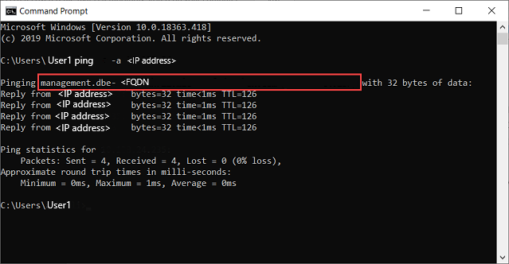

# Connect to Azure Resource Manager on your Azure Stack Edge device

[!INCLUDE [applies-to-GPU-and-pro-r-and-mini-r-skus](../../includes/azure-stack-edge-applies-to-gpu-pro-r-mini-r-sku.md)]

Azure Resource Manager provides a management layer that enables you to create, update, and delete resources in your Azure subscription. The Azure Stack Edge device supports the same Azure Resource Manager APIs to create, update, and delete VMs in a local subscription. This support lets you manage the device in a manner consistent with the cloud.

This article describes how to connect to the local APIs on your Azure Stack Edge device via Azure Resource Manager using Azure PowerShell.


## Endpoints on Azure Stack Edge device

The following table summarizes the various endpoints exposed on your device, the supported protocols, and the ports to access those endpoints. Throughout the article, you will find references to these endpoints.

| # | Endpoint | Supported protocols | Port used | Used for |
| --- | --- | --- | --- | --- |
| 1. | Azure Resource Manager | https | 443 | To connect to Azure Resource Manager for automation |
| 2. | Security token service | https | 443 | To authenticate via access and refresh tokens |
| 3. | Blob* | https | 443 | To connect to Blob storage via REST |

\* *Connection to blob storage endpoint is not required to connect to Azure Resource Manager.*

## Connecting to Azure Resource Manager workflow

The process of connecting to local APIs of the device using Azure Resource Manager requires the following steps:

| Step # | You'll do this step ... | .. on this location. |
| --- | --- | --- |
| 1. | [Configure your Azure Stack Edge device](#step-1-configure-azure-stack-edge-device) | Local web UI |
| 2. | [Create and install certificates](#step-2-create-and-install-certificates) | Windows client/local web UI |
| 3. | [Review and configure the prerequisites](#step-3-install-powershell-on-the-client) | Windows client |
| 4. | [Set up Azure PowerShell on the client](#step-4-set-up-azure-powershell-on-the-client) | Windows client |
| 5. | [Modify host file for endpoint name resolution](#step-5-modify-host-file-for-endpoint-name-resolution) | Windows client or DNS server |
| 6. | [Check that the endpoint name is resolved](#step-6-verify-endpoint-name-resolution-on-the-client) | Windows client |
| 7. | [Use Azure PowerShell cmdlets to verify connection to Azure Resource Manager](#step-7-set-azure-resource-manager-environment) | Windows client |

The following sections detail each of the above steps in connecting to Azure Resource Manager.

## Prerequisites

Before you begin, make sure that the client used for connecting to device via Azure Resource Manager is using TLS 1.2. For more information, go to [Configure TLS 1.2 on Windows client accessing Azure Stack Edge device](azure-stack-edge-gpu-configure-tls-settings.md).

## Step 1: Configure Azure Stack Edge device

Take the following steps in the local web UI of your Azure Stack Edge device.

1. Complete the network settings for your Azure Stack Edge device.

    


    Make a note of the device IP address. You will use this IP later.

2. Configure the device name and the DNS domain from the **Device** page. Make a note of the device name and the DNS domain as you will use these later.

    

    > [!IMPORTANT]
    > The device name, DNS domain will be used to form the endpoints that are exposed.
    > Use the Azure Resource Manager and Blob endpoints from the **Device** page in the local web UI.


## Step 2: Create and install certificates

Certificates ensure that your communication is trusted. On your Azure Stack Edge device, self-signed appliance, blob, and Azure Resource Manager certificates are automatically generated. Optionally, you can bring in your own signed blob and Azure Resource Manager certificates as well.

When you bring in a signed certificate of your own, you also need the corresponding signing chain of the certificate. For the signing chain, Azure Resource Manager, and the blob certificates on the device, you will need the corresponding certificates on the client machine also to authenticate and communicate with the device.

To connect to Azure Resource Manager, you will need to create or get signing chain and endpoint certificates, import these certificates on your Windows client, and finally upload these certificates on the device.

### Create certificates

For test and development use only, you can use Windows PowerShell to create certificates on your local system. While creating the certificates for the client, follow these guidelines:

1. You first need to create a root certificate for the signing chain. For more information, see See steps to [Create signing chain certificates](azure-stack-edge-gpu-create-certificates-powershell.md#create-signing-chain-certificate).

2. You can next create the endpoint certificates for Azure Resource Manager and blob (optional). You can get these endpoints from the **Device** page in the local web UI. See the steps to [Create endpoint certificates](azure-stack-edge-gpu-create-certificates-powershell.md#create-signed-endpoint-certificates).

3. For all these certificates, make sure that the subject name and subject alternate name conform to the following guidelines:

    |Type |Subject name (SN)  |Subject alternative name (SAN)  |Subject name example |
    |---------|---------|---------|---------|
    |Azure Resource Manager|`management.<Device name>.<Dns Domain>`|`login.<Device name>.<Dns Domain>`<br>`management.<Device name>.<Dns Domain>`|`management.mydevice1.microsoftdatabox.com` |
    |Blob storage*|`*.blob.<Device name>.<Dns Domain>`|`*.blob.< Device name>.<Dns Domain>`|`*.blob.mydevice1.microsoftdatabox.com` |
    |Multi-SAN single certificate for both endpoints|`<Device name>.<dnsdomain>`|`login.<Device name>.<Dns Domain>`<br>`management.<Device name>.<Dns Domain>`<br>`*.blob.<Device name>.<Dns Domain>`|`mydevice1.microsoftdatabox.com` |

\* Blob storage is not required to connect to Azure Resource Manager. It is listed here in case you are creating local storage accounts on your device.

For more information on certificates, go to how to [Upload certificates on your device and import certificates on the clients accessing your device](azure-stack-edge-gpu-manage-certificates.md).

### Upload certificates on the device

The certificates that you created in the previous step will be in the Personal store on your client. These certificates need to be exported on your client into appropriate format files that can then be uploaded to your device.

1. The root certificate must be exported as a DER format file with *.cer* file extension. For detailed steps, see [Export certificates as a .cer format file](azure-stack-edge-gpu-prepare-certificates-device-upload.md#export-certificates-as-der-format).

2. The endpoint certificates must be exported as *.pfx* files with private keys. For detailed steps, see [Export certificates as .pfx file with private keys](azure-stack-edge-gpu-prepare-certificates-device-upload.md#export-certificates-as-pfx-format-with-private-key).

3. The root and endpoint certificates are then uploaded on the device using the **+Add certificate** option on the **Certificates** page in the local web UI. To upload the certificates, follow the steps in [Upload certificates](azure-stack-edge-gpu-manage-certificates.md#upload-certificates).


### Import certificates on the client running Azure PowerShell

The Windows client where you will invoke the Azure Resource Manager APIs needs to establish trust with the device. To this end, the certificates that you created in the previous step must be imported on your Windows client into the appropriate certificate store.

1. The root certificate that you exported as the DER format with *.cer* extension should now be imported in the Trusted Root Certificate Authorities on your client system. For detailed steps, see [Import certificates into the Trusted Root Certificate Authorities store.](azure-stack-edge-gpu-manage-certificates.md#import-certificates-as-der-format)

2. The endpoint certificates that you exported as the *.pfx* must be exported as *.cer*. This *.cer* is then imported in the **Personal** certificate store on your system. For detailed steps, see [Import certificates into personal store](azure-stack-edge-gpu-manage-certificates.md#import-certificates-as-der-format).

## Step 3: Install PowerShell on the client

### [Az](#tab/Az)

Your Windows client must meet the following prerequisites:


1. Run Windows PowerShell 5.1. You must have Windows PowerShell 5.1. To check the version of PowerShell on your system, run the following cmdlet:

    ```powershell
    $PSVersionTable.PSVersion
    ```

    Compare the **Major** version and ensure that it is 5.1 or later.

    If you have an outdated version, see [Upgrading existing Windows PowerShell](/powershell/scripting/install/installing-windows-powershell#upgrading-existing-windows-powershell).

    If you don't have PowerShell 5.1, follow [Installing Windows PowerShell](/powershell/scripting/install/installing-windows-powershell).

    An example output is shown below.

    ```output
    Windows PowerShell
    Copyright (C) Microsoft Corporation. All rights reserved.
    Try the new cross-platform PowerShell https://aka.ms/pscore6
    PS C:\windows\system32> $PSVersionTable.PSVersion
    Major  Minor  Build  Revision
    -----  -----  -----  --------
    5      1      19041  906
    ```

1. You can access the PowerShell Gallery.

    Run PowerShell as administrator. Verify that PowerShellGet version is older than 2.2.3. Additionally, verify if the `PSGallery` is registered as a repository.

    ```powershell
    Install-Module PowerShellGet -MinimumVersion 2.2.3
    Import-Module -Name PackageManagement -ErrorAction Stop
    Get-PSRepository -Name "PSGallery"
    ```

    An example output is shown below.

    ```output
    PS C:\windows\system32> Install-Module PowerShellGet -MinimumVersion 2.2.3
    PS C:\windows\system32> Import-Module -Name PackageManagement -ErrorAction Stop
    PS C:\windows\system32> Get-PSRepository -Name "PSGallery"
    Name                      InstallationPolicy   SourceLocation
    ----                      ------------------   --------------
    PSGallery                 Trusted              https://www.powershellgallery.com/api/v2
    ```

### [AzureRM](#tab/AzureRM)

Your Windows client must meet the following prerequisites:


1. Run Windows PowerShell 5.1. You must have Windows PowerShell 5.1. PowerShell core is not supported. To check the version of PowerShell on your system, run the following cmdlet:

    ```powershell
    $PSVersionTable.PSVersion
    ```

    Compare the **Major** version and ensure that it is 5.1.

    If you have an outdated version, see [Upgrading existing Windows PowerShell](/powershell/scripting/install/installing-windows-powershell#upgrading-existing-windows-powershell).

    If you don't have PowerShell 5.1, follow [Installing Windows PowerShell](/powershell/scripting/install/installing-windows-powershell).

    An example output is shown below.

    ```output
    Windows PowerShell
    Copyright (C) Microsoft Corporation. All rights reserved.
    Try the new cross-platform PowerShell https://aka.ms/pscore6
    PS C:\windows\system32> $PSVersionTable.PSVersion
    Major  Minor  Build  Revision
    -----  -----  -----  --------
    5      1      18362  145
    ```

2. You can access the PowerShell Gallery.

    Run PowerShell as administrator. Verify if the `PSGallery` is registered as a repository.

    ```powershell
    Import-Module -Name PowerShellGet -ErrorAction Stop
    Import-Module -Name PackageManagement -ErrorAction Stop
    Get-PSRepository -Name "PSGallery"
    ```

    An example output is shown below.

    ```output
    PS C:\windows\system32> Import-Module -Name PowerShellGet -ErrorAction Stop
    PS C:\windows\system32> Import-Module -Name PackageManagement -ErrorAction Stop
    PS C:\windows\system32> Get-PSRepository -Name "PSGallery"
    Name                      InstallationPolicy   SourceLocation
    ----                      ------------------   --------------
    PSGallery                 Trusted              https://www.powershellgallery.com/api/v2
    ```
---
If your repository is not trusted or you need more information, see [Validate the PowerShell Gallery accessibility](/azure-stack/operator/azure-stack-powershell-install?view=azs-1908&preserve-view=true&preserve-view=true#2-validate-the-powershell-gallery-accessibility).

## Step 4: Set up Azure PowerShell on the client

### [Az](#tab/Az)

You will install Azure PowerShell modules on your client that will work with your device.

1. Run PowerShell as an administrator. You need access to PowerShell gallery.


1. First verify that there are no existing versions of `AzureRM` and `Az` modules on your client. To check, run the following commands:

    ```powershell
    # Check existing versions of AzureRM modules
    Get-InstalledModule -Name AzureRM -AllVersions

    # Check existing versions of Az modules
    Get-InstalledModule -Name Az -AllVersions
    ```

    If there are existing versions, use the `Uninstall-Module` cmdlet to uninstall. For more information, see
    - [Uninstall AzureRM modules](/powershell/azure/uninstall-az-ps#uninstall-the-az-module).
    - [Uninstall Az modules](/powershell/azure/uninstall-az-ps#uninstall-the-azurerm-module).

1. To install the required Azure PowerShell modules from the PowerShell Gallery, run the following command:

    - If your client is using PowerShell Core version 7.0 and later:

        ```powershell
        # Install the Az.BootStrapper module. Select Yes when prompted to install NuGet.

        Install-Module -Name Az.BootStrapper

        # Install and import the API Version Profile into the current PowerShell session.

        Use-AzProfile -Profile 2020-09-01-hybrid -Force

        # Confirm the installation of PowerShell
        Get-Module -Name "Az*" -ListAvailable
        ```

    - If your client is using PowerShell 5.1 and later:

        ```powershell
        #Install the Az module version 1.10.0

        Install-Module -Name Az -RequiredVersion 1.10.0
        ```

3.  Make sure that you have Az module version 1.10.0 running at the end of the installation.


    If you used PowerShell 7 and later, the example output below indicates that the Az version 1.10.0 modules were installed successfully.

    ```output

    PS C:\windows\system32> Install-Module -Name Az.BootStrapper
    PS C:\windows\system32> Use-AzProfile -Profile 2020-09-01-hybrid -Force
    Loading Profile 2020-09-01-hybrid
    PS C:\windows\system32> Get-Module -Name "Az*" -ListAvailable
    ```

    If you used PowerShell 5.1 and later, the example output below indicates that that the Az version 1.10.0 modules were installed successfully.

    ```powershell
    PS C:\WINDOWS\system32> Get-InstalledModule -Name Az -AllVersions
    Version              Name                                Repository           Description
    -------              ----                                ----------           ------
    1.10.0               Az                                  PSGallery            Mic...

    PS C:\WINDOWS\system32>
    ```

### [AzureRM](#tab/AzureRM)

You will install Azure PowerShell modules on your client that will work with your device.

1. Run PowerShell as an administrator. You need access to PowerShell gallery.


2. To install the required Azure PowerShell modules from the PowerShell Gallery, run the following command:

    ```powershell
    # Install the AzureRM.BootStrapper module. Select Yes when prompted to install NuGet.

    Install-Module -Name AzureRM.BootStrapper

    # Install and import the API Version Profile into the current PowerShell session.

    Use-AzureRmProfile -Profile 2019-03-01-hybrid -Force

    # Confirm the installation of PowerShell
    Get-Module -Name "Azure*" -ListAvailable
    ```

    Make sure that you have Azure-RM module version 2.5.0 running at the end of the installation.
    If you have an existing version of Azure-RM module that does not match the required version, uninstall using the following command:

    `Get-Module -Name Azure* -ListAvailable | Uninstall-Module -Force -Verbose`

    You will now need to install the required version again.


    An example output shown below indicates that the AzureRM version 2.5.0 modules were installed successfully.

    ```powershell
    PS C:\windows\system32> Install-Module -Name AzureRM.BootStrapper
    PS C:\windows\system32> Use-AzureRmProfile -Profile 2019-03-01-hybrid -Force
    Loading Profile 2019-03-01-hybrid
    PS C:\windows\system32> Get-Module -Name "Azure*" -ListAvailable

        Directory: C:\Program Files\WindowsPowerShell\Modules

    ModuleType Version    Name                          ExportedCommands
    ---------- -------    ----                          ----------------
    Script     4.5.0      Azure.Storage                       {Get-AzureStorageTable, New-AzureStorageTableSASToken, New...
    Script     2.5.0      AzureRM
    Script     0.5.0      AzureRM.BootStrapper                {Update-AzureRmProfile, Uninstall-AzureRmProfile, Install-...
    Script     4.6.1      AzureRM.Compute                     {Remove-AzureRmAvailabilitySet, Get-AzureRmAvailabilitySet...
    Script     3.5.1      AzureRM.Dns                         {Get-AzureRmDnsRecordSet, New-AzureRmDnsRecordConfig, Remo...
    Script     5.1.5      AzureRM.Insights                    {Get-AzureRmMetricDefinition, Get-AzureRmMetric, Remove-Az...
    Script     4.2.0      AzureRM.KeyVault                    {Add-AzureKeyVaultCertificate, Set-AzureKeyVaultCertificat...
    Script     5.0.1      AzureRM.Network                     {Add-AzureRmApplicationGatewayAuthenticationCertificate, G...
    Script     5.8.3      AzureRM.profile                     {Disable-AzureRmDataCollection, Disable-AzureRmContextAuto...
    Script     6.4.3      AzureRM.Resources                   {Get-AzureRmProviderOperation, Remove-AzureRmRoleAssignmen...
    Script     5.0.4      AzureRM.Storage                     {Get-AzureRmStorageAccount, Get-AzureRmStorageAccountKey, ...
    Script     4.0.2      AzureRM.Tags                        {Remove-AzureRmTag, Get-AzureRmTag, New-AzureRmTag}
    Script     4.0.3      AzureRM.UsageAggregates             Get-UsageAggregates
    Script     5.0.1      AzureRM.Websites                    {Get-AzureRmAppServicePlan, Set-AzureRmAppServicePlan, New...


        Directory: C:\Program Files (x86)\Microsoft Azure Information Protection\Powershell

    ModuleType Version    Name                            ExportedCommands
    ---------- -------    ----                           ----------------
    Binary     1.48.204.0 AzureInformationProtection          {Clear-RMSAuthentication, Get-RMSFileStatus, Get-RMSServer...
    ```
---

## Step 5: Modify host file for endpoint name resolution

You will now add the device IP address to:

- The host file on the client, OR,
- The DNS server configuration

> [!IMPORTANT]
> We recommend that you modify the the DNS server configuration for endpoint name resolution.

On your Windows client that you are using to connect to the device, take the following steps:

1. Start **Notepad** as an administrator, and then open the **hosts** file located at C:\Windows\System32\Drivers\etc.

    

2. Add the following entries to your **hosts** file replacing with appropriate values for your device:

    ```
    <Device IP> login.<appliance name>.<DNS domain>
    <Device IP> management.<appliance name>.<DNS domain>
    <Device IP> <storage name>.blob.<appliance name>.<DNS domain>
    ```

    > [!IMPORTANT]
    > The entry in the hosts file should match exactly that provided to connect to Azure Resource Manager at a later step. Make sure that the DNS Domain entry here is all in the lowercase. To get the values for the `<appliance name>` and `<DNS domain>`, go to the **Device** page in the local UI of your device.

    You saved the device IP from the local web UI in an earlier step.

    The `login.<appliance name>.<DNS domain>` entry is the endpoint for Security Token Service (STS). STS is responsible for creation, validation, renewal, and cancellation of security tokens. The security token service is used to create the access token and refresh token that are used for continuous communication between the device and the client.

    The endpoint for blob storage is optional when connecting to Azure Resource Manager. This endpoint is needed when transferring data to Azure via storage accounts.

3. For reference, use the following image. Save the **hosts** file.

    

## Step 6: Verify endpoint name resolution on the client

Check if the endpoint name is resolved on the client that you are using to connect to the device.

1. You can use the `ping.exe` command-line utility to check that the endpoint name is resolved. Given an IP address, the `ping` command will return the TCP/IP host name of the computer you\'re tracing.

    Add the `-a` switch to the command line as shown in the example below. If the host name is returnable, it will also return this potentially valuable information in the reply.

    


## Step 7: Set Azure Resource Manager environment

### [Az](#tab/Az)

Set the Azure Resource Manager environment and verify that your device to client communication via Azure Resource Manager is working fine. Take the following steps for this verification:


1. Use the `Add-AzEnvironment` cmdlet to further ensure that the communication via Azure Resource Manager is working properly and the API calls are going through the port dedicated for Azure Resource Manager - 443.

    The `Add-AzEnvironment` cmdlet adds endpoints and metadata to enable Azure Resource Manager cmdlets to connect with a new instance of Azure Resource Manager.


    > [!IMPORTANT]
    > The Azure Resource Manager endpoint URL that you provide in the following cmdlet is case-sensitive. Make sure the endpoint URL is all in lowercase and matches what you provided in the hosts file. If the case doesn't match, then you will see an error.

    ```powershell
    Add-AzEnvironment -Name <Environment Name> -ARMEndpoint "https://management.<appliance name>.<DNSDomain>/"
    ```

    A sample output is shown below:

    ```output
    PS C:\WINDOWS\system32> Add-AzEnvironment -Name AzASE -ARMEndpoint "https://management.myasegpu.wdshcsso.com/"

    Name  Resource Manager Url                      ActiveDirectory Authority
    ----  --------------------                      -------------------------
    AzASE https://management.myasegpu.wdshcsso.com/ https://login.myasegpu.wdshcsso.c...
    ```

2. Set the environment as Azure Stack Edge and the port to be used for Azure Resource Manager calls as 443. You define the environment in two ways:

    - Set the environment. Type the following command:

        ```powershell
        Set-AzEnvironment -Name <Environment Name>
        ```

        Here is an example output.

        ```output
        PS C:\WINDOWS\system32> Set-AzEnvironment -Name AzASE

        Name  Resource Manager Url                      ActiveDirectory Authority
        ----  --------------------                      -------------------------
        AzASE https://management.myasegpu.wdshcsso.com/ https://login.myasegpu.wdshcsso.c...
        ```
        For more information, go to [Set-AzEnvironment](/powershell/module/az.accounts/set-azenvironment).

    - Define the environment inline for every cmdlet that you execute. This ensures that all the API calls are going through the correct environment. By default, the calls would go through the Azure public but you want these to go through the environment that you set for Azure Stack Edge device.

    - See more information on how to [Switch Az environments](#switch-environments).

2. Call local device APIs to authenticate the connections to Azure Resource Manager.

    1. These credentials are for a local machine account and are solely used for API access.

    2. You can connect via `login-AzAccount` or via `Connect-AzAccount` command.

        1. To sign in, type the following command.

            ```powershell
            $pass = ConvertTo-SecureString "<Your password>" -AsPlainText -Force;
            $cred = New-Object System.Management.Automation.PSCredential("EdgeArmUser", $pass)
            Connect-AzAccount -EnvironmentName AzASE -TenantId c0257de7-538f-415c-993a-1b87a031879d -credential $cred
            ```

            Use the tenant ID c0257de7-538f-415c-993a-1b87a031879d as in this instance it is hard coded.
            Use the following username and password.

            - **Username** - *EdgeArmUser*

            - **Password** - [Set the password for Azure Resource Manager](azure-stack-edge-gpu-set-azure-resource-manager-password.md) and use this password to sign in.


            Here is an example output for the `Connect-AzAccount`:

            ```output
            PS C:\windows\system32> $pass = ConvertTo-SecureString "<Your password>" -AsPlainText -Force;
            PS C:\windows\system32> $cred = New-Object System.Management.Automation.PSCredential("EdgeArmUser", $pass)
            PS C:\windows\system32> Connect-AzAccount -EnvironmentName AzASE -TenantId c0257de7-538f-415c-993a-1b87a031879d -credential $cred

            Account       SubscriptionName   TenantId            Environment
            -------       ----------------   --------            -----------
            EdgeArmUser@localhost Default Provider Subscription c0257de7-538f-415c-993a-1b87a031879d AzASE

            PS C:\windows\system32>
            ```

            An alternative way to log in is to use the `login-AzAccount` cmdlet.

            `login-AzAccount -EnvironmentName <Environment Name> -TenantId c0257de7-538f-415c-993a-1b87a031879d`

            Here is an example output.

            ```output
            PS C:\WINDOWS\system32> login-AzAccount -EnvironmentName AzASE -TenantId c0257de7-538f-415c-993a-1b87a031879d

            Account               SubscriptionName              TenantId
            -------               ----------------              --------
            EdgeArmUser@localhost Default Provider Subscription c0257de7-538f-415c-993a-1b87a...

            PS C:\WINDOWS\system32>
            ```
3. To verify that the connection to the device is working, use the `Get-AzResource` command. This command should return all the resources that exist locally on the device.

    Here is an example output.

    ```output
    PS C:\WINDOWS\system32> Get-AzResource

    Name              : aseimagestorageaccount
    ResourceGroupName : ase-image-resourcegroup
    ResourceType      : Microsoft.Storage/storageaccounts
    Location          : dbelocal
    ResourceId        : /subscriptions/.../resourceGroups/ase-image-resourcegroup/providers/Microsoft.Storage/storageac
                        counts/aseimagestorageaccount
    Tags              :

    Name              : myaselinuxvmimage1
    ResourceGroupName : ASERG
    ResourceType      : Microsoft.Compute/images
    Location          : dbelocal
    ResourceId        : /subscriptions/.../resourceGroups/ASERG/providers/Microsoft.Compute/images/myaselinuxvmimage1
    Tags              :

    Name              : ASEVNET
    ResourceGroupName : ASERG
    ResourceType      : Microsoft.Network/virtualNetworks
    Location          : dbelocal
    ResourceId        : /subscriptions/.../resourceGroups/ASERG/providers/Microsoft.Network/virtualNetworks/ASEVNET
    Tags              :

    PS C:\WINDOWS\system32>
    ```


### [AzureRM](#tab/AzureRM)

Set the Azure Resource Manager environment and verify that your device to client communication via Azure Resource Manager is working fine. Take the following steps for this verification:


1. Use the `Add-AzureRmEnvironment` cmdlet to further ensure that the communication via Azure Resource Manager is working properly and the API calls are going through the port dedicated for Azure Resource Manager - 443.

    The `Add-AzureRmEnvironment` cmdlet adds endpoints and metadata to enable Azure Resource Manager cmdlets to connect with a new instance of Azure Resource Manager.


    > [!IMPORTANT]
    > The Azure Resource Manager endpoint URL that you provide in the following cmdlet is case-sensitive. Make sure the endpoint URL is all in lowercase and matches what you provided in the hosts file. If the case doesn't match, then you will see an error.

    ```powershell
    Add-AzureRmEnvironment -Name <Environment Name> -ARMEndpoint "https://management.<appliance name>.<DNSDomain>/"
    ```

    A sample output is shown below:

    ```output
    PS C:\windows\system32> Add-AzureRmEnvironment -Name AzDBE -ARMEndpoint https://management.dbe-n6hugc2ra.microsoftdatabox.com/

    Name  Resource Manager Url                    ActiveDirectory Authority
    ----  --------------------                   -------------------------
    AzDBE https://management.dbe-n6hugc2ra.microsoftdatabox.com https://login.dbe-n6hugc2ra.microsoftdatabox.com/adfs/
    ```

2. Set the environment as Azure Stack Edge and the port to be used for Azure Resource Manager calls as 443. You define the environment in two ways:

    - Set the environment. Type the following command:

    ```powershell
    Set-AzureRMEnvironment -Name <Environment Name>
    ```

    For more information, go to [Set-AzureRMEnvironment](/powershell/module/azurerm.profile/set-azurermenvironment?view=azurermps-6.13.0&preserve-view=true).

    - Define the environment inline for every cmdlet that you execute. This ensures that all the API calls are going through the correct environment. By default, the calls would go through the Azure public but you want these to go through the environment that you set for Azure Stack Edge device.

    - See more information on [how to switch AzureRM environments](#switch-environments).

2. Call local device APIs to authenticate the connections to Azure Resource Manager.

    1. These credentials are for a local machine account and are solely used for API access.

    2. You can connect via `login-AzureRMAccount` or via `Connect-AzureRMAccount` command.

        1. To sign in, type the following command. The tenant ID in this instance is hard coded - c0257de7-538f-415c-993a-1b87a031879d. Use the following username and password.

            - **Username** - *EdgeArmUser*

            - **Password** - [Set the password for Azure Resource Manager](azure-stack-edge-gpu-set-azure-resource-manager-password.md) and use this password to sign in.

            ```output
            PS C:\windows\system32> $pass = ConvertTo-SecureString "<Your password>" -AsPlainText -Force;
            PS C:\windows\system32> $cred = New-Object System.Management.Automation.PSCredential("EdgeArmUser", $pass)
            PS C:\windows\system32> Connect-AzureRmAccount -EnvironmentName AzDBE -TenantId c0257de7-538f-415c-993a-1b87a031879d -credential $cred

            Account       SubscriptionName   TenantId            Environment
            -------       ----------------   --------            -----------
            EdgeArmUser@localhost Default Provider Subscription c0257de7-538f-415c-993a-1b87a031879d AzDBE

            PS C:\windows\system32>
            ```


            An alternative way to log in is to use the `login-AzureRmAccount` cmdlet.

            `login-AzureRMAccount -EnvironmentName <Environment Name> -TenantId c0257de7-538f-415c-993a-1b87a031879d`

            Here is a sample output of the command.

            ```output
            PS C:\Users\Administrator> login-AzureRMAccount -EnvironmentName AzDBE -TenantId c0257de7-538f-415c-993a-1b87a031879d

            Account         SubscriptionName  TenantId              Environment
            -------         ----------------  --------              -------
            EdgeArmUser@localhost Default Provider Subscription c0257de7-538f-415c-993a-1b87a031879d AzDBE
            PS C:\Users\Administrator>
            ```
---

If you run into issues with your Azure Resource Manager connections, see [Troubleshoot Azure Resource Manager issues](azure-stack-edge-gpu-troubleshoot-azure-resource-manager.md) for guidance.

> [!IMPORTANT]
> The connection to Azure Resource Manager expires every 1.5 hours or if your Azure Stack Edge device restarts. If this happens, any cmdlets that you execute, will return error messages to the effect that you are not connected to Azure anymore. You will need to sign in again.

## Switch environments

You may need to switch between two environments.

### [Az](#tab/Az)

Run `Disconnect-AzAccount` command to switch to a different `AzEnvironment`. If you use `Set-AzEnvironment` and `Login-AzAccount` without using `Disconnect-AzAccount`, the environment is not actually switched.

The following examples show how to switch between two environments, `AzASE1` and `AzASE2`.

First, list all the existing environments on your client.


```output
PS C:\WINDOWS\system32> Get-AzEnvironment​
Name    Resource Manager Url     ActiveDirectory Authority​
----    --------------------      -------------------------​
AzureChinaCloud   https://management.chinacloudapi.cn/                 https://login.chinacloudapi.cn/​
AzureCloud        https://management.azure.com/                        https://login.microsoftonline.com/​
AzureGermanCloud  https://management.microsoftazure.de/                https://login.microsoftonline.de/​
AzDBE1            https://management.HVTG1T2-Test.microsoftdatabox.com https://login.hvtg1t2-test.microsoftdatabox.com/adfs/​
AzureUSGovernment https://management.usgovcloudapi.net/                https://login.microsoftonline.us/​
AzDBE2            https://management.CVV4PX2-Test.microsoftdatabox.com https://login.cvv4px2-test.microsoftdatabox.com/adfs/​
```
​
Next, get which environment you are currently connected to via your Azure Resource Manager.

```output
PS C:\WINDOWS\system32> Get-AzContext |fl *​
​​
Name               : Default Provider Subscription (...) - EdgeArmUser@localhost​
Account            : EdgeArmUser@localhost​
Environment        : AzDBE2​
Subscription       : ...​
Tenant             : c0257de7-538f-415c-993a-1b87a031879d​
TokenCache         : Microsoft.Azure.Commands.Common.Authentication.ProtectedFileTokenCache​
VersionProfile     :​
ExtendedProperties : {}​
```

You should now disconnect from the current environment before you switch to the other environment.​
​
​
```output
PS C:\WINDOWS\system32> Disconnect-AzAccount​
​​
Id                    : EdgeArmUser@localhost​
Type                  : User​
Tenants               : {c0257de7-538f-415c-993a-1b87a031879d}​
AccessToken           :​
Credential            :​
TenantMap             : {}​
CertificateThumbprint :​
ExtendedProperties    : {[Subscriptions, ...], [Tenants, c0257de7-538f-415c-993a-1b87a031879d]}
```

Log into the other environment. The sample output is shown below.

```output
PS C:\WINDOWS\system32> Login-AzAccount -Environment "AzDBE1" -TenantId $ArmTenantId​
​
Account     SubscriptionName   TenantId        Environment​
-------     ----------------   --------        -----------​
EdgeArmUser@localhost Default Provider Subscription c0257de7-538f-415c-993a-1b87a031879d AzDBE1
```
​
Run this cmdlet to confirm which environment you are connected to.

```output
PS C:\WINDOWS\system32> Get-AzContext |fl *​
​​
Name               : Default Provider Subscription (...) - EdgeArmUser@localhost​
Account            : EdgeArmUser@localhost​
Environment        : AzDBE1​
Subscription       : ...
Tenant             : c0257de7-538f-415c-993a-1b87a031879d​
TokenCache         : Microsoft.Azure.Commands.Common.Authentication.ProtectedFileTokenCache​
VersionProfile     :​
ExtendedProperties : {}
```
​You have now switched to the intended environment.

### [AzureRM](#tab/AzureRM)

Run `Disconnect-AzureRmAccount` command to switch to a different `AzureRmEnvironment`. If you use `Set-AzureRmEnvironment` and `Login-AzureRmAccount` without using `Disconnect-AzureRmAccount`, the environment is not actually switched.

The following examples show how to switch between two environments, `AzDBE1` and `AzDBE2`.

First, list all the existing environments on your client.


```output
PS C:\WINDOWS\system32> Get-AzureRmEnvironment​
Name    Resource Manager Url     ActiveDirectory Authority​
----    --------------------      -------------------------​
AzureChinaCloud   https://management.chinacloudapi.cn/                 https://login.chinacloudapi.cn/​
AzureCloud        https://management.azure.com/                        https://login.microsoftonline.com/​
AzureGermanCloud  https://management.microsoftazure.de/                https://login.microsoftonline.de/​
AzDBE1            https://management.HVTG1T2-Test.microsoftdatabox.com https://login.hvtg1t2-test.microsoftdatabox.com/adfs/​
AzureUSGovernment https://management.usgovcloudapi.net/                https://login.microsoftonline.us/​
AzDBE2            https://management.CVV4PX2-Test.microsoftdatabox.com https://login.cvv4px2-test.microsoftdatabox.com/adfs/​
```
​
Next, get which environment you are currently connected to via your Azure Resource Manager.

```output
PS C:\WINDOWS\system32> Get-AzureRmContext |fl *​
​​
Name               : Default Provider Subscription (A4257FDE-B946-4E01-ADE7-674760B8D1A3) - EdgeArmUser@localhost​
Account            : EdgeArmUser@localhost​
Environment        : AzDBE2​
Subscription       : ...​
Tenant             : c0257de7-538f-415c-993a-1b87a031879d​
TokenCache         : Microsoft.Azure.Commands.Common.Authentication.ProtectedFileTokenCache​
VersionProfile     :​
ExtendedProperties : {}​
```

You should now disconnect from the current environment before you switch to the other environment.​
​
​
```output
PS C:\WINDOWS\system32> Disconnect-AzureRmAccount​
​​
Id                    : EdgeArmUser@localhost​
Type                  : User​
Tenants               : {c0257de7-538f-415c-993a-1b87a031879d}​
AccessToken           :​
Credential            :​
TenantMap             : {}​
CertificateThumbprint :​
ExtendedProperties    : {[Subscriptions, ...], [Tenants, c0257de7-538f-415c-993a-1b87a031879d]}
```

Log into the other environment. The sample output is shown below.

```output
PS C:\WINDOWS\system32> Login-AzureRmAccount -Environment "AzDBE1" -TenantId $ArmTenantId​
​
Account     SubscriptionName   TenantId        Environment​
-------     ----------------   --------        -----------​
EdgeArmUser@localhost Default Provider Subscription c0257de7-538f-415c-993a-1b87a031879d AzDBE1
```
​
Run this cmdlet to confirm which environment you are connected to.

```output
PS C:\WINDOWS\system32> Get-AzureRmContext |fl *​
​​
Name               : Default Provider Subscription (...) - EdgeArmUser@localhost​
Account            : EdgeArmUser@localhost​
Environment        : AzDBE1​
Subscription       : ...​
Tenant             : c0257de7-538f-415c-993a-1b87a031879d​
TokenCache         : Microsoft.Azure.Commands.Common.Authentication.ProtectedFileTokenCache​
VersionProfile     :​
ExtendedProperties : {}
```
​---

You have now switched to the intended environment.

## Next steps

- [Troubleshoot Azure Resource Manager issues](azure-stack-edge-gpu-troubleshoot-azure-resource-manager.md).
- [Deploy VMs on your Azure Stack Edge Pro device](azure-stack-edge-gpu-deploy-virtual-machine-powershell.md).
