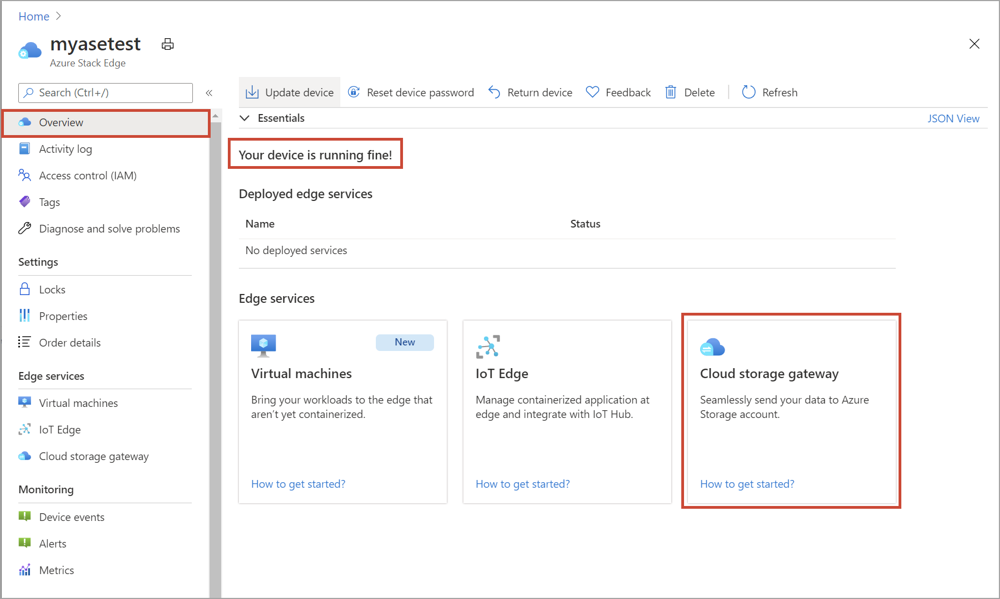
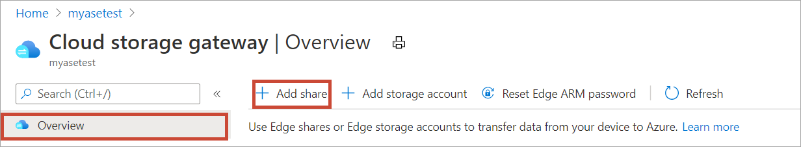
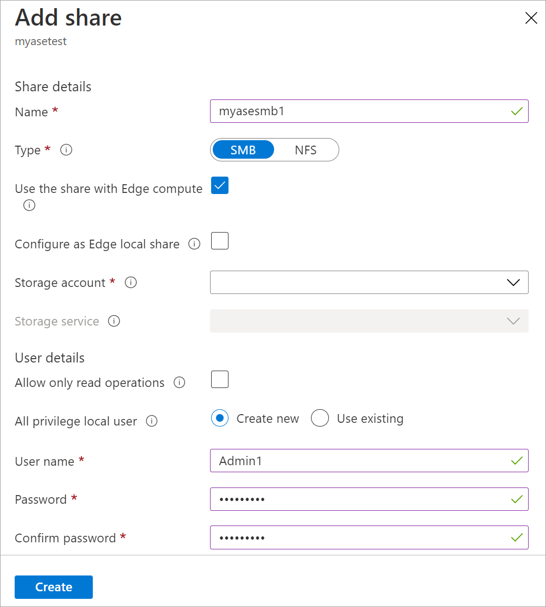
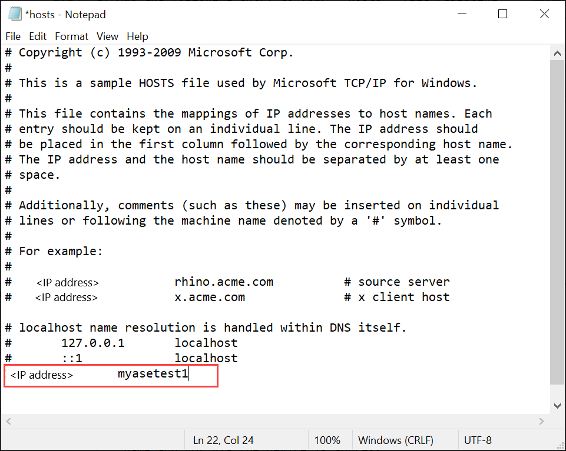
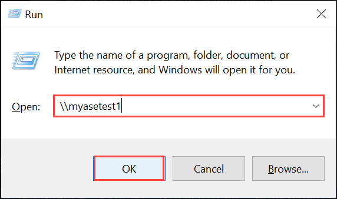

# Tutorial: Transfer data via shares with Azure Stack Edge Pro GPU

[!INCLUDE [applies-to-GPU-and-pro-r-and-mini-r-skus](../../includes/azure-stack-edge-applies-to-gpu-pro-r-mini-r-sku.md)]

This tutorial describes how to add and connect to shares on your Azure Stack Edge Pro device. After you've added the shares, Azure Stack Edge Pro can transfer data to Azure.

This procedure can take around 10 minutes to complete.

In this tutorial, you learn how to:

> [!div class="checklist"]
>
> * Add a share
> * Connect to the share

## Prerequisites

Before you add shares to Azure Stack Edge Pro, make sure that:

* You've installed your physical device as described in [Install Azure Stack Edge Pro](azure-stack-edge-gpu-deploy-install.md).

* You've activated the physical device as described in [Activate your Azure Stack Edge Pro](azure-stack-edge-gpu-deploy-activate.md).

## Add a share

To create a share, do the following procedure:

1. In the [Azure portal](https://portal.azure.com/), select your Azure Stack Edge resource and then go to the **Overview**. Your device should be online. Select **Cloud storage gateway**.

   

2. Select **+ Add share** on the device command bar.

   

3. In the **Add share** pane, follow these steps:

    a. In the **Name** box, provide a unique name for your share.  
    The share name can have only letters, numerals, and hyphens. It must have between 3 to 63 characters and begin with a letter or a numeral. Hyphens must be preceded and followed by a letter or a numeral.
    
    b. Select a **Type** for the share.  
    The type can be **SMB** or **NFS**, with SMB being the default. SMB is the standard for Windows clients, and NFS is used for Linux clients.  
    Depending upon whether you choose SMB or NFS shares, the rest of the options vary slightly. 

    c. Provide a storage account where the share will reside.

    d. In the **Storage service** drop-down list, select **Block Blob**, **Page Blob**, or **Files**.  
    The type of service you select depends on which format you want the data to use in Azure. In this example, because we want to store the data as block blobs in Azure, we select **Block Blob**. If you select **Page Blob**, make sure that your data is 512 bytes aligned. For example, a VHDX is always 512 bytes aligned.

   > [!IMPORTANT]
   > Make sure that the Azure Storage account that you use does not have immutability policies or archiving policies set on it if you are using it with a Azure Stack Edge Pro or Data Box Gateway device.  If the blob policies are immutable or if the blobs are aggressively archived, you'll experience upload errors when the blob is changed in the share. For more information, see [Set and manage immutability policies for blob storage](../storage/blobs/immutable-policy-configure-version-scope.md).

    e. Create a new blob container or use an existing one from the dropdown list. If creating a blob container, provide a container name. If a container doesn't already exist, it's created in the storage account with the newly created share name.
   
    f. Depending on whether you've created an SMB share or an NFS share, do one of the following steps: 
     
    - **SMB share**: Under **All privilege local user**, select **Create new** or **Use existing**. If you create a new local user, enter a username and password, and then confirm the password. This action assigns permissions to the local user. Modification of share-level permissions is currently not supported. If you select the **Allow only read operations** check box for this share data, you can specify read-only users.
    
        
   
    - **NFS share**: Enter the IP addresses of allowed clients that can access the share.

        
   
4. Select **Create** to create the share.
    
    You're notified that the share creation is in progress. After the share is created with the specified settings, the **Shares** tile updates to reflect the new share.
    

## Connect to the share

You can now connect to one or more of the shares that you created in the last step. Depending upon whether you have an SMB or an NFS share, the steps can vary.

The first step is to ensure that the device name can be resolved when you are using SMB or NFS share.

### Modify host file for name resolution

You will now add the IP of the device and the device friendly name that you defined on the local web UI of device to:

- The host file on the client, OR,
- The host file on the DNS server

> [!IMPORTANT]
> We recommend that you modify the host file on the DNS server for the device name resolution.

On your Windows client that you are using to connect to the device, take the following steps:

1. Start **Notepad** as an administrator, and then open the **hosts** file located at `C:\Windows\System32\Drivers\etc`.

    


2. Add the following entry to your **hosts** file replacing with appropriate values for your device: 

    ```
    <Device IP>   <device friendly name>
    ``` 
    You can get the device IP from the **Network** and the device friendly name from the **Device** page in the local web UI. The following screenshot of the hosts file shows the entry:

    

### Connect to an SMB share

On your Windows Server client connected to your Azure Stack Edge Pro device, connect to an SMB share by entering the commands:


1. In a command window, type:

    `net use \\<Device name>\<share name>  /u:<user name for the share>`

    > [!NOTE]
    > You can connect to an SMB share only with the device name and not via the device IP address.

2. When you're prompted to do so, enter the password for the share.  
   The sample output of this command is presented here.

    ```powershell
    Microsoft Windows [Version 10.0.18363.476)
    (c) 2017 Microsoft Corporation. All rights reserved.
    
    C: \Users\AzureStackEdgeUser>net use \\myasetest1\myasesmbshare1 /u:aseuser
    Enter the password for 'aseuser' to connect to 'myasetest1':
    The command completed successfully.
    
    C: \Users\AzureStackEdgeUser>
    ```   

3. On your keyboard, select Windows + R.

4. In the **Run** window, specify the `\\<device name>`, and then select **OK**.  

    

   File Explorer opens. You should now be able to view the shares that you created as folders. In File Explorer, double-click a share (folder) to view the content.
 
    

    The data is written to these shares as it is generated and the device pushes the data to cloud.

### Connect to an NFS share

On your Linux client connected to your Azure Stack Edge Pro device, do the following procedure:

1. Make sure that the client has NFSv4 client installed. To install NFS client, use the following command:

   `sudo apt-get install nfs-common`

    For more information, go to [Install NFSv4 client](https://help.ubuntu.com/community/NFSv4Howto).

2. After the NFS client is installed, mount the NFS share that you created on your Azure Stack Edge Pro device by using the following command:

   `sudo mount -t nfs -o sec=sys,resvport <device IP>:/<NFS share on device> /home/username/<Folder on local Linux computer>`

    You can get the device IP from the **Network** page of your local web UI.

    > [!IMPORTANT]
    > Use of `sync` option when mounting shares improves the transfer rates of large files.
    > Before you mount the share, make sure that the directories that will act as mountpoints on your local computer are already created. These directories should not contain any files or subfolders.

    The following example shows how to connect via NFS to a share on your Azure Stack Edge Pro device. The device IP is `10.10.10.60`. The share `mylinuxshare2` is mounted on the ubuntuVM. The share mount point is `/home/azurestackedgeubuntuhost/edge`.

    `sudo mount -t nfs -o sec=sys,resvport 10.10.10.60:/mylinuxshare2 /home/azurestackedgeubuntuhost/Edge`

> [!NOTE] 
> The following caveats are applicable to this release:
> - After a file is created in the share, renaming of the file isn't supported. 
> - Deleting a file from a share does not delete the entry in the Azure Storage account.
> - When using `rsync` to copy over NFS, use the `--inplace` flag. 

## Next steps

In this tutorial, you learned about the following Azure Stack Edge Pro topics:

> [!div class="checklist"]
> * Add a share
> * Connect to share

To learn how to transform your data by using Azure Stack Edge Pro, advance to the next tutorial:

> [!div class="nextstepaction"]
> [Transform data with Azure Stack Edge Pro](./azure-stack-edge-j-series-deploy-configure-compute.md)
