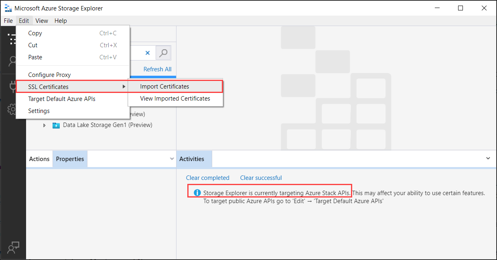

# Tutorial: Transfer data via storage accounts with Azure Stack Edge Pro GPU 

[!INCLUDE [applies-to-GPU-and-pro-r-and-mini-r-skus](../../includes/azure-stack-edge-applies-to-gpu-pro-r-mini-r-sku.md)]

This tutorial describes how to add and connect to storage accounts on your Azure Stack Edge Pro device. After you've added the storage accounts, Azure Stack Edge Pro can transfer data to Azure.

This procedure can take around 30 minutes to complete.

In this tutorial, you learn how to:

> [!div class="checklist"]
> * Add a storage account
> * Connect to the storage account

 
## Prerequisites

Before you add storage accounts to Azure Stack Edge Pro, make sure that:

- You've installed your physical device as described in [Install Azure Stack Edge Pro](azure-stack-edge-gpu-deploy-install.md).

- You've activated the physical device as described in [Activate your Azure Stack Edge Pro](azure-stack-edge-gpu-deploy-activate.md).


## Add an Edge storage account

To create an Edge storage account, do the following procedure:

[!INCLUDE [Add an Edge storage account](../../includes/azure-stack-edge-gateway-add-storage-account.md)]


## Connect to the Edge storage account

You can now connect to Edge storage REST APIs over *http* or *https*.

- *Https* is the secure and recommended way.
- *Http* is used when connecting over trusted networks.

## Connect via http

Connection to Edge storage REST APIs over http requires the following steps:

- Add the Azure consistent service VIP and blob service endpoint to the remote host
- Verify the connection 

Each of these steps is described in the following sections.

### Add device IP address and blob service endpoint to the remote client

[!INCLUDE [Add device IP and blob service endpoint to host file](../../includes/azure-stack-edge-gateway-add-device-ip-address-blob-service-endpoint.md)]


### Verify connection

To verify the connection, you would typically need the following information (may vary) you gathered in the previous step:

- Storage account name.
- Storage account access key.
- Blob service endpoint.

You already have the storage account name and the blob service endpoint. You can get the storage account access key by connecting to the device via the Azure Resource Manager using an Azure PowerShell client.

Follow the steps in [Connect to the device via Azure Resource Manager](azure-stack-edge-gpu-connect-resource-manager.md). Once you have signed into the local device APIs via the Azure Resource Manager, get the list of storage accounts on the device. Run the following cmdlet:

`Get-AzureRMStorageAccount`

From the list of the storage accounts on the device, identify the storage account for which you need the access key. Note the storage account name and resource group.

A sample output is shown below:

```azurepowershell
PS C:\windows\system32> Get-AzureRmStorageAccount

StorageAccountName ResourceGroupName Location SkuName     Kind    AccessTier CreationTime          ProvisioningState EnableHttpsTrafficOnly
------------------ ----------------- -------- -------     ----    ---------- ------------          ----------------- ----------------------
myasetiered1       myasetiered1      DBELocal StandardLRS Storage            11/27/2019 7:10:12 PM Succeeded         False
```

To get the access key, run the following cmdlet:

`Get-AzureRmStorageAccountKey`

A sample output is shown below:

```azurepowershell
PS C:\windows\system32> Get-AzureRmStorageAccountKey

cmdlet Get-AzureRmStorageAccountKey at command pipeline position 1
Supply values for the following parameters:
(Type !? for Help.)
ResourceGroupName: myasetiered1
Name: myasetiered1

KeyName Value    Permissions                                                                                
------- -----    -----------                                                                                
key1    Jb2brrNjRNmArFcDWvL4ufspJjlo+Nie1uh8Mp4YUOVQNbirA1uxEdHeV8Z0dXbsG7emejFWI9hxyR1T93ZncA==        Full
key2    6VANuHzHcJV04EFeyPiWRsFWnHPkgmX1+a3bt5qOQ2qIzohyskIF/2gfNMqp9rlNC/w+mBqQ2mI42QgoJSmavg==        Full
```

Copy and save this key. You will use this key to verify the connection using Azure Storage Explorer.

To verify that the connection is successfully established, use Storage Explorer to attach to an external storage account. If you do not have Storage Explorer, [download Storage Explorer](https://go.microsoft.com/fwlink/?LinkId=708343&clcid=0x409).

[!INCLUDE [Verify connection using Storage Explorer](../../includes/azure-stack-edge-gateway-verify-connection-storage-explorer.md)]


## Connect via https

Connection to Azure Blob storage REST APIs over https requires the following steps:

- Get your blob endpoint certificate
- Import the certificate on the client or remote host
- Add the device IP and blob service endpoint to the client or remote host
- Configure and verify the connection

Each of these steps is described in the following sections.

### Get certificate

Accessing Blob storage over HTTPS requires an SSL certificate for the device. You will also upload this certificate to your Azure Stack Edge Pro device as *.pfx* file with a private key attached to it. For more information on how to create (for test and dev purposes only) and upload these certificates to your Azure Stack Edge Pro device, go to:

- [Create the blob endpoint certificate](azure-stack-edge-gpu-create-certificates-powershell.md#create-certificates).
- [Upload the blob endpoint certificate](azure-stack-edge-gpu-manage-certificates.md#upload-certificates).
- [Import certificates on the client accessing the device](azure-stack-edge-gpu-manage-certificates.md#import-certificates-on-the-client-accessing-the-device).

### Import certificate

If using Azure Storage Explorer to connect to the storage accounts on the device, you also need to import certificate into Storage Explorer in PEM format. In Windows environment, Base-64 encoded *.cer* is the same as the PEM format.

Take the following steps to import the certificates on Azure Storage Explorer:

1. Make sure that Azure Storage Explorer is targeting the Azure Stack APIs. Go to **Edit > Target Azure Stack APIs**. When prompted, restart Storage Explorer for the change to take effect.

2. To import SSL certificates, go to **Edit > SSL certificates > Import certificates**.

  
    

3. Navigate and provide the signing chain and blob certificates. Both the signing chain and the blob certificate should be in PEM format which is the same as Base64-encoded format on Windows system. You will be notified that the certificates were successfully imported.


### Add device IP address and blob service endpoint

Follow the same steps to [add device IP address and blob service endpoint when connecting over *http*](#add-device-ip-address-and-blob-service-endpoint-to-the-remote-client).

### Configure and verify connection

Follow the steps to [Configure and verify connection that you used while connecting over *http*](#verify-connection). The only difference is that you should leave the *Use http option* unchecked.

## Next steps

In this tutorial, you learned about the following Azure Stack Edge Pro topics:

> [!div class="checklist"]
> * Add a storage account
> * Connect to a storage account

To learn how to transform your data by using Azure Stack Edge Pro, advance to the next tutorial:

> [!div class="nextstepaction"]
> [Transform data with Azure Stack Edge Pro](./azure-stack-edge-j-series-deploy-configure-compute.md)
