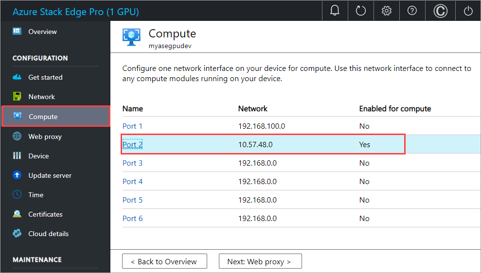
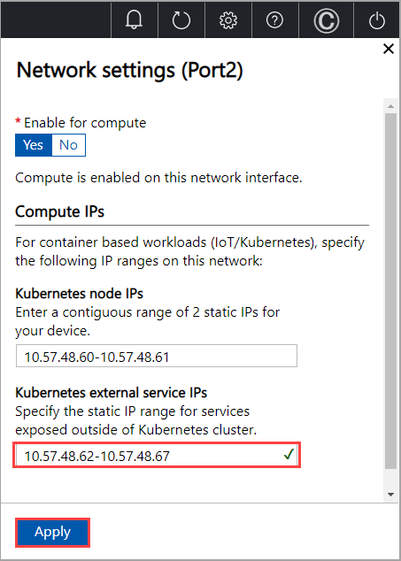

# Deploy Azure Data Services on your Azure Stack Edge Pro GPU device

[!INCLUDE [applies-to-GPU-and-pro-r-and-mini-r-skus](../../includes/azure-stack-edge-applies-to-gpu-pro-r-mini-r-sku.md)]

This article describes the process of creating an Azure Arc Data Controller and then deploying Azure Data Services on your Azure Stack Edge Pro GPU device. 

Azure Arc Data Controller is the local control plane that enables Azure Data Services in customer-managed environments. Once you have created the Azure Arc Data Controller on the Kubernetes cluster that runs on your Azure Stack Edge Pro GPU device, you can deploy Azure Data Services such as SQL Managed Instance (Preview) on that data controller.

The procedure to create Data Controller and then deploy an SQL Managed Instance involves the use of PowerShell and `kubectl` - a native tool that provides command-line access to the Kubernetes cluster on the device.


## Prerequisites

Before you begin, make sure that:

1. You've access to an Azure Stack Edge Pro GPU device and you've activated your device as described in [Activate Azure Stack Edge Pro](azure-stack-edge-gpu-deploy-activate.md).

1. You've enabled the compute role on the device. A Kubernetes cluster was also created on the device when you configured compute on the device as per the instructions in [Configure compute on your Azure Stack Edge Pro GPU device](azure-stack-edge-gpu-deploy-configure-compute.md).

1. You have the Kubernetes API endpoint from the **Device** page of your local web UI. For more information, see the instructions in [Get Kubernetes API endpoint](azure-stack-edge-gpu-deploy-configure-compute.md#get-kubernetes-endpoints).

1. You've access to a client that will connect to your device. 
    1. This article uses a Windows client system running PowerShell 5.0 or later to access the device. You can use any other client with a [Supported operating system](azure-stack-edge-gpu-system-requirements.md#supported-os-for-clients-connected-to-device). 
    1. Install `kubectl` on your client. For the client version:
        1. Identify the Kubernetes server version installed on the device. In the local UI of the device, go to **Software updates** page. Note the **Kubernetes server version** in this page.
        1. Download a client that is skewed no more than one minor version from the master. The client version but may lead the master by up to one minor version. For example, a v1.3 master should work with v1.1, v1.2, and v1.3 nodes, and should work with v1.2, v1.3, and v1.4 clients. For more information on Kubernetes client version, see [Kubernetes version and version skew support policy](https://kubernetes.io/docs/setup/release/version-skew-policy/#supported-version-skew).
    
1. Optionally, [Install client tools for deploying and managing Azure Arc enabled data services](../azure-arc/data/install-client-tools.md). These tools are not required but recommended.  
1. Make sure you have enough resources available on your device to provision a data controller and one SQL Managed Instance. For data controller and one SQL Managed Instance, you will need a minimum of 16 GB of RAM and 4 CPU cores. For detailed guidance, go to [Minimum requirements for Azure Arc enabled data services deployment](../azure-arc/data/sizing-guidance.md#minimum-deployment-requirements).


## Configure Kubernetes external service IPs

1. Go the local web UI of the device and then go to **Compute**.
1. Select the network enabled for compute. 

    

1. Make sure that you provide three additional Kubernetes external service IPs (in addition to the IPs you have already configured for other external services or containers). The data controller will use two service IPs and the third IP is used when you create a SQL Managed Instance. You will need one IP for each additional Data Service you will deploy. 

    

1. Apply the settings and these new IPs will immediately take effect on an already existing Kubernetes cluster. 


## Deploy Azure Arc Data Controller

Before you deploy a data controller, you'll need to create a namespace.

### Create namespace 

Create a new, dedicated namespace where you will deploy the Data Controller. You'll also create a user and then grant user the access to the namespace that you created. 

> [!NOTE]
> For both namespace and user names, the [DNS subdomain naming conventions](https://kubernetes.io/docs/concepts/overview/working-with-objects/names/#dns-subdomain-names) apply.

1. [Connect to the PowerShell interface](azure-stack-edge-gpu-connect-powershell-interface.md#connect-to-the-powershell-interface).
1. Create a namespace. Type:

	`New-HcsKubernetesNamespace -Namespace <Name of namespace>`

1. Create a user. Type: 

	`New-HcsKubernetesUser -UserName <User name>`

1. A config file is displayed in plain text. Copy this file and save it as a *config* file. 

    > [!IMPORTANT]
    > Do not save the config file as *.txt* file, save the file without any file extension.

1. The config file should live in the `.kube` folder of your user profile on the local machine. Copy the file to that folder in your user profile.

    
1. Grant the user access to the namespace that you created. Type: 

    `Grant-HcsKubernetesNamespaceAccess -Namespace <Name of namespace> -UserName <User name>`

    Here is a sample output of the preceding commands. In this example, we create a `myadstest` namespace, a `myadsuser` user and granted the user access to the namespace.
    
    ```powershell
    [10.100.10.10]: PS>New-HcsKubernetesNamespace -Namespace myadstest
    [10.100.10.10]: PS>New-HcsKubernetesUser -UserName myadsuser
    apiVersion: v1
    clusters:
    - cluster:
        certificate-authority-data: LS0tLS1CRUdJTiBD=======//snipped//=======VSVElGSUNBVEUtLS0tLQo=
        server: https://compute.myasegpudev.wdshcsso.com:6443
      name: kubernetes
    contexts:
    - context:
        cluster: kubernetes
        user: myadsuser
      name: myadsuser@kubernetes
    current-context: myadsuser@kubernetes
    kind: Config
    preferences: {}
    users:
    - name: myadsuser
      user:
        client-certificate-data: LS0tLS1CRUdJTiBDRV=========//snipped//=====EE9PQotLS0kFURSBLRVktLS0tLQo=
    
    [10.100.10.10]: PS>Grant-HcsKubernetesNamespaceAccess -Namespace myadstest -UserName myadsuser
    [10.100.10.10]: PS>Set-HcsKubernetesAzureArcDataController -SubscriptionId db4e2fdb-6d80-4e6e-b7cd-736098270664 -ResourceGroupName myasegpurg -Location "EastUS" -UserName myadsuser -Password "Password1" -DataControllerName "arctestcontroller" -Namespace myadstest
    [10.100.10.10]: PS>
    ```
1. Add a DNS entry to the hosts file on your system. 

    1. Run Notepad as administrator and open the `hosts` file located at `C:\windows\system32\drivers\etc\hosts`. 
    2. Use the information that you saved from the **Device** page in the local UI (prerequisite) to create the entry in the hosts file. 

        For example, copy this endpoint `https://compute.myasegpudev.microsoftdatabox.com/[10.100.10.10]` to create the following entry with device IP address and DNS domain: 

        `10.100.10.10 compute.myasegpudev.microsoftdatabox.com`

1. To verify that you can connect to the Kubernetes pods, start a cmd prompt or a PowerShell session. Type:
    
    ```powershell
    PS C:\WINDOWS\system32> kubectl get pods -n "myadstest"
    No resources found.
    PS C:\WINDOWS\system32>
    ```
You can now deploy your data controller and data services applications in the namespace, then view the applications and their logs.

### Create data controller

The data controller is a collection of pods that are deployed to your Kubernetes cluster to provide an API, the controller service, the bootstrapper, and the monitoring databases and dashboards. Follow these steps to create a data controller on the Kubernetes cluster that exists on your Azure Stack Edge device in the namespace that you created earlier.   

1. Gather the following information that you'll need to create a data controller:

    
    |Column1  |Column2  |
    |---------|---------|
    |Data controller name     |A descriptive name for your data controller. For example, `arctestdatacontroller`.         |
    |Data controller username     |Any username for the data controller administrator user. The data controller username and password are used to authenticate to the data controller API to perform administrative functions.          |
    |Data controller password     |A password for the data controller administrator user. Choose a secure password and share it with only those that need to have cluster administrator privileges.         |
    |Name of your Kubernetes namespace     |The name of the Kubernetes namespace that you want to create the data controller in.         |
    |Azure subscription ID     |The Azure subscription GUID for where you want the data controller resource in Azure to be created.         |
    |Azure resource group name     |The name of the resource group where you want the data controller resource in Azure to be created.         |
    |Azure location     |The Azure location where the data controller resource metadata will be stored in Azure. For a list of available regions, see Azure global infrastructure / Products by region.|


1. Connect to the PowerShell interface. To create the data controller, type: 

    ```powershell
    Set-HcsKubernetesAzureArcDataController -SubscriptionId <Subscription ID> -ResourceGroupName <Resource group name> -Location <Location without spaces> -UserName <User you created> -Password <Password to authenticate to Data Controller> -DataControllerName <Data Controller Name> -Namespace <Namespace you created>    
    ```
    Here is a sample output of the preceding commands.

    ```powershell
    [10.100.10.10]: PS>Set-HcsKubernetesAzureArcDataController -SubscriptionId db4e2fdb-6d80-4e6e-b7cd-736098270664 -ResourceGroupName myasegpurg -Location "EastUS" -UserName myadsuser -Password "Password1" -DataControllerName "arctestcontroller" -Namespace myadstest
    [10.100.10.10]: PS>	
    ```
    
    The deployment may take approximately 5 minutes to complete.

    > [!NOTE]
    > The data controller created on Kubernetes cluster on your Azure Stack Edge Pro GPU device works only in the disconnected mode in the current release. The disconnected mode is for the Data Controller and not for your device.

### Monitor data creation status

1. Open another PowerShell window.
1. Use the following `kubectl` command to monitor the creation status of the data controller. 

    ```powershell
    kubectl get datacontroller/<Data controller name> --namespace <Name of your namespace>
    ```
    When the controller is created, the status should be `Ready`.
    Here is a sample output of the preceding command:

    ```powershell
    PS C:\WINDOWS\system32> kubectl get datacontroller/arctestcontroller --namespace myadstest
    NAME                STATE
    arctestcontroller   Ready
    PS C:\WINDOWS\system32>
    ```
1. To identify the IPs assigned to the external services running on the data controller, use the `kubectl get svc -n <namespace>` command. Here is a sample output:

    ```powershell
    PS C:\WINDOWS\system32> kubectl get svc -n myadstest
    NAME                      TYPE           CLUSTER-IP       EXTERNAL-IP   PORT(S)                                       AGE
    controldb-svc             ClusterIP      172.28.157.130   <none>        1433/TCP,8311/TCP,8411/TCP                    3d21h
    controller-svc            ClusterIP      172.28.123.251   <none>        443/TCP,8311/TCP,8301/TCP,8411/TCP,8401/TCP   3d21h
    controller-svc-external   LoadBalancer   172.28.154.30    10.57.48.63   30080:31090/TCP                               3d21h
    logsdb-svc                ClusterIP      172.28.52.196    <none>        9200/TCP,8300/TCP,8400/TCP                    3d20h
    logsui-svc                ClusterIP      172.28.85.97     <none>        5601/TCP,8300/TCP,8400/TCP                    3d20h
    metricsdb-svc             ClusterIP      172.28.255.103   <none>        8086/TCP,8300/TCP,8400/TCP                    3d20h
    metricsdc-svc             ClusterIP      172.28.208.191   <none>        8300/TCP,8400/TCP                             3d20h
    metricsui-svc             ClusterIP      172.28.158.163   <none>        3000/TCP,8300/TCP,8400/TCP                    3d20h
    mgmtproxy-svc             ClusterIP      172.28.228.229   <none>        443/TCP,8300/TCP,8311/TCP,8400/TCP,8411/TCP   3d20h
    mgmtproxy-svc-external    LoadBalancer   172.28.166.214   10.57.48.64   30777:30621/TCP                               3d20h
    sqlex-svc                 ClusterIP      None             <none>        1433/TCP                                      3d20h
    PS C:\WINDOWS\system32>
    ```

## Deploy SQL managed instance

After you have successfully created the data controller, you can use a template to deploy a SQL Managed Instance on the data controller.

### Deployment template

Use the following deployment template to deploy a SQL Managed Instance on the data controller on your device.

```yml
apiVersion: v1
data:
    password: UGFzc3dvcmQx
    username: bXlhZHN1c2Vy
kind: Secret
metadata:
    name: sqlex-login-secret
type: Opaque
---
apiVersion: sql.arcdata.microsoft.com/v1alpha1
kind: sqlmanagedinstance
metadata:
    name: sqlex
spec:
    limits:
    memory: 4Gi
    vcores: "4"
    requests:
    memory: 2Gi
    vcores: "1"
    service:
    type: LoadBalancer
    storage:
    backups:
        className: ase-node-local
        size: 5Gi
    data:
        className: ase-node-local
        size: 5Gi
    datalogs:
        className: ase-node-local
        size: 5Gi
    logs:
        className: ase-node-local
        size: 1Gi
```


#### Metadata name
	
The metadata name is the name of the SQL Managed Instance. The associated pod in the preceding `deployment.yaml` will be name as `sqlex-n` (`n` is the number of pods associated with the application).	
	
#### Password and username data

The data controller username and password are used to authenticate to the data controller API to perform administrative functions. The Kubernetes secret for the data controller username and password in the deployment template are base64 encoded strings. 

You can use an online tool to base64 encode your desired username and password or you can use built in CLI tools depending on your platform. When using an online Base64 encode tool, provide the user name and password strings (that you entered while creating the data controller) in the tool and the tool will generate the corresponding Base64 encoded strings.
	
#### Service type

Service type should be set to `LoadBalancer`.
	
#### Storage class name

You can identify the storage class on your Azure Stack Edge device that the deployment will use for data, backups, data logs and logs. Use the  `kubectl get storageclass` command to get the storage class deployed on your device.

```powershell
PS C:\WINDOWS\system32> kubectl get storageclass
NAME             PROVISIONER      RECLAIMPOLICY  VOLUMEBINDINGMODE     ALLOWVOLUMEEXPANSION   AGE
ase-node-local   rancher.io/local-path   Delete  WaitForFirstConsumer  false                  5d23h
PS C:\WINDOWS\system32>
```
In the preceding sample output, the storage class `ase-node-local` on your device should be specified in the template.
 
#### Spec

To create an SQL Managed Instance on your Azure Stack Edge device, you can specify your memory and CPU requirements in the spec section of the `deployment.yaml`. Each SQL managed instance must request a minimum of 2-GB memory and 1 CPU core as shown in the following example. 

```yml
spec:
    limits:
    memory: 4Gi
    vcores: "4"
    requests:
    memory: 2Gi
    vcores: "1"
```  

For detailed sizing guidance for data controller and 1 SQL Managed Instance, review [SQL managed instance sizing details](../azure-arc/data/sizing-guidance.md#sql-managed-instance-sizing-details).

### Run deployment template

Run the `deployment.yaml` using the following command:

```powershell
kubectl create -n <Name of namespace that you created> -f <Path to the deployment yaml> 
```

Here is a sample output of the following command:

```powershell
PS C:\WINDOWS\system32> kubectl get pods -n "myadstest"
No resources found.
PS C:\WINDOWS\system32> 
PS C:\WINDOWS\system32> kubectl create -n myadstest -f C:\azure-arc-data-services\sqlex.yaml  secret/sqlex-login-secret created
sqlmanagedinstance.sql.arcdata.microsoft.com/sqlex created
PS C:\WINDOWS\system32> kubectl get pods --namespace myadstest
NAME                 READY   STATUS    RESTARTS   AGE
bootstrapper-mv2cd   1/1     Running   0          83m
control-w9s9l        2/2     Running   0          78m
controldb-0          2/2     Running   0          78m
controlwd-4bmc5      1/1     Running   0          64m
logsdb-0             1/1     Running   0          64m
logsui-wpmw2         1/1     Running   0          64m
metricsdb-0          1/1     Running   0          64m
metricsdc-fb5r5      1/1     Running   0          64m
metricsui-56qzs      1/1     Running   0          64m
mgmtproxy-2ckl7      2/2     Running   0          64m
sqlex-0              3/3     Running   0          13m
PS C:\WINDOWS\system32>
```

The `sqlex-0` pod in the sample output indicates the status of the SQL Managed Instance.

## Remove data controller

To remove the data controller, delete the dedicated namespace in which you deployed it.


```powershell
kubectl delete ns <Name of your namespace>
```


## Next steps

- [Deploy a stateless application on your Azure Stack Edge Pro](./azure-stack-edge-gpu-deploy-stateless-application-kubernetes.md).
