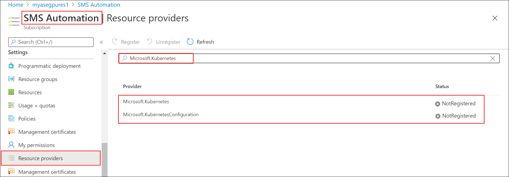
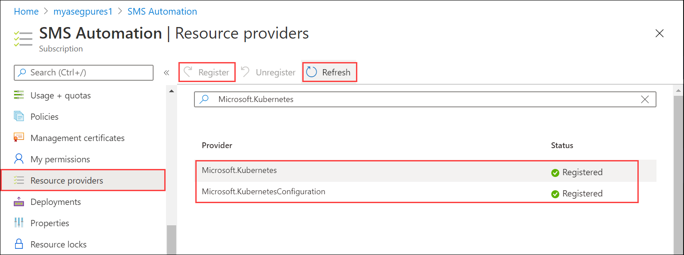
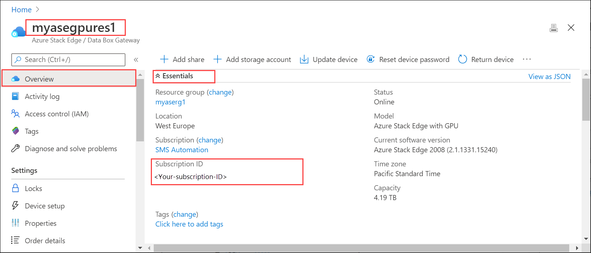
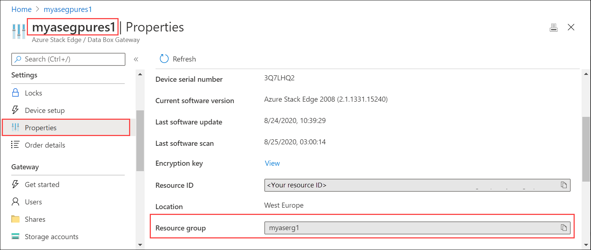

# Enable Azure Arc on Kubernetes cluster on your Azure Stack Edge Pro GPU device

This article shows you how to enable Azure Arc on an existing Kubernetes cluster on your Azure Stack Edge Pro device. 

This procedure is intended for those who have reviewed the [Kubernetes workloads on Azure Stack Edge Pro device](azure-stack-edge-gpu-kubernetes-workload-management.md) and are familiar with the concepts of [What is Azure Arc enabled Kubernetes (Preview)?](https://docs.microsoft.com/azure/azure-arc/kubernetes/overview).


## Prerequisites

Before you can enable Azure Arc on Kubernetes cluster, make sure that you have completed the following prerequisites on your Azure Stack Edge Pro device and the client that you will use to access the device:

### For device

1. You have sign-in credentials to a 1-node Azure Stack Edge Pro device.
    1. The device is activated. See [Activate the device](azure-stack-edge-gpu-deploy-activate.md).
    1. The device has the compute role configured via Azure portal and has a Kubernetes cluster. See [Configure compute](azure-stack-edge-gpu-deploy-configure-compute.md).

1. You've owner access to the subscription. You would need this access during the role assignment step for your service principal.
 

### For client accessing the device

1. You have a  Windows client system that will be used to access the Azure Stack Edge Pro device.
  
    - The client is running Windows PowerShell 5.0 or later. To download the latest version of Windows PowerShell, go to [Install Windows PowerShell](https://docs.microsoft.com/powershell/scripting/install/installing-windows-powershell?view=powershell-7).
    
    - You can have any other client with a [Supported operating system](azure-stack-edge-gpu-system-requirements.md#supported-os-for-clients-connected-to-device) as well. This article describes the procedure when using a Windows client. 
    
1. You have completed the procedure described in [Access the Kubernetes cluster on Azure Stack Edge Pro device](azure-stack-edge-gpu-create-kubernetes-cluster.md). You have:
    
    - Installed `kubectl` on the client  <!--and saved the `kubeconfig` file with the user configuration to C:\\Users\\&lt;username&gt;\\.kube. -->
    
    - Make sure that the `kubectl` client version is skewed no more than one version from the Kubernetes master version running on your Azure Stack Edge Pro device. 
      - Use `kubectl version` to check the version of kubectl running on the client. Make a note of the full version.
      - In the local UI of your Azure Stack Edge Pro device, go to **Software update** and note the Kubernetes server version number. 
    
              
      
      - Verify these two versions are compatible. 

<!-- az cli version requirements-->

## Register Kubernetes resource providers

Before you enable Azure Arc on the Kubernetes cluster, you will need to enable and register `Microsoft.Kubernetes` and `Microsoft.KubernetesConfiguration` against your subscription. 

1. To enable a resource provider, in the Azure portal, go to the subscription that you are planning to use for the deployment. Go to **Resource Providers**. 
1. In the right-pane, search for the providers you want to add. In this example, `Microsoft.Kubernetes` and `Microsoft.KubernetesConfiguration`.

    

1. Select a resource provider and from the top of the command bar, select **Register**. Registration  takes several minutes. 

    

1. Refresh the UI until you see that the resource provider is registered. Repeat the process for both resource providers.
    
    

You can also register resource providers via the `az cli`. For more information, see [Register the two providers for Azure Arc enabled Kubernetes](../azure-arc/kubernetes/connect-cluster.md#register-the-two-providers-for-azure-arc-enabled-kubernetes)

## Create service principal, assign role

1. Make sure that you have `Subscription ID` and the name of the resource group you used for the resource deployment for your Azure Stack Edge service. To get the subscription ID, go to your Azure Stack Edge resource in the Azure portal. Navigate to **Overview > Essentials**.

    

    To get the resource group name, go to **Properties**.

    

1. To create a service principal, use the following command via the `az cli`.

    `az ad sp create-for-rbac --skip assignment --name "<Informative name for service principal>"`  

    For information on how to log into the `az cli`, [Start Cloud Shell in Azure portal](../cloud-shell/quickstart-powershell.md?view=azure-cli-latest#start-cloud-shell)

    Here is an example. 
    
    ```azurecli
    PS /home/user> az ad sp create-for-rbac --skip-assignment --name "https://azure-arc-for-ase-k8s"
    {
      "appId": "aa8a082e-0fa1-4a82-b51c-e8b2a9fdaa8b",
      "displayName": "azure-arc-for-ase-k8s",
      "name": "https://azure-arc-for-ase-k8s",
      "password": "<password>",
      "tenant": "72f988bf-86f1-41af-91ab-2d7cd011db47"
    }
    PS /home/user>
    ```

1. Make a note of the `appID`, `name`, `password`, and `tenantID` as you will use this as input in the next command.

1. After creating the new service principal, assign the `Kubernetes Cluster - Azure Arc Onboarding` role to the newly created principal. This is a built-in Azure role (use the role ID in the command) with limited permissions. Use the following command:

    `az role assignment create --role 34e09817-6cbe-4d01-b1a2-e0eac5743d41 --assignee <appId-from-service-principal> --scope /subscriptions/<SubscriptionID>/resourceGroups/<Resource-group-name>`

    Here is an example.
    
    ```azurecli
    PS /home/user> az role assignment create --role 34e09817-6cbe-4d01-b1a2-e0eac5743d41 --assignee aa8a082e-0fa1-4a82-b51c-e8b2a9fdaa8b --scope /subscriptions/062c67a6-019b-40af-a775-c4dc1abe56ed/resourceGroups/myaserg1
    {
      "canDelegate": null,
      "id": "/subscriptions/062c67a6-019b-40af-a775-c4dc1abe56ed/resourceGroups/myaserg1/providers/Microsoft.Authorization/roleAssignments/59272f92-e5ce-4aeb-9c0c-62532d8caf25",
      "name": "59272f92-e5ce-4aeb-9c0c-62532d8caf25",
      "principalId": "b045b3fe-8745-4097-9674-91cb0afaad91",
      "principalType": "ServicePrincipal",
      "resourceGroup": "myaserg1",
      "roleDefinitionId": "/subscriptions/062c67a6-019b-40af-a775-c4dc1abe56ed/providers/Microsoft.Authorization/roleDefinitions/34e09817-6cbe-4d01-b1a2-e0eac5743d41",
      "scope": "/subscriptions/062c67a6-019b-40af-a775-c4dc1abe56ed/resourceGroups/myaserg1",
      "type": "Microsoft.Authorization/roleAssignments"
    }
    PS /home/user>
    ```
    For more information on how to create service principal and perform the role assignment, see the steps in [Create an Azure Arc-enabled onboarding Service Principal](https://docs.microsoft.com/azure/azure-arc/kubernetes/create-onboarding-service-principal).


## Enable Arc on Kubernetes cluster

Follow these steps to configure the Kubernetes cluster for Azure Arc management:

1. [Connect to the PowerShell interface](azure-stack-edge-gpu-connect-powershell-interface.md#connect-to-the-powershell-interface) of your device.

1. Type:

    `Set-HcsKubernetesAzureArcAgent -SubscriptionId "<Your Azure Subscription Id>" -ResourceGroupName "<Resource Group Name>" -ResourceName "<Azure Arc resource name (shouldn't exist already)>" -Location "<Region associated with resource group>" -TenantId "<Tenant Id of service principal>" -ClientId "<App id of service principal>" -ClientSecret "<Password of service principal>"`

    To deploy Azure Arc on Azure Stack Edge Pro device, make sure that you are using a [Supported region for Azure Arc](../azure-arc/kubernetes/overview.md#supported-regions). Azure Arc is currently in preview. You can also figure out the exact name of the region to pass in the cmdlet by using the `az account list-locations` command.
    
    Here is an example:
   
    ```powershell
    [10.128.44.240]: PS>Set-HcsKubernetesAzureArcAgent -SubscriptionId "062c67a6-019b-40af-a775-c4dc1abe56ed" -ResourceGroupName "myaserg1" -ResourceName "myasetestresarc" -Location "westeurope" -TenantId "72f988bf-86f1-41af-91ab-2d7cd011db47" -ClientId "aa8a082e-0fa1-4a82-b51c-e8b2a9fdaa8b" -ClientSecret "<password>"
        [10.128.44.240]: PS>
    ```
    
    In the Azure portal, a resource should be created with the name you provided in the preceding command.

    

1. To verify that Azure Arc is enabled successfully, run the following command from PowerShell interface:

    `kubectl get deployments -n azure-arc`

    This command finds any applications that are deployed in `azure-arc` namespace corresponding to Azure Arc.

    Here is a sample output that shows the Azure Arc agents that were deployed on your Kubernetes cluster in the `azure-arc` namespace. 


    ```powershell
    [10.128.44.240]: PS>kubectl get deployments -n azure-arc
    NAME                        READY   UP-TO-DATE   AVAILABLE   AGE
    cluster-metadata-operator   1/1     1            1           45m
    clusteridentityoperator     1/1     1            1           45m
    config-agent                1/1     1            1           45m
    connect-agent               1/1     1            1           45m
    controller-manager          1/1     1            1           45m
    flux-logs-agent             1/1     1            1           45m
    metrics-agent               1/1     1            1           45m
    resource-sync-agent         1/1     1            1           45m
    [10.128.44.240]: PS>
    ```

    You can also get a list of the pods running on your Kubernetes cluster in `azure-arc` namespace. A pod is an application container, or process, running on your Kubernetes cluster. 

    Use the following command:
    
    `kubectl get pods -n azure-arc`
    
    Here is a sample output.
    
    ```powershell
    [10.128.44.240]: PS>kubectl get pods -n azure-arc
    NAME                                         READY   STATUS    RESTARTS   AGE
    cluster-metadata-operator-64cbdf95b4-s2q52   2/2     Running   0          16m
    clusteridentityoperator-6f6dbccf7-nwnxg      3/3     Running   0          16m
    config-agent-7df5bf497b-mjm8k                3/3     Running   0          16m
    connect-agent-5d4c766764-m7h46               1/1     Running   0          16m
    controller-manager-777555fb57-t7tdp          3/3     Running   0          16m
    flux-logs-agent-845476c899-zcmtj             2/2     Running   0          16m
    metrics-agent-84d6fc8f4d-g9jkm               2/2     Running   0          16m
    resource-sync-agent-8f88dbf96-zgxjj          3/3     Running   0          16m
    [10.128.44.240]: PS>
    ```


As the preceding output shows, Azure Arc enabled Kubernetes consists of a few agents (operators) that run in your cluster deployed to the `azure-arc` namespace.

- `config-agent`: watches the connected cluster for source control configuration resources applied on the cluster and updates compliance state
- `controller-manager`: is an operator of operators and orchestrates interactions between Azure Arc components
- `metrics-agent`: collects metrics of other Arc agents to ensure that these agents are exhibiting optimal performance
- `cluster-metadata-operator`: gathers cluster metadata - cluster version, node count, and Azure Arc agent version
- `resource-sync-agent`: syncs the above mentioned cluster metadata to Azure
- `clusteridentityoperator`: Azure Arc enabled Kubernetes currently supports system assigned identity. clusteridentityoperator maintains the managed service identity (MSI) certificate used by other agents for communication with Azure.
- `flux-logs-agent`: collects logs from the flux operators deployed as a part of source control configuration.
- `connect-agent`: talks to the Azure Arc resource.

### Remove Arc from the Kubernetes cluster

To remove the Azure Arc management, follow these steps:

1. 1. [Connect to the PowerShell interface](azure-stack-edge-gpu-connect-powershell-interface.md#connect-to-the-powershell-interface) of your device.
2. Type:

    `Remove-HcsKubernetesAzureArcAgent` 


## Next steps

To understand how to run an Azure Arc deployment, see 
[Deploy a stateless PHP Guestbook application with Redis via GitOps on an Azure Stack Edge Pro device](azure-stack-edge-gpu-deploy-stateless-application-git-ops-guestbook.md)
