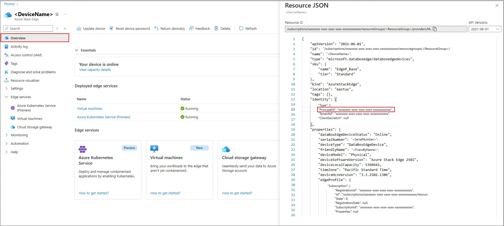

# Enable Azure Arc on Kubernetes cluster on your Azure Stack Edge Pro GPU device

[!INCLUDE [applies-to-GPU-and-pro-r-and-mini-r-skus](../../includes/azure-stack-edge-applies-to-gpu-pro-r-mini-r-sku.md)]

This article shows you how to enable Azure Arc on an existing Kubernetes cluster on your Azure Stack Edge Pro device.

This procedure assumes that you've read and understood the following articles:

- [Kubernetes workloads on Azure Stack Edge Pro device](azure-stack-edge-gpu-kubernetes-workload-management.md).
- [What is Azure Arc-enabled Kubernetes (Preview)?](/azure/azure-arc/kubernetes/overview)

## Prerequisites

Make sure that you've completed the following prerequisites on your Azure Stack Edge Pro device and the client that you use to access the device:

### For device

1. You have sign-in credentials to a 1-node Azure Stack Edge Pro device.
    1. The device is activated. See [Activate the device](azure-stack-edge-gpu-deploy-activate.md).
    1. The device has the compute role configured via Azure portal and has a Kubernetes cluster. See [Configure compute](azure-stack-edge-gpu-deploy-configure-compute.md).

1. You have owner access to the subscription. You would need this access during the role assignment step for your service principal.


### For client accessing the device

1. You have a Windows client system that is used to access the Azure Stack Edge Pro device.

    - The client is running Windows PowerShell 5.0 or later. To download the latest version of Windows PowerShell, go to [Install Windows PowerShell](/powershell/scripting/install/installing-powershell-core-on-windows).

    - You can have any other client with a [Supported operating system](azure-stack-edge-gpu-system-requirements.md#supported-os-for-clients-connected-to-device) as well. This article describes the procedure when using a Windows client.


1. You've completed the procedure described in [Access the Kubernetes cluster on Azure Stack Edge Pro device](azure-stack-edge-gpu-create-kubernetes-cluster.md). You have:

    - Installed `kubectl` on the client.
    - Make sure that the `kubectl` client version is skewed no more than one version from the Kubernetes master version running on your Azure Stack Edge Pro device.
      - Use `kubectl version` to check the version of kubectl running on the client. Make a note of the full version.
      - In the local UI of your Azure Stack Edge Pro device, go to **Software update** and note the Kubernetes server version number.

        

      - Verify these two versions are compatible.


## Register Kubernetes resource providers

Before you enable Azure Arc on the Kubernetes cluster, you need to enable and register `Microsoft.Kubernetes` and `Microsoft.KubernetesConfiguration` against your subscription.

1. To enable a resource provider, in the Azure portal, go to the subscription that you're planning to use for the deployment. Go to **Resource Providers**.
1. In the right-pane, search for the providers you want to add. In this example, `Microsoft.Kubernetes` and `Microsoft.KubernetesConfiguration`.

    

1. Select a resource provider and from the top of the command bar, select **Register**. Registration  takes several minutes.

    

1. Refresh the UI until you see that the resource provider is registered. Repeat the process for both resource providers.

    

You can also register resource providers via the `az cli`. For more information, see [Register the two providers for Azure Arc-enabled Kubernetes](/azure/azure-arc/kubernetes/quickstart-connect-cluster#register-providers-for-azure-arc-enabled-kubernetes).

## Create service principal, assign role

1. Make sure that you have `Subscription ID` and the name of the resource group you used for the resource deployment for your Azure Stack Edge service. To get the subscription ID, go to your Azure Stack Edge resource in the Azure portal. Navigate to **Overview > Essentials**.

    

    To get the resource group name, go to **Properties**.

    

1. To create a service principal, use the following command via the `az cli`.

    `az ad sp create-for-rbac --name "<Informative name for service principal>"`

    For information on how to log into the `az cli`, [Start Cloud Shell in Azure portal](/azure/cloud-shell/quickstart). If using `az cli` on a local client to create the service principal, make sure that you're running version 2.25 or later.

    Here's an example.

    ```azurecli
    PS /home/user> az ad sp create-for-rbac --name "https://azure-arc-for-ase-k8s"
    {
      "appId": "xxxxxxxx-xxxx-xxxx-xxxx-xxxxxxxxxxxx",
      "displayName": "azure-arc-for-ase-k8s",
      "name": "https://azure-arc-for-ase-k8s",
      "password": "<password>",
      "tenant": "xxxxxxxx-xxxx-xxxx-xxxx-xxxxxxxxxxxx"
    }
    PS /home/user>
    ```

1. Make a note of the `appId`, `name`, `password`, and `tenantID` as you'll use these values as input to the next command.

   There are several ways to obtain `appId`. The following three options are the preferred methods. If you use one of the following options, you can skip steps 1, 2, and 3 from the previous section and move directly to the following step 4.

   - Option 1 - Use Minishell to run the following PowerShell cmdlet: 

      ```powershell
      [Device-IP]: PS> Get-AzureDataBoxEdgeApplicationId
      xxxxxxxx-xxxx-xxxx-xxxx-xxxxxxxxxxxx
      [Device-IP]: PS>
      ```

   - Option 2 - Use the following steps to view JSON details for your device In Azure portal:
      
      1. Navigate to your Azure Stack Edge device **Overview** and then select **JSON view** at top right.
  
              

      1.  In the **Resource JSON** details for your device, make note of the `principalId`. 

          

   - Option 3 - Use non-Azure Stack Edge PowerShell on a client machine to run the following command:

      ```powershell
      // ASE resource group and resource name can be obtained from Azure portal
      PS C:\> $ASEResource= GetAzResource –ResourceGroupName <resource-group-name> -ResourceName <resource-name>
      PS C:\> $ASEResource.Identity.PrincipalId
      xxxxxxxx-xxxx-xxxx-xxxx-xxxxxxxxxxxx
      PS C:\>
      ```

1. After you create the new service principal, or after you retrieve it using one of these options, assign the `Kubernetes Cluster - Azure Arc Onboarding` role to the newly created principal. This is a built-in Azure role (use the role ID in the command) with limited permissions. Use the following command:

    `az role assignment create --role 34e09817-6cbe-4d01-b1a2-e0eac5743d41 --assignee <appId-from-service-principal> --scope /subscriptions/<SubscriptionID>/resourceGroups/<Resource-group-name>`

    Here's an example.

    ```azurecli
    PS /home/user> az role assignment create --role 34e09817-6cbe-4d01-b1a2-e0eac5743d41 --assignee xxxxxxxx-xxxx-xxxx-xxxx-xxxxxxxxxxxx --scope /subscriptions/xxxxxxxx-xxxx-xxxx-xxxx-xxxxxxxxxxxx/resourceGroups/myaserg1
    {
      "canDelegate": null,
      "id": "/subscriptions/xxxxxxxx-xxxx-xxxx-xxxx-xxxxxxxxxxxx/resourceGroups/myaserg1/providers/Microsoft.Authorization/roleAssignments/00000000-0000-0000-0000-000000000000",
      "name": "xxxxxxxx-xxxx-xxxx-xxxx-xxxxxxxxxxxx",
      "principalId": "xxxxxxxx-xxxx-xxxx-xxxx-xxxxxxxxxxxx",
      "principalType": "ServicePrincipal",
      "resourceGroup": "myaserg1",
      "roleDefinitionId": "/subscriptions/xxxxxxxx-xxxx-xxxx-xxxx-xxxxxxxxxxxx/providers/Microsoft.Authorization/roleDefinitions/34e09817-6cbe-4d01-b1a2-e0eac5743d41",
      "scope": "/subscriptions/xxxxxxxx-xxxx-xxxx-xxxx-xxxxxxxxxxxx/resourceGroups/myaserg1",
      "type": "Microsoft.Authorization/roleAssignments"
    }
    PS /home/user>
    ```

## Enable Arc on Kubernetes cluster

Follow these steps to configure the Kubernetes cluster for Azure Arc management:

1. [Connect to the PowerShell interface](azure-stack-edge-gpu-connect-powershell-interface.md#connect-to-the-powershell-interface) of your device.

1. Run the following command:

    `Set-HcsKubernetesAzureArcAgent -SubscriptionId "<Your Azure Subscription Id>" -ResourceGroupName "<Resource Group Name>" -ResourceName "<Azure Arc resource name (shouldn't exist already)>" -Location "<Region associated with resource group>" -TenantId "<Tenant Id of service principal>" -ClientId "<App id of service principal>"`

    After you run this command, you see a follow-up prompt to specify `ClientSecret`. Provide the service principal password at the prompt.

    Add the `CloudEnvironment` parameter if you're using a cloud other than Azure public. You can set this parameter to `AZUREPUBLICCLOUD`, `AZURECHINACLOUD`, `AZUREGERMANCLOUD`, and `AZUREUSGOVERNMENTCLOUD`.

   **Usage considerations:**

   - To deploy Azure Arc on your device, make sure that you're using a [Supported region for Azure Arc](https://azure.microsoft.com/global-infrastructure/services/?products=azure-arc).
   - Use the `az account list-locations` command to determine the exact location name to pass in the `Set-HcsKubernetesAzureArcAgent` cmdlet. Location names are typically formatted without any spaces.
   
   > [!IMPORTANT]
   > If you obtain the `Id` instead of creating a new service principle using the older method, then do not specify `ClientId`, `TenantId`, or `ClientSecret`.

   Here's an example:

   ```powershell
   [10.100.10.10]: PS>Set-HcsKubernetesAzureArcAgent -SubscriptionId "xxxxxxxx-xxxx-xxxx-xxxx-xxxxxxxxxxxx" -ResourceGroupName "myaserg1" -ResourceName "myasetestresarc" -Location "westeurope" -TenantId "xxxxxxxx-xxxx-xxxx-xxxx-xxxxxxxxxxxx" -ClientId "xxxxxxxx-xxxx-xxxx-xxxx-xxxxxxxxxxxx"

   WARNING: A script or application on the remote computer 10.126.76.0 is sending a prompt request. When you are prompted,
   enter sensitive information, such as credentials or passwords, only if you trust the remote computer and the
   application or script that is requesting the data.

   cmdlet Set-HcsKubernetesAzureArcAgent at command pipeline position 1

   Supply values for the following parameters:
   ClientSecret: **********************************
   [10.100.10.10]: PS>
   ```

   In the Azure portal, a resource should be created with the name you provided in the preceding command.

   

1. To verify that Azure Arc is enabled successfully, run the following command from PowerShell interface:

    `kubectl get deployments,pods -n azure-arc`

    Here's a sample output that shows the Azure Arc agents that were deployed on your Kubernetes cluster in the `azure-arc` namespace.

    ```powershell
    [10.128.44.240]: PS>kubectl get deployments,pods -n azure-arc
    NAME                                        READY   UP-TO-DATE   AVAILABLE   AGE
    deployment.apps/cluster-metadata-operator   1/1     1            1           13d
    deployment.apps/clusterconnect-agent        1/1     1            1           13d
    deployment.apps/clusteridentityoperator     1/1     1            1           13d
    deployment.apps/config-agent                1/1     1            1           13d
    deployment.apps/controller-manager          1/1     1            1           13d
    deployment.apps/extension-manager           1/1     1            1           13d
    deployment.apps/flux-logs-agent             1/1     1            1           13d
    deployment.apps/kube-aad-proxy              1/1     1            1           13d
    deployment.apps/metrics-agent               1/1     1            1           13d
    deployment.apps/resource-sync-agent         1/1     1            1           13d

    NAME                                            READY   STATUS    RESTARTS   AGE
    pod/cluster-metadata-operator-9568b899c-2stjn   2/2     Running   0          13d
    pod/clusterconnect-agent-576758886d-vggmv       3/3     Running   0          13d
    pod/clusteridentityoperator-6f59466c87-mm96j    2/2     Running   0          13d
    pod/config-agent-7cbd6cb89f-9fdnt               2/2     Running   0          13d
    pod/controller-manager-df6d56db5-kxmfj          2/2     Running   0          13d
    pod/extension-manager-58c94c5b89-c6q72          2/2     Running   0          13d
    pod/flux-logs-agent-6db9687fcb-rmxww            1/1     Running   0          13d
    pod/kube-aad-proxy-67b87b9f55-bthqv             2/2     Running   0          13d
    pod/metrics-agent-575c565fd9-k5j2t              2/2     Running   0          13d
    pod/resource-sync-agent-6bbd8bcd86-x5bk5        2/2     Running   0          13d
    [10.128.44.240]: PS>
    ```

A conceptual overview of these agents is available [here](/azure/azure-arc/kubernetes/conceptual-agent-overview).

### Remove Arc from the Kubernetes cluster

To remove the Azure Arc management, follow these steps:

1. [Connect to the PowerShell interface](azure-stack-edge-gpu-connect-powershell-interface.md#connect-to-the-powershell-interface) of your device.
2. Run the following command:

    `Remove-HcsKubernetesAzureArcAgent`


> [!NOTE]
> By default, when resource `yamls` are deleted from the Git repository, the corresponding resources aren't deleted from the Kubernetes cluster. You need to set `--sync-garbage-collection`  in Arc OperatorParams to allow the deletion of resources when deleted from git repository. For more information, see [Delete a configuration](/azure/azure-arc/kubernetes/tutorial-use-gitops-connected-cluster#additional-parameters)

## Next steps

To understand how to run an Azure Arc deployment, see
[Deploy a stateless PHP `Guestbook` application with Redis via GitOps on an Azure Stack Edge Pro device](azure-stack-edge-gpu-deploy-stateless-application-git-ops-guestbook.md).
