# Tutorial: Configure certificates for your Azure Stack Edge Pro with GPU

::: zone pivot="single-node"

This tutorial describes how you can configure certificates for your Azure Stack Edge Pro device with an onboard GPU by using the local web UI.

::: zone-end

::: zone pivot="two-node"

This tutorial describes how you can configure certificates for your 2-node Azure Stack Edge Pro GPU device by using the local web UI.

::: zone-end

The time taken for this step can vary depending on the specific option you choose and how the certificate flow is established in your environment.

In this tutorial, you learn about:

> [!div class="checklist"]
>
> * Prerequisites
> * Configure certificates for the physical device

## Prerequisites

Before you configure and set up your Azure Stack Edge Pro device with GPU, make sure that:

* You've installed the physical device as detailed in [Install Azure Stack Edge Pro GPU](azure-stack-edge-gpu-deploy-install.md).
* If you plan to bring your own certificates:
    - You should have your certificates ready in the appropriate format including the signing chain certificate. For details on certificate, go to [Manage certificates](azure-stack-edge-gpu-manage-certificates.md)

    - If your device is deployed in Azure Government and not deployed in Azure public cloud, a signing chain certificate is required before you can activate your device. 
    For details on certificate, go to [Manage certificates](azure-stack-edge-gpu-manage-certificates.md).

## Configure certificates for device

::: zone pivot="single-node"

1. Open the **Certificates** page in the local web UI of your device. This page will display the certificates available on your device. The device is shipped with self-signed certificates, also referred to as the device certificates. You can also bring your own certificates.
1. If you didn't change the device name or DNS domain when you [configured device settings earlier](azure-stack-edge-gpu-deploy-set-up-device-update-time.md#configure-device-settings), and you don't want to use your own certificates, you don't need any configuration on this page. You just need to verify that the status of all the certificates shows as valid on this page. 

    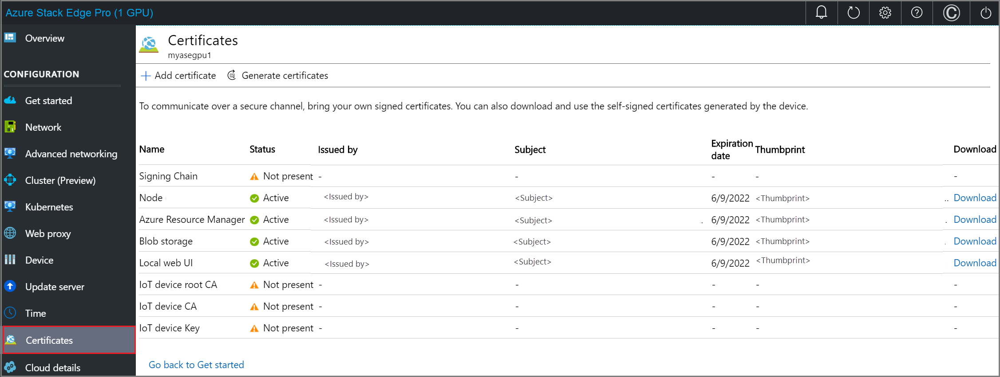

    You're ready to [Activate your device](azure-stack-edge-gpu-deploy-activate.md) with the existing device certificates.

1. Follow these steps only if you've changed the device name or the DNS domain for your device. In these instances, the status of your device certificates will be **Not valid**. That's because the device name and DNS domain in the certificates' `subject name` and `subject alternative` settings are out of date. 

    Select a certificate to view status details.       

    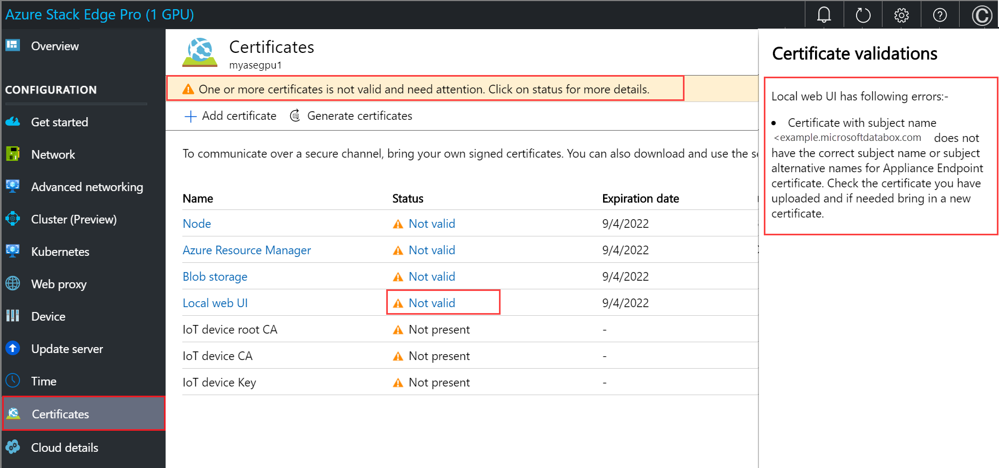  

1. If you've changed the device name or DNS domain of your device, and you don't provide new certificates, **activation of the device will be blocked**. To use a new set of certificates on your device, choose one of the following options:
    
     - **Generate all the device certificates**. Select this option, and then complete the steps in [Generate device certificates](#generate-device-certificates), if you plan to use automatically generated device certificates and need to generate new device certificates. You should only use these device certificates for testing, not with production workloads.

     - **Bring your own certificates**. Select this option, and then do the steps in [Bring your own certificates](#bring-your-own-certificates), if you want to use your own signed endpoint certificates and the corresponding signing chains. **We recommend that you always bring your own certificates for production workloads.**
    
     - You can choose to bring some of your own certificates and generate some device certificates. The **Generate all the device certificates** option only regenerates the device certificates.
    
1. When you have a full set of valid certificates for your device, the device is ready for activation. Select **< Back to Get started** to proceed to the next deployment step, [Activate your device](azure-stack-edge-gpu-deploy-activate.md).

::: zone-end

::: zone pivot="two-node"

1. Open the **Certificates** page in the local web UI of your device. This page will display the certificates available on your device. The device is shipped with self-signed certificates, also referred to as the device certificates. You can also bring your own certificates.
1. If you didn't change the device name or DNS domain when you [configured device settings earlier](azure-stack-edge-gpu-deploy-set-up-device-update-time.md#configure-device-settings), and you don't want to use your own certificates, you don't need any configuration on this page. You just need to verify that the status of all the certificates shows as valid on this page. 

    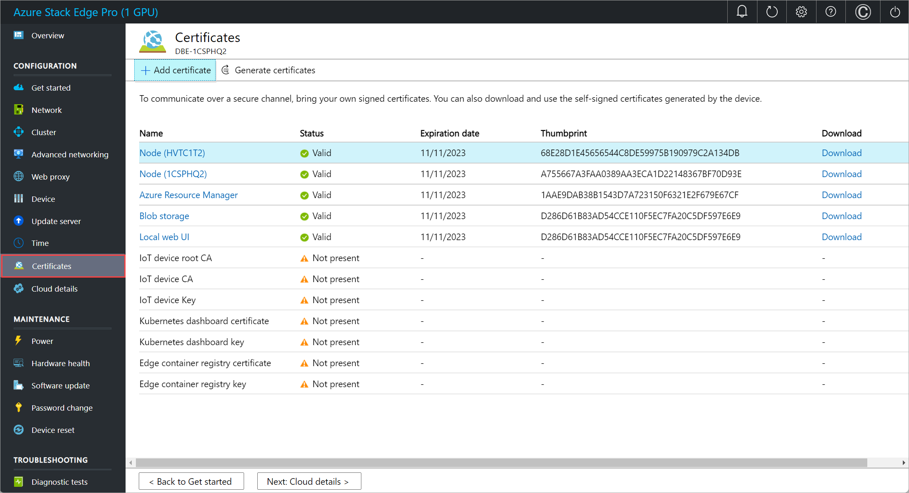 

    You're ready to [Activate your device](azure-stack-edge-gpu-deploy-activate.md) with the existing device certificates.

1. Follow these steps only if you've changed the device name or the DNS domain for your device. In these instances, the status of your device certificates will be **Not valid**. That's because the device name and DNS domain in the certificates' `subject name` and `subject alternative` settings are out of date. 

    Select a certificate to view status details.       

      

1. If you've changed the device name or DNS domain of your device, and you don't provide new certificates, **activation of the device will be blocked**. To use a new set of certificates on your device, choose one of the following options:
    
     - **Generate all the device certificates**. Select this option, and then complete the steps in [Generate device certificates](#generate-device-certificates), if you plan to use automatically generated device certificates and need to generate new device certificates. You should only use these device certificates for testing, not with production workloads.

     - **Bring your own certificates**. Select this option, and then do the steps in [Bring your own certificates](#bring-your-own-certificates), if you want to use your own signed endpoint certificates and the corresponding signing chains. **We recommend that you always bring your own certificates for production workloads.**
    
     - You can choose to bring some of your own certificates and generate some device certificates. The **Generate all the device certificates** option only regenerates the device certificates.
    
1. When you have a full set of valid certificates for your device, the device is ready for activation. Select **< Back to Get started** to proceed to the next deployment step, [Activate your device](azure-stack-edge-gpu-deploy-activate.md).

::: zone-end

## Generate device certificates

Follow these steps to generate device certificates.

Use these steps to regenerate and download the Azure Stack Edge Pro GPU device certificates:

::: zone pivot="single-node"

1. In the local UI of your device, go to **Configuration > Certificates**. Select **Generate certificates**.

    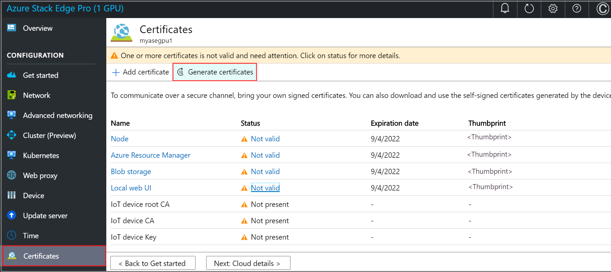

2. In the **Generate device certificates**, select **Generate**. 

    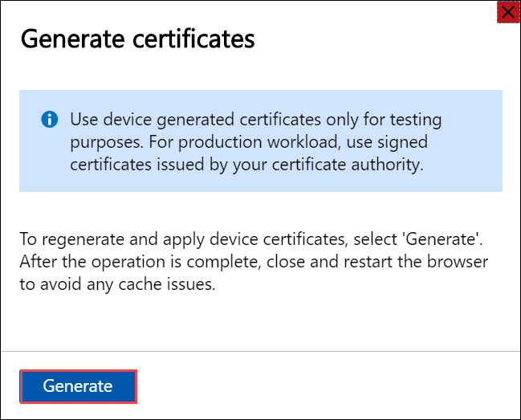

    The device certificates are now generated and applied. It takes a few minutes to generate and apply the certificates.
    
    > [!IMPORTANT]
    > While the certificate generation operation is in progress, do not bring your own certificates and try to add those via the **+ Add certificate** option.

    You are notified when the operation is successfully completed. **To avoid any potential cache issues, restart your browser.**
    
    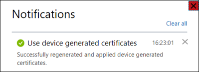

3. After the certificates are generated: 

    - The status of all the certificates shows as **Valid**. 

        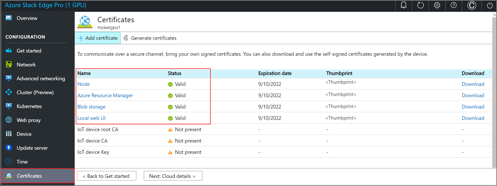

    - You can select a specific certificate name, and view the certificate details. 

        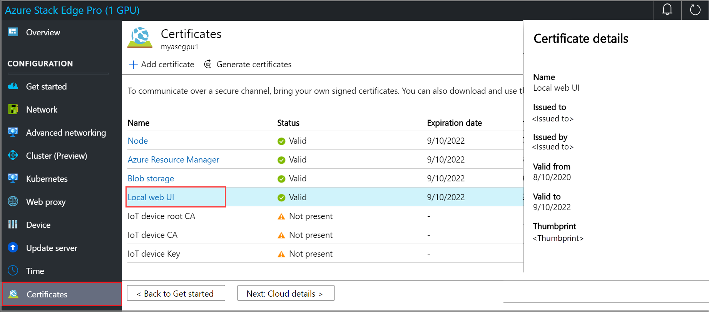

    - The **Download** column is now populated. This column has links to download the regenerated certificates. 

        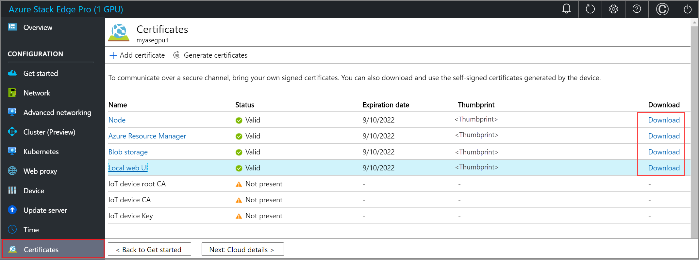

4. Select the download link for a certificate and when prompted, save the certificate. 

    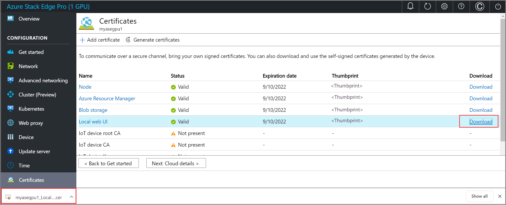

5. Repeat this process for all the certificates that you wish to download. 
    
    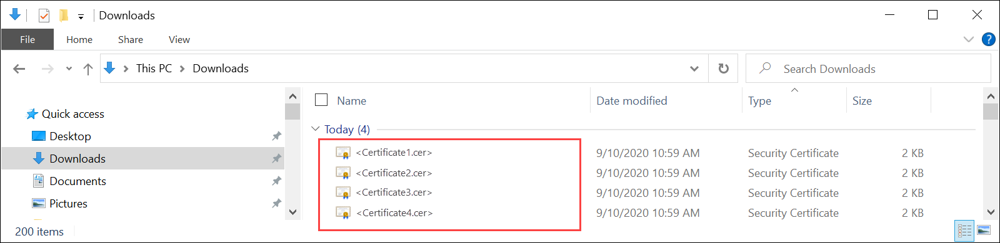

::: zone-end

::: zone pivot="two-node"

1. In the local UI of your device, go to **Configuration > Certificates**. Select **Generate certificates**.

    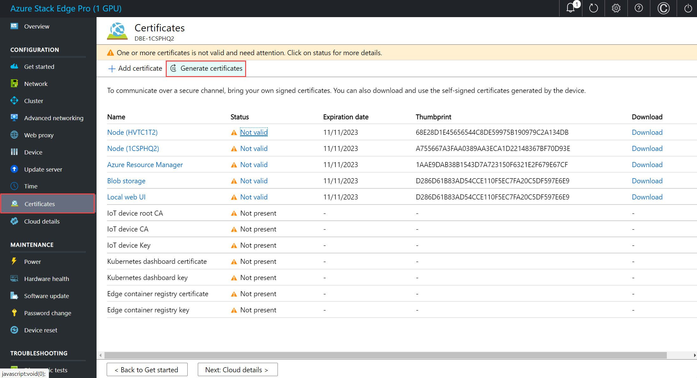

2. In the **Generate device certificates**, select **Generate**. 

    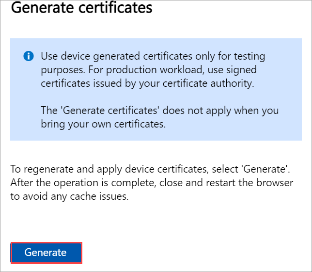

    The device certificates are now generated and applied. It takes a few minutes to generate and apply the certificates.
    
    > [!IMPORTANT]
    > While the certificate generation operation is in progress, do not bring your own certificates and try to add those via the **+ Add certificate** option.

    You are notified when the operation is successfully completed. **To avoid any potential cache issues, restart your browser.**
    
    

3. After the certificates are generated: 

    - The status of all the certificates shows as **Valid**. 

        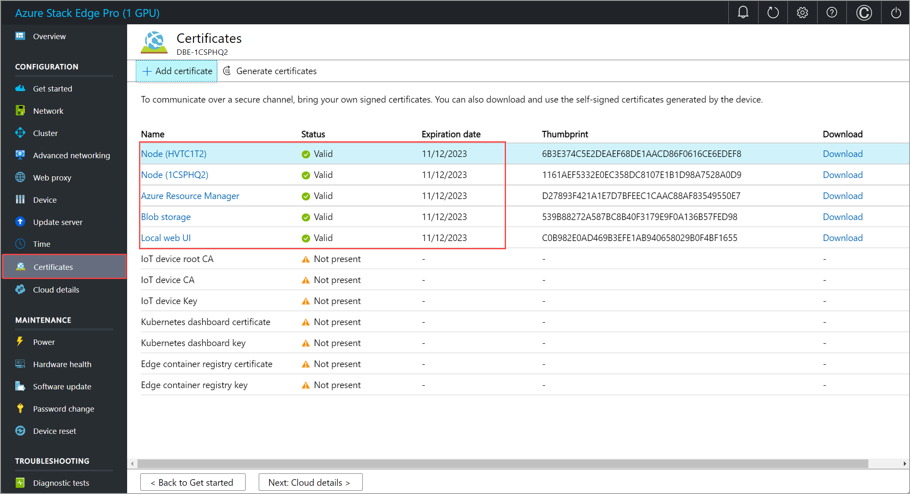

    - You can select a specific certificate name, and view the certificate details. 

        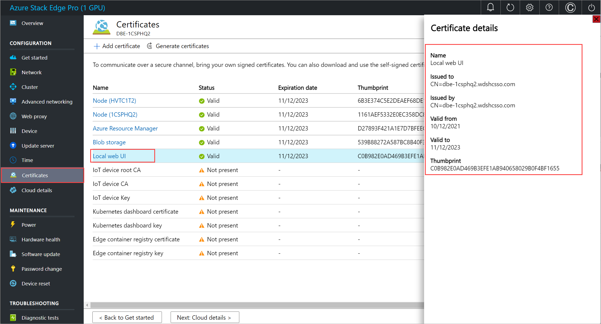

    - The **Download** column is now populated. This column has links to download the regenerated certificates. 

        

4. Select the download link for a certificate and when prompted, save the certificate. 

    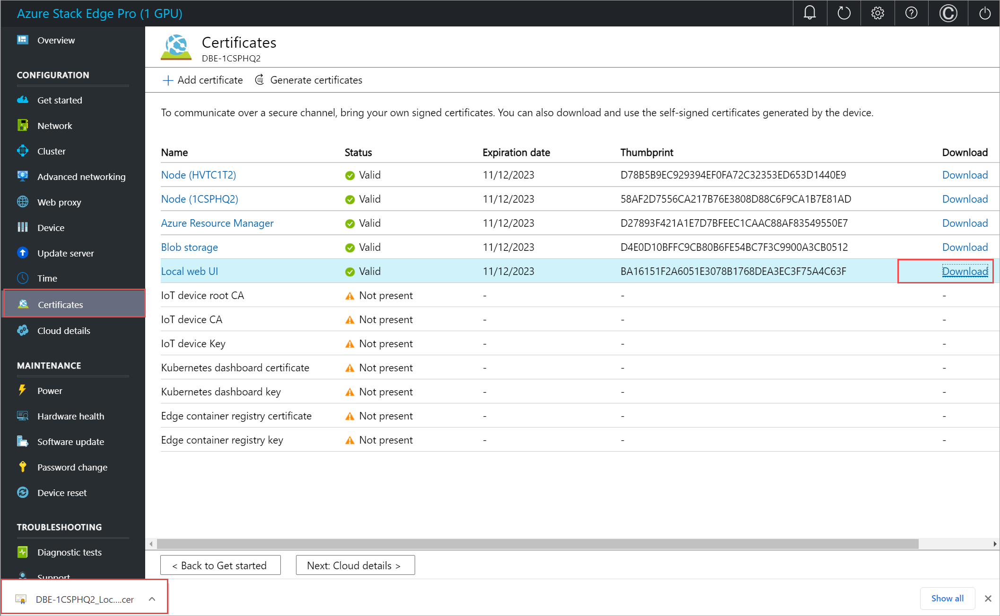

5. Repeat this process for all the certificates that you wish to download. 
    
    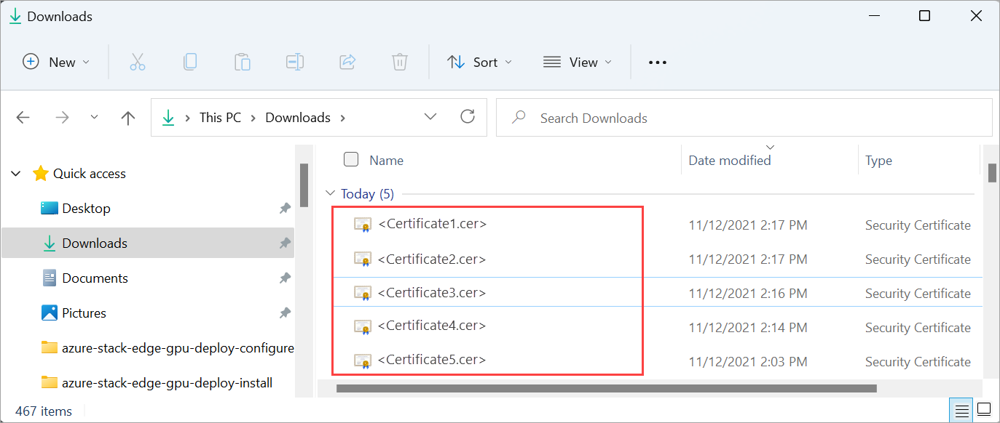

::: zone-end

The device generated certificates are saved as DER certificates with the following name format: 

- `<Device name>_<Endpoint name>.cer`

These certificates contain the public key for the corresponding certificates installed on the device. 

You will need to install these certificates on the client system that you are using to access the endpoints on the Azure Stack Edge device. These certificates establish trust between the client and the device.

To import and install these certificates on the client that you are using to access the device, follow the steps in [Import certificates on the clients accessing your Azure Stack Edge Pro GPU device](azure-stack-edge-gpu-manage-certificates.md#import-certificates-on-the-client-accessing-the-device). 

If using Azure Storage Explorer, you will need to install certificates on your client in PEM format and you will need to convert the device generated certificates into PEM format. 

> [!IMPORTANT]
> - The download link is only available for the device generated certificates and not if you bring your own certificates.
> - You can decide to have a mix of device generated certificates and bring your own certificates as long as other certificate requirements are met. For more information, go to [Certificate requirements](azure-stack-edge-gpu-certificate-requirements.md).
    

## Bring your own certificates

You can bring your own certificates. 

- Start by understanding the [Types of certificates that can be used with your Azure Stack Edge device](azure-stack-edge-gpu-certificates-overview.md).
- Next, review the [Certificate requirements for each type of certificate](azure-stack-edge-gpu-certificate-requirements.md).
- You can then [Create your certificates via Azure PowerShell](azure-stack-edge-gpu-create-certificates-powershell.md) or [Create your certificates via Readiness Checker tool](azure-stack-edge-gpu-create-certificates-tool.md).
- Finally, [Convert the certificates to appropriate format](azure-stack-edge-gpu-prepare-certificates-device-upload.md) so that they are ready to upload on to your device.

Follow these steps to upload your own certificates including the signing chain.

1. To upload certificate, on the **Certificate** page, select **+ Add certificate**.

    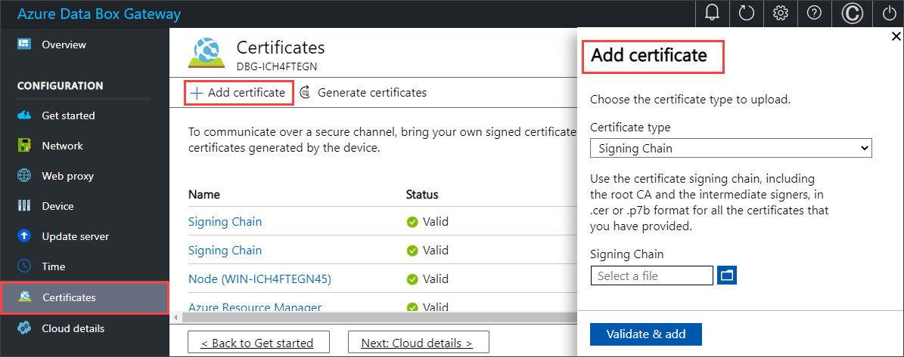

2. You can skip this step if you included all certificates in the certificate path when you [exported certificates in .pfx format](azure-stack-edge-gpu-prepare-certificates-device-upload.md#export-certificates-as-pfx-format-with-private-key). If you didn't include all certificates in your export, upload the signing chain, and then select **Validate & add**. You need to do this before you upload your other certificates.

    In some cases, you may want to bring a signing chain alone for other purposes - for example, to connect to your update server for Windows Server Update Services (WSUS).

    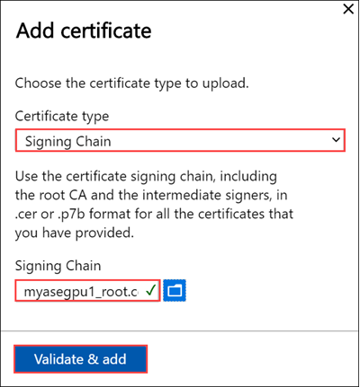

3. Upload other certificates. For example, you can upload the Azure Resource Manager and Blob storage endpoint certificates.

    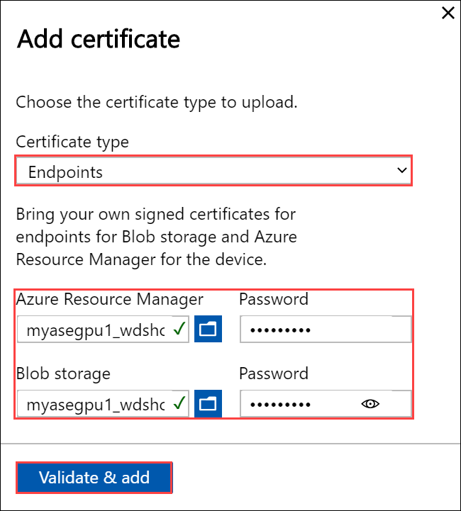

    You can also upload the local web UI certificate. After you upload this certificate, you will be required to start your browser and clear the cache. You will then need to connect to the device local web UI.  

    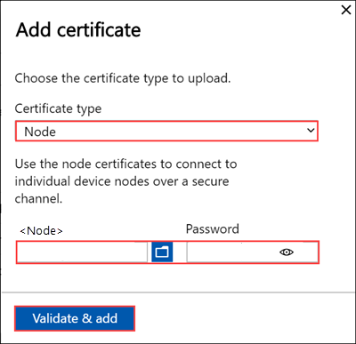

    You can also upload the node certificate.

    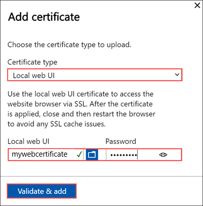

    At any time, you can select a certificate and view the details to ensure that these match with the certificate that you uploaded.

    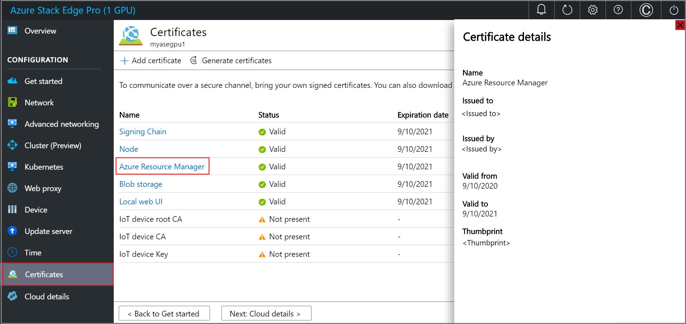

    The certificate page should update to reflect the newly added certificates.

    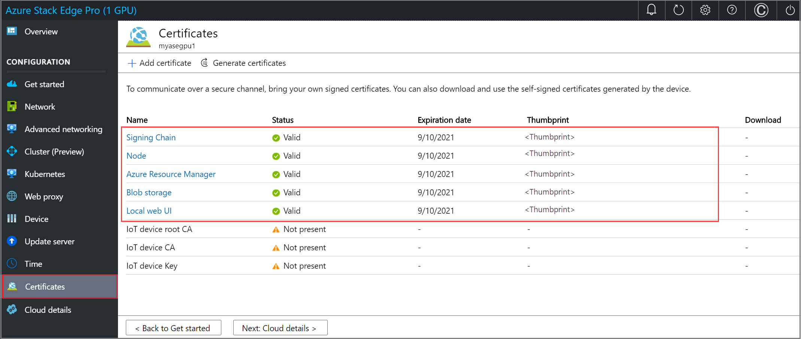  

    > [!NOTE]
    > Except for Azure public cloud, signing chain certificates are needed to be brought in before activation for all cloud configurations (Azure Government or Azure Stack).

Your device is now ready to be activated. Select **< Back to Get started**.

## Next steps

In this tutorial, you learn about:

> [!div class="checklist"]
>
> * Prerequisites
> * Configure certificates for the physical device

To learn how to activate your Azure Stack Edge Pro GPU device, see:

> [!div class="nextstepaction"]
> [Activate Azure Stack Edge Pro GPU device](./azure-stack-edge-gpu-deploy-activate.md)
