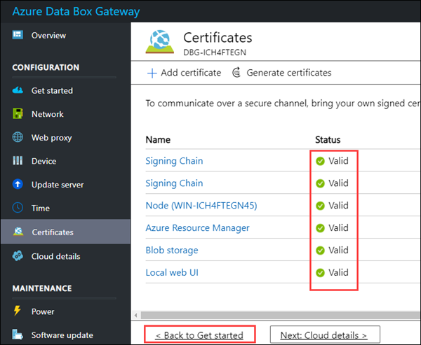
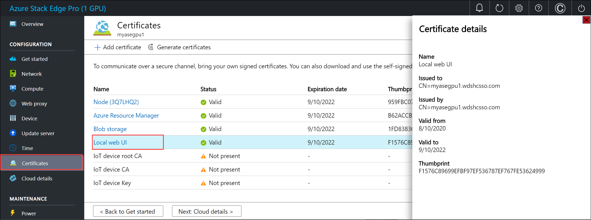
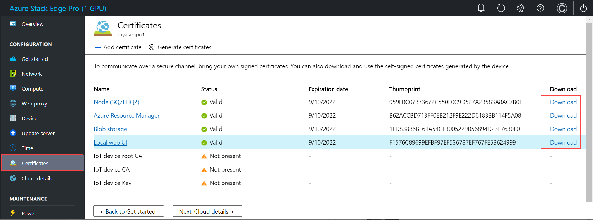

# Tutorial: Configure certificates for your Azure Stack Edge Pro with GPU

This tutorial describes how to configure certificates for your Azure Stack Edge Pro with device onboard GPU using the local web UI.

The time taken for this step will vary depending on the option you choose and how the certificate flow is established in your environment.

> [!NOTE]
> If you didn't change the device name or DNS domain when you [configured device settings earlier](azure-stack-edge-gpu-deploy-set-up-device-update-time.md#configure-device-settings), and you don't want to use your own certificates, you can skip this step. The device has automatically generated self-signed certificates. You're ready to [Activate your device](azure-stack-edge-gpu-deploy-activate.md).

In this tutorial, you learn about:

> [!div class="checklist"]
>
> * Prerequisites
> * Configure certificates for the physical device

## Prerequisites

Before you configure and set up your Azure Stack Edge Pro device with GPU, make sure that:

* You've installed the physical device as described in [Install Azure Stack Edge Pro GPU](azure-stack-edge-gpu-deploy-install.md).
* If you plan to bring your own certificates:
    - You've prepared your certificates, including the signing chain certificate, in the required format. For steps, see [Manage certificates](azure-stack-edge-gpu-manage-certificates.md)
    - If you're deploying your device in the Azure Government cloud instead of the Azure public cloud, a signing chain certificate is required before you can activate your device.
    <!--DO WE NEED TO PROVIDE THIS LINK TWICE IN THIS SECTION?--For details on certificates, go to [Manage certificates](azure-stack-edge-gpu-manage-certificates.md).-->

## Configure certificates for device

Use the following steps to configure certificates for your Azure Stack Edge Pro GPU device:

1. Open the **Certificates** page in the local web UI of your device.<!--THE REST IS NOT NEEDED? - , you will configure your certificates. Depending on whether you changed the device name or the DNS domain in the **Device** page, you can choose one of the following options for your certificates.-->

     <!-- REPLACED by a note in the introduction. - If you didn't change the device name or DNS domain when you configured your device, and you don't want to use your own certificates, you can skip this step. The device has automatically generated self-signed certificates to begin with. You're ready to [Activate your device](azure-stack-edge-gpu-deploy-activate.md).-->

     

     If you've changed the device name or DNS domain for your device, the status of certificates will be **Not valid**. That's because the device name and DNS domain in the certificates' `subject name` and `subject alternative` settings are out of date.<!--Sentence 2 explanation was moved up from below.-->

     

     You can select a certificate to view status details.

       

2. To use a new set of certificates on your device, choose one of the following options:
    
     - **Generate all the device certificates**. Select this option, and then complete the steps in [Generate device certificates](#generate-device-certificates), if you plan to use automatically generated device certificates and need to generate new device certificates. You should only use these device certificates for testing, not with production workloads.

     - **Bring your own certificates**. Select this option, and then do the steps in [Bring your own certificates](#bring-your-own-certificates), if you want to use your own signed endpoint certificates and the corresponding signing chains. **We recommend that you always bring your own certificates for production workloads.**
    
     - You can choose to bring some of your own certificates and generate some device certificates. The **Generate all the device certificates** option only regenerates the device certificates.<!--1) It's not clear which certificates are "device certificates" and which can be added to the device certificates. Current explanation is slightly contradictory. Can we fix this? 2) Ideally, we should frame this as a very simple set of substeps. This is doable if we can clearly distinguish between device certs automatically generated and the additional certs they  could bring.-->

    > [!NOTE]
    > If you've changed the device name or DNS domain of your device, and you don't provide new certificates, **activation of the device will be blocked**.

3. When you have a full set of valid certificates for your device, the device is ready for activation. Select **< Back to Get started** to proceed to the next deployment step, [Activate your device](azure-stack-edge-gpu-deploy-activate.md).

       

## Generate device certificates

Use this procedure if you're using the device certificates that are generated automatically on your Azure Stack Edge device and you need to generate new certificates. For example, if you change the device name or domain name server (DNS) domain for your device, you'll need to generate new certificates.<!--Lead rewritten. Verify the context.-->

To regenerate and download device certificates for your device, do these steps:

1. In the local web UI of your device, go to **CONFIGURATION > Certificates**. Select **Generate certificates**.

    

2. On the **Generate device certificates** pane, select **Generate**.

    

    The device certificates are now generated and applied. It takes a few minutes to generate and apply the certificates.

    > [!IMPORTANT]
    > While the certificate generation operation is in progress, do not bring your own certificates and try to add those via the **+ Add certificate** option.

    You are notified when the operation is successfully completed. **To avoid any potential cache issues, restart your browser.**
    
    

3. After the certificates are generated: 

    - The status of all the certificates shows as **Valid**. 

        

    - You can select a specific certificate name, and view the certificate details. 

        

    - The **Download** column is now populated. This column has links to download the regenerated certificates. 

        

4. Select the download link for a certificate and, when prompted, save the certificate.

    

5. Repeat this process for all the certificates that you wish to download.

    

    The device-generated certificates are saved as DER certificates with the following name format: 

    `<Device name>_<Endpoint name>.cer`. These certificates contain the public key for the corresponding certificates installed on the device. 

You'll need to install these certificates on the client that you're using to access the endpoints on the Azure Stack Edge device. These certificates establish trust between the client and the device. Follow the steps in [Import certificates on the clients accessing your Azure Stack Edge Pro GPU device](azure-stack-edge-gpu-manage-certificates.md#import-certificates-on-the-client-accessing-the-device).

If you're using Azure Storage Explorer, you'll need to install certificates on your client in PEM format, and you'll' need to convert the device-generated certificates into PEM format.

> [!IMPORTANT]
> - The download link is only available for device-generated certificates. It's not available if you bring your own certificates.
> - You can decide to have a mix of device-generated certificates and bring your own certificates as long as other certificate requirements are met. For more information, go to [Certificate requirements](azure-stack-edge-gpu-certificate-requirements.md).

## Bring your own certificates

To use your own certificates instead the automatically generated device certificates with your Azure Stack Edge device, use the following procedures.

### Prepare your certificates

Complete these steps to prepare your certificates for upload to the device:

1. Understand certificate requirements:
    - [Review the types of certificates to use with your Azure Stack Edge device](azure-stack-edge-gpu-certificates-overview.md).
    - [Review certificate requirements for each certificate type](azure-stack-edge-gpu-certificate-requirements.md).
2. [Create your certificates via Azure PowerShell](azure-stack-edge-gpu-create-certificates-powershell.md), or [use the Readiness Checker tool](azure-stack-edge-gpu-create-certificates-tool.md).
3. [Convert the certificates to the required format](azure-stack-edge-gpu-prepare-certificates-device-upload.md).

### Upload your certificates to the device

To upload your own certificates to your device, do these steps:

1. To upload a certificate, on the **Certificates** page of the local web UI, select **+ Add certificate**. Then use the **Add certificate** pane to upload your certificate.

    

2. If you didn't include all certificates in the certification path when you exported certificates, upload the **Signing Chain** certificate chain first using the Browse button by **Signing Chain**. Then select **Validate & add**.

    If you included all certificates in your export, you can skip this step. For more information, see [Export certificates as .pfx format with private key](azure-stack-edge-gpu-prepare-certificates-device-upload.md#export-certificates-as-pfx-format-with-private-key).

    

3. Upload your remaining certificates.

    After you select a certificate type, use the **Add certificates** pane to upload each certificate and provide the password that you assigned when you exported the certificate. Then select **Validate & add** to add the certificates to the device. 

    - Select the **Endpoints** certificate type, and add a certificate for each endpoint that the device exposes. For example, upload the Azure Resource Manager and Blob storage endpoint certificates.

      

    - Select the **Local web UI** certificate type, and add the certificate you'll use to access the local web UI via a browser. 
    
      After you upload this certificate, you'll need to start your browser and clear the cache. You'll then need to connect to the device local web UI.  

      

    - On a multi-node device, select the **Node** certificate type, and add the certificate(s) you'll use to establish a trust relationship among nodes.<!--Verify description.-->

      

4. As you add certificates, the **Certificates** page shows the newly added certificates.

      

    At any time, you can select a certificate and view the details to ensure that these match with the certificate that you uploaded.

    

    > [!NOTE]
    > Except for Azure public cloud, signing chain certificates must be brought in before activation for all cloud configurations (Azure Government or Azure Stack).

<!--REPLACED by a new, final step in the main procedure. - When you finish [regenerating device certificates](#generate-device-certificates), if needed, or [adding your own certificates](#bring-your-own-certificates), you're ready to activate your device. Select **< Back to Get started** and proceed.-->

## Next steps

In this tutorial, you learn about:

> [!div class="checklist"]
>
> * Prerequisites
> * Configure certificates for the physical device

To learn how to activate your Azure Stack Edge Pro GPU device, see:

> [!div class="nextstepaction"]
> [Activate Azure Stack Edge Pro GPU device](./azure-stack-edge-gpu-deploy-activate.md)
