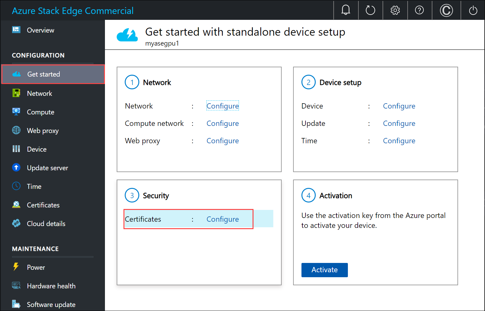

# Tutorial: Configure certificates for your Azure Stack Edge with GPU

This tutorial describes how you can configure certificates for your Azure Stack Edge device with an onboard GPU by using the local web UI.

The time taken for this step can vary depending on the specific option you choose and how the certificate flow is established in your environment.

In this tutorial, you learn about:

> [!div class="checklist"]
>
> * Prerequisites
> * Configure certificates for the physical device

## Prerequisites

Before you configure and set up your Azure Stack Edge device with GPU, make sure that:

* You've installed the physical device as detailed in [Install Azure Stack Edge](azure-stack-edge-gpu-deploy-install.md).
* If you plan to bring your own certificates:
    - You should have your certificates ready in the appropriate format including the signing chain certificate.
<!--    - If your device is deployed in Azure Government or Azure Government Secret or Azure Government top secret cloud and not deployed in Azure public cloud, a signing chain certificate is required before you can activate your device. 
    For details on certificate, go to [Manage certificates](azure-stack-edge-j-series-manage-certificates.md).-->

## Configure certificates for device

1. On the **Security** tile, select **Configure** for certificates. 

    

2. Depending on whether you changed the device name or the DNS domain in the **Device setup** tile, you can choose one of the following options for your certificates.

    - If you have not changed the device name or the DNS domain in the earlier step and do not wish to bring your own certificates, then you can skip this step and proceed to the next step. The device has automatically generated self-signed certificates to begin with. 

        

    - If you changed the device name or DNS domain, then to successfully activate your device, you can choose one of the following options: 
    
        - **Generate all the device certificates**. The device certificates should only be used for testing and not used with production workloads.** For more information, go to [Generate device certificates on your Azure Stack Edge](#generate-device-certificates).

        - **Bring your own certificates**. You can bring your own signed endpoint certificates and the corresponding signing chains. You first add the signing chain and then upload the endpoint certificates. **We recommend that you always bring your own certificates for production workloads.** For more information, go to [Bring your own certificates on your Azure Stack Edge device](#bring-your-own-certificates).
    
        - You can bring some of your own certificates and generate some device certificates. The **Generate certificates** option will only regenerate the device certificates.

    - If you changed the device name or DNS domain, and you do not generate certificates or bring your own certificates, then the activation will be blocked.

### Generate device certificates

Follow these steps to generate device certificates.

Use these steps to regenerate and download the Azure Stack Edge device certificates:

1. In the local UI of your device, go to **Configuration > Certificates**. Select **Generate certificates**.

    

2. In the **Generate device certificates**, select **Generate**.

    

    The device certificates are now generated and applied. 
    
    > [!IMPORTANT]
    > While the certificate generation operation is in progress, do not bring your own certificates and try to add those via the **+ Add certificate** option.

    You are notified when the operation is successfully completed. To avoid any potential cache issues, restart your browser. 
    
    

3. In the **Certificates** page, you will see the **Download** column is now populated and links to download the regenerated certificates are available. 

    

4. Select the download link for a certificate and when prompted, save the certificate. 

    

5. Repeat this process for all the certificates that you wish to download. 
    
    

    The device generated certificates are saved as DER certificates with the following name format: 

    `<Device name>_<Endpoint name>.cer`. These certificates contain the public key for the corresponding certificates installed on the device. 

You will need to install these certificates on the client system that you are using to access the endpoints on the ASE device. These certificates establish trust between the client and the device.

To import and install these certificates on the client that you are using to access the device, follow the steps in [Import certificates on the clients accessing your Azure Stack Edge device](azure-stack-edge-j-series-manage-certificates.md#import-certificates-on-the-client-accessing-the-device). 

If using Azure Storage Explorer, you will need to install certificates on your client in PEM format and you will need to convert the device generated certificates into PEM format. 

> [!IMPORTANT]
> - The download link is only available for the device generated certificates and not if you bring your own certificates.
> - You can decide to have a mix of device generated certificates and bring your own certificates as long as other certificate requirements are met. For more information, go to [Certificate requirements](azure-stack-edge-j-series-certificate-requirements.md).
    

### Bring your own certificates

Follow these steps to add your own certificates including the signing chain.

1. To upload certificate, on the **Certificate** page, select **+ Add certificate**.

    

2. Upload the signing chain first and select **Validate & add**.

    

3. Now you can upload other certificates. For example, you can upload the Azure Resource Manager and Blob storage endpoint certificates.

    

    You can also upload the local web UI certificate. After you upload this certificate, you will be required to start your browser and clear the cache. You will then need to connect to the device local web UI.  

    

    You can also upload the node certificate.

    

    The certificate page should update to reflect the newly added certificates.

      

    > [!NOTE]
    > Except for Azure public cloud, signing chain certificates are needed to be brought in before activation for all cloud configurations (Azure Government or Azure Stack).

Your device is now ready to be activated.

## Next steps

In this tutorial, you learn about:

> [!div class="checklist"]
>
> * Prerequisites
> * Configure certificates for the physical device

To learn how to activate your Azure Stack Edge device, see:

> [!div class="nextstepaction"]
> [Activate Azure Stack Edge device](./azure-stack-edge-gpu-deploy-activate.md)
