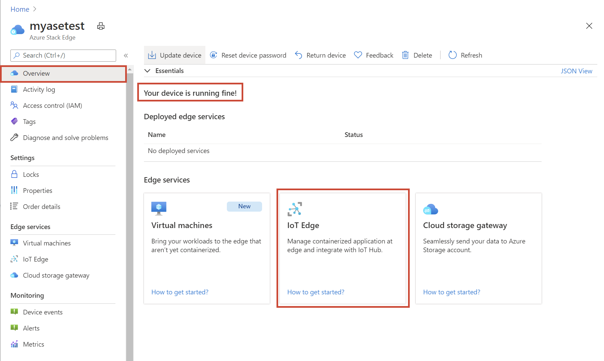
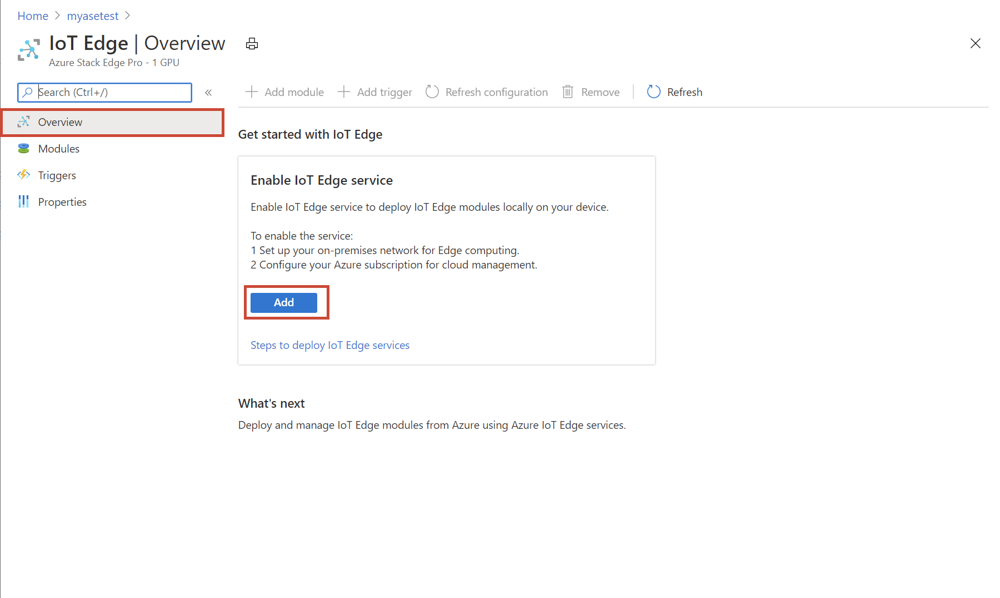
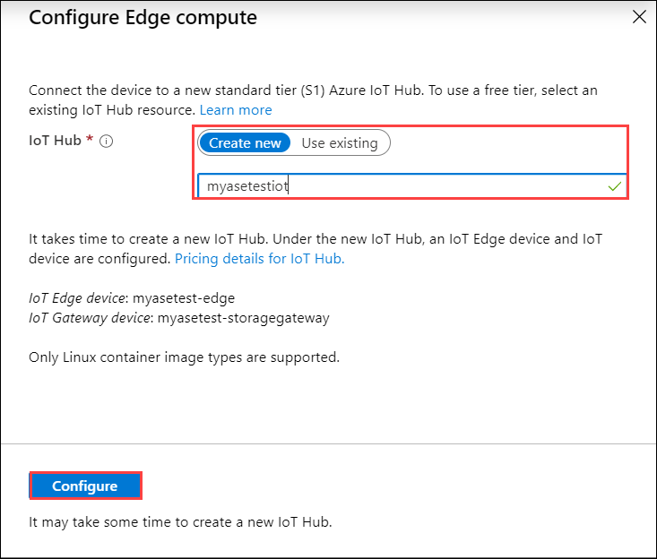
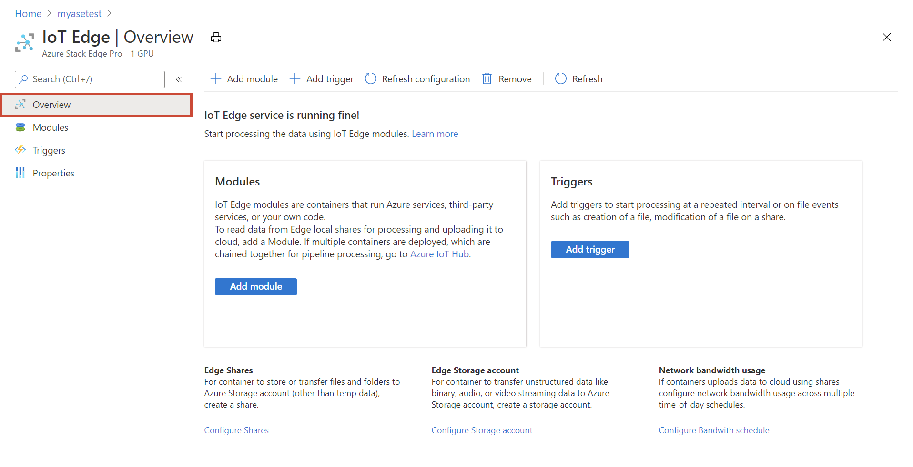
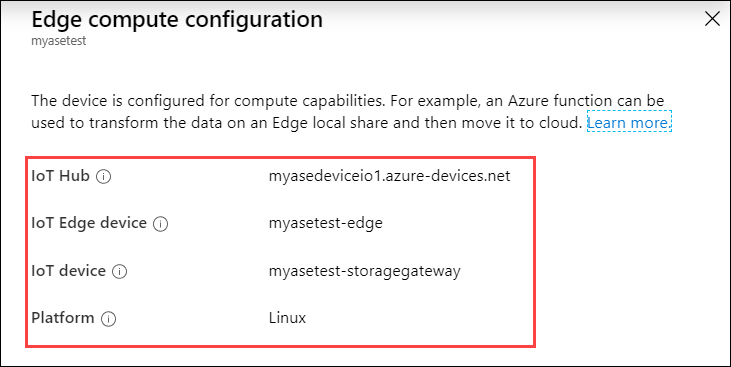

# Tutorial: Configure compute on Azure Stack Edge Pro GPU device

<!--[!INCLUDE [applies-to-skus](../../includes/azure-stack-edge-applies-to-all-sku.md)]-->

This tutorial describes how to configure a compute role and create a Kubernetes cluster on your Azure Stack Edge Pro device. 

This procedure can take around 20 to 30 minutes to complete.

In this tutorial, you learn how to:

> [!div class="checklist"]
> * Configure compute
> * Get Kubernetes endpoints

 
## Prerequisites

Before you set up a compute role on your Azure Stack Edge Pro device, make sure that:

- You've activated your Azure Stack Edge Pro device as described in [Activate Azure Stack Edge Pro](azure-stack-edge-gpu-deploy-activate.md).
- Make sure that you've followed the instructions in [Enable compute network](azure-stack-edge-gpu-deploy-configure-network-compute-web-proxy.md#enable-compute-network) and:
    - Enabled a network interface for compute.
    - Assigned Kubernetes node IPs and Kubernetes external service IPs.

## Configure compute

To configure compute on your Azure Stack Edge Pro, you'll create an IoT Hub resource via the Azure portal.

1. In the Azure portal of your Azure Stack Edge resource, go to **Overview**. In the right-pane, on the **Compute** tile, select **Get started**.

    

2. On the **Configure Edge compute** tile, select **Configure compute**.

    

3. On the **Configure Edge compute** blade, input the following:

   
    |Field  |Value  |
    |---------|---------|
    |IoT Hub     | Choose from **New** or **Existing**.   By default, a Standard tier (S1) is used to create an IoT resource. To use a free tier IoT resource, create one and then select the existing resource.   In each case, the IoT Hub resource uses the same subscription and resource group that is used by the Azure Stack Edge resource.     |
    |Name     |Enter a name for your IoT Hub resource.         |

    

4. Select **Create**. The IoT Hub resource creation takes several minutes. After the IoT Hub resource is created, the **Configure compute** tile updates to show the compute configuration. 

    

5. To confirm that the Edge compute role has been configured, select **View Compute** on the **Configure compute** tile.
    
    

    > [!NOTE]
    > If the **Configure Compute** dialog is closed before the IoT Hub is associated with the Azure Stack Edge Pro device, the IoT Hub gets created but is not shown in the compute configuration. 
    
When the Edge compute role is set up on the Edge device, it creates two devices: an IoT device and an IoT Edge device. Both devices can be viewed in the IoT Hub resource. An IoT Edge Runtime is also running on this IoT Edge device. At this point, only the Linux platform is available for your IoT Edge device.

It can take 20-30 minutes to configure compute since behind the scenes, virtual machines and Kubernetes cluster are being created. 

After you have successfully configured the compute in Azure portal, a Kubernetes cluster and a default user associated with the IoT namespace (a system namespace controlled by Azure Stack Edge Pro) exist. 

## Get Kubernetes endpoints

To configure a client to access Kubernetes cluster, you will need the Kubernetes endpoint. Follow these steps to get Kubernetes API endpoint from the local UI of your Azure Stack Edge Pro device.

1. In the local web UI of your device, go to **Devices** page.
2. Under the **Device endpoints**, copy the **Kubernetes API service** endpoint. This endpoint is a string in the following format: `https://compute.<device-name>.<DNS-domain>[Kubernetes-cluster-IP-address]`. 

    

3. Save the endpoint string. You will use this later when configuring a client to access the Kubernetes cluster via kubectl.

4. While you are in the local web UI, you can:

    - Go to Kubernetes API, select **advanced settings** and download an advanced configuration file for Kubernetes. 

        

        If you have been provided a key from Microsoft (select users may have this), then you can use this config file.

        

    - You can also go to **Kubernetes dashboard** endpoint and download an `aseuser` config file. 
    
        

        You can use this config file to sign into the Kubernetes dashboard or debug any issues in your Kubernetes cluster. For more information, see [Access Kubernetes dashboard](azure-stack-edge-gpu-monitor-kubernetes-dashboard.md#access-dashboard). 

## Next steps

In this tutorial, you learned how to:

> [!div class="checklist"]
> * Configure compute
> * Get Kubernetes endpoints

To learn how to administer your Azure Stack Edge Pro device, see:

> [!div class="nextstepaction"]
> [Use local web UI to administer an Azure Stack Edge Pro](azure-stack-edge-manage-access-power-connectivity-mode.md)
