# Tutorial: Configure network for Azure Stack Edge Pro with GPU

::: zone pivot="single-node"

This tutorial describes how to configure network for your Azure Stack Edge Pro device with an onboard GPU by using the local web UI.

The connection process can take around 20 minutes to complete.

::: zone-end

::: zone pivot="two-node"

This tutorial describes how to configure network for your two-node Azure Stack Edge Pro GPU device by using the local web UI.

The procedure can take around 45 minutes to complete.

::: zone-end

In this tutorial, you learn about:

::: zone pivot="single-node"

> [!div class="checklist"]
> * Prerequisites
> * Configure network
> * Enable compute network
> * Configure web proxy

::: zone-end

::: zone pivot="two-node"

> [!div class="checklist"]
> * Prerequisites
> * Select device setup type
> * Configure network
> * Get authentication token
> * Configure cluster
> * Configure virtual IP
> * Configure advanced networking
> * Configure web proxy

::: zone-end

## Prerequisites

Before you configure and set up your Azure Stack Edge Pro device with GPU, make sure that:

* You've installed the physical device as detailed in [Install Azure Stack Edge Pro](azure-stack-edge-gpu-deploy-install.md).
* You've connected to the local web UI of the device as detailed in [Connect to Azure Stack Edge Pro](azure-stack-edge-gpu-deploy-connect.md)

::: zone pivot="two-node"

## Configure setup type

::: zone pivot="single-node"
1. Go to the **Get started** page.
1. In the **Set up a single node device** tile, select **Start**.

       

::: zone-end

::: zone pivot="two-node"

1. In the local UI for one of the devices, go to the **Get started** page.
1. In the **Set up a 2-node cluster** tile, select **Start**.

    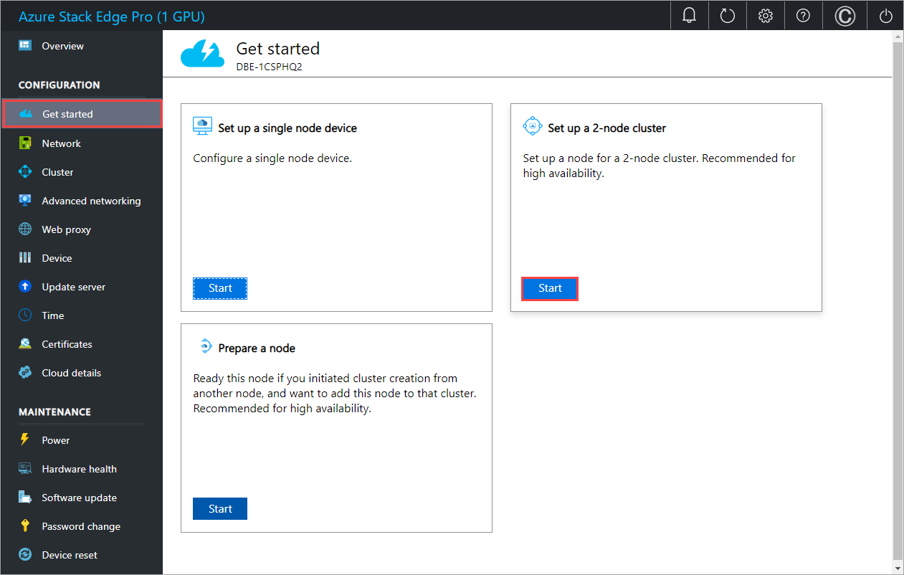 

1. In the local UI for the second device, go to the **Get started** page.
1. In the **Prepare a node** tile, select **Start**.

    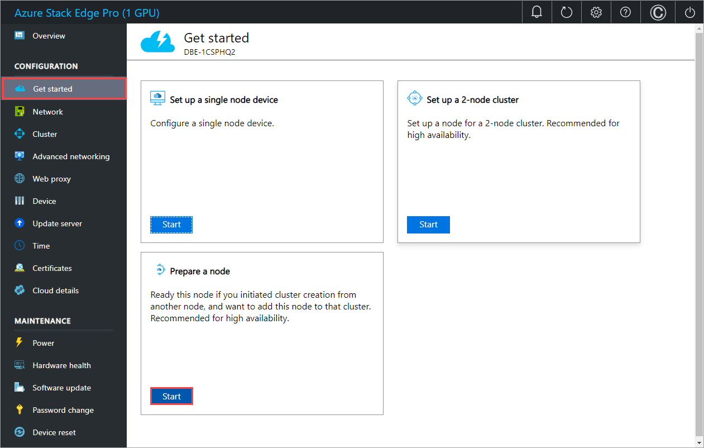 

::: zone-end

::: zone pivot="single-node"

## Configure network

Your **Get started** page displays the various settings that are required to configure and activate the physical device with the Azure Stack Edge service. 

Follow these steps to configure the network for your device.

1. In the local web UI of your device, go to the **Get started** page. 

2. On the **Network** tile, select **Configure**.  
    
    

    On your physical device, there are six network interfaces. PORT 1 and PORT 2 are 1-Gbps network interfaces. PORT 3, PORT 4, PORT 5, and PORT 6 are all 25-Gbps network interfaces that can also serve as 10-Gbps network interfaces. PORT 1 is automatically configured as a management-only port, and PORT 2 to PORT 6 are all data ports. For a new device, the **Network settings** page is as shown below.
    
    

3. To change the network settings, select a port and in the right pane that appears, modify the IP address, subnet, gateway, primary DNS, and secondary DNS. 

    - If you select Port 1, you can see that it is preconfigured as static. 

        

    - If you select Port 2, Port 3, Port 4, or Port 5, all of these ports are configured as DHCP by default.

        

    As you configure the network settings, keep in mind:

    * Make sure that Port 5 and Port 6 are connected for Network Function Manager deployments. For more information, see [Tutorial: Deploy network functions on Azure Stack Edge (Preview)](../network-function-manager/deploy-functions.md).
    * If DHCP is enabled in your environment, network interfaces are automatically configured. An IP address, subnet, gateway, and DNS are automatically assigned.
    * If DHCP isn't enabled, you can assign static IPs if needed.
    * You can configure your network interface as IPv4.
    * On 25-Gbps interfaces, you can set the RDMA (Remote Direct Access Memory) mode to iWarp or RoCE (RDMA over Converged Ethernet). Where low latencies are the primary requirement and scalability is not a concern, use RoCE. When latency is a key requirement, but ease-of-use and scalability are also high priorities, iWARP is the best candidate.
    * Network Interface Card (NIC) Teaming or link aggregation is not supported with Azure Stack Edge. <!--NIC teaming should work for 2-node-->
    * Serial number for any port corresponds to the node serial number.

    Once the device network is configured, the page updates as shown below.

    

     > [!NOTE]
     > We recommend that you do not switch the local IP address of the network interface from static to DCHP, unless you have another IP address to connect to the device. If using one network interface and you switch to DHCP, there would be no way to determine the DHCP address. If you want to change to a DHCP address, wait until after the device has activated with the service, and then change. You can then view the IPs of all the adapters in the **Device properties** in the Azure portal for your service.

    After you have configured and applied the network settings, select **Next: Compute** to configure compute network.

::: zone-end

::: zone pivot="two-node"

## Configure network

You'll configure network on both nodes. These steps can be done in parallel. The cabling on both nodes should be identical and should conform with the network topology you choose.

### Configure network on first node

To configure the network for a 2-node device, follow these steps on the first node of the device:

1. In the local UI of the first node, in the **Network** tile, select **Needs setup**. 

    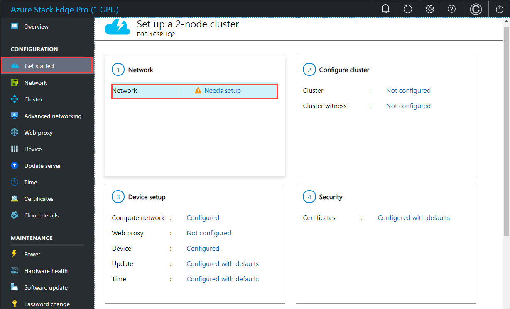

1. In the **Network** page, choose the topology for cluster and the storage traffic between nodes from the following options: 

    - **Switchless**. Use this option when high-speed switches aren't available for storage and clustering traffic.
    - **Use switches and NIC teaming**. Use this option when you need port level redundancy through teaming. NIC Teaming allows you to group two physical ports on the device node, Port 3 and Port 4 in this case, into two software-based virtual network interfaces. These teamed network interfaces provide fast performance and fault tolerance in the event of a network interface failure. For more information, see [NIC teaming on Windows Server](/windows-server/networking/technologies/nic-teaming/nic-teaming).
    - **Use switches without NIC teaming**. Use this option if you need an extra port for workload traffic and port level redundancy is not required.

    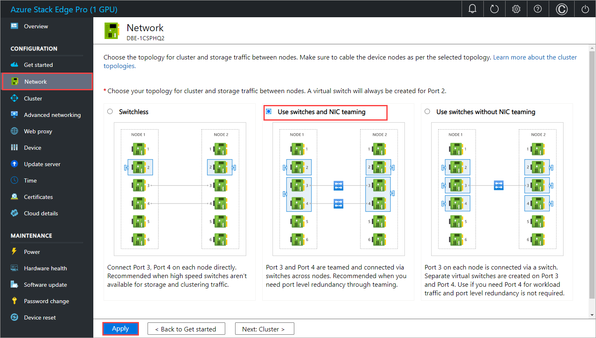

1. Make sure that your node is cabled as per the selected topology.
1. Select **Apply**.
1. You'll see a **Confirm network setting** dialog. This dialog reminds you to make sure that your node is cabled as per the network topology you selected. Once you choose the network cluster topology, you can't change this topology with a device reset. Select **Yes** to confirm the network setting. The network setting takes a few minutes to apply and you see a notification when the network settings are successfully applied.

    

1. Once the network settings are applied, the **Network** page updates. For example, if you selected network topology that uses switches and NIC teaming, you will see that on a device node, a virtual switch is created at Port 2 and another virtual switch is created on Port 3 and Port 4. Port 3 and Port 4 are teamed and then on the teamed network interface, two virtual network interfaces are created, **vPort3** and **vPort4**. The same is true for the second device node. The teamed NICs are then connected via switches.

    

### Configure network on second node

You'll now prepare the second node for clustering. You'll first need to configure the network. Follow these steps in the local UI of the second node:

1. On the **Prepare a node for clustering** page, in the **Network** tile, select **Needs setup**.

    

1. Make sure that the second node is cabled as per the topology you selected for the first node. In the **Network** page, choose and **Apply** the same topology that you selected for the first node.

    

1. Select **Back to get started**.

## Get authentication token

You'll now get the authentication token that will be needed when adding this node to form a cluster. Follow these steps in the local UI of the second node:

1. On the **Prepare a node for clustering** page, in the **Get authentication token** tile, select **Prepare node**.

    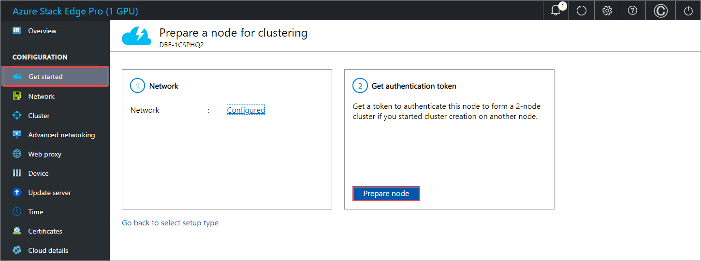

1. Select **Get token**.
1. Copy the node serial number and the authentication token. You will use this information when you add this node to the cluster on the first node.

    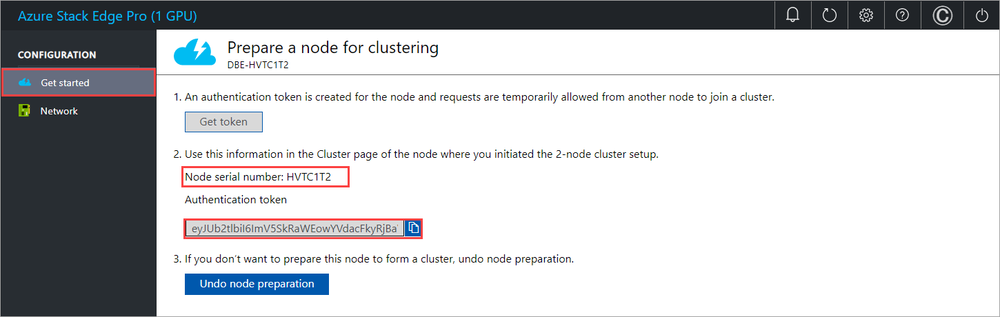

## Configure cluster 

To configure the cluster, you'll need to establish a cluster witness and then add a prepared node. You'll also need to configure virtual IP settings so that you can connect to a cluster as opposed to a specific node.

### Configure cluster witness

You'll now create a cluster witness. A cluster witness helps establish quorum for a two-node device if a node goes down. To learn about quorum, see [Understanding quorum](windows-server/failover-clustering/manage-cluster-quorum#understanding-quorum). 

A cluster witness can be: 

- **Cloud witness** if you use an Azure Storage account to provide a vote on cluster quorum. A cloud witness uses Azure Blob Storage to read or write a blob file and then uses it to arbitrate in split-brain resolution. 

    Use cloud witness when you have internet access. For more information on cloud witness, see [Deploy a cloud witness for Failover cluster](windows-server/failover-clustering/deploy-cloud-witness).
- **File share witness** if you use a local SMB file share to provide a vote in the cluster quorum. Use a file share witness if all the servers in a cluster have spotty internet connectivity or can't use disk witness as there aren't any shared drives. 

    Use file share witness if you're in an IT environment with other machines and file shares. For more information on file share witness, see [Deploy a file share witness for Failover cluster](/windows-server/failover-clustering/file-share-witness).

Before you create a cluster witness, make sure that you've reviewed the cluster witness requirements.

Follow these steps to configure the cluster witness.

#### Configure cloud witness

1. In the local UI of the first node, go to the **Cluster** page. Under **Cluster witness type**, select **Modify**.

    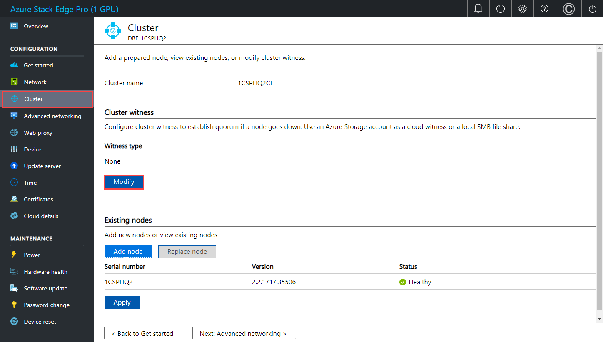

1. In the **Modify cluster witness** blade, enter the following inputs.
    1. Choose the **Witness type** as **Cloud.**
    1. Enter the **Azure Storage account name**.
    1. Specify Storage account authentication from Access key or SAS token.
    1. If you chose Access key as the authentication mechanism, enter the Access key of the Storage account, Azure Storage container where the witness lives, and the service endpoint. 
    1. Select **Apply**.

    

#### Configure local witness

1. In the local UI of the first node, go to the **Cluster** page. Under **Cluster witness type**, select **Modify**.

    

1. In the **Modify cluster witness** blade, enter the following inputs.
    1. Choose the **Witness type** as **Local.**
    1. Enter the file share path as *//server/fileshare* format.
    1. Select **Apply**. 

    

### Add prepared node to cluster

You'll now add the prepared node to the first node and form the cluster. Before you add the prepared node, make sure the networking on the incoming node is configured in the same way as that of this node where you initiated cluster creation.

1. In the local UI of the first node, go to the **Cluster** page. Under **Existing nodes**, select **Add node**.

    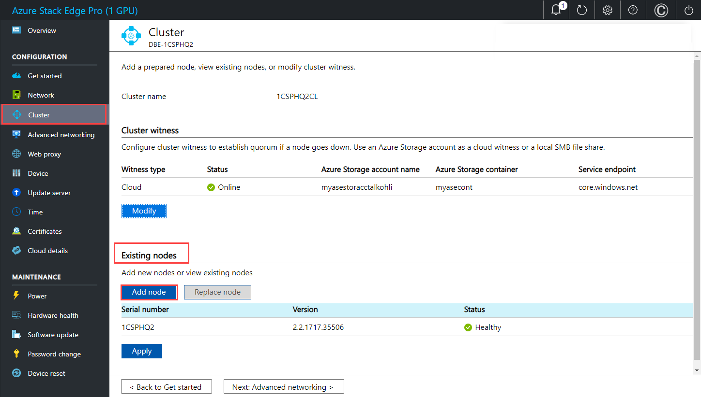

1. In the **Add node** blade, input the following information for the incoming node: 

    1. Provide the serial number for the incoming node.
    1. Enter the authentication token for the incoming node.

1. Select **Validate & add**. This step takes a few minutes. 

    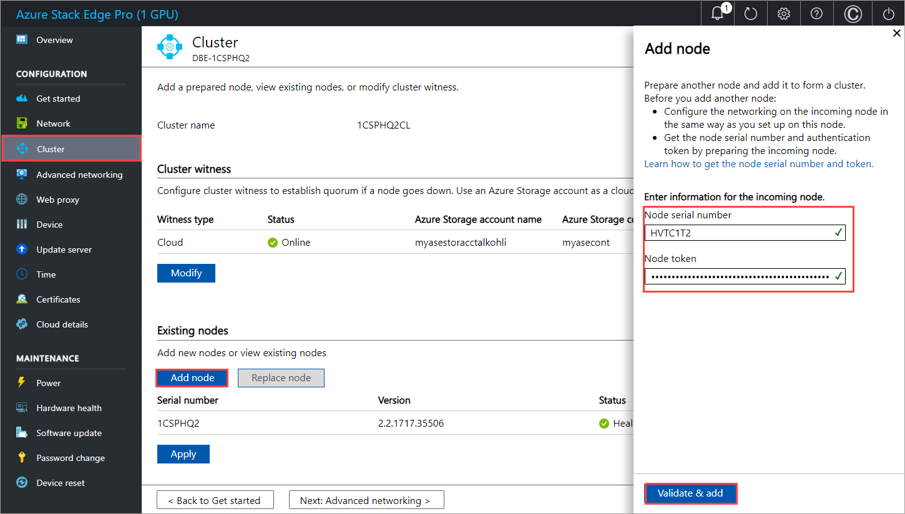

You see a notification when the node is successfully added to the cluster.

## Configure virtual IPs

For Azure consistent services and NFS, you'll also need to define a virtual IP that allows you to connect to a clustered device as opposed to a specific node. A virtual IP is an available IP in the cluster network and any client connecting to the cluster network on the two-node device should be able to access this IP.

### For Azure Consistent Services

For Azure Consistent Services, follow these steps to configure virtual IP.

1. In the local UI on the **Cluster** page, under the **Virtual IP settings** section, select **Azure Consistent Services**. 
1. In the **Virtual IP settings** blade, input the following.

    1. From the dropdown list, select the **Azure Consistent Services network**. 
    1. Choose IP settings from **DHCP** or **static**.
    1. If you chose IP settings as static, enter a virtual IP. This should be a free IP from within the Azure Consistent Services network that you specified. If you selected DHCP, a virtual IP is automatically picked from the Azure Consistent Services network that you selected.
1. Select **Apply**.

### For Network File System

For clients connecting via NFS protocol to the two-node device, follow these steps to configure virtual IP.

1. In the local UI on the **Cluster** page, under the **Virtual IP settings** section, select **Network File System**.
1. In the **Virtual IP settings** blade, input the following.

    1. From the dropdown list, select the **NFS network**.
    1. Choose IP settings from **DHCP** or **Static**.
    1. If you chose IP settings as static, enter a virtual IP. This should be a free IP from within the NFS network that you specified. If you selected DHCP, a virtual IP is automatically picked from the NFS network that you selected.
1. Select **Apply**.

> [!NOTE]
> Virtual IP settings are required. If you do not configure this IP, you will be blocked when configuring the **Device settings** in the next step.

::: zone-end

::: zone pivot="single-node"

## Enable compute network

Follow these steps to enable compute and configure compute network. 

<!--1. Go to the **Get started** page in the local web UI of your device. On the **Network** tile, select **Compute network**.  

    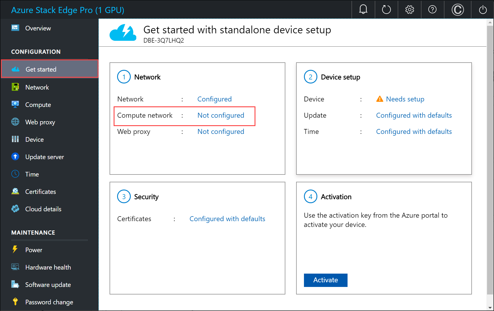-->

1. In the **Compute** page, select a network interface that you want to enable for compute. 

    

1. In the **Network settings** dialog, select **Enable**. When you enable compute, a virtual switch is created on your device on that network interface. The virtual switch is used for the compute infrastructure on the device. 
    
1. Assign **Kubernetes node IPs**. These static IP addresses are for the compute VM.  

    For an *n*-node device, a contiguous range of a minimum of *n+1* IPv4 addresses (or more) are provided for the compute VM using the start and end IP addresses. Given Azure Stack Edge is a 1-node device, a minimum of 2 contiguous IPv4 addresses are provided.

    > [!IMPORTANT]
    > Kubernetes on Azure Stack Edge uses 172.27.0.0/16 subnet for pod and 172.28.0.0/16 subnet for service. Make sure that these are not in use in your network. If these subnets are already in use in your network, you can change these subnets by running the `Set-HcsKubeClusterNetworkInfo` cmdlet from the PowerShell interface of the device. For more information, see [Change Kubernetes pod and service subnets](azure-stack-edge-gpu-connect-powershell-interface.md#change-kubernetes-pod-and-service-subnets).

1. Assign **Kubernetes external service IPs**. These are also the load-balancing IP addresses. These contiguous IP addresses are for services that you want to expose outside of the Kubernetes cluster and you specify the static IP range depending on the number of services exposed. 
    
    > [!IMPORTANT]
    > We strongly recommend that you specify a minimum of 1 IP address for Azure Stack Edge Hub service to access compute modules. You can then optionally specify additional IP addresses for other services/IoT Edge modules (1 per service/module) that need to be accessed from outside the cluster. The service IP addresses can be updated later. 
    
1. Select **Apply**.

    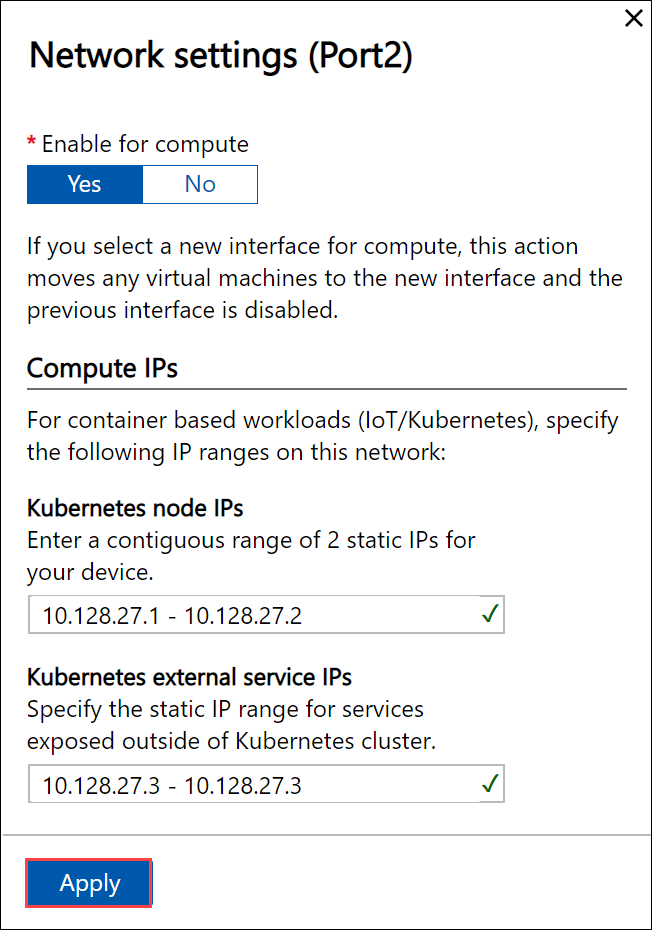

1. The configuration takes a couple minutes to apply and you may need to refresh the browser. You can see that the specified port is enabled for compute. 
 
    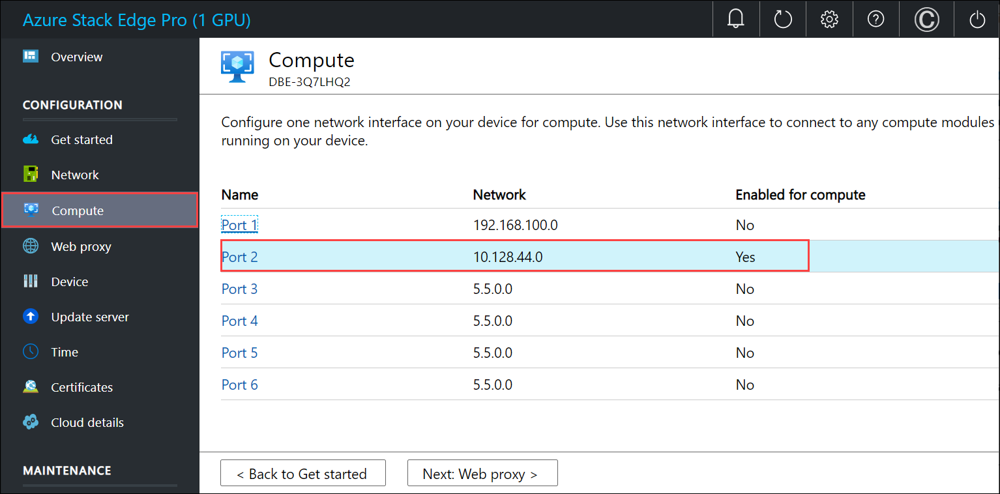

    Select **Next: Web proxy** to configure web proxy.  

::: zone-end

::: zone pivot="two-node"

## Configure advanced networking

You'll now configure the intent of the virtual switches that are created based on the network topology that you created.

1. In the  local UI, go to **Advanced networking** page. 
1. In the **Virtual switch** section, select a virtual switch. In the **Network settings** blade, specify whether the switch should be used for compute or management traffic. You can't configure storage intent as storage traffic was already configured based on the network topology that you selected earlier. Use *CRTL + Click* to select more than one intent for your virtual switch. 
1. For a virtual switch that is intended for compute, you can assign **Kubernetes node IPs**. These static IP addresses are for the compute VM.  

    For an *n*-node device, a contiguous range of a minimum of *n+1* IPv4 addresses (or more) are provided for the compute VM using the start and end IP addresses. Given Azure Stack Edge is a 1-node device, a minimum of 2 contiguous IPv4 addresses are provided.

    > [!IMPORTANT]
    > Kubernetes on Azure Stack Edge uses 172.27.0.0/16 subnet for pod and 172.28.0.0/16 subnet for service. Make sure that these are not in use in your network. If these subnets are already in use in your network, you can change these subnets by running the `Set-HcsKubeClusterNetworkInfo` cmdlet from the PowerShell interface of the device. For more information, see [Change Kubernetes pod and service subnets](azure-stack-edge-gpu-connect-powershell-interface.md#change-kubernetes-pod-and-service-subnets).

1. Assign **Kubernetes external service IPs**. These are also the load-balancing IP addresses. These contiguous IP addresses are for services that you want to expose outside of the Kubernetes cluster and you specify the static IP range depending on the number of services exposed. 
    
    > [!IMPORTANT]
    > We strongly recommend that you specify a minimum of 1 IP address for Azure Stack Edge Hub service to access compute modules. You can then optionally specify additional IP addresses for other services/IoT Edge modules (1 per service/module) that need to be accessed from outside the cluster. The service IP addresses can be updated later. 
    
1. Select **Apply**.

    

1. The configuration takes a couple minutes to apply and you may need to refresh the browser. You can see that the specified port is enabled for compute. 
 
    

    Select **Next: Web proxy** to configure web proxy.  

::: zone-end
  
## Configure web proxy

This is an optional configuration.

> [!IMPORTANT]
> * Proxy-auto config (PAC) files are not supported. A PAC file defines how web browsers and other user agents can automatically choose the appropriate proxy server (access method) for fetching a given URL. 
> * Transparent proxies work well with Azure Stack Edge Pro. For non-transparent proxies that intercept and read all the traffic (via their own certificates installed on the proxy server), upload the public key of the proxy's certificate as the signing chain on your Azure Stack Edge Pro device. You can then configure the proxy server settings on your Azure Stack Edge device. For more information, see [Bring your own certificates and upload through the local UI](azure-stack-edge-gpu-deploy-configure-certificates.md#bring-your-own-certificates).  

<!--1. Go to the **Get started** page in the local web UI of your device.
2. On the **Network** tile, configure your web proxy server settings. Although web proxy configuration is optional, if you use a web proxy, you can configure it on this page only.

   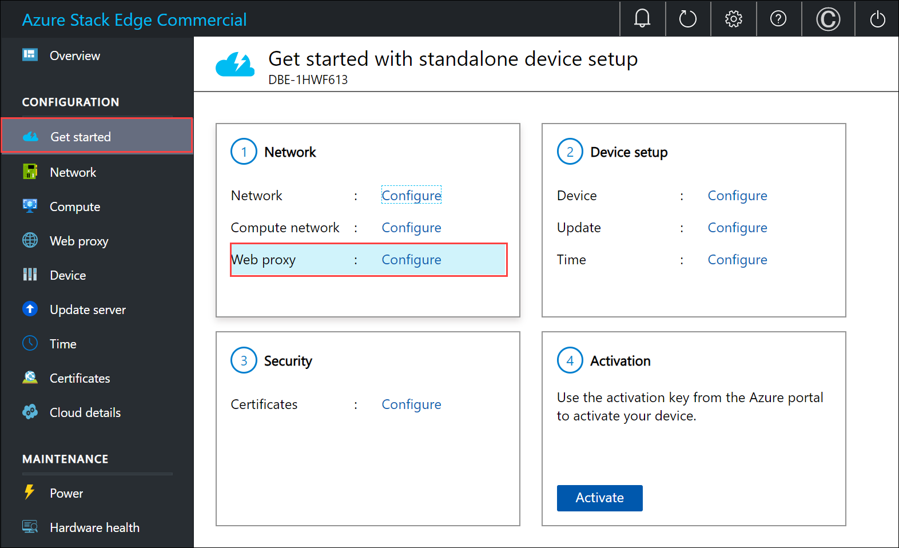-->

1. On the **Web proxy settings** page, take the following steps:

   1. In the **Web proxy URL** box, enter the URL in this format: `http://host-IP address or FQDN:Port number`. HTTPS URLs are not supported.

   2. To validate and apply the configured web proxy settings, select **Apply**.

   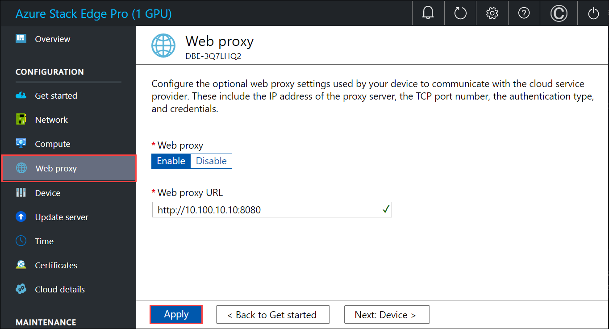<!--UI text update for instruction text is needed.-->

2. After the settings are applied, select **Next: Device**.

## Next steps

In this tutorial, you learned about:

::: zone pivot="single-node"

> [!div class="checklist"]
> * Prerequisites
> * Configure network
> * Enable compute network
> * Configure web proxy

::: zone-end

::: zone pivot="two-node"

> [!div class="checklist"]
> * Prerequisites
> * Select device setup type
> * Configure network
> * Get authentication token
> * Configure cluster
> * Configure virtual IP
> * Configure advanced networking
> * Configure web proxy

::: zone-end

To learn how to set up your Azure Stack Edge Pro GPU device, see:

> [!div class="nextstepaction"]
> [Configure device settings](./azure-stack-edge-gpu-deploy-set-up-device-update-time.md)
