# Tutorial: Configure network for Azure Stack Edge Pro with GPU

This tutorial describes how to configure network for your Azure Stack Edge Pro device with an onboard GPU by using the local web UI.

The connection process can take around 20 minutes to complete.

In this tutorial, you learn about:

> [!div class="checklist"]
> * Prerequisites
> * Configure network
> * Configure advanced networking
> * Configure web proxy
> * Validate network settings

## Prerequisites

Before you configure and set up your Azure Stack Edge Pro device with GPU, make sure that you:

* Install the physical device as detailed in [Install Azure Stack Edge Pro](azure-stack-edge-gpu-deploy-install.md).
* Connect to the local web UI of the device as detailed in [Connect to Azure Stack Edge Pro with GPU](azure-stack-edge-gpu-deploy-connect.md).

## Configure setup type

1. Go to the **Get started** page.
1. In the **Set up a single node device** tile, select **Start**.

    :::image type="content" source="./media/azure-stack-edge-gpu-deploy-configure-network-compute-web-proxy/setup-type-single-node-1.png" alt-text="Screenshot of local web UI 'Get started' page for one node." lightbox="./media/azure-stack-edge-gpu-deploy-configure-network-compute-web-proxy/setup-type-single-node-1.png":::

## Configure network

Your **Get started** page displays the various settings that are required to configure and activate the physical device with the Azure Stack Edge service. 

Follow these steps to configure the network for your device.

1. In the local web UI of your device, go to the **Get started** page. 

2. On the **Network** tile, select **Needs setup**.  
    
    :::image type="content" source="./media/azure-stack-edge-gpu-deploy-configure-network-compute-web-proxy/network-1.png" alt-text="Screenshot of local web UI 'Network' tile for one node." lightbox="./media/azure-stack-edge-gpu-deploy-configure-network-compute-web-proxy/network-1.png":::

    On your physical device, there are six network interfaces. Port 1 and Port 2 are 1-Gbps network interfaces. Port 3, Port 4, Port 5, and Port 6 are all 25-Gbps network interfaces that can also serve as 10-Gbps network interfaces. Port 1 is automatically configured as a management-only port, and Port 2 to Port 6 are all data ports. For a new device, the **Network** page is as shown below.
    
    :::image type="content" source="./media/azure-stack-edge-gpu-deploy-configure-network-compute-web-proxy/network-2a.png" alt-text="Screenshot of local web UI 'Network' page for one node." lightbox="./media/azure-stack-edge-gpu-deploy-configure-network-compute-web-proxy/network-2a.png":::

3. To change the network settings, select a port and in the right pane that appears, modify the IP address, subnet, gateway, primary DNS, and secondary DNS. 

    - If you select Port 1, you can see that it's preconfigured as static. 

        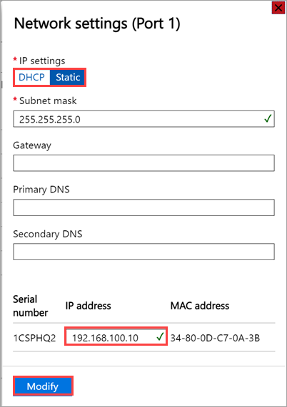

    - If you select Port 2, Port 3, Port 4, or Port 5, all of these ports are configured as DHCP by default.

        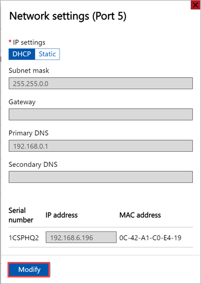

    - By default for all the ports, it's expected that you set an IP. If you decide not to set an IP for a network interface on your device, you can set the IP to **No** and then **Modify** the settings.

        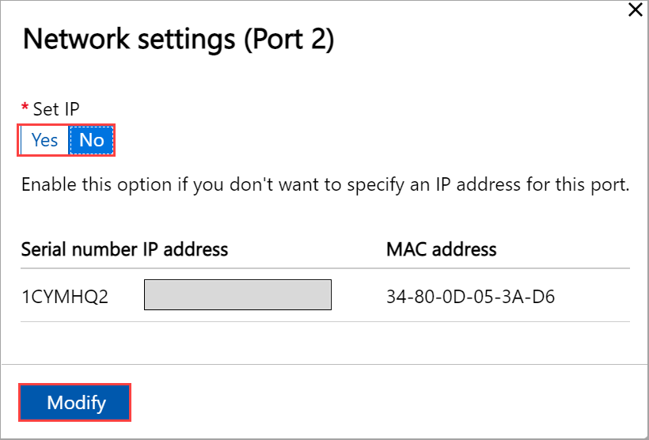

    As you configure the network settings, keep in mind:

    * Make sure that Port 5 and Port 6 are connected for Network Function Manager deployments. For more information, see [Tutorial: Deploy network functions on Azure Stack Edge (Preview)](../network-function-manager/deploy-functions.md).
    * If DHCP is enabled in your environment, network interfaces are automatically configured. An IP address, subnet, gateway, and DNS are automatically assigned.
    * If DHCP isn't enabled, you can assign static IPs if needed.
    * You can configure your network interface as IPv4.
    * Serial number for any port corresponds to the node serial number.    <!--* On 25-Gbps interfaces, you can set the RDMA (Remote Direct Access Memory) mode to iWarp or RoCE (RDMA over Converged Ethernet). Where low latencies are the primary requirement and scalability is not a concern, use RoCE. When latency is a key requirement, but ease-of-use and scalability are also high priorities, iWARP is the best candidate.-->
    

    > [!NOTE]
    > If you need to connect to your device from an outside network, see [Enable device access from outside network](azure-stack-edge-gpu-manage-access-power-connectivity-mode.md#enable-device-access-from-outside-network) for additional network settings.

    Once the device network is configured, the page updates as follows:

    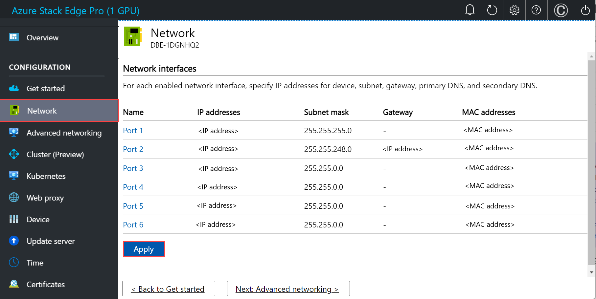

     > [!NOTE]
     > We recommend that you do not switch the local IP address of the network interface from static to DHCP, unless you have another IP address to connect to the device. If using one network interface and you switch to DHCP, there would be no way to determine the DHCP address. If you want to change to a DHCP address, wait until after the device has activated with the service, and then change. You can then view the IPs of all the adapters in the **Device properties** in the Azure portal for your service.

    After you configure and apply the network settings, select **Next: Advanced networking** to configure compute network.

## Configure virtual switches

Follow these steps to add or delete virtual switches.

> [!NOTE]
> There is no restriction on the number of virtual switches that you can create on your device. However, you can enable compute only on one virtual switch at a time.

1. In the local UI of your device, go to the **Advanced networking** page. 
1. In the **Virtual switch** section, add or delete virtual switches. Select **Add virtual switch** to create a new switch.

   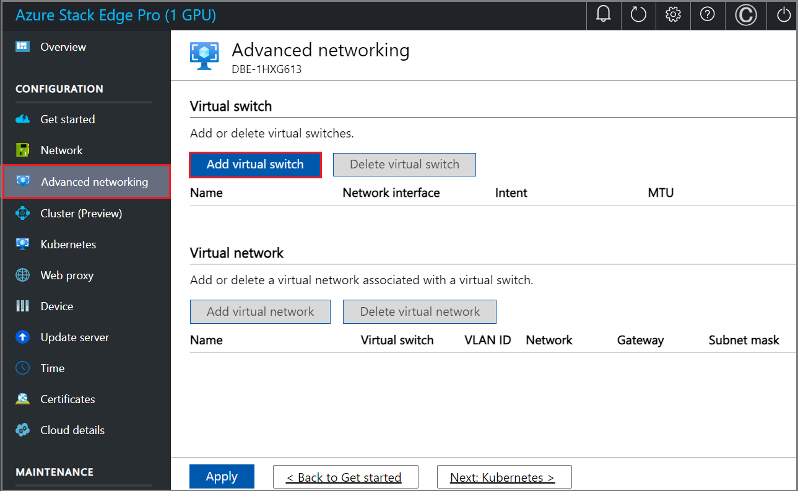

1. In the **Network settings** blade, if using a new virtual switch, provide the following:

     1. Provide a **Name** for the virtual switch.
     1. Choose the **Network interface** onto which the virtual switch should be created.
     1. Set the **MTU** (Maximum Transmission Unit) parameter for the virtual switch (Optional).
     1. Select **Modify** and **Apply** to save your changes.
     
    The MTU value determines the maximum packet size that can be transmitted over a network. Azure Stack Edge supports MTU values in the following table. If a device on the network path has an MTU setting lower than 1500, IP packets with the “don't fragment” flag (DF) with packet size 1500 will be dropped.

    | Azure Stack Edge SKU | Network interface | Supported MTU values |
    |-------|--------|------------|
    | Pro-GPU | Ports 1, 2, 3, and 4 | 1400 - 1500 |
    | Pro-GPU | Ports 5 and 6 | Not configurable, set to default. |
    | Pro 2 | Ports 1 and 2 | 1400 - 1500 |
    | Pro 2 | Ports 3 and 4 | Not configurable, set to default. |

    The host virtual switch uses the specified MTU setting.

    If a virtual network interface is created on the virtual switch, the interface uses the specified MTU setting. If this virtual switch is enabled for compute, the Azure Kubernetes Service VMs and container network interfaces (CNIs) uses the specified MTU as well.

   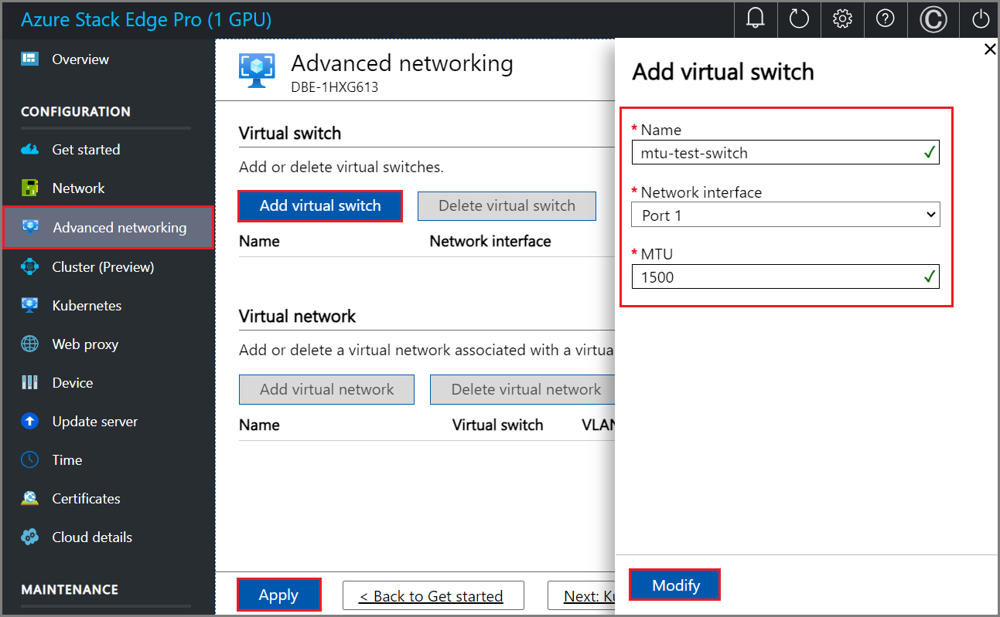

   When you create a virtual switch, the MTU column is populated with its MTU value.

   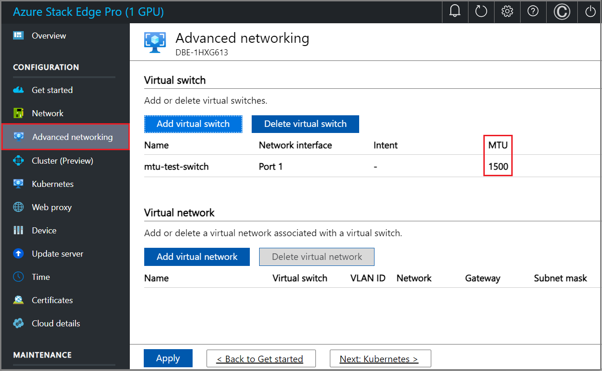

1. The configuration takes a few minutes to apply and once the virtual switch is created, the list of virtual switches updates to reflect the newly created switch. You can see that the specified virtual switch is created and enabled for compute.

   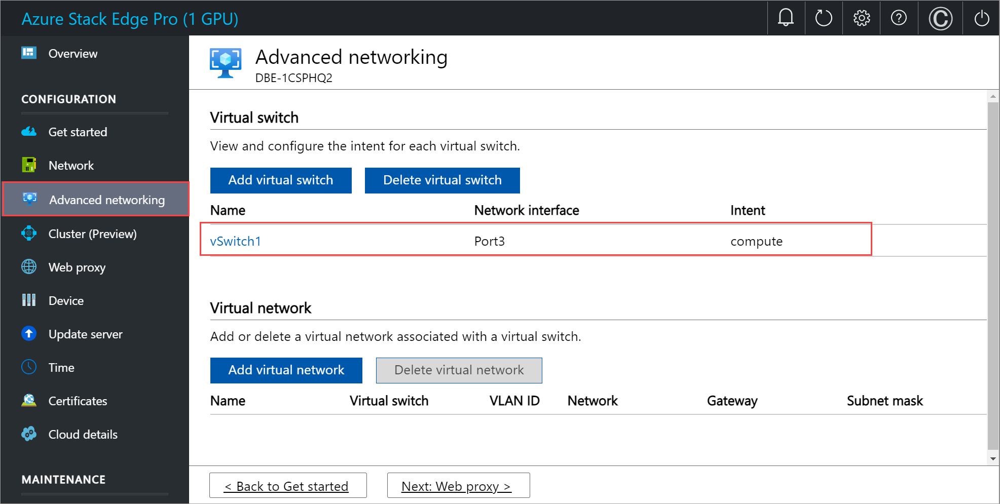

1. You can create more than one switch by following the steps described earlier.

1. To delete a virtual switch, under the **Virtual switch** section, select **Delete virtual switch**. When a virtual switch is deleted, the associated virtual networks are also deleted.

Next, you can create and associate virtual networks with your virtual switches.

## Configure virtual networks

You can add or delete virtual networks associated with your virtual switches. To add a virtual switch, follow these steps:

1. In the local UI on the **Advanced networking** page, under the **Virtual network** section, select **Add virtual network**.
1. In the **Add virtual network** blade, input the following information:

    1. Select a virtual switch for which you want to create a virtual network.
    1. Provide a **Name** for your virtual network. The name you specify must conform to [Naming rules and restrictions for Azure resources](../azure-resource-manager/management/resource-name-rules.md#microsoftnetwork).
    1. Enter a **VLAN ID** as a unique number in 1-4094 range. The VLAN ID that you provide should be in your trunk configuration. For more information about trunk configuration for your switch, refer to the instructions from your physical switch manufacturer. 
    1. Specify the **Subnet mask** and **Gateway** for your virtual LAN network as per the physical network configuration.
    1. Select **Apply**. A virtual network is created on the specified virtual switch.

    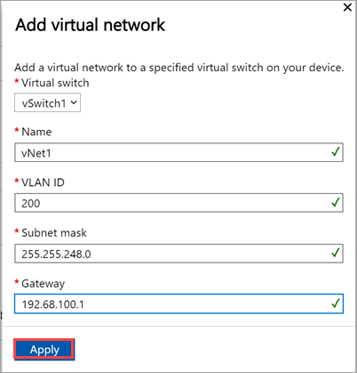

1. To delete a virtual network, under the **Virtual network** section, select **Delete virtual network** and select the virtual network you want to delete.

1. Select **Next: Kubernetes >** to next configure your compute IPs for Kubernetes.

## Configure compute IPs

After the virtual switches are created, you can enable the switches for Kubernetes compute traffic.

1. In the local UI, go to the **Kubernetes** page.

    <!-- To use PowerShell to specify the workload, see detailed steps in [Change Kubernetes workload profiles](azure-stack-edge-gpu-connect-powershell-interface.md#change-kubernetes-workload-profiles). -->

   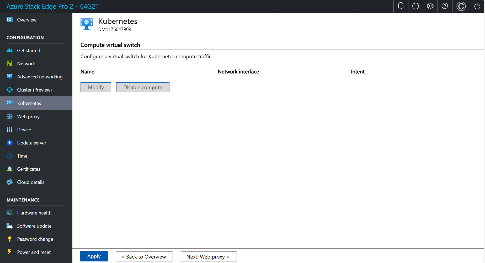

<!-- 1. Specify a workload from the options provided.
   - If you're working with an Azure Private MEC solution, select the option for **an Azure Private MEC solution in your environment**.
   - If you're working with an SAP Digital Manufacturing solution or another Microsoft partner solution, select the option for **a SAP Digital Manufacturing for Edge Computing or another Microsoft partner solution in your environment**.
   - For other workloads, select the option for **other workloads in your environment**.
   
    If prompted, confirm the option you specified and then select **Apply**.

    To use PowerShell to specify the workload, see detailed steps in [Change Kubernetes workload profiles](azure-stack-edge-gpu-connect-powershell-interface.md#change-kubernetes-workload-profiles).

    -->

1. Select the virtual switch you want to enable for Kubernetes compute traffic.
1. Assign **Kubernetes node IPs**. These static IP addresses are for the Kubernetes VMs.  

    <!--If you select the **Azure Private MEC solution** or **SAP Digital Manufacturing for Edge Computing or another Microsoft partner** workload option for your environment, you must provide a contiguous range of a minimum of 6 IPv4 addresses (or more) for a 1-node configuration, and 7 IPv4 addresses (or more) for a two-node configuration.-->

    <!--If you select the **other workloads** option for an *n*-node device, a contiguous range of a minimum of *n+1* IPv4 addresses (or more) are provided for the compute VM using the start and end IP addresses. Provide a minimum of two free, contiguous IPv4 addresses.-->

    > [!IMPORTANT]
    > - Kubernetes on Azure Stack Edge uses 172.27.0.0/16 subnet for pod and 172.28.0.0/16 subnet for service. Make sure that these are not in use in your network. For more information, see [Change Kubernetes pod and service subnets](azure-stack-edge-gpu-connect-powershell-interface.md#change-kubernetes-pod-and-service-subnets).
    > - DHCP mode is not supported for Kubernetes node IPs.

1. Assign **Kubernetes external service IPs**. These are also the load-balancing IP addresses. These contiguous IP addresses are for services that you want to expose outside of the Kubernetes cluster and you specify the static IP range depending on the number of services exposed. 
    
    > [!IMPORTANT]
    > We strongly recommend that you specify a minimum of 1 IP address for Azure Stack Edge Hub service to access compute modules. The service IP addresses can be updated later. 
    
1. Select **Apply**.

    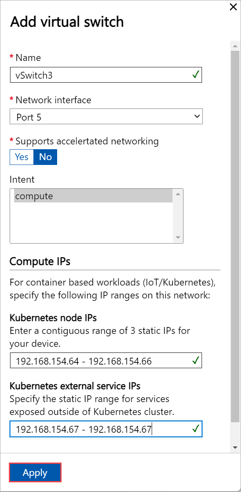

1. The configuration takes a couple minutes to apply and you may need to refresh the browser. 

1. Select **Next: Web proxy** to configure web proxy.
  
## Configure web proxy

This is an optional configuration. Although web proxy configuration is optional, if you use a web proxy, you can configure it on this page only.

> [!IMPORTANT]
> * Proxy-auto config (PAC) files are not supported. A PAC file defines how web browsers and other user agents can automatically choose the appropriate proxy server (access method) for fetching a given URL. 
> * Transparent proxies work well with Azure Stack Edge Pro. For non-transparent proxies that intercept and read all the traffic (via their own certificates installed on the proxy server), upload the public key of the proxy's certificate as the signing chain on your Azure Stack Edge Pro device. You can then configure the proxy server settings on your Azure Stack Edge device. For more information, see [Bring your own certificates and upload through the local UI](azure-stack-edge-gpu-deploy-configure-certificates.md#bring-your-own-certificates).  

1. On the **Web proxy settings** page, take the following steps:

   1. In the **Web proxy URL** box, enter the URL in this format: `http://host-IP address or FQDN:Port number`. HTTPS URLs aren't supported.

   2. To validate and apply the configured web proxy settings, select **Apply**.

   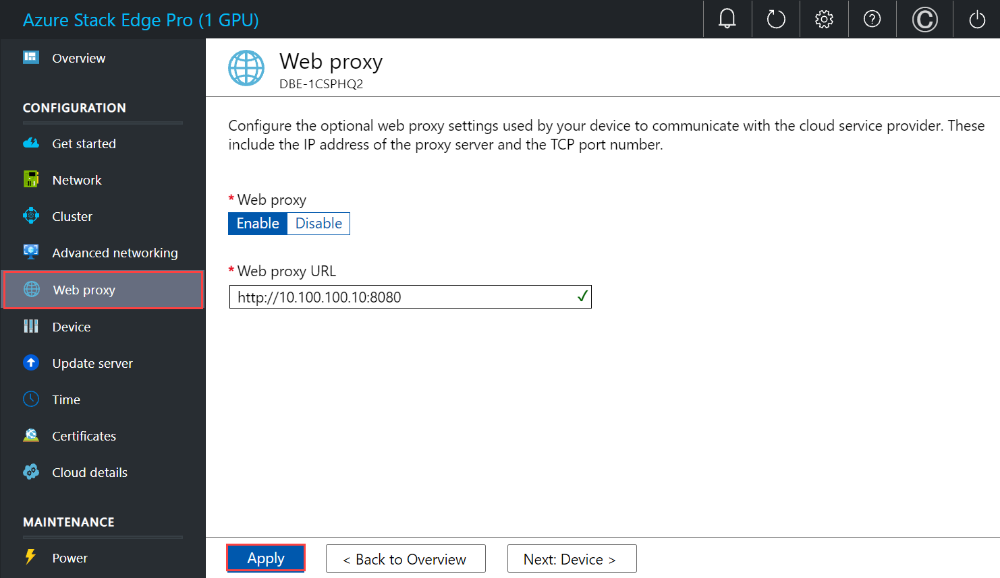

## Validate network settings

Follow these steps to validate your network settings.

1. Go to the **Diagnostic tests** page and select the tests as shown below.
1. Select **Run test**.
   
     

1. Review test results to ensure that status shows **Healthy** for each test that was run.

   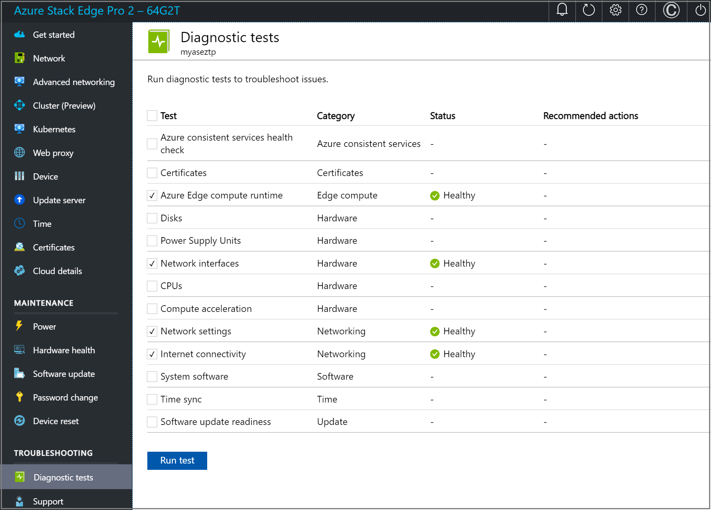

1. If a test fails, select **Recommended actions** on the test results page, implement the recommended change, and then rerun the test. For example, the dialog below shows recommended actions if the Azure Edge compute runtime test fails.

   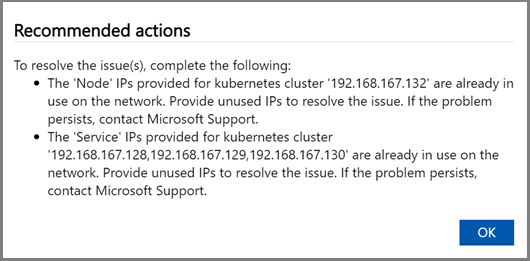

1. After network settings are validated and all tests return **Healthy** status, proceed to the device settings page.

## Next steps

In this tutorial, you learned about:

> [!div class="checklist"]
> * Prerequisites
> * Configure network
> * Enable compute network
> * Configure web proxy
> * Validate network settings

To learn how to set up your Azure Stack Edge Pro GPU device, see:

> [!div class="nextstepaction"]
> [Configure device settings](./azure-stack-edge-gpu-deploy-set-up-device-update-time.md).
