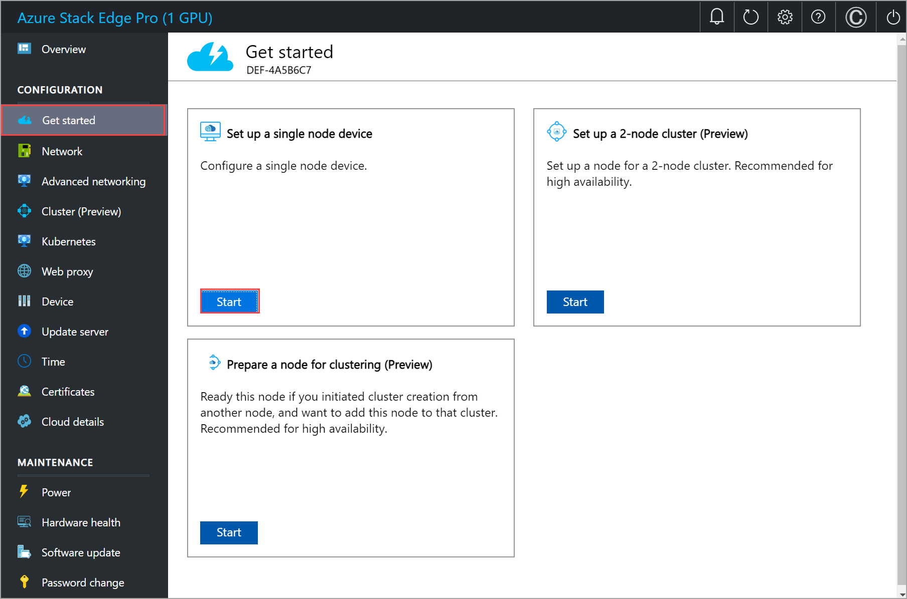
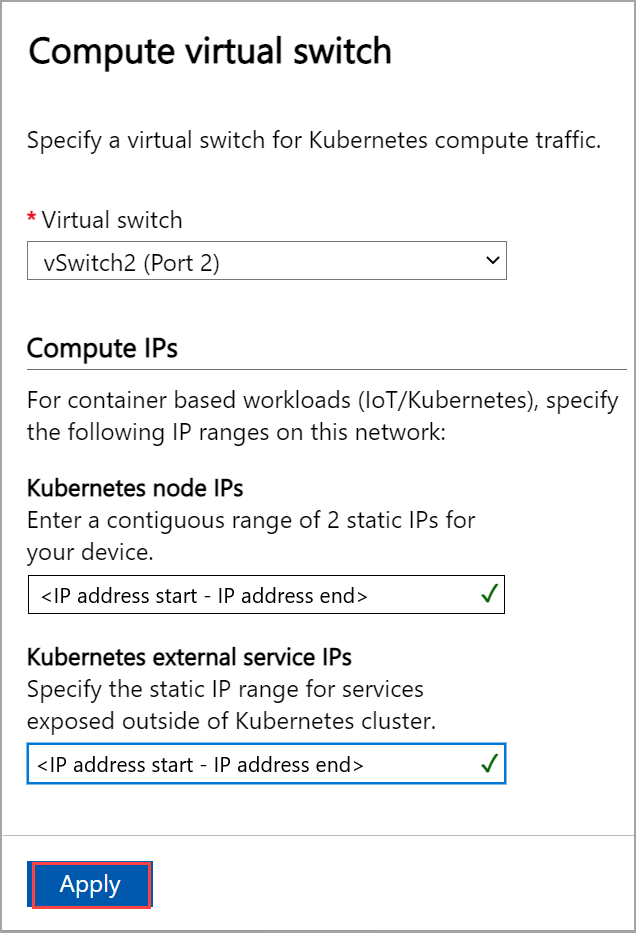
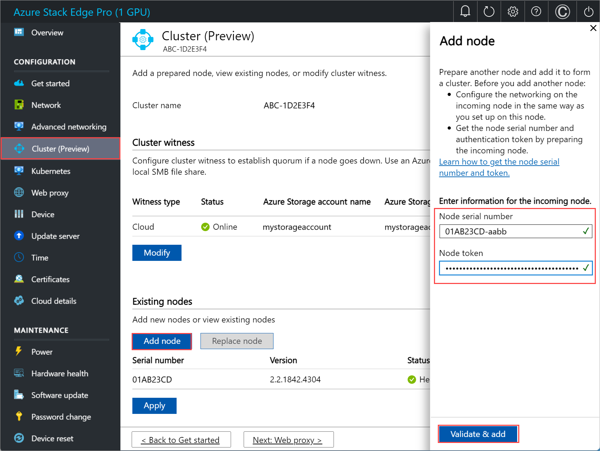
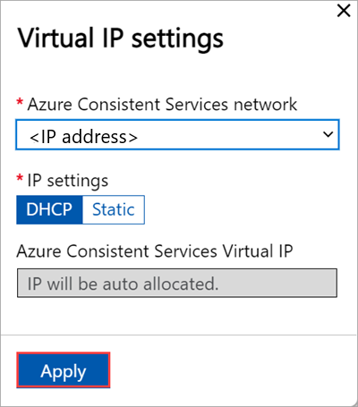

# Tutorial: Configure network for Azure Stack Edge Pro with GPU

::: zone pivot="single-node"

This tutorial describes how to configure network for your Azure Stack Edge Pro device with an onboard GPU by using the local web UI.

The connection process can take around 20 minutes to complete.

::: zone-end

::: zone pivot="two-node"

This tutorial describes how to configure network for your two-node Azure Stack Edge Pro GPU device by using the local web UI.

The procedure can take around 45 minutes to complete.

::: zone-end

In this tutorial, you learn about:

::: zone pivot="single-node"

> [!div class="checklist"]
> * Prerequisites
> * Configure network
> * Configure advanced networking
> * Configure web proxy
> * Validate network settings

::: zone-end

::: zone pivot="two-node"

> [!div class="checklist"]
> * Prerequisites
> * Select device setup type
> * Configure network and network topology on both nodes
> * Get authentication token for prepared node
> * Configure cluster witness and add prepared node
> * Configure virtual IP settings for Azure Consistent Services and NFS
> * Configure advanced networking
> * Configure web proxy
> * Validate network settings

::: zone-end

## Prerequisites

Before you configure and set up your Azure Stack Edge Pro device with GPU, make sure that:

* You've installed the physical device as detailed in [Install Azure Stack Edge Pro](azure-stack-edge-gpu-deploy-install.md).
* You've connected to the local web UI of the device as detailed in [Connect to Azure Stack Edge Pro](azure-stack-edge-gpu-deploy-connect.md)

::: zone pivot="single-node"

## Configure setup type

1. Go to the **Get started** page.
1. In the **Set up a single node device** tile, select **Start**.

       

## Configure network

Your **Get started** page displays the various settings that are required to configure and activate the physical device with the Azure Stack Edge service. 

Follow these steps to configure the network for your device.

1. In the local web UI of your device, go to the **Get started** page. 

2. On the **Network** tile, select **Configure**.  
    
    

    On your physical device, there are six network interfaces. PORT 1 and PORT 2 are 1-Gbps network interfaces. PORT 3, PORT 4, PORT 5, and PORT 6 are all 25-Gbps network interfaces that can also serve as 10-Gbps network interfaces. PORT 1 is automatically configured as a management-only port, and PORT 2 to PORT 6 are all data ports. For a new device, the **Network** page is as shown below.
    
    

3. To change the network settings, select a port and in the right pane that appears, modify the IP address, subnet, gateway, primary DNS, and secondary DNS. 

    - If you select Port 1, you can see that it is preconfigured as static. 

        

    - If you select Port 2, Port 3, Port 4, or Port 5, all of these ports are configured as DHCP by default.

        

    - By default for all the ports, it is expected that you'll set an IP. If you decide not to set an IP for a network interface on your device, you can set the IP to **No** and then **Modify** the settings.

        

    As you configure the network settings, keep in mind:

    * Make sure that Port 5 and Port 6 are connected for Network Function Manager deployments. For more information, see [Tutorial: Deploy network functions on Azure Stack Edge (Preview)](../network-function-manager/deploy-functions.md).
    * If DHCP is enabled in your environment, network interfaces are automatically configured. An IP address, subnet, gateway, and DNS are automatically assigned.
    * If DHCP isn't enabled, you can assign static IPs if needed.
    * You can configure your network interface as IPv4.
    * Serial number for any port corresponds to the node serial number.    <!--* On 25-Gbps interfaces, you can set the RDMA (Remote Direct Access Memory) mode to iWarp or RoCE (RDMA over Converged Ethernet). Where low latencies are the primary requirement and scalability is not a concern, use RoCE. When latency is a key requirement, but ease-of-use and scalability are also high priorities, iWARP is the best candidate.-->
    

    > [!NOTE]
    > If you need to connect to your device from an outside network, see [Enable device access from outside network](azure-stack-edge-gpu-manage-access-power-connectivity-mode.md#enable-device-access-from-outside-network) for additional network settings.

    Once the device network is configured, the page updates as shown below.

    

     > [!NOTE]
     > We recommend that you do not switch the local IP address of the network interface from static to DCHP, unless you have another IP address to connect to the device. If using one network interface and you switch to DHCP, there would be no way to determine the DHCP address. If you want to change to a DHCP address, wait until after the device has activated with the service, and then change. You can then view the IPs of all the adapters in the **Device properties** in the Azure portal for your service.

    After you have configured and applied the network settings, select **Next: Advanced networking** to configure compute network.

## Configure virtual switches

Follow these steps to add or delete virtual switches.

1. In the  local UI, go to **Advanced networking** page. 
1. In the **Virtual switch** section, add or delete virtual switches. Select **Add virtual switch** to create a new switch.

   

1. In the **Network settings** blade, if using a new virtual switch, provide the following:

     1. Provide a **Name** for the virtual switch.
     1. Choose the **Network interface** onto which the virtual switch should be created.
     1. Set the **MTU** (Maximum Transmission Unit) parameter for the virtual switch (Optional).
     1. Select **Modify** and **Apply** to save your changes.
     
    The MTU value determines the maximum packet size that can be transmitted over a network. Azure Stack Edge supports MTU values in the following table. If a device on the network path has an MTU setting lower than 1500, IP packets with the “do not fragment” flag (DF) with packet size 1500 will be dropped.

    | Azure Stack Edge SKU | Network interface | Supported MTU values |
    |-------|--------|------------|
    | Pro-GPU | Ports 1, 2, 3, and 4 | 1400 - 1500 |
    | Pro-GPU | Ports 5 and 6 | Not configurable, set to default. |
    | Pro 2 | Ports 1 and 2 | 1400 - 1500 |
    | Pro 2 | Ports 3 and 4 | Not configurable, set to default. |

    The host virtual switch will use the specified MTU setting.

    If a virtual network interface is created on the virtual switch, the interface will use the specified MTU setting. If this virtual switch is enabled for compute, the Azure Kubernetes Service VMs and container network interfaces (CNIs) will use the specified MTU as well.

   

   When you create a virtual switch, the MTU column is populated with its MTU value.

   

1. The configuration will take a few minutes to apply and once the virtual switch is created, the list of virtual switches updates to reflect the newly created switch. You can see that the specified virtual switch is created and enabled for compute.

   

1. You can create more than one switch by following the steps described earlier.

1. To delete a virtual switch, under the **Virtual switch** section, select **Delete virtual switch**. When a virtual switch is deleted, the associated virtual networks will also be deleted.

Next, you can create and associate virtual networks with your virtual switches.

## Configure virtual networks

You can add or delete virtual networks associated with your virtual switches. To add a virtual switch, follow these steps:

1. In the local UI on the **Advanced networking** page, under the **Virtual network** section, select **Add virtual network**.
1. In the **Add virtual network** blade, input the following information:

    1. Select a virtual switch for which you want to create a virtual network.
    1. Provide a **Name** for your virtual network.
    1. Enter a **VLAN ID** as a unique number in 1-4094 range. The VLAN ID that you provide should be in your trunk configuration. For more information on trunk configuration for your switch, refer to the instructions from your physical switch manufacturer. 
    1. Specify the **Subnet mask** and **Gateway** for your virtual LAN network as per the physical network configuration.
    1. Select **Apply**. A virtual network is created on the specified virtual switch.

    

1. To delete a virtual network, under the **Virtual network** section, select **Delete virtual network** and select the virtual network you want to delete.

1. Select **Next: Kubernetes >** to next configure your compute IPs for Kubernetes.

## Configure compute IPs

Follow these steps to configure compute IPs for your Kubernetes workloads. 

1. In the  local UI, go to the **Kubernetes** page. 

1. From the dropdown select a virtual switch that you will use for Kubernetes compute traffic. <!--By default, all switches are configured for management. You can't configure storage intent as storage traffic was already configured based on the network topology that you selected earlier.--> 
  
1. Assign **Kubernetes node IPs**. These static IP addresses are for the Kubernetes VMs.  

    For an *n*-node device, a contiguous range of a minimum of *n+1* IPv4 addresses (or more) are provided for the compute VM using the start and end IP addresses. For a 1-node device, provide a minimum of 2 free, contiguous IPv4 addresses. 
    
    > [!IMPORTANT]
    > - Kubernetes on Azure Stack Edge uses 172.27.0.0/16 subnet for pod and 172.28.0.0/16 subnet for service. Make sure that these are not in use in your network. If these subnets are already in use in your network, you can change these subnets by running the `Set-HcsKubeClusterNetworkInfo` cmdlet from the PowerShell interface of the device. For more information, see [Change Kubernetes pod and service subnets](azure-stack-edge-gpu-connect-powershell-interface.md#change-kubernetes-pod-and-service-subnets).
    > - DHCP mode is not supported for Kubernetes node IPs. If you plan to deploy IoT Edge/Kubernetes, you must assign static Kubernetes IPs and then enable IoT role. This will ensure that static IPs are assigned to Kubernetes node VMs.
    > - If your datacenter firewall is restricting or filtering traffic based on source IPs or MAC addresses, make sure that the compute IPs (Kubernetes node IPs) and MAC addresses are on the allowed list. The MAC addresses can be specified by running the `Set-HcsMacAddressPool` cmdlet on the PowerShell interface of the device.

1. Assign **Kubernetes external service IPs**. These are also the load-balancing IP addresses. These contiguous IP addresses are for services that you want to expose outside of the Kubernetes cluster and you specify the static IP range depending on the number of services exposed.
    
    > [!IMPORTANT]
    > We strongly recommend that you specify a minimum of 1 IP address for Azure Stack Edge Hub service to access compute modules. You can then optionally specify additional IP addresses for other services/IoT Edge modules (1 per service/module) that need to be accessed from outside the cluster. The service IP addresses can be updated later. 
    
1. Select **Apply**.

    

1. The configuration takes a couple minutes to apply and you may need to refresh the browser. 

1. Select **Next: Web proxy** to configure web proxy. 

::: zone-end

::: zone pivot="two-node"

## Configure setup type

1. In the local UI for one of the devices, go to the **Get started** page.
1. In the **Set up a 2-node cluster** tile, select **Start**.

     

1. In the local UI for the second device, go to the **Get started** page.
1. In the **Prepare a node** tile, select **Start**.

     

## Configure network, topology

You'll configure network as well as network topology on both the nodes. These steps can be done in parallel. The cabling on both nodes should be identical and should conform with the network topology you choose.

### Configure network on first node

To configure the network for a 2-node device, follow these steps on the first node of the device:

1. In the local UI of the first node, in the **Network** tile, select **Needs setup**. 

    

1. In the **Network** page, configure the IP addresses for your network interfaces. On your physical device, there are six network interfaces. PORT 1 and PORT 2 are 1-Gbps network interfaces. PORT 3, PORT 4, PORT 5, and PORT 6 are all 25-Gbps network interfaces that can also serve as 10-Gbps network interfaces. PORT 1 is automatically configured as a management-only port, and PORT 2 to PORT 6 are all data ports. For a new device, the **Network settings** page is as shown below.
    
    

    To change the network settings, select a port and in the right pane that appears, modify the IP address, subnet, gateway, primary DNS, and secondary DNS. You can configure your network interface as IPv4.

    

    By default for all the ports, it is expected that you'll set an IP. If you decide not to set an IP for a network interface on your device, you can set the IP to **No** and then **Modify** the settings.

    

    As you configure the network settings, keep in mind:

    * Make sure that Port 5 and Port 6 are connected for Network Function Manager deployments. For more information, see [Tutorial: Deploy network functions on Azure Stack Edge (Preview)](../network-function-manager/deploy-functions.md).
    * If DHCP is enabled in your environment, network interfaces are automatically configured. An IP address, subnet, gateway, and DNS are automatically assigned. If DHCP isn't enabled, you can assign static IPs if needed.
    * On 25-Gbps interfaces, you can set the RDMA (Remote Direct Access Memory) mode to iWarp or RoCE (RDMA over Converged Ethernet). Where low latencies are the primary requirement and scalability is not a concern, use RoCE. When latency is a key requirement, but ease-of-use and scalability are also high priorities, iWARP is the best candidate.
    * Serial number for any port corresponds to the node serial number.

      > [!IMPORTANT]
      > For a two node cluster, only the network interfaces with a set IP address are supported by the network topology.

    Once you apply the network settings, select **Next: Advanced networking >** to configure your network topology.

### Configure network topology on first node

1. In the **Advanced networking** page, choose the topology for cluster and the storage traffic between nodes from the following options: 

    - **Switchless**. Use this option when high-speed switches aren't available for storage and clustering traffic.
    - **Use switches and NIC teaming**. Use this option when you need port level redundancy through teaming. NIC Teaming allows you to group two physical ports on the device node, Port 3 and Port 4 in this case, into two software-based virtual network interfaces. These teamed network interfaces provide fast performance and fault tolerance in the event of a network interface failure. For more information, see [NIC teaming on Windows Server](/windows-server/networking/windows-server-supported-networking-scenarios#bkmk_nicteam).
    - **Use switches without NIC teaming**. Use this option if you need an extra port for workload traffic and port level redundancy is not required.

    

1. Make sure that your node is cabled as per the selected topology.
1. Select **Apply**.
1. You'll see a **Confirm network setting** dialog. This dialog reminds you to make sure that your node is cabled as per the network topology you selected. Once you choose the network cluster topology, you can't change this topology without a device reset. Select **Yes** to confirm the network topology. 

    

    The network topology setting takes a few minutes to apply and you see a notification when the settings are successfully applied.

1. Once the network topology is applied, the **Network** page updates. For example, if you selected network topology that uses switches and NIC teaming, you will see that on a device node, a virtual switch **vSwitch1** is created at Port 2 and another virtual switch, **vSwitch2** is created on Port 3 and Port 4. Port 3 and Port 4 are teamed and then on the teamed network interface, two virtual network interfaces are created, **vPort3** and **vPort4**. The same is true for the second device node. The teamed network interfaces are then connected via switches.

    

You'll now configure the network and the network topology of the second node. 

### Configure network on second node

You'll now prepare the second node for clustering. You'll first need to configure the network. Follow these steps in the local UI of the second node:

1. On the **Prepare a node for clustering** page, in the **Network** tile, select **Needs setup**.

    

### Configure network topology on second node

1. Make sure that the second node is cabled as per the topology you selected for the first node. In the **Network** page, choose and **Apply** the same topology that you selected for the first node.

    

1. Select **Back to get started**.

## Get authentication token

You'll now get the authentication token that will be needed when adding this node to form a cluster. Follow these steps in the local UI of the second node:

1. On the **Prepare a node for clustering** page, in the **Get authentication token** tile, select **Prepare node**.

    

1. Select **Get token**.
1. Copy the node serial number and the authentication token. You will use this information when you add this node to the cluster on the first node.

    

## Configure cluster 

To configure the cluster, you'll need to establish a cluster witness and then add a prepared node. You'll also need to configure virtual IP settings so that you can connect to a cluster as opposed to a specific node.

### Configure cluster witness

You'll now create a cluster witness. A cluster witness helps establish quorum for a two-node device if a node goes down. To learn about quorum, see [Understanding quorum](/windows-server/failover-clustering/manage-cluster-quorum#understanding-quorum). 

A cluster witness can be: 

- **Cloud witness** if you use an Azure Storage account to provide a vote on cluster quorum. A cloud witness uses Azure Blob Storage to read or write a blob file and then uses it to arbitrate in split-brain resolution. 

    Use cloud witness when you have internet access. For more information on cloud witness, see [Deploy a cloud witness for Failover cluster](/windows-server/failover-clustering/deploy-cloud-witness).

- **File share witness** if you use a local SMB file share to provide a vote in the cluster quorum. Use a file share witness if all the servers in a cluster have spotty internet connectivity or can't use disk witness as there aren't any shared drives. 

    Use file share witness if you're in an IT environment with other machines and file shares. For more information on file share witness, see [Deploy a file share witness for Failover cluster](/windows-server/failover-clustering/file-share-witness).

Before you create a cluster witness, make sure that you've reviewed the cluster witness requirements.

Follow these steps to configure the cluster witness.

#### Configure cloud witness

1. In the local UI of the first node, go to the **Cluster (Preview)** page. Under **Cluster witness type**, select **Modify**.

    

1. In the **Modify cluster witness** blade, enter the following inputs.
    1. Choose the **Witness type** as **Cloud.**
    1. Enter the **Azure Storage account name**.
    1. Specify Storage account authentication from Access key or SAS token.
    1. If you chose Access key as the authentication mechanism, enter the Access key of the Storage account, Azure Storage container where the witness lives, and the service endpoint. 
    1. Select **Apply**.

    

#### Configure local witness

1. In the local UI of the first node, go to the **Cluster** page. Under **Cluster witness type**, select **Modify**.

    

1. In the **Modify cluster witness** blade, enter the following inputs.
    1. Choose the **Witness type** as **Local.**
    1. Enter the file share path as *//server/fileshare* format.
    1. Select **Apply**. 

    

### Add prepared node to cluster

You'll now add the prepared node to the first node and form the cluster. Before you add the prepared node, make sure the networking on the incoming node is configured in the same way as that of this node where you initiated cluster creation.

1. In the local UI of the first node, go to the **Cluster** page. Under **Existing nodes**, select **Add node**.

    

1. In the **Add node** blade, input the following information for the incoming node: 

    1. Provide the serial number for the incoming node.
    1. Enter the authentication token for the incoming node.

1. Select **Validate & add**. This step takes a few minutes. 

    

    You see a notification when the node is successfully validated.

1. The node is now ready to join the cluster. Select **Apply**. The cluster creation takes several minutes. Once the cluster is created, the page updates to show both the nodes are added.

## Configure virtual IPs

For Azure consistent services and NFS, you'll also need to define a virtual IP that allows you to connect to a clustered device as opposed to a specific node. A virtual IP is an available IP in the cluster network and any client connecting to the cluster network on the two-node device should be able to access this IP.

### For Azure Consistent Services

For Azure Consistent Services, follow these steps to configure virtual IP.

1. In the local UI on the **Cluster** page, under the **Virtual IP settings** section, select **Azure Consistent Services**. 

    

1. In the **Virtual IP settings** blade, input the following.

    1. From the dropdown list, select the **Azure Consistent Services network**. 
    1. Choose IP settings from **DHCP** or **static**.
    1. If you chose IP settings as static, enter a virtual IP. This should be a free IP from within the Azure Consistent Services network that you specified. If you selected DHCP, a virtual IP is automatically picked from the Azure Consistent Services network that you selected.
1. Select **Apply**.

    

### For Network File System

For clients connecting via NFS protocol to the two-node device, follow these steps to configure virtual IP.

1. In the local UI on the **Cluster** page, under the **Virtual IP settings** section, select **Network File System**.

    

1. In the **Virtual IP settings** blade, input the following.

    1. From the dropdown list, select the **NFS network**.
    1. Choose IP settings from **DHCP** or **Static**.
    1. If you chose IP settings as static, enter a virtual IP. This should be a free IP from within the NFS network that you specified. If you selected DHCP, a virtual IP is automatically picked from the NFS network that you selected.
1. Select **Apply**.

    

> [!NOTE]
> Virtual IP settings are required. If you do not configure this IP, you will be blocked when configuring the **Device settings** in the next step.

### Configure virtual switches 

After the cluster is formed and configured, you can now create new virtual switches.

> [!IMPORTANT]
> On a two-node cluster, compute should only be configured on a virtual switch. 

1. In the  local UI, go to **Advanced networking** page. 
1. In the **Virtual switch** section, add or delete virtual switches. Select **Add virtual switch** to create a new switch.

   

1. In the **Network settings** blade, if using a new virtual switch, provide the following:

     1. Provide a **Name** for the virtual switch.
     1. Choose the **Network interface** onto which the virtual switch should be created.
     1. Set the **MTU** (Maximum Transmission Unit) parameter for the virtual switch (Optional).
     1. Select **Modify** and **Apply** to save your changes.
     
    The MTU value determines the maximum packet size that can be transmitted over a network. Azure Stack Edge supports MTU values in the following table. If a device on the network path has an MTU setting lower than 1500, IP packets with the “do not fragment” flag (DF) with packet size 1500 will be dropped.

    | Azure Stack Edge SKU | Network interface | Supported MTU values |
    |-------|--------|------------|
    | Pro-GPU | Ports 1, 2, 3, and 4 | 1400 - 1500 |
    | Pro-GPU | Ports 5 and 6 | Not configurable, set to default. |
    | Pro 2 | Ports 1 and 2 | 1400 - 1500 |
    | Pro 2 | Ports 3 and 4 | Not configurable, set to default. |

    The host virtual switch will use the specified MTU setting.

    If a virtual network interface is created on the virtual switch, the interface will use the specified MTU setting. If this virtual switch is enabled for compute, the Azure Kubernetes Service VMs and container network interfaces (CNIs) will use the specified MTU as well.

   

   When you create a virtual switch, the MTU column is populated with its MTU value.

   

1. The configuration will take a few minutes to apply and once the virtual switch is created, the list of virtual switches updates to reflect the newly created switch. You can see that the specified virtual switch is created and enabled for compute.

   

1. You can create more than one switch by following the steps described earlier.

1. To delete a virtual switch, under the **Virtual switch** section, select **Delete virtual switch**. When a virtual switch is deleted, the associated virtual networks will also be deleted.

Next, you can create and associate virtual networks with your virtual switches.

### Configure virtual network

You can add or delete virtual networks associated with your virtual switches. To add a virtual network, follow these steps:

1. In the local UI on the **Advanced networking** page, under the **Virtual network** section, select **Add virtual network**.
1. In the **Add virtual network** blade, input the following information:

    1. Select a virtual switch for which you want to create a virtual network.
    1. Provide a **Name** for your virtual network.
    1. Enter a **VLAN ID** as a unique number in 1-4094 range. The VLAN ID that you provide should be in your trunk configuration. For more information on trunk configuration for your switch, refer to the instructions from your physical switch manufacturer.
    1. Specify the **Subnet mask** and **Gateway** for your virtual LAN network as per the physical network configuration.
    1. Select **Apply**.

    
    <!--UPDATE this screen.-->

1. To delete a virtual network, under the **Virtual network** section, select **Delete virtual network** and select the virtual network you want to delete.

Select **Next: Kubernetes >** to next configure your compute IPs for Kubernetes.

## Configure compute IPs

After the virtual switches are created, you can enable the switches for Kubernetes compute traffic.

1. In the local UI, go to the **Kubernetes** page.
1. Specify a workload from the options provided.
   - If you are working with an Azure Private MEC solution, select the option for **an Azure Private MEC solution in your environment**.
   - If you are working with an SAP Digital Manufacturing solution or another Microsoft partner solution, select the option for **a SAP Digital Manufacturing for Edge Computing or another Microsoft partner solution in your environment**.
   - For other workloads, select the option for **other workloads in your environment**.
   
    If prompted, confirm the option you specified and then select **Apply**.

    To use PowerShell to specify the workload, see detailed steps in [Change Kubernetes workload profiles](azure-stack-edge-gpu-connect-powershell-interface.md#change-kubernetes-workload-profiles).

   

1. From the dropdown list, select the virtual switch you want to enable for Kubernetes compute traffic.
1. Assign **Kubernetes node IPs**. These static IP addresses are for the Kubernetes VMs.  

    For an *n*-node device, a contiguous range of a minimum of *n+1* IPv4 addresses (or more) are provided for the compute VM using the start and end IP addresses. For a 1-node device, provide a minimum of 2 free, contiguous IPv4 addresses. For a two-node cluster, provide a minimum of 3 free, contiguous IPv4 addresses.

    > [!IMPORTANT]
    > - Kubernetes on Azure Stack Edge uses 172.27.0.0/16 subnet for pod and 172.28.0.0/16 subnet for service. Make sure that these are not in use in your network. For more information, see [Change Kubernetes pod and service subnets](azure-stack-edge-gpu-connect-powershell-interface.md#change-kubernetes-pod-and-service-subnets).
    > - DHCP mode is not supported for Kubernetes node IPs.

1. Assign **Kubernetes external service IPs**. These are also the load-balancing IP addresses. These contiguous IP addresses are for services that you want to expose outside of the Kubernetes cluster and you specify the static IP range depending on the number of services exposed. 
    
    > [!IMPORTANT]
    > We strongly recommend that you specify a minimum of 1 IP address for Azure Stack Edge Hub service to access compute modules. The service IP addresses can be updated later. 
    
1. Select **Apply**.

    

1. The configuration takes a couple minutes to apply and you may need to refresh the browser. 

::: zone-end
  
## Configure web proxy

This is an optional configuration. Although web proxy configuration is optional, if you use a web proxy, you can configure it on this page only.

> [!IMPORTANT]
> * Proxy-auto config (PAC) files are not supported. A PAC file defines how web browsers and other user agents can automatically choose the appropriate proxy server (access method) for fetching a given URL. 
> * Transparent proxies work well with Azure Stack Edge Pro. For non-transparent proxies that intercept and read all the traffic (via their own certificates installed on the proxy server), upload the public key of the proxy's certificate as the signing chain on your Azure Stack Edge Pro device. You can then configure the proxy server settings on your Azure Stack Edge device. For more information, see [Bring your own certificates and upload through the local UI](azure-stack-edge-gpu-deploy-configure-certificates.md#bring-your-own-certificates).  

1. On the **Web proxy settings** page, take the following steps:

   1. In the **Web proxy URL** box, enter the URL in this format: `http://host-IP address or FQDN:Port number`. HTTPS URLs are not supported.

   2. To validate and apply the configured web proxy settings, select **Apply**.

   

## Validate network settings

Follow these steps to validate your network settings.

1. Go to the **Diagnostic tests** page and select the tests as shown below.
1. Select **Run test**.
   
     

1. Review test results to ensure that status shows **Healthy** for each test that was run.

   

1. If a test fails, select **Recommended actions** on the test results page, implement the recommended change, and then rerun the test. For example, the dialog below shows recommended actions if the Azure Edge compute runtime test fails.

   

1. After network settings are validated and all tests return **Healthy** status, proceed to the device settings page.

::: zone pivot="two-node"

Repeat the above steps for the second node of the 2-node device. Make sure to use the same web proxy settings on both the device nodes.

::: zone-end

## Next steps

In this tutorial, you learned about:

::: zone pivot="single-node"

> [!div class="checklist"]
> * Prerequisites
> * Configure network
> * Enable compute network
> * Configure web proxy
> * Validate network settings

::: zone-end

::: zone pivot="two-node"

> [!div class="checklist"]
> * Prerequisites
> * Select device setup type
> * Configure network on both nodes
> * Get authentication token for prepared node
> * Configure cluster witness and add prepared node
> * Configure virtual IP settings for Azure Consistent Services and NFS
> * Configure advanced networking
> * Configure web proxy
> * Validate network settings

::: zone-end

To learn how to set up your Azure Stack Edge Pro GPU device, see:

> [!div class="nextstepaction"]
> [Configure device settings](./azure-stack-edge-gpu-deploy-set-up-device-update-time.md)
