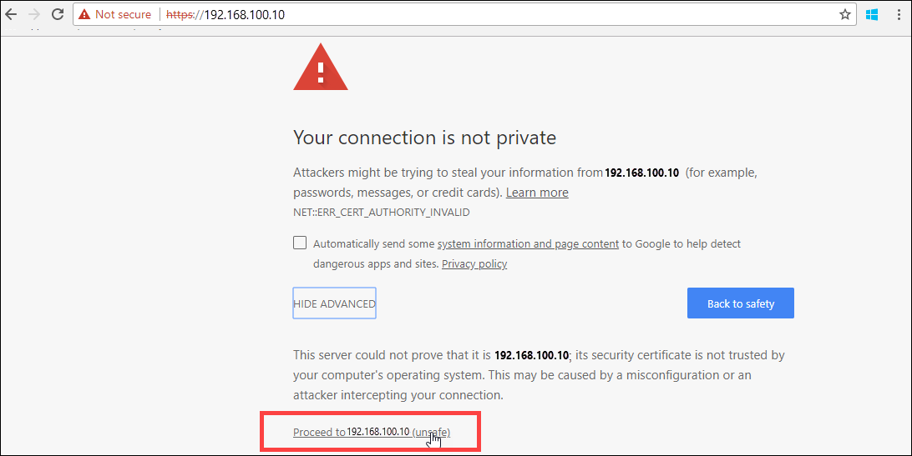
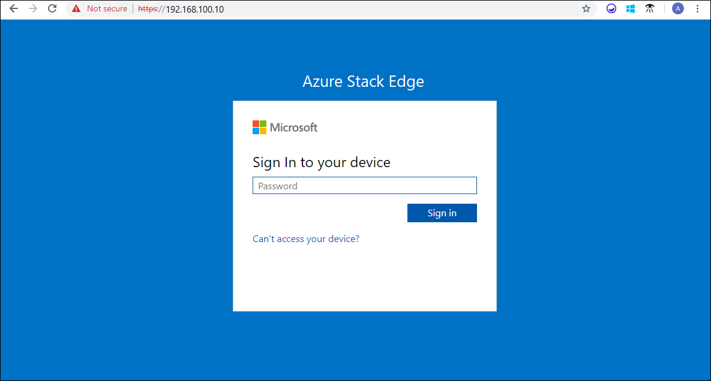

# Tutorial: Connect to Azure Stack Edge Pro with GPU

::: zone pivot="single-node"

This tutorial describes how you can connect to your Azure Stack Edge Pro device with an onboard GPU by using the local web UI.

The connection process can take around 5 minutes to complete.

::: zone-end

::: zone pivot="two-node"

This tutorial describes how you can connect to the local web UI on the two nodes of your Azure Stack Edge device.

The connection process can take around 10-15 minutes to complete.

::: zone-end

In this tutorial, you learn about:

> [!div class="checklist"]
>
> * Prerequisites
> * Connect to a physical device

## Prerequisites

Before you configure and set up your Azure Stack Edge Pro GPU device, make sure that:

* You've installed the physical device as detailed in [Install Azure Stack Edge Pro](azure-stack-edge-gpu-deploy-install.md).
* You've run the Azure Stack Network Readiness Checker tool to verify that your network meets Azure Stack Edge requirements. For instructions, see [Check network readiness for Azure Stack Edge devices](azure-stack-edge-deploy-check-network-readiness.md).

## Connect to the local web UI setup

::: zone pivot="single-node"

1. Configure the Ethernet adapter on your computer to connect to the Azure Stack Edge Pro device with a static IP address of 192.168.100.5 and subnet 255.255.255.0.

2. Connect the computer to PORT 1 on your device. If connecting the computer to the device directly (without a switch), use an Ethernet crossover cable or a USB Ethernet adapter. 

    The backplane of the device may look slightly different depending on the exact model you have received. Use the illustrations in [Cable your device](azure-stack-edge-gpu-deploy-install.md#cable-the-device) to identify Port 1 on your device.

3. Open a browser window and access the local web UI of the device at `https://192.168.100.10`.  
    This action may take a few minutes after you've turned on the device.

    You see an error or a warning indicating that there is a problem with the website's security certificate. 
   
    

4. Select **Continue to this webpage**.  
    These steps might vary depending on the browser you're using.

5. Sign in to the web UI of your device. The default password is *Password1*. 
   
    

6. At the prompt, change the device administrator password.  
    The new password must contain between 8 and 16 characters. It must contain three of the following characters: uppercase, lowercase, numeric, and special characters.

You're now at the **Overview** page of your device. The next step is to configure the network settings for your device.

::: zone-end

::: zone pivot="two-node"

1. Configure the Ethernet adapter on your computer to connect to the first node of your Azure Stack Edge device with a static IP address of 192.168.100.5 and subnet 255.255.255.0.

1. Connect the computer to PORT 1 on the first node of your 2-node device. If connecting the computer to the device directly (without a switch), use an Ethernet crossover cable or a USB Ethernet adapter. 

    The backplane of the device may look slightly different depending on the exact model you have received. Use the illustrations in [Cable your device](azure-stack-edge-gpu-deploy-install.md#cable-the-device) to identify Port 1 on your device.

1. Open a browser window and access the local web UI of the device at `https://192.168.100.10`.  
    This action may take a few minutes after you've turned on the device.

    You see an error or a warning indicating that there is a problem with the website's security certificate. 
   
    

1. Select **Continue to this webpage**.  
    These steps might vary depending on the browser you're using.

1. Sign in to the web UI of your device. The default password is *Password1*. 
   
    

1. At the prompt, change the device administrator password.  
    The new password must contain between 8 and 16 characters. It must contain three of the following characters: uppercase, lowercase, numeric, and special characters. You're now at the **Overview** page in the local web UI of the first node of your 2-node device.

1. Repeat the above steps to connect to the second node of your 2-node device. 

The next step is to configure the network settings for your device.

::: zone-end

## Next steps

In this tutorial, you learned about:

> [!div class="checklist"]
> * Prerequisites
> * Connect to a physical device

To learn how to configure network settings on your Azure Stack Edge Pro device, see:

> [!div class="nextstepaction"]
> [Configure network](./azure-stack-edge-gpu-deploy-configure-network-compute-web-proxy.md)
