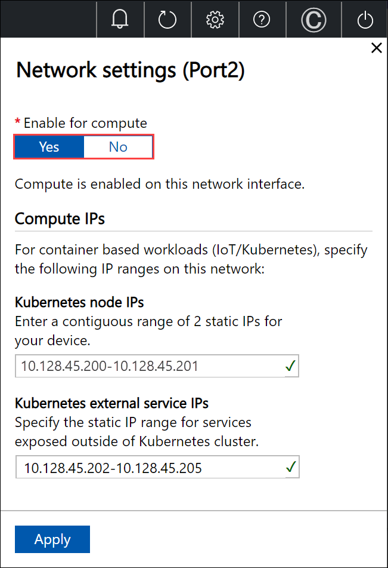

# Enable compute on your Azure Stack Edge device

This article describes how to enable compute on your Azure Stack Edge device. Once you enable compute on your device, you have the option of deploying IoT Edge modules, Kubernetes, or virtual machines.

In this tutorial, you learn about:

> [!div class="checklist"]
> * Prerequisites
> * Enabling compute on your device

## Prerequisites

Before you begin, make sure that:

1. You've access to a 1-node or a 4-node Azure Stack Edge device. This device is activated with a resource in Azure as per the steps in [Tutorial: Activate your Azure Stack Edge](azure-stack-edge-gpu-deploy-activate.md). 

2. You've a client that you will use to access your Azure Stack Edge device. The client is running a [Supported operating system](azure-stack-edge-system-requirements.md#supported-os-for-clients-connected-to-device). 

## Enable compute

1. Enable compute on your Azure Stack Edge device. To enable compute, in the local web UI of your device, go to the **Compute** page. 

2. Select a network interface that you want to enable for compute. Select **Enable**. Enabling compute results in the creation of a virtual switch on your device on that network interface. This virtual switch is used if you deploy virtual machines on your device. 
    
3. Assign **Kubernetes node IPs**. These static IP addresses are for the compute VM. For a 4-node device, a contiguous range of a minimum of 5 IPv4 addresses (or more) are provided for the compute VM using the start and end IP addresses. For a 1-node device, a minimum of 2 contiguous IPv4 addresses are provided. 

4. Assign **Kubernetes external service IPs**. These are also the load balancing IP addresses. These contiguous IP addresses are for services that you want to expose outside of the Kubernetes cluster and you specify the static IP range depending on the number of services exposed. Azure Stack Edge Hub service is used by downstream devices to connect to IoT Edge. 
    
    We strongly recommend that you specify a minimum of 1 IP address for Azure Stack Edge Hub service to access compute modules. You can then optionally specify additional IP addresses for other services/IoT Edge modules (1 per service/module) that need to be accessed from outside the cluster. The service IP addresses can be updated later. 
    
5. Select **Apply**.

    

6. Go to the **Device** page. Under the **Device endpoints**, copy the **Kubernetes API service** endpoint. This endpoint is a string in the following format: `https://compute.<device-name>.<DNS-domain>[device-IP-address]`. 

    

    Save and use this string on a client that you will use to access the Azure Stack Edge device.

<!--## Prepare client to access device

1. Add a DNS entry to the hosts file on your client system. Run Notepad as administrator and open the `hosts` file located at `C:\windows\system32\drivers\etc\hosts`. 

2. Use the information that you saved from the **Device** page in the local UI in the earlier step to create the entry in the hosts file. 

    For example, copy this endpoint `https://compute.asedevice.microsoftdatabox.com/[10.100.10.10]` to create the following entry with device IP address and DNS domain: 

    `10.100.10.10 compute.asedevice.microsoftdatabox.com`

This client is now ready to be used to access the device.
-->

## Next steps

In this tutorial, you learned how to:

> [!div class="checklist"]
> * Prerequisites
> * Enabling compute on your device

To learn how to transfer data with your Azure Stack Edge device, see:

> [!div class="nextstepaction"]
> [Transfer data with Azure Stack Edge](./azure-stack-edge-j-series-deploy-add-shares.md)
