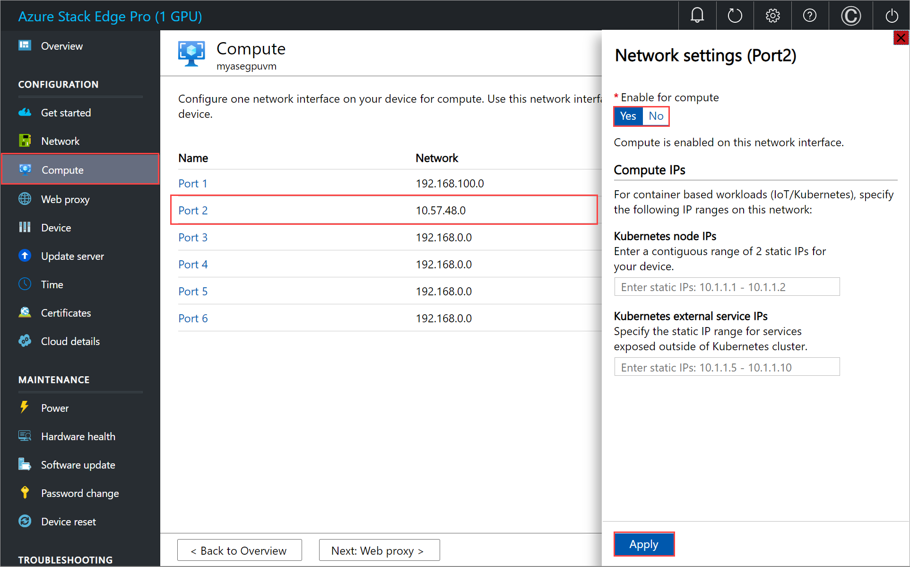
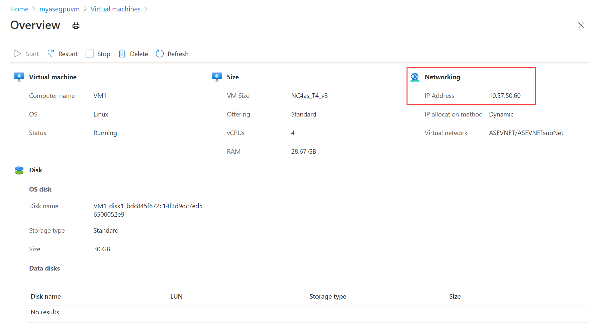

# GPU VMs for your Azure Stack Edge Pro device

[!INCLUDE [applies-to-GPU-and-pro-r-skus](../../includes/azure-stack-edge-applies-to-gpu-pro-r-sku.md)]

This article provides an overview of GPU virtual machines (VMs) on your Azure Stack Edge Pro device. The article describes how to create a GPU VM and then install GPU driver extension to install appropriate Nvidia drivers. Use the Azure Resource Manager templates to create the GPU VM and install the GPU driver extension. 

This article applies to Azure Stack Edge Pro GPU and Azure Stack Edge Pro R devices.

## About GPU VMs

Your Azure Stack Edge Pro devices are equipped with 1 or 2 of Nvidia's Tesla T4 GPU. To deploy GPU-accelerated VM workloads on these devices, use GPU optimized VM sizes. For example, the NC T4 v3-series should be used to deploy inference workloads featuring T4 GPUs. 

For more information, see [NC T4 v3-series VMs](../virtual-machines/nct4-v3-series.md).

## Supported OS and GPU drivers 

To take advantage of the GPU capabilities of Azure N-series VMs, Nvidia GPU drivers must be installed. 

The Nvidia GPU driver extension installs appropriate Nvidia CUDA or GRID drivers. You can install or manage the extension using the Azure Resource Manager templates.

### Supported OS for GPU extension for Windows

This extension supports the following operating systems (OSs). Other versions may work but have not been tested in-house on GPU VMs running on Azure Stack Edge Pro devices.

| Distribution | Version |
|---|---|
| Windows Server 2019 | Core |
| Windows Server 2016 | Core |

### Supported OS for GPU extension for Linux

This extension supports the following OS distros, depending on the driver support for specific OS version. Other versions may work but have not been tested in-house on GPU VMs running on Azure Stack Edge Pro devices.


| Distribution | Version |
|---|---|
| Ubuntu | 18.04 LTS |
| Red Hat Enterprise Linux | 7.4 |


## GPU VMs and Kubernetes

Before you deploy GPU VMs on your device, review the following considerations if  Kubernetes is configured on the device.

#### For 1-GPU device: 

- **Create a GPU VM followed by Kubernetes configuration on your device**: In this scenario, the GPU VM creation and Kubernetes configuration will both be successful. Kubernetes will not have access to the GPU in this case.

- **Configure Kubernetes on your device followed by creation of a GPU VM**: In this scenario, the Kubernetes will claim the GPU on your device and the VM creation will fail as there are no GPU resources available.

#### For 2-GPU device

- **Create a GPU VM followed by Kubernetes configuration on your device**: In this scenario, the GPU VM that you create will claim one GPU on your device and Kubernetes configuration will also be successful and claim the remaining one GPU.	

- **Create two GPU VMs followed by Kubernetes configuration on your device**: In this scenario, the two GPU VMs will claim the two GPUs on the device and the Kubernetes is configured successfully with no GPUs. 

- **Configure Kubernetes on your device followed by creation of a GPU VM**: In this scenario, the Kubernetes will claim both the GPUs on your device and the VM creation will fail as no GPU resources are available.

If you have GPU VMs running on your device and Kubernetes is also configured, then anytime the VM is deallocated (when you stop or remove a VM using Stop-AzureRmVM or Remove-AzureRmVM), there is a risk that the Kubernetes cluster will claim all the GPUs available on the device. In such an instance, you will not be able to restart the GPU VMs deployed on your device or create GPU VMs.


## Create GPU VMs

Follow these steps when deploying GPU VMs on your device:

1. Identify if your device will also be running Kubernetes. If the device will run Kubernetes, then you'll need to create the GPU VM first and then configure Kubernetes. If Kubernetes is configured first, then it will claim all the available GPU resources and the GPU VM creation will fail.

1. [Download the VM templates and parameters files](https://aka.ms/ase-vm-templates) to your client machine. Unzip it into a directory you’ll use as a working directory.

1. To create GPU VMs, follow all the steps in the [Deploy VM on your Azure Stack Edge Pro using templates](azure-stack-edge-gpu-deploy-virtual-machine-templates.md) except for the following differences: 

    1. While configuring compute network, enable the port that is connected to the Internet, for compute. This allows you to download the GPU drivers required for GPU extensions for your GPU VMs.

        Here is an example where Port 2 was connected to the internet and was used to enable the compute network. If you've identified that Kubernetes is not needed in the earlier step, you can skip the Kubernetes node IP and external service IP assignment.

        

            
    1. Create a VM using the templates. When specifying GPU VM sizes, make sure to use the NCasT4-v3-series in the `CreateVM.parameters.json` as these are supported for GPU VMs. For more information, see [Supported VM sizes for GPU VMs](azure-stack-edge-gpu-virtual-machine-sizes.md#ncast4_v3-series-preview).

        ```json
            "vmSize": {
          "value": "Standard_NC4as_T4_v3"
        },
        ```

    1. Once the GPU VM is successfully created, you can view this VM in the list of virtual machines in your Azure Stack Edge resource in the Azure portal.

        

1. Select the VM and drill down to the details. Copy the IP allocated to the VM.

    

1. After the VM is created, deploy GPU extension using the extension template. For linux VMs, see [Install GPU extension for Linux](#gpu-extension-for-linux) and for Windows VMs, see [Install GPU extension for Windows](#gpu-extension-for-windows).

1. To verify GPU extension install, connect to the GPU VM:
    1. If using a Windows VM, follow the steps in [Connect to a Windows VM](azure-stack-edge-gpu-deploy-virtual-machine-powershell.md#connect-to-a-windows-vm). [Verify the installation](#verify-windows-driver-installation).
    1. If using a Linux VM, follow the steps in [Connect to a Linux VM](azure-stack-edge-gpu-deploy-virtual-machine-powershell.md#connect-to-a-linux-vm). [Verify the installation](#verify-linux-driver-installation).

1. If needed, you could switch the compute network back to whatever you need. 


> [!NOTE]
> When updating your device software version from 2012 to later, you will need to manually stop the GPU VMs.


## Install GPU extension

Depending on the operating system for your VM, you could install GPU extension for Windows or for Linux.

> [!NOTE]
> Before you install the GPU extension, make sure that the port enabled for compute network on your device is connected to Internet and has access. The GPU drivers are downloaded through the internet access.

### GPU extension for Windows

To deploy Nvidia GPU drivers for an existing VM, edit the `addGPUExtWindowsVM.parameters.json` parameters file and then deploy the template `addGPUextensiontoVM.json`.

#### Edit parameters file

The file `addGPUExtWindowsVM.parameters.json` takes the following parameters:

```json
"parameters": {	
	"vmName": {
	"value": "<name of the VM>" 
	},
	"extensionName": {
	"value": "<name for the extension. Example: windowsGpu>" 
	},
	"publisher": {
	"value": "Microsoft.HpcCompute" 
	},
	"type": {
	"value": "NvidiaGpuDriverWindows" 
	},
	"typeHandlerVersion": {
	"value": "1.3" 
	},
	"settings": {
	"value": {
	"DriverURL" : "http://us.download.nvidia.com/tesla/442.50/442.50-tesla-desktop-winserver-2019-2016-international.exe",
	"DriverCertificateUrl" : "https://go.microsoft.com/fwlink/?linkid=871664",
	"DriverType":"CUDA"
	}
	}
	}
```

Here is a sample parameter file that was used in this article:

```powershell
PS C:\WINDOWS\system32> $templateFile = "C:\12-09-2020\CreateVM\CreateVM.json"
PS C:\WINDOWS\system32> $templateParameterFile = "C:\12-09-2020\CreateVM\CreateVM.parameters.json"
PS C:\WINDOWS\system32> $RGName = "myasegpuvm1"
PS C:\WINDOWS\system32> New-AzureRmResourceGroupDeployment -ResourceGroupName $RGName -TemplateFile $templateFile -TemplateParameterFile $templateParameterFile -Name "deployment2"

DeploymentName          : deployment2
ResourceGroupName       : myasegpuvm1
ProvisioningState       : Succeeded
Timestamp               : 12/16/2020 12:02:56 AM
Mode                    : Incremental
TemplateLink            :
Parameters              :
                          Name             Type                       Value
                          ===============  =========================  ==========
                          vmName           String                     VM2
                          adminUsername    String                     Administrator
                          password         String                     Password1
                          imageName        String                     myasewindowsimg
                          vmSize           String                     Standard_NC4as_T4_v3
                          vnetName         String                     ASEVNET
                          vnetRG           String                     aserg
                          subnetName       String                     ASEVNETsubNet
                          nicName          String                     nic6
                          ipConfigName     String                     ipconfig6
                          privateIPAddress  String

Outputs                 :
DeploymentDebugLogLevel :
PS C:\WINDOWS\system32>
```
#### Deploy template

Deploy the template `addGPUextensiontoVM.json`. This template deploys extension to an existing VM. Run the following command:

```powershell
$templateFile = "<Path to addGPUextensiontoVM.json>" 
$templateParameterFile = "<Path to addGPUExtWindowsVM.parameters.json>" 
$RGName = "<Name of your resource group>"
New-AzureRmResourceGroupDeployment -ResourceGroupName $RGName -TemplateFile $templateFile -TemplateParameterFile $templateParameterFile -Name "<Name for your deployment>"
```
> [!NOTE]
> The extension deployment is a long running job and takes about 10 minutes to complete.

Here is a sample output:

```powershell
PS C:\WINDOWS\system32> "C:\12-09-2020\ExtensionTemplates\addGPUextensiontoVM.json"
C:\12-09-2020\ExtensionTemplates\addGPUextensiontoVM.json
PS C:\WINDOWS\system32> $templateFile = "C:\12-09-2020\ExtensionTemplates\addGPUextensiontoVM.json"
PS C:\WINDOWS\system32> $templateParameterFile = "C:\12-09-2020\ExtensionTemplates\addGPUExtWindowsVM.parameters.json"
PS C:\WINDOWS\system32> $RGName = "myasegpuvm1"
PS C:\WINDOWS\system32> New-AzureRmResourceGroupDeployment -ResourceGroupName $RGName -TemplateFile $templateFile -TemplateParameterFile $templateParameterFile -Name "deployment3"

DeploymentName          : deployment3
ResourceGroupName       : myasegpuvm1
ProvisioningState       : Succeeded
Timestamp               : 12/16/2020 12:18:50 AM
Mode                    : Incremental
TemplateLink            :
Parameters              :
                          Name             Type                       Value
                          ===============  =========================  ==========
                          vmName           String                     VM2
                          extensionName    String                     windowsgpuext
                          publisher        String                     Microsoft.HpcCompute
                          type             String                     NvidiaGpuDriverWindows
                          typeHandlerVersion  String                     1.3
                          settings         Object                     {
                            "DriverURL": "http://us.download.nvidia.com/tesla/442.50/442.50-tesla-desktop-winserver-2019-2016-international.exe",
                            "DriverCertificateUrl": "https://go.microsoft.com/fwlink/?linkid=871664",
                            "DriverType": "CUDA"
                          }

Outputs                 :
DeploymentDebugLogLevel :
PS C:\WINDOWS\system32>
```
#### Track deployment

To check the deployment state of extensions for a given VM, run the following command: 

```powershell
Get-AzureRmVMExtension -ResourceGroupName <Name of resource group> -VMName <Name of VM> -Name <Name of the extension>
```
Here is a sample output:

```powershell
PS C:\WINDOWS\system32> Get-AzureRmVMExtension -ResourceGroupName myasegpuvm1 -VMName VM2 -Name windowsgpuext

ResourceGroupName       : myasegpuvm1
VMName                  : VM2
Name                    : windowsgpuext
Location                : dbelocal
Etag                    : null
Publisher               : Microsoft.HpcCompute
ExtensionType           : NvidiaGpuDriverWindows
TypeHandlerVersion      : 1.3
Id                      : /subscriptions/947b3cfd-7a1b-4a90-7cc5-e52caf221332/resourceGroups/myasegpuvm1/providers/Microsoft.Compute/virtualMachines/VM2/extensions/windowsgpuext
PublicSettings          : {
                            "DriverURL": "http://us.download.nvidia.com/tesla/442.50/442.50-tesla-desktop-winserver-2019-2016-international.exe",
                            "DriverCertificateUrl": "https://go.microsoft.com/fwlink/?linkid=871664",
                            "DriverType": "CUDA"
                          }
ProtectedSettings       :
ProvisioningState       : Creating
Statuses                :
SubStatuses             :
AutoUpgradeMinorVersion : True
ForceUpdateTag          :

PS C:\WINDOWS\system32>
```

Extension execution output is logged to the following file. Refer to this file `C:\Packages\Plugins\Microsoft.HpcCompute.NvidiaGpuDriverWindows\1.3.0.0\Status` to track the status of installation. 


A successful install is indicated by a `message` as `Enable Extension` and `status` as `success`.

```powershell
"status":  {
                       "formattedMessage":  {
                                                "message":  "Enable Extension",
                                                "lang":  "en"
                                            },
                       "name":  "NvidiaGpuDriverWindows",
                       "status":  "success",
```

#### Verify Windows driver installation

Sign in to the VM and run the nvidia-smi command-line utility installed with the driver. The `nvidia-smi.exe` is located at  `C:\Program Files\NVIDIA Corporation\NVSMI\nvidia-smi.exe`. If you do not see the file, it's possible that the driver installation is still running in the background. Wait for 10 minutes and check again.

If the driver is installed, you see an output similar to the following sample: 

```powershell
PS C:\Users\Administrator> cd "C:\Program Files\NVIDIA Corporation\NVSMI"
PS C:\Program Files\NVIDIA Corporation\NVSMI> ls

    Directory: C:\Program Files\NVIDIA Corporation\NVSMI

Mode                LastWriteTime         Length Name
----                -------------         ------ ----
-a----        2/26/2020  12:00 PM         849640 MCU.exe
-a----        2/26/2020  12:00 PM         443104 nvdebugdump.exe
-a----        2/25/2020   2:06 AM          81823 nvidia-smi.1.pdf
-a----        2/26/2020  12:01 PM         566880 nvidia-smi.exe
-a----        2/26/2020  12:01 PM         991344 nvml.dll

PS C:\Program Files\NVIDIA Corporation\NVSMI> .\nvidia-smi.exe
Wed Dec 16 00:35:51 2020
+-----------------------------------------------------------------------------+
| NVIDIA-SMI 442.50       Driver Version: 442.50       CUDA Version: 10.2     |
|-------------------------------+----------------------+----------------------+
| GPU  Name            TCC/WDDM | Bus-Id        Disp.A | Volatile Uncorr. ECC |
| Fan  Temp  Perf  Pwr:Usage/Cap|         Memory-Usage | GPU-Util  Compute M. |
|===============================+======================+======================|
|   0  Tesla T4            TCC  | 0000503C:00:00.0 Off |                    0 |
| N/A   35C    P8    11W /  70W |      8MiB / 15205MiB |      0%      Default |
+-------------------------------+----------------------+----------------------+

+-----------------------------------------------------------------------------+
| Processes:                                                       GPU Memory |
|  GPU       PID   Type   Process name                             Usage      |
|=============================================================================|
|  No running processes found                                                 |
+-----------------------------------------------------------------------------+
PS C:\Program Files\NVIDIA Corporation\NVSMI>
```

For more information, see [Nvidia GPU driver extension for Windows](../virtual-machines/extensions/hpccompute-gpu-windows.md).

### GPU extension for Linux

To deploy Nvidia GPU drivers for an existing VM, edit the parameters file and then deploy the template `addGPUextensiontoVM.json`. There are specific parameters files for Ubuntu and Red Hat Enterprise Linux (RHEL) as discussed in the following sections.

#### Edit parameters file

If using Ubuntu, the `addGPUExtLinuxVM.parameters.json` file takes the following parameters:

```powershell
"parameters": {	
	"vmName": {
	"value": "<name of the VM>" 
	},
	"extensionName": {
	"value": "<name for the extension. Example: linuxGpu>" 
	},
	"publisher": {
	"value": "Microsoft.HpcCompute" 
	},
	"type": {
	"value": "NvidiaGpuDriverLinux" 
	},
	"typeHandlerVersion": {
	"value": "1.3" 
	},
	"settings": {
	"value": {
	"DRIVER_URL": "https://go.microsoft.com/fwlink/?linkid=874271",
	"PUBKEY_URL": "http://download.microsoft.com/download/F/F/A/FFAC979D-AD9C-4684-A6CE-C92BB9372A3B/7fa2af80.pub",
	"CUDA_ver": "10.0.130",
	"InstallCUDA": "true"
	}
	}
	}
```
If using Red Hat Enterprise Linux (RHEL), the `addGPUExtensionRHELVM.parameters.json` file takes the following parameters:

```powershell
{
    "$schema": "https://schema.management.azure.com/schemas/2019-04-01/deploymentParameters.json#",
    "contentVersion": "1.0.0.0",
    "parameters": {
        "vmName": {
            "value": "<name of the VM>" 
        },
        "extensionName": {
            "value": "<name for the extension. Example: linuxGpu>" 
        },
        "publisher": {
            "value": "Microsoft.HpcCompute" 
        },
        "type": {
            "value": "NvidiaGpuDriverLinux" 
        },
        "typeHandlerVersion": {
            "value": "1.3" 
        },
        "settings": {
            "value": {
                    "isCustomInstall":true,
                    "DRIVER_URL":"https://go.microsoft.com/fwlink/?linkid=874273",
                    "CUDA_ver":"10.0.130",
                    "PUBKEY_URL":"http://download.microsoft.com/download/F/F/A/FFAC979D-AD9C-4684-A6CE-C92BB9372A3B/7fa2af80.pub",
                    "DKMS_URL":"https://dl.fedoraproject.org/pub/epel/epel-release-latest-7.noarch.rpm",
                    "LIS_URL":"https://aka.ms/lis",
                    "LIS_RHEL_ver":"3.10.0-1062.9.1.el7"
            }
        }
    }
}
```


Here is a sample Ubuntu parameter file that was used in this article:

```powershell
{
    "$schema": "https://schema.management.azure.com/schemas/2019-04-01/deploymentParameters.json#",
    "contentVersion": "1.0.0.0",
    "parameters": {
        "vmName": {
            "value": "VM1" 
        },
        "extensionName": {
            "value": "gpuLinux" 
        },
        "publisher": {
            "value": "Microsoft.HpcCompute" 
        },
        "type": {
            "value": "NvidiaGpuDriverLinux" 
        },
        "typeHandlerVersion": {
            "value": "1.3" 
        },
        "settings": {
            "value": {
            "DRIVER_URL": "https://go.microsoft.com/fwlink/?linkid=874271",
            "PUBKEY_URL": "http://download.microsoft.com/download/F/F/A/FFAC979D-AD9C-4684-A6CE-C92BB9372A3B/7fa2af80.pub",
            "CUDA_ver": "10.0.130",
            "InstallCUDA": "true"
            }
        }
    }
}
```


#### Deploy template

Deploy the template `addGPUextensiontoVM.json`. This template deploys extension to an existing VM. Run the following command:

```powershell
$templateFile = "Path to addGPUextensiontoVM.json" 
$templateParameterFile = "Path to addGPUExtLinuxVM.parameters.json" 
$RGName = "<Name of your resource group>" 
New-AzureRmResourceGroupDeployment -ResourceGroupName $RGName -TemplateFile $templateFile -TemplateParameterFile $templateParameterFile -Name "<Name for your deployment>"
```	

> [!NOTE]
> The extension deployment is a long running job and takes about 10 minutes to complete.

Here is a sample output:

```powershell
Copyright (C) Microsoft Corporation. All rights reserved.
Try the new cross-platform PowerShell https://aka.ms/pscore6

PS C:\WINDOWS\system32> $templateFile = "C:\12-09-2020\ExtensionTemplates\addGPUextensiontoVM.json"
PS C:\WINDOWS\system32> $templateParameterFile = "C:\12-09-2020\ExtensionTemplates\addGPUExtLinuxVM.parameters.json"
PS C:\WINDOWS\system32> $RGName = "rg2"
PS C:\WINDOWS\system32> New-AzureRmResourceGroupDeployment -ResourceGroupName $RGName -TemplateFile $templateFile -TemplateParameterFile $templateParameterFile -Name "delpoyment7"

DeploymentName          : delpoyment7
ResourceGroupName       : rg2
ProvisioningState       : Succeeded
Timestamp               : 12/10/2020 10:43:23 PM
Mode                    : Incremental
TemplateLink            :
Parameters              :
                          Name             Type                       Value
                          ===============  =========================  ==========
                          vmName           String                     VM1
                          extensionName    String                     gpuLinux
                          publisher        String                     Microsoft.HpcCompute
                          type             String                     NvidiaGpuDriverLinux
                          typeHandlerVersion  String                     1.3
                          settings         Object                     {
                            "DRIVER_URL": "https://go.microsoft.com/fwlink/?linkid=874271",
                            "PUBKEY_URL":
                          "http://download.microsoft.com/download/F/F/A/FFAC979D-AD9C-4684-A6CE-C92BB9372A3B/7fa2af80.pub",
                            "CUDA_ver": "10.0.130",
                            "InstallCUDA": "true"
                          }

Outputs                 :
DeploymentDebugLogLevel :
PS C:\WINDOWS\system32>
```

#### Track deployment status	
	
Template deployment is a long running job. To check the deployment state of extensions for a given VM, open another PowerShell session (run as administrator). Run the following command: 

```powershell
Get-AzureRmVMExtension -ResourceGroupName myResourceGroup -VMName <VM Name> -Name <Extension Name>
```
Here is a sample output: 

```powershell
Copyright (C) Microsoft Corporation. All rights reserved.
Try the new cross-platform PowerShell https://aka.ms/pscore6

PS C:\WINDOWS\system32> Get-AzureRmVMExtension -ResourceGroupName rg2 -VMName VM1 -Name gpulinux

ResourceGroupName       : rg2
VMName                  : VM1
Name                    : gpuLinux
Location                : dbelocal
Etag                    : null
Publisher               : Microsoft.HpcCompute
ExtensionType           : NvidiaGpuDriverLinux
TypeHandlerVersion      : 1.3
Id                      : /subscriptions/947b3cfd-7a1b-4a90-7cc5-e52caf221332/resourceGroups/rg2/providers/Microsoft.Compute/virtualMachines/VM1/extensions/gpuLinux
PublicSettings          : {
                            "DRIVER_URL": "https://go.microsoft.com/fwlink/?linkid=874271",
                            "PUBKEY_URL": "http://download.microsoft.com/download/F/F/A/FFAC979D-AD9C-4684-A6CE-C92BB9372A3B/7fa2af80.pub",
                            "CUDA_ver": "10.0.130",
                            "InstallCUDA": "true"
                          }
ProtectedSettings       :
ProvisioningState       : Creating
Statuses                :
SubStatuses             :
AutoUpgradeMinorVersion : True
ForceUpdateTag          :

PS C:\WINDOWS\system32>
```

> [!NOTE]
> When the deployment is complete, the `ProvisioningState` changes to `Succeeded`.

The extension execution output is logged to the following file: `/var/log/azure/nvidia-vmext-status`.

#### Verify Linux driver installation

Follow these steps to verify the driver installation:

1. Connect to the GPU VM. Follow the instructions in [Connect to a Linux VM](azure-stack-edge-gpu-deploy-virtual-machine-powershell.md#connect-to-a-linux-vm). 

    Here is a sample output:

    ```powershell
    PS C:\WINDOWS\system32> ssh -l Administrator 10.57.50.60
    Administrator@10.57.50.60's password:
    Welcome to Ubuntu 18.04.4 LTS (GNU/Linux 5.0.0-1031-azure x86_64)
     * Documentation:  https://help.ubuntu.com
     * Management:     https://landscape.canonical.com
     * Support:        https://ubuntu.com/advantage
      System information as of Thu Dec 10 22:57:01 UTC 2020
    
      System load:  0.0                Processes:           133
      Usage of /:   24.8% of 28.90GB   Users logged in:     0
      Memory usage: 2%                 IP address for eth0: 10.57.50.60
      Swap usage:   0%
    
    249 packages can be updated.
    140 updates are security updates.
    
    Welcome to Ubuntu 18.04.4 LTS (GNU/Linux 5.0.0-1031-azure x86_64)    
     * Documentation:  https://help.ubuntu.com
     * Management:     https://landscape.canonical.com
     * Support:        https://ubuntu.com/advantage    
      System information as of Thu Dec 10 22:57:01 UTC 2020    
      System load:  0.0                Processes:           133
      Usage of /:   24.8% of 28.90GB   Users logged in:     0
      Memory usage: 2%                 IP address for eth0: 10.57.50.60
      Swap usage:   0%
        
    249 packages can be updated.
    140 updates are security updates.
    
    New release '20.04.1 LTS' available.
    Run 'do-release-upgrade' to upgrade to it.
        
    *** System restart required ***
    Last login: Thu Dec 10 21:49:29 2020 from 10.90.24.23
    To run a command as administrator (user "root"), use "sudo <command>".
    See "man sudo_root" for details.
    
    Administrator@VM1:~$
	```
2. Run the nvidia-smi command-line utility installed with the driver. If the driver is successfully installed, you will be able to run the utility and see the following output:

    ```powershell
    Administrator@VM1:~$ nvidia-smi
    Thu Dec 10 22:58:46 2020
    +-----------------------------------------------------------------------------+
    | NVIDIA-SMI 455.45.01    Driver Version: 455.45.01    CUDA Version: 11.1     |
    |-------------------------------+----------------------+----------------------+
    | GPU  Name        Persistence-M| Bus-Id        Disp.A | Volatile Uncorr. ECC |
    | Fan  Temp  Perf  Pwr:Usage/Cap|         Memory-Usage | GPU-Util  Compute M. |
    |                               |                      |               MIG M. |
    |===============================+======================+======================|
    |   0  Tesla T4            Off  | 0000941F:00:00.0 Off |                    0 |
    | N/A   48C    P0    27W /  70W |      0MiB / 15109MiB |      5%      Default |
    |                               |                      |                  N/A |
    +-------------------------------+----------------------+----------------------+
    
    +-----------------------------------------------------------------------------+
    | Processes:                                                                  |
    |  GPU   GI   CI        PID   Type   Process name                  GPU Memory |
    |        ID   ID                                                   Usage      |
    |=============================================================================|
    |  No running processes found                                                 |
    +-----------------------------------------------------------------------------+
    Administrator@VM1:~$
    ```

For more information, see [Nvidia GPU driver extension for Linux](../virtual-machines/extensions/hpccompute-gpu-linux.md).

## Remove GPU extension

To remove the GPU extension, use the following command:

`Remove-AzureRmVMExtension -ResourceGroupName <Resource group name> -VMName <VM name> -Name <Extension name>`

Here is a sample output:

```powershell
PS C:\azure-stack-edge-deploy-vms> Remove-AzureRmVMExtension -ResourceGroupName rgl -VMName WindowsVM -Name windowsgpuext
Virtual machine extension removal operation
This cmdlet will remove the specified virtual machine extension. Do you want to continue? [Y] Yes [N] No [S] Suspend [?] Help (default is "Y"): y
Requestld IsSuccessStatusCode StatusCode ReasonPhrase
--------- ------------------- ---------- ------------    
          True                OK         OK
```


## Next steps

[Azure Resource Manager cmdlets](/powershell/module/azurerm.resources/?view=azurermps-6.13.0&preserve-view=true)