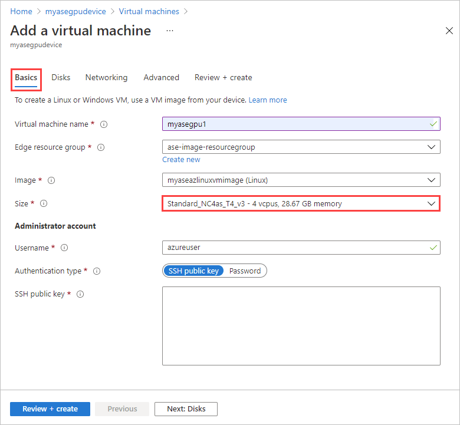
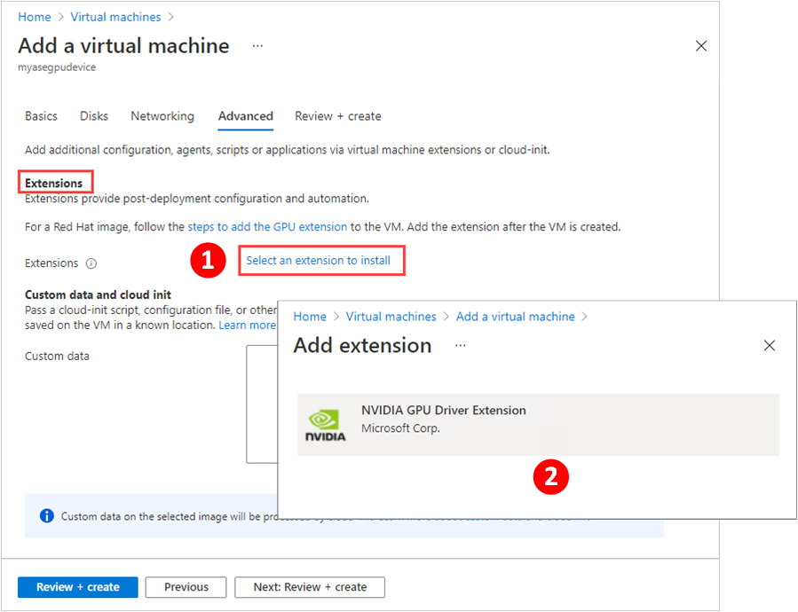
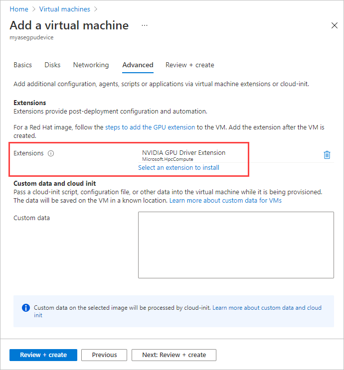
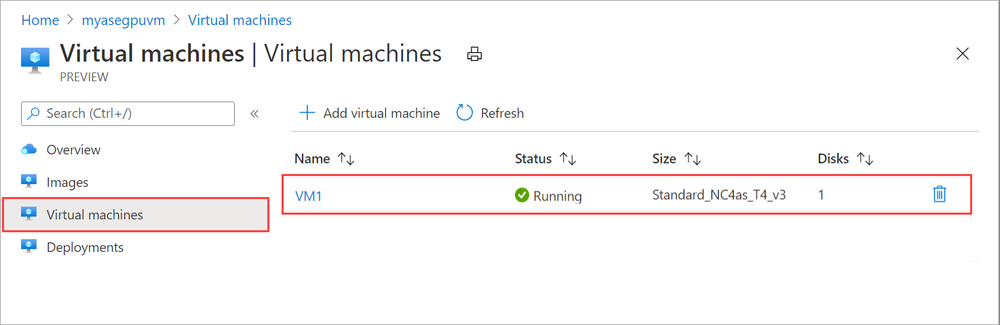
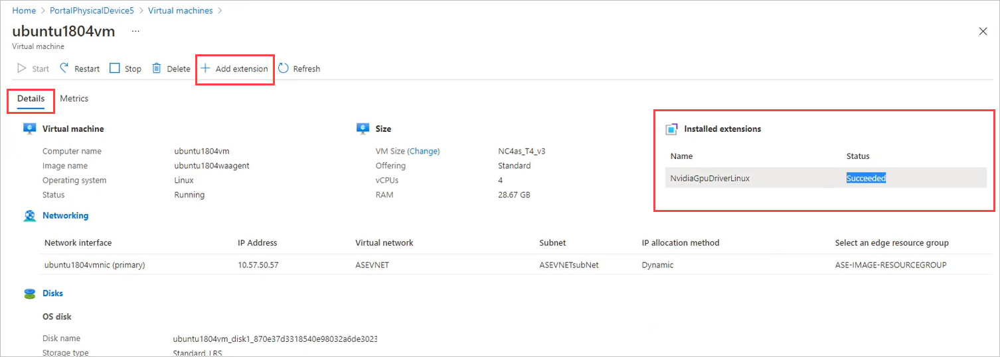
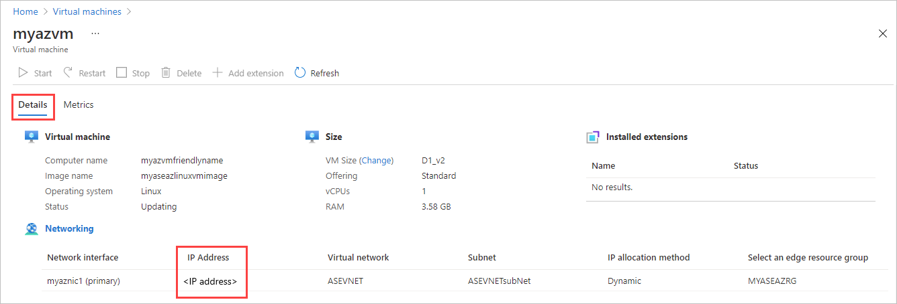
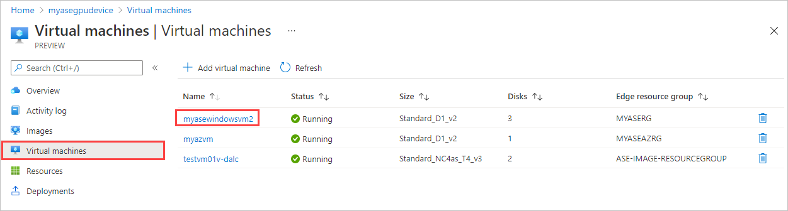
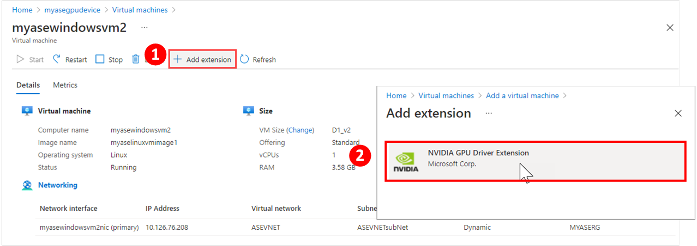

# Deploy GPU VMs on your Azure Stack Edge Pro GPU device

[!INCLUDE [applies-to-gpu-pro-pro2-and-pro-r-skus](../../includes/azure-stack-edge-applies-to-gpu-pro-pro-2-pro-r-sku.md)]

This article describes how to create a GPU VM in the Azure portal or by using the Azure Resource Manager templates.

Use the Azure portal to quickly deploy a single GPU VM. You can install the GPU extension during or after VM creation. Or use Azure Resource Manager templates to efficiently deploy and manage multiple GPU VMs.

## Create GPU VMs

You can deploy a GPU VM via the portal or using Azure Resource Manager templates.

For a list of supported operating systems, drivers, and VM sizes for GPU VMs, see [What are GPU virtual machines?](azure-stack-edge-gpu-overview-gpu-virtual-machines.md) For deployment considerations, see [GPU VMs and Kubernetes](azure-stack-edge-gpu-overview-gpu-virtual-machines.md#gpu-vms-and-kubernetes).


> [!IMPORTANT]
> - Gen2 VMs are not supported for GPU.
> - If your device will be running Kubernetes, do not configure Kubernetes before you deploy your GPU VMs. If you configure Kubernetes first, it claims all the available GPU resources, and GPU VM creation will fail. For Kubernetes deployment considerations on 1-GPU and 2-GPU devices, see [GPU VMs and Kubernetes](azure-stack-edge-gpu-overview-gpu-virtual-machines.md#gpu-vms-and-kubernetes).
> - If you're running a Windows 2016 VHD, you must enable TLS 1.2 inside the VM before you install the GPU extension on 2205 and higher. For detailed steps, see [Troubleshoot GPU extension issues for GPU VMs on Azure Stack Edge Pro GPU](azure-stack-edge-gpu-troubleshoot-virtual-machine-gpu-extension-installation.md#failure-to-install-gpu-extension-on-a-windows-2016-vhd).

### [Portal](#tab/portal)

Follow these steps when deploying GPU VMs on your device via the Azure portal:

1. To create GPU VMs, follow all the steps in [Deploy VM on your Azure Stack Edge using Azure portal](azure-stack-edge-gpu-deploy-virtual-machine-portal.md), with these configuration requirements:

    - On the **Basics** tab, select a [VM size from N-series, optimized for GPUs](azure-stack-edge-gpu-virtual-machine-sizes.md#n-series-gpu-optimized). Based on the GPU model on your device, Nvidia T4 or Nvidia A2, the dropdown list will display the corresponding supported GPU VM sizes.  

       

    - To install the GPU extension during deployment, on the **Advanced** tab, choose **Select an extension to install**. Then select a GPU extension to install. GPU extensions are only available for a virtual machine with a [VM size from N-series](azure-stack-edge-gpu-virtual-machine-sizes.md#n-series-gpu-optimized).
        
        > [!NOTE]
        > If you're using a Red Hat image, you'll need to install the GPU extension after VM deployment. Follow the steps in [Install GPU extension](azure-stack-edge-gpu-deploy-virtual-machine-install-gpu-extension.md).
    
       

       The **Advanced** tab shows the extension you selected.

       

1. Once the GPU VM is successfully created, you can view this VM in the list of virtual machines in your Azure Stack Edge resource in the Azure portal.

    

    Select the VM, and drill down to the details. Make sure the GPU extension has **Succeeded** status.

    


### [Templates](#tab/templates)

Follow these steps when deploying GPU VMs on your device using Azure Resource Manager templates:

1. [Download the VM templates and parameters files](https://aka.ms/ase-vm-templates) to your client machine. Unzip it into a directory you’ll use as a working directory.

1. Before you can deploy VMs on your Azure Stack Edge device, you must configure your client to connect to the device via Azure Resource Manager over Azure PowerShell. For detailed instructions, see [Connect to Azure Resource Manager on your Azure Stack Edge device](azure-stack-edge-gpu-connect-resource-manager.md).

1. To create GPU VMs, follow all the steps in [Deploy VM on your Azure Stack Edge using templates](azure-stack-edge-gpu-deploy-virtual-machine-templates.md), with these configuration requirements: 
            
    - When specifying GPU VM sizes, make sure to use the NCasT4-v3-series in the `CreateVM.parameters.json`, which are supported for GPU VMs. For more information, see [Supported VM sizes for GPU VMs](azure-stack-edge-gpu-virtual-machine-sizes.md#n-series-gpu-optimized).

       ```json
           "vmSize": {
         "value": "Standard_NC4as_T4_v3"
       },
       ```

    Once the GPU VM is successfully created, you can view this VM in the list of virtual machines in your Azure Stack Edge resource in the Azure portal.

    

1. Select the VM, and drill down to the details. Copy the IP address allocated to the VM.

    

After the VM is created, you can [deploy the GPU extension using the extension template](azure-stack-edge-gpu-deploy-virtual-machine-install-gpu-extension.md?tabs=linux).

---

> [!NOTE]
> When updating your device software version from 2012 to later, you will need to manually stop the GPU VMs.

## Install GPU extension after deployment

To take advantage of the GPU capabilities of Azure N-series VMs, Nvidia GPU drivers must be installed. From the Azure portal, you can install the GPU extension during or after VM deployment. If you're using templates, you'll install the GPU extension after you create the VM.

---

### [Portal](#tab/portal)

If you didn't install the GPU extension when you created the VM, follow these steps to install it on the deployed VM:

1. Go to the virtual machine you want to add the GPU extension to.

    
  
1. In **Details**, select **+ Add extension**. Then select a GPU extension to install.

    GPU extensions are only available for a virtual machine with a [VM size from N-series](azure-stack-edge-gpu-virtual-machine-sizes.md#n-series-gpu-optimized). If you prefer, you can [install the GPU extension after deployment](azure-stack-edge-gpu-deploy-gpu-virtual-machine.md#install-gpu-extension-after-deployment).



> [!Note]
> You can't remove a GPU extension via the portal. Instead, use the [Remove-AzureRmVMExtension](/powershell/module/azurerm.compute/remove-azurermvmextension?view=azurermps-6.13.0&preserve-view=true) cmdlet in Azure PowerShell. For instructions, see [Remove GPU extension](azure-stack-edge-gpu-deploy-virtual-machine-install-gpu-extension.md#remove-gpu-extension)

### [Templates](#tab/templates)

When you create a GPU VM using templates, you install the GPU extension after deployment. For detailed steps for using templates to deploy a GPU extension on a Windows virtual machine or a Linux virtual machine, see [Install GPU extension](azure-stack-edge-gpu-deploy-virtual-machine-install-gpu-extension.md).

---

## Next steps

- [Troubleshoot VM deployment](azure-stack-edge-gpu-troubleshoot-virtual-machine-provisioning.md)
- [Troubleshoot GPU extension issues](azure-stack-edge-gpu-troubleshoot-virtual-machine-gpu-extension-installation.md)
- [Monitor VM activity on your device](azure-stack-edge-gpu-monitor-virtual-machine-activity.md)
- [Monitor CPU and memory on a VM](azure-stack-edge-gpu-monitor-virtual-machine-metrics.md)
