# Tutorial: Install Azure Stack Edge Pro with GPU

::: zone pivot="single-node"

This tutorial describes how to install an Azure Stack Edge Pro physical device with a GPU. The installation procedure involves unpacking, rack mounting, and cabling the device. 

The installation can take around two hours to complete.

::: zone-end

::: zone pivot="two-node"

This tutorial describes how to install a two-node Azure Stack Edge Pro GPU cluster. The installation procedure involves unpacking, rack mounting, and cabling the device. 

The installation can take around 2.5 hours to complete.

::: zone-end

In this tutorial, you learn how to:

> [!div class="checklist"]
> * Unpack the device
> * Rack mount the device
> * Cable the device

## Prerequisites

The prerequisites for installing a physical device as follows:

### For the Azure Stack Edge resource

Before you begin, make sure that:

* You've completed all the steps in [Prepare to deploy Azure Stack Edge Pro with GPU](azure-stack-edge-gpu-deploy-prep.md).
    * You've created an Azure Stack Edge resource to deploy your device.
    * You've generated the activation key to activate your device with the Azure Stack Edge resource.

 
### For the Azure Stack Edge Pro physical device

Before you deploy a device:

- Make sure that the device rests safely on a flat, stable, and level work surface.
- Verify that the site where you intend to set up has:
    - Standard AC power from an independent source.

        -OR-
    - A rack power distribution unit (PDU) with an uninterruptible power supply (UPS).
    - An available 1U slot on the rack on which you intend to mount the device.

### For the network in the datacenter

Before you begin:

- Review the networking requirements for deploying Azure Stack Edge Pro, and configure the datacenter network per the requirements. For more information, see [Azure Stack Edge Pro networking requirements](azure-stack-edge-system-requirements.md#networking-port-requirements).

- Make sure that the minimum Internet bandwidth is 20 Mbps for optimal functioning of the device.

## Unpack the device

::: zone pivot="single-node"

This device is shipped in a single box. Complete the following steps to unpack your device. 

1. Place the box on a flat, level surface.
2. Inspect the box and the packaging foam for crushes, cuts, water damage, or any other obvious damage. If the box or packaging is severely damaged, don't open it. Contact Microsoft Support to help you assess whether the device is in good working order.
3. Unpack the box. After unpacking the box, make sure that you have:
    - One single enclosure Azure Stack Edge Pro device
    - Two power cords
    - One rail kit assembly
    - A Safety, Environmental, and Regulatory Information booklet

::: zone-end

::: zone pivot="two-node"

This device is shipped in a two boxes. Complete the following steps to unpack your device. 

1. Place the boxes on a flat, level surface.
2. Inspect the boxes and the packaging foam for crushes, cuts, water damage, or any other obvious damage. If the box or packaging is severely damaged, don't open it. Contact Microsoft Support to help you assess whether the devices are in good working order.
3. Unpack each box. After unpacking the box, make sure that you have the following in each box:
    - One single enclosure Azure Stack Edge devices
    - Two power cords
    - One rail kit assembly
    - A Safety, Environmental, and Regulatory Information booklet 

::: zone-end

If you didn't receive all of the items listed here, [Contact Microsoft Support](azure-stack-edge-contact-microsoft-support.md). The next step is to rack mount your device.

## Rack the device

The device must be installed on a standard 19-inch rack. Use the following procedure to rack mount your device on a standard 19-inch rack.

> [!IMPORTANT]
> Azure Stack Edge Pro devices must be rack-mounted for proper operation.

### Prerequisites

- Before you begin, read the safety instructions in your Safety, Environmental, and Regulatory Information booklet. This booklet was shipped with the device.
- Begin installing the rails in the allotted space that is closest to the bottom of the rack enclosure.
- For the tooled rail mounting configuration:
    -  You need to supply eight screws: #10-32, #12-24, #M5, or #M6. The head diameter of the screws must be less than 10 mm (0.4").
    -  You need a flat-tipped screwdriver.

### Identify the rail kit contents

Locate the components for installing the rail kit assembly:
- Two A7 Dell ReadyRails II sliding rail assemblies
- Two hook and loop straps

    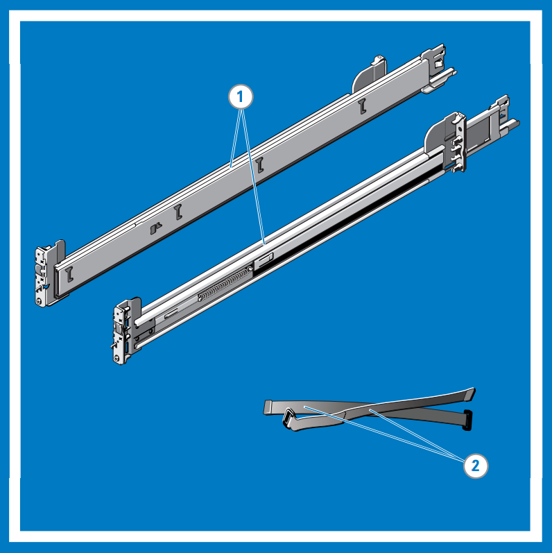

### Install and remove tool-less rails (Square hole or round hole racks)

> [!TIP]
> This option is tool-less because it does not require tools to install and remove the rails into the unthreaded square or round holes in the racks.

1. Position the left and right rail end pieces labeled **FRONT** facing inward and orient each end piece to seat in the holes on the front side of the vertical rack flanges.
2. Align each end piece in the bottom and top holes of the desired U spaces.
3. Engage the back end of the rail until it fully seats on the vertical rack flange and the latch clicks into place. Repeat these steps to position and seat the front-end piece on the vertical rack flange.
4. To remove the rails, pull the latch release button on the end piece midpoint and unseat each rail.

    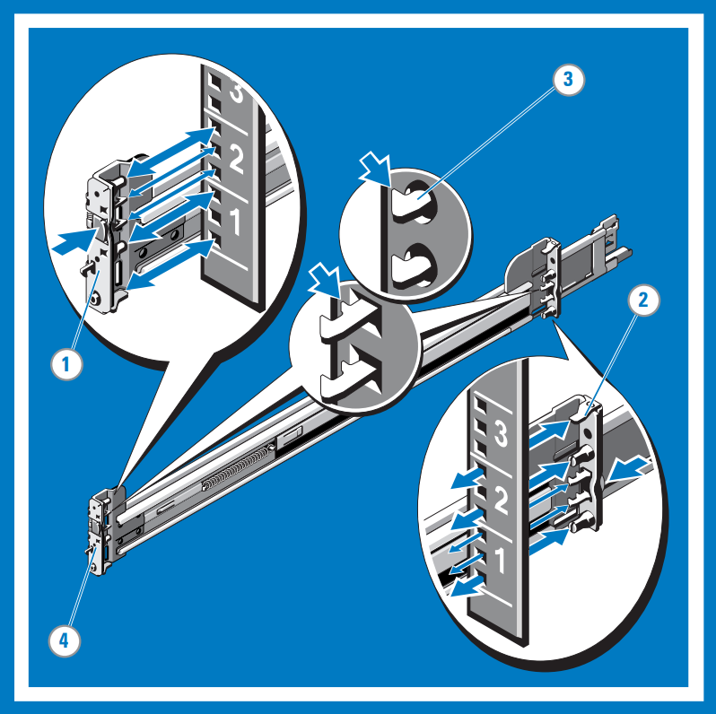

### Install and remove tooled rails (Threaded hole racks)

> [!TIP]
> This option is tooled because it requires a tool (_a flat-tipped screwdriver_) to install and remove the rails into the threaded round holes in the racks.

1. Remove the pins from the front and rear mounting brackets using a flat-tipped screwdriver.
2. Pull and rotate the rail latch subassemblies to remove them from the mounting brackets.
3. Attach the left and right mounting rails to the front vertical rack flanges using two pairs of screws.
4. Slide the left and right back brackets forward against the rear vertical rack flanges and attach them using two pairs of screws.

    

### Install the system in a rack

1. Pull the inner slide rails out of the rack until they lock into place.
2. Locate the rear rail standoff on each side of the system and lower them into the rear J-slots on the slide assemblies. Rotate the system downward until all the rail standoffs are seated in the J-slots.
3. Push the system inward until the lock levers click into place.
4. Press the slide-release lock buttons on both rails and slide the system into the rack.

    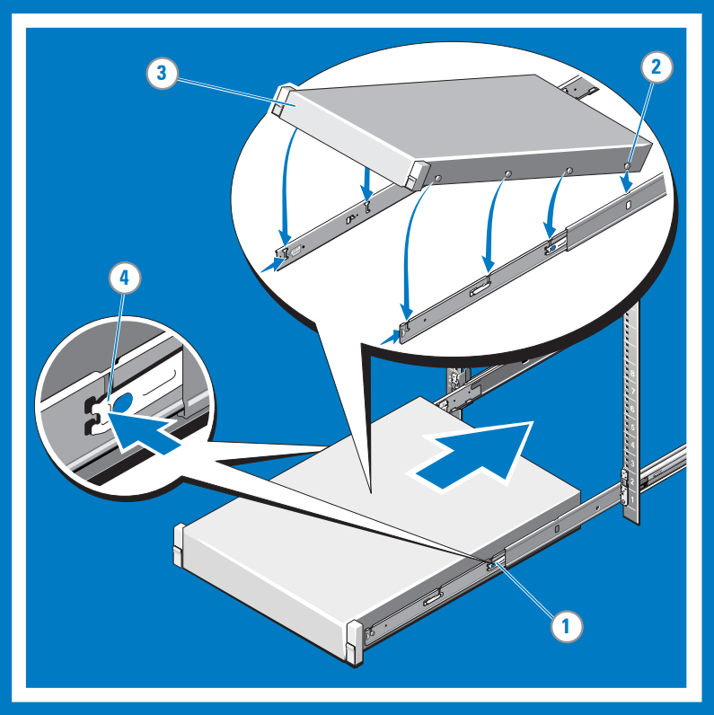

### Remove the system from the rack

1. Locate the lock levers on the sides of the inner rails.
2. Unlock each lever by rotating it up to its release position.
3. Grasp the sides of the system firmly and pull it forward until the rail standoffs are at the front of the J-slots. Lift the system up and away from the rack and place it on a level surface.

    

### Engage and release the slam latch

> [!NOTE]
> For systems not equipped with slam latches, secure the system using screws, as described in step 3 of this procedure.

1. Facing the front, locate the slam latch on either side of the system.
2. The latches engage automatically as the system is pushed into the rack and are released by pulling up on the latches.
3. To secure the system for shipment in the rack or for other unstable environments, locate the hard-mount screw under each latch and tighten each screw with a #2 Phillips screwdriver.

    

## Cable the device

Route the cables and then cable your device. The following procedures explain how to cable your Azure Stack Edge Pro device for power and network.

### Cabling checklist

::: zone pivot="single-node"

Before you start cabling your device, you need the following things:

- Your Azure Stack Edge Pro physical device, unpacked, and rack mounted.
- Two power cables.
- At least one 1-GbE RJ-45 network cable to connect to the management interface. There are two 1-GbE network interfaces, one management and one data, on the device.
- One 25/10-GbE SFP+ copper cable for each data network interface to be configured. At least one data network interface from among PORT 2, PORT 3, PORT 4, PORT 5, or PORT 6 needs to be connected to the Internet (with connectivity to Azure).  
- Access to two power distribution units (recommended).
- At least one 1-GbE network switch to connect a 1-GbE network interface to the Internet for data. The local web UI won't be accessible if the connected switch isn't at least 1 GbE. If using 25/10-GbE interface for data, you'll need a 25-GbE or 10-GbE switch.

> [!NOTE]
> - If you are connecting only one data network interface, we recommend that you use a 25/10-GbE network interface such as PORT 3, PORT 4, PORT 5, or PORT 6 to send data to Azure. 
> - For best performance and to handle large volumes of data, consider connecting all the data ports.
> - The Azure Stack Edge Pro device should be connected to the datacenter network so that it can ingest data from data source servers.

::: zone-end

::: zone pivot="two-node"

Before you start cabling your device, you need the following things:

- Both of your Azure Stack Edge physical devices, unpacked, and rack mounted.
- Four power cables, two for each device node. <!-- check w/ PIT team around how the bezel is shipped or attached to the device -->
- At least two 1-GbE RJ-45 network cables to connect Port 1 on each device node for initial configuration. <!-- check with Ernie if is clustered in the factory, only 1 node may be connected to mgmt -->
- At least two 1-GbE RJ-45 network cables to connect Port 2 on each device node to the internet (with connectivity to Azure).
- 25/10-GbE SFP+ copper cables for Port 3 and Port 4 to be configured. Additional 25/10-GbR SFP+ copper cables if you'll also connect Port 5 and Port 6. Port 5 and Port 6 must be connected if you intend to [Deploy network functions on Azure Stack Edge](../network-function-manager/deploy-functions.md).
- 25-GbE or 10-GbE switches if opting for a switched network topology. See [Supported network topologies](azure-stack-edge-gpu-clustering-overview.md).
- Access to two power distribution units (recommended).

> [!NOTE]
> - For best performance and to handle large volumes of data, consider connecting all the data ports. <!-- should we still say this given we ask them to choose specific topologies-->
> - The Azure Stack Edge Pro device should be connected to the datacenter network so that it can ingest data from data source servers.

::: zone-end

### Device front panel

The front panel on Azure Stack Edge device:

- Has disk drives and a power button.

    - There are 10 disk slots in the front of your device.
    - Slot 0 has a 240-GB SATA drive used as an operating system disk. Slot 1 is empty and slots 2 to 6 are NVMe SSDs used as data disks. Slots 7 to 9 are also empty.

### Device backplane

The backplane of Azure Stack Edge device: 

- Includes redundant power supply units (PSUs).
- Has six network interfaces:

    - Two 1-Gbps interfaces.
    - Four 25-Gbps interfaces that can also serve as 10-Gbps interfaces.
    - A baseboard management controller (BMC).

- Has two network cards corresponding to the six ports:

    - **Custom Microsoft `Qlogic` Cavium 25G NDC adapter** - Port 1 through port 4.
    - **Mellanox dual port 25G ConnectX-4 channel network adapter** - Port 5 and port 6.

For a full list of supported cables, switches, and transceivers for these network adapter cards, see:

- [`Qlogic` Cavium 25G NDC adapter interoperability matrix](https://www.marvell.com/documents/xalflardzafh32cfvi0z/).
- 25 GbE and 10 GbE cables and modules in [Mellanox dual port 25G ConnectX-4 channel network adapter compatible products](https://docs.mellanox.com/display/ConnectX4LxFirmwarev14271016/Firmware+Compatible+Products).

> [!NOTE]
> Using USB ports to connect any external device, including keyboards and monitors, is not supported for Azure Stack Edge devices.

### Power cabling 

Take the following steps to cable your device for power and network.

::: zone pivot="single-node"

1. Identify the various ports on the back plane of your device. You may have received one of the following devices from the factory depending on the number of GPUs in your device.

   

    - Device with two Peripheral Component Interconnect (PCI) slots and one GPU

        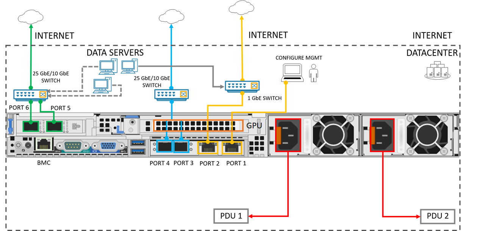

    - Device with three PCI slots and one GPU

        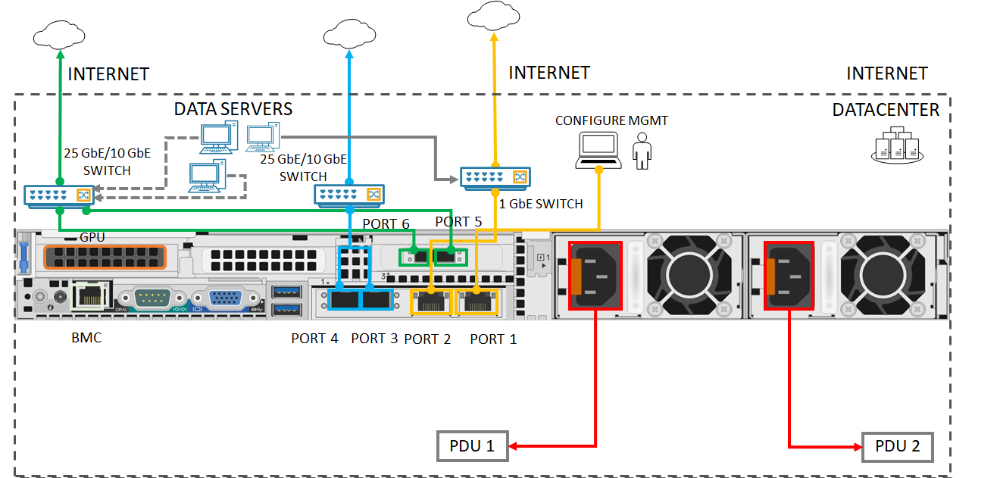

    - Device with three PCI slots and two GPUs

        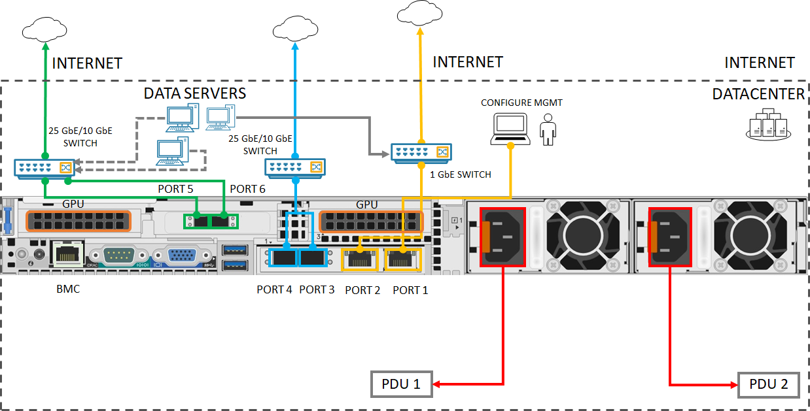

2. Locate the disk slots and the power button on the front of the device.

    

3. Connect the power cords to each of the PSUs in the enclosure. To ensure high availability, install and connect both PSUs to different power sources. 
4. Attach the power cords to the rack power distribution units (PDUs). Make sure that the two PSUs use separate power sources.
5. Press the power button to turn on the device.
6. Connect the 1-GbE network interface PORT 1 to the computer that's used to configure the physical device. PORT 1 serves as the management interface.
    
    > [!NOTE]
    > If connecting the computer directly to your device (without going through a switch), use an Ethernet crossover cable or a USB Ethernet adapter.

7. Connect one or more of PORT 2, PORT 3, PORT 4, PORT 5, or PORT 6 to the datacenter network/Internet.

    - If connecting PORT 2, use the 1-GbE RJ-45 network cable.
    - For the 10/25-GbE network interfaces, use the SFP+ copper cables or fiber. If using fiber, use an optical to SFP adapter.
    - For Network Function Manager deployments, make sure that PORT 5 and PORT 6 are connected. For more information, see [Tutorial: Deploy network functions on Azure Stack Edge (Preview)](../network-function-manager/deploy-functions.md).

::: zone-end

::: zone pivot="two-node"

1. Identify the various ports on the back plane of your device. <!--You may have received one of the following devices from the factory depending on the number of GPUs in your device.-->

    - Device with two Peripheral Component Interconnect (PCI) slots and one GPU
     
        

    - Device with three PCI slots and one GPU

        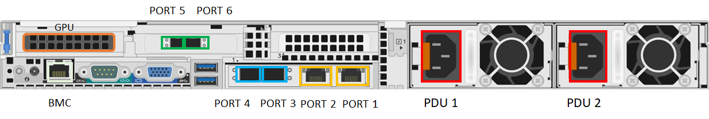
     
    - Device with three PCI slots and two GPUs

        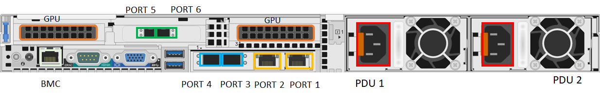   

2. Locate the disk slots and the power button on the front of the device.

    

3. Connect the power cords to each of the PSUs in the enclosure. 
1. To ensure high availability, the right power supply of the two devices should be connected to a Power Distribution Unit (PDU) or power source. The left power supply of both the devices should be connected to another PDU or power source. 

    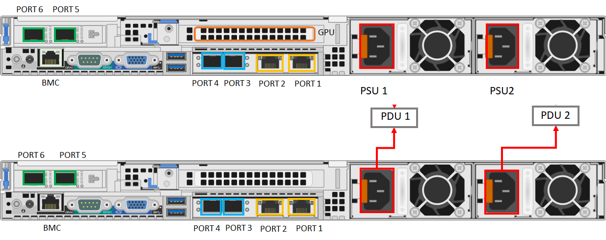

1. Press the power button in the front panel of the device to turn on the device.

### Network cabling

The two-node device can be configured in the following different ways: 

- Without switches.
- Connect Port 3 and Port 4 via switches.
- Connect Port 3 via a switch. 

Each of these configurations is described in the following sections. For more information on when to use these configurations, see [Supported network topologies](azure-stack-edge-gpu-clustering-overview.md)

#### Switchless

Use this configuration when high speed switches aren't available for storage and clustering traffic.

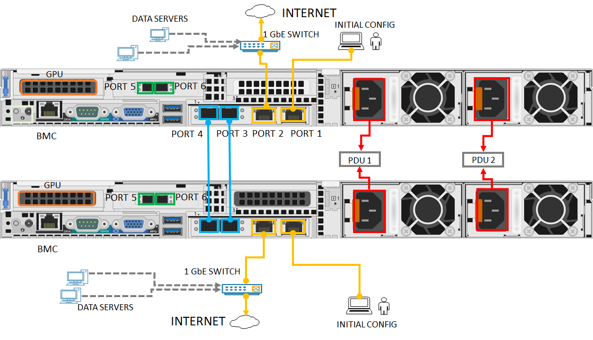

1. Connect the 1-GbE network interface PORT 1 to the computer that's used to configure the physical device. If connecting the computer directly to your device (without going through a switch), use an Ethernet crossover cable or a USB Ethernet adapter.
1. Connect PORT 2 to the internet using a 1-GbE RJ-45 network cable.
1. Connect PORT 3 and PORT 4 on both the devices via SFP+ copper cables or fiber. If using fiber, use an optical to SFP adapter.
 

#### Connect Port 3 and Port 4 via switches  

Use this configuration when you need port level redundancy through teaming.

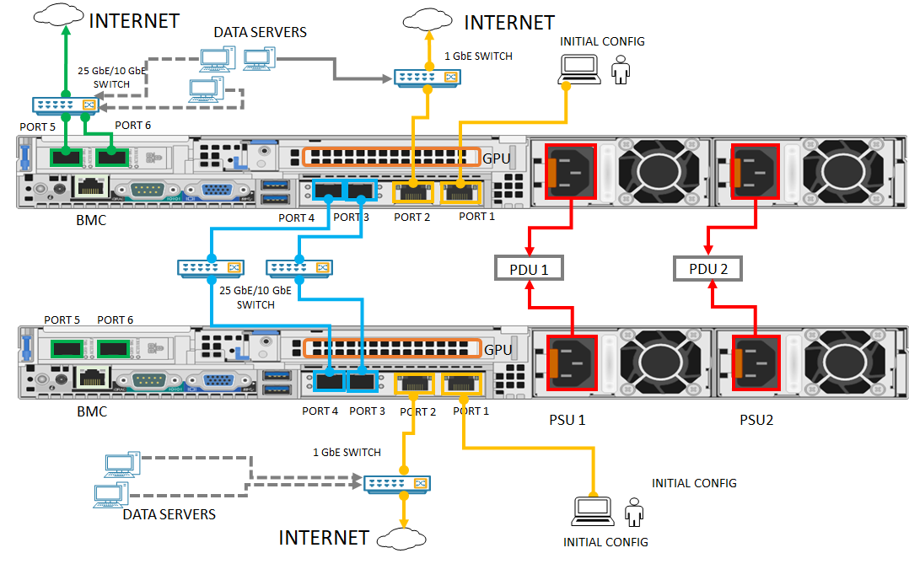

1. Connect the 1-GbE network interface PORT 1 to the computer that's used to configure the physical device. If connecting the computer directly to your device (without going through a switch), use an Ethernet crossover cable or a USB Ethernet adapter.
1. Connect PORT 2 to the internet using a 1-GbE RJ-45 network cable.
1. Connect PORT 3 and PORT 4 on both the devices via SFP+ copper cables or fiber and using a 10/25 GbE switch. If using fiber, use an optical to SFP adapter.

#### Connect Port 3 via switch

Use this configuration if you need an extra port for workload traffic and port level redundancy isn't required.

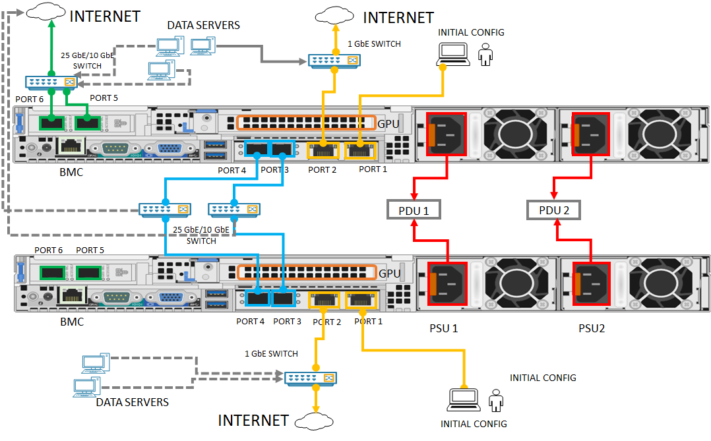

1. Connect the 1-GbE network interface PORT 1 to the computer that's used to configure the physical device. If connecting the computer directly to your device (without going through a switch), use an Ethernet crossover cable or a USB Ethernet adapter. 
1. Connect PORT 2 to the internet using a 1-GbE RJ-45 network cable.
1. Connect PORT 3 on both the devices via SFP+ copper cables or fiber and using a 10/25 GbE switch. If using fiber, use an optical to SFP adapter.

>[!NOTE]
> For Network Function Manager deployments, make sure that PORT 5 and PORT 6 are connected. For more information, see [Tutorial: Deploy network functions on Azure Stack Edge (Preview)](../network-function-manager/deploy-functions.md).   
 
::: zone-end

## Next steps

In this tutorial, you learned about Azure Stack Edge Pro GPU topics such as how to:

> [!div class="checklist"]
> * Unpack the device
> * Rack the device
> * Cable the device

Advance to the next tutorial to learn how to connect to your device.

> [!div class="nextstepaction"]
> [Connect Azure Stack Edge Pro](./azure-stack-edge-gpu-deploy-connect.md)
