# Deploy an IoT Edge workload using GPU sharing on your Azure Stack Edge Pro

This article describes how containerized workloads can share the GPUs on your Azure Stack Edge Pro GPU device. The approach involves enabling the Multi-Process Service (MPS) and then specifying the GPU workloads via an IoT Edge deployment. 

## Prerequisites

Before you begin, make sure that:

1. You've access to an Azure Stack Edge Pro GPU device that is [activated](azure-stack-edge-gpu-deploy-activate.md) and has [compute configured](azure-stack-edge-gpu-deploy-configure-compute.md). You have the [Kubernetes API endpoint](azure-stack-edge-gpu-deploy-configure-compute.md#get-kubernetes-endpoints) and you have added this endpoint to the `hosts` file on your client that will be accessing the device.

1. You've access to a client system with a [Supported operating system](azure-stack-edge-gpu-system-requirements.md#supported-os-for-clients-connected-to-device). If using a Windows client, the system should run PowerShell 5.0 or later to access the device.

1. Save the following deployment `json` on your local system. You'll use information from this file to run the IoT Edge deployment. This deployment is based on [Simple CUDA containers](https://docs.nvidia.com/cuda/wsl-user-guide/index.html#running-simple-containers) that are publicly available from Nvidia. 

    ```json
    {
        "modulesContent": {
            "$edgeAgent": {
                "properties.desired": {
                    "modules": {
                        "cuda-sample1": {
                            "settings": {
                                "image": "nvidia/samples:nbody",
                                "createOptions": "{\"Entrypoint\":[\"/bin/sh\"],\"Cmd\":[\"-c\",\"/tmp/nbody -benchmark -i=1000; while true; do echo no-op; sleep 10000;done\"],\"HostConfig\":{\"IpcMode\":\"host\",\"PidMode\":\"host\"}}"
                            },
                            "type": "docker",
                            "version": "1.0",
                            "env": {
                                "NVIDIA_VISIBLE_DEVICES": {
                                    "value": "0"
                                }
                            },
                            "status": "running",
                            "restartPolicy": "never"
                        },
                        "cuda-sample2": {
                            "settings": {
                                "image": "nvidia/samples:nbody",
                                "createOptions": "{\"Entrypoint\":[\"/bin/sh\"],\"Cmd\":[\"-c\",\"/tmp/nbody -benchmark -i=1000; while true; do echo no-op; sleep 10000;done\"],\"HostConfig\":{\"IpcMode\":\"host\",\"PidMode\":\"host\"}}"
                            },
                            "type": "docker",
                            "version": "1.0",
                            "env": {
                                "NVIDIA_VISIBLE_DEVICES": {
                                    "value": "0"
                                }
                            },
                            "status": "running",
                            "restartPolicy": "never"
                        }
                    },
                    "runtime": {
                        "settings": {
                            "minDockerVersion": "v1.25"
                        },
                        "type": "docker"
                    },
                    "schemaVersion": "1.1",
                    "systemModules": {
                        "edgeAgent": {
                            "settings": {
                                "image": "mcr.microsoft.com/azureiotedge-agent:1.0",
                                "createOptions": ""
                            },
                            "type": "docker"
                        },
                        "edgeHub": {
                            "settings": {
                                "image": "mcr.microsoft.com/azureiotedge-hub:1.0",
                                "createOptions": "{\"HostConfig\":{\"PortBindings\":{\"443/tcp\":[{\"HostPort\":\"443\"}],\"5671/tcp\":[{\"HostPort\":\"5671\"}],\"8883/tcp\":[{\"HostPort\":\"8883\"}]}}}"
                            },
                            "type": "docker",
                            "status": "running",
                            "restartPolicy": "always"
                        }
                    }
                }
            },
            "$edgeHub": {
                "properties.desired": {
                    "routes": {
                        "route": "FROM /messages/* INTO $upstream"
                    },
                    "schemaVersion": "1.1",
                    "storeAndForwardConfiguration": {
                        "timeToLiveSecs": 7200
                    }
                }
            },
            "cuda-sample1": {
                "properties.desired": {}
            },
            "cuda-sample2": {
                "properties.desired": {}
            }
        }
    }
    ```

## Verify GPU driver, CUDA version

The first step is to verify that your device is running required GPU driver and CUDA versions.

1. [Connect to the PowerShell interface of your device](azure-stack-edge-gpu-connect-powershell-interface.md#connect-to-the-powershell-interface).

1. Run the following command:

    `Get-HcsGpuNvidiaSmi`

1. In the Nvidia smi output, make a note of the GPU version and the CUDA version on your device. If you are running Azure Stack Edge 2102 software, this version would correspond to the following driver versions:

    - GPU driver version: 460.32.03
    - CUDA version: 11.2
    
    Here is an example output:

    ```powershell
    [10.100.10.10]: PS>Get-HcsGpuNvidiaSmi
    K8S-1HXQG13CL-1HXQG13:
    
    Tue Feb 23 10:34:01 2021
    +-----------------------------------------------------------------------------+
    | NVIDIA-SMI 460.32.03    Driver Version: 460.32.03    CUDA Version: 11.2     |
    |-------------------------------+----------------------+----------------------+
    | GPU  Name        Persistence-M| Bus-Id        Disp.A | Volatile Uncorr. ECC |
    | Fan  Temp  Perf  Pwr:Usage/Cap|         Memory-Usage | GPU-Util  Compute M. |
    |                               |                      |               MIG M. |
    |===============================+======================+======================|
    |   0  Tesla T4            On   | 0000041F:00:00.0 Off |                    0 |
    | N/A   40C    P8    15W /  70W |      0MiB / 15109MiB |      0%      Default |
    |                               |                      |                  N/A |
    +-------------------------------+----------------------+----------------------+
    
    +-----------------------------------------------------------------------------+
    | Processes:                                                                  |
    |  GPU   GI   CI        PID   Type   Process name                  GPU Memory |
    |        ID   ID                                                   Usage      |
    |=============================================================================|
    |  No running processes found                                                 |
    +-----------------------------------------------------------------------------+
    [10.100.10.10]: PS>  
    ```

1. Keep this session open as you will use it to view the Nvidia smi output throughout the article.


## Deploy without context-sharing

You can now deploy an application on your device when the Multi-Process Service is not running and there is no context-sharing. The deployment is via the Azure portal in the `iotedge` namespace that exists on your device.

### Create user in IoT Edge namespace

First you'll create a user that will connect to the `iotedge` namespace. The IoT Edge modules are deployed in the iotedge namespace. For more information, see [Kubernetes namespaces on your device](azure-stack-edge-gpu-kubernetes-rbac.md#namespaces-types).

Follow these steps to create a user and grant user the access to the `iotedge` namespace. 

1. [Connect to the PowerShell interface of your device](azure-stack-edge-gpu-connect-powershell-interface.md#connect-to-the-powershell-interface).

1. Create a new user in the `iotedge` namespace. Run the following command:

    `New-HcsKubernetesUser -UserName <user name>`

    Here is an example output:

    ```powershell
    [10.100.10.10]: PS>New-HcsKubernetesUser -UserName iotedgeuser
    apiVersion: v1
    clusters:
    - cluster:
        certificate-authority-data: 
    ===========================//snipped //======================// snipped //=============================
        server: https://compute.myasegpudev.wdshcsso.com:6443
      name: kubernetes
    contexts:
    - context:
        cluster: kubernetes
        user: iotedgeuser
      name: iotedgeuser@kubernetes
    current-context: iotedgeuser@kubernetes
    kind: Config
    preferences: {}
    users:
    - name: iotedgeuser
      user:
        client-certificate-data: 
    ===========================//snipped //======================// snipped //=============================
        client-key-data: 
    ===========================//snipped //======================// snipped ============================
    PQotLS0tLUVORCBSU0EgUFJJVkFURSBLRVktLS0tLQo=
    ```

1. Copy the output displayed in plain text. Save the output as a *config* file (with no extension) in the `.kube` folder of your user profile on your local machine, for example, `C:\Users\<username>\.kube`. 

1. Grant the user that you created, access to the `iotedge` namespace. Run the following command:

    `Grant-HcsKubernetesNamespaceAccess -Namespace iotedge -UserName <user name>`    

    Here is an example output:

    ```python
    [10.100.10.10]: PS>Grant-HcsKubernetesNamespaceAccess -Namespace iotedge -UserName iotedgeuser
    [10.100.10.10]: PS>    
    ```
For detailed instructions, see [Connect to and manage a Kubernetes cluster via kubectl on your Azure Stack Edge Pro GPU device](azure-stack-edge-gpu-create-kubernetes-cluster.md#configure-cluster-access-via-kubernetes-rbac).

### Deploy modules via portal

Deploy IoT Edge modules via the Azure portal. You'll deploy publicly available Nvidia CUDA sample modules that run n-body simulation.

1. Make sure that the IoT Edge service is running on your device.

    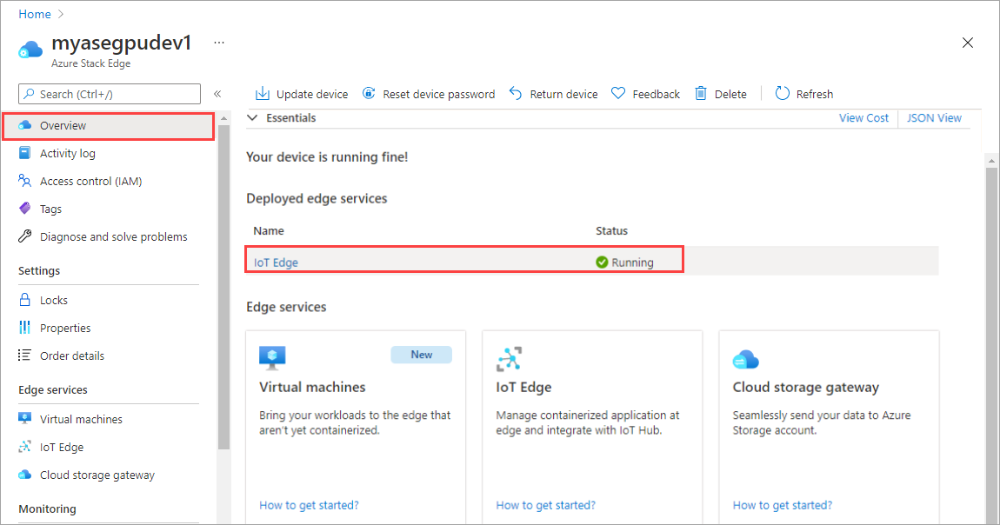

1. Select the IoT Edge tile in the right-pane. Go to **IoT Edge > Properties**. In the right-pane, select the IoT Hub resource associated with your device.

    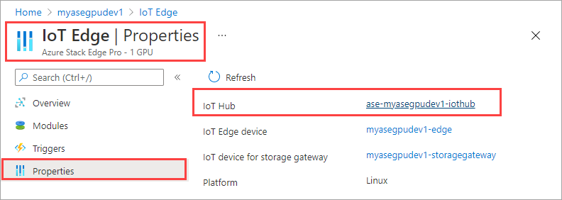

1. In the IoT Hub resource, go to **Automatic Device Management > IoT Edge**. In the right-pane, select the IoT Edge device associated with your device.

    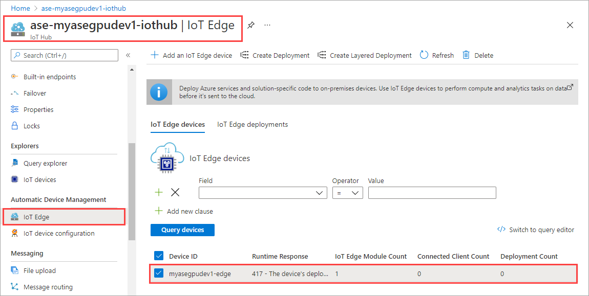

1. Select **Set modules**.

    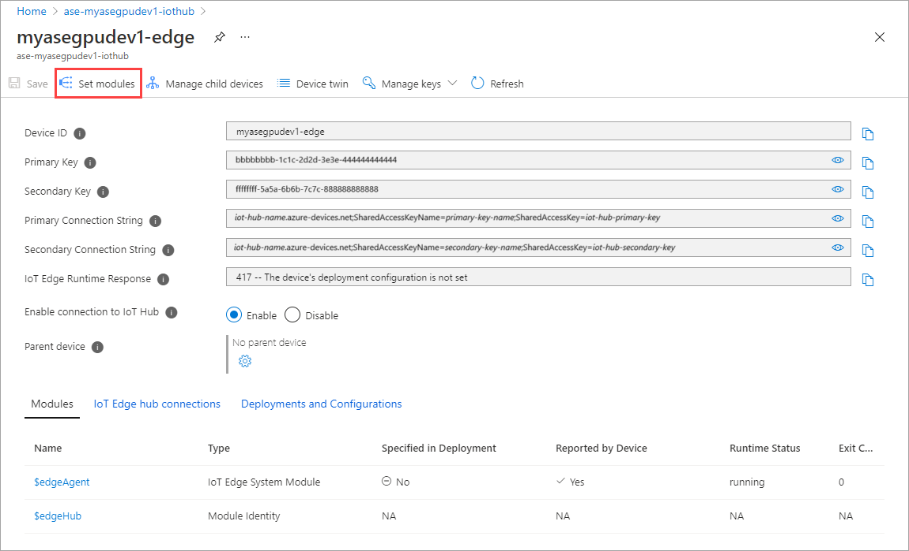

1. Select **+ Add > + IoT Edge module**.

    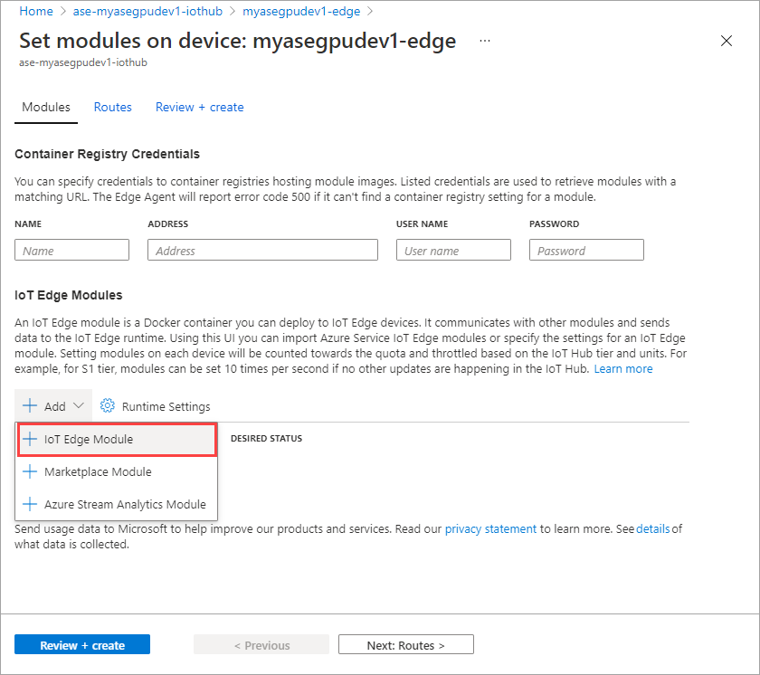

1. On the **Module Settings** tab, provide the **IoT Edge module name** and **Image URI**. Set **Image pull policy** to **On create**.

    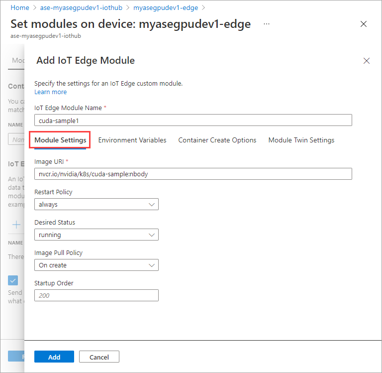
1. On the **Environment Variables** tab, specify **NVIDIA_VISIBLE_DEVICES** as **0**.

    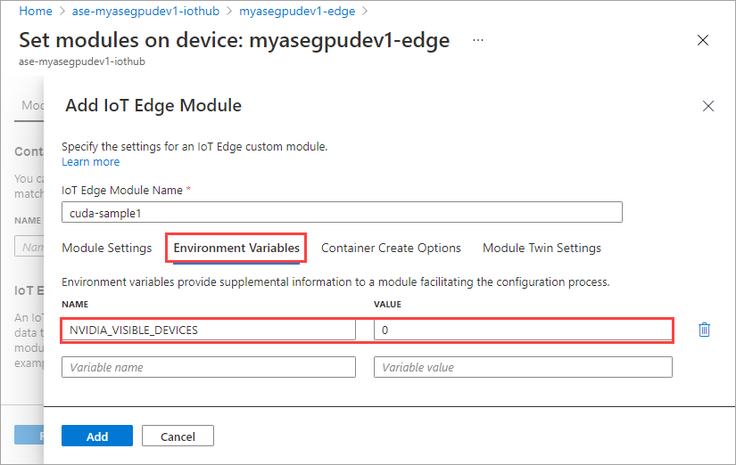

1. On the **Container Create Options** tab, provide the following options:

    ```json
    {
        "Entrypoint": [
            "/bin/sh"
        ],
        "Cmd": [
            "-c",
            "/tmp/nbody -benchmark -i=1000; while true; do echo no-op; sleep 10000;done"
        ],
        "HostConfig": {
            "IpcMode": "host",
            "PidMode": "host"
        }
    }    
    ```
    The options are displayed as follows:

    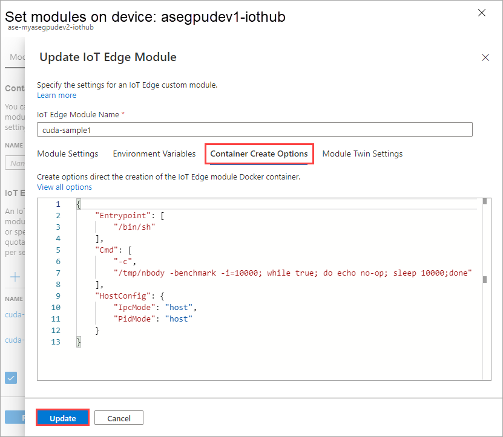

    Select **Add**.

1. The module that you added should show as **Running**. 

    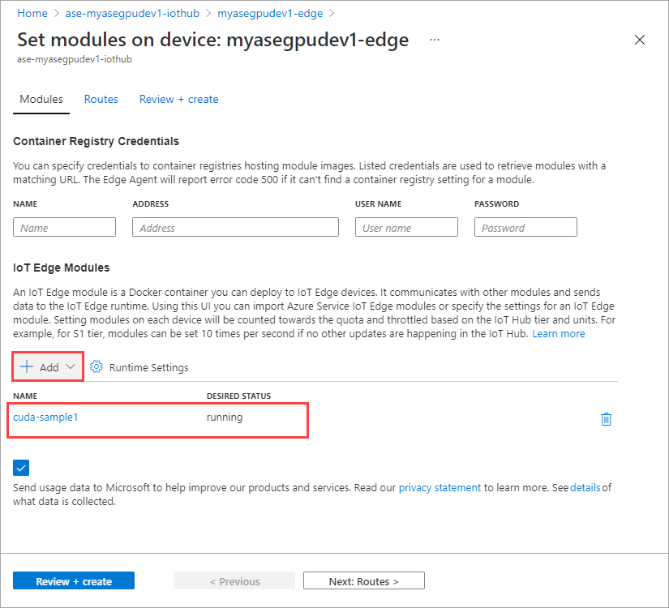


1. Repeat all the steps to add a module that you followed when adding the first module. In this example, provide the name of the module as `cuda-sample2`. 

    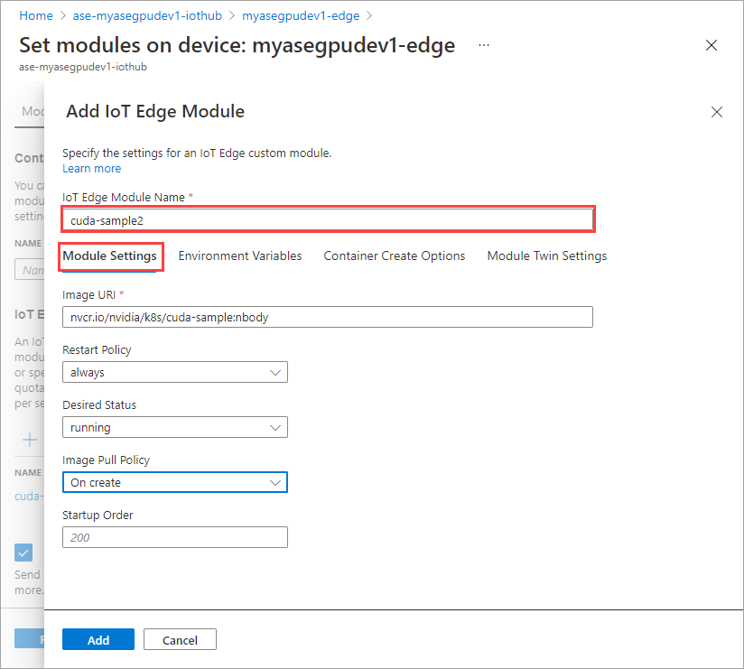

    Use the same environment variable as both the modules will share the same GPU.

    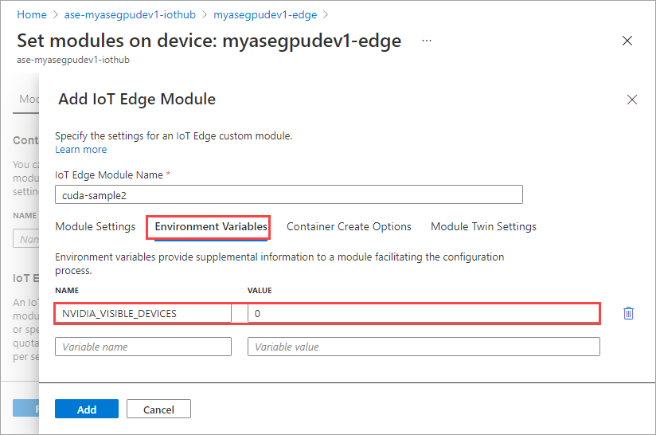

    Use the same container create options that you provided for the first module and select **Add**.

    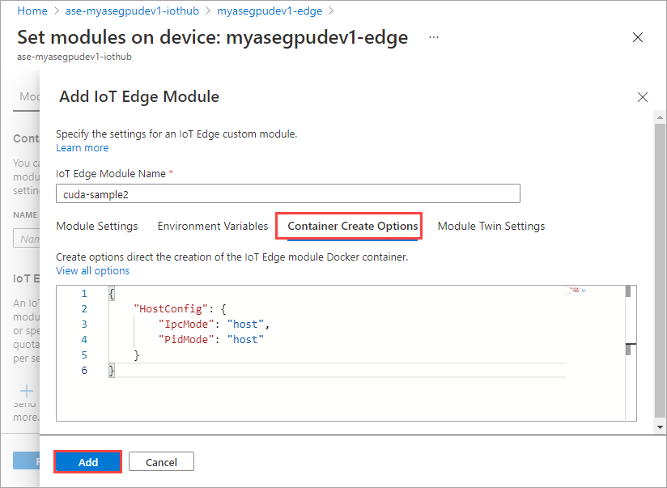

1. On the **Set modules** page, select **Review + Create** and then select **Create**. 

    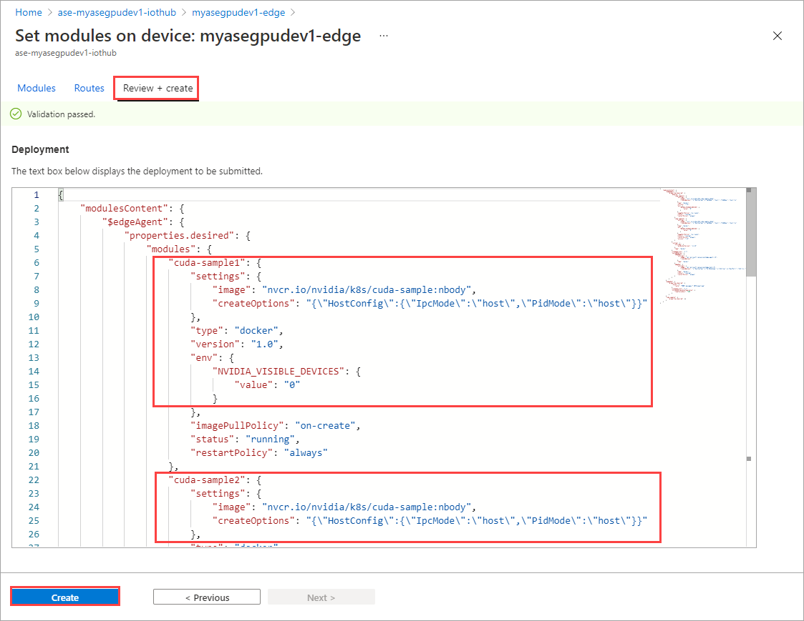

1. The **Runtime status** of both the modules should now show as **Running**.  

    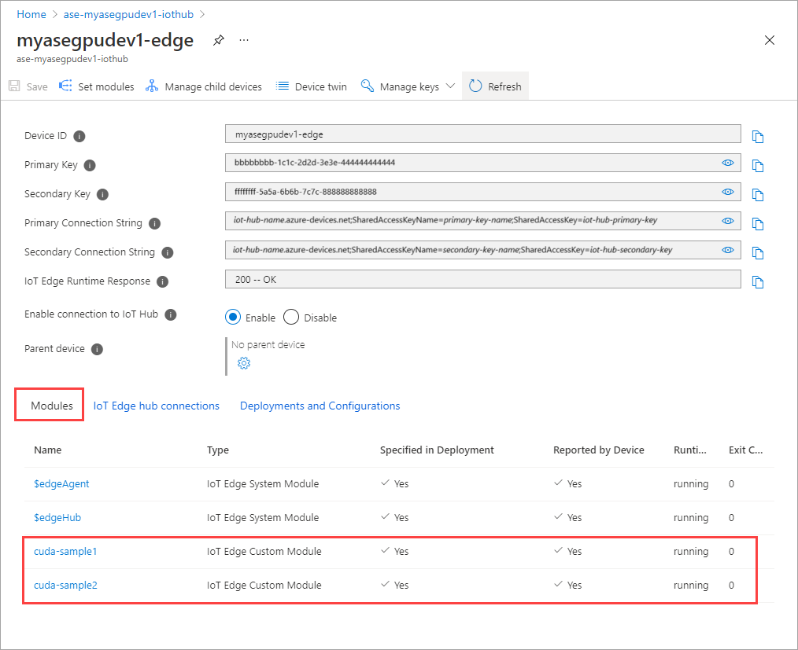


### Monitor workload deployment

1. Open a new PowerShell session.

1. List the pods running in the `iotedge` namespace. Run the following command:

    `kubectl get pods -n iotedge`   

    Here is an example output:

    ```powershell
    PS C:\WINDOWS\system32> kubectl get pods -n iotedge --kubeconfig C:\GPU-sharing\kubeconfigs\configiotuser1
    NAME                            READY   STATUS    RESTARTS   AGE
    cuda-sample1-869989578c-ssng8   2/2     Running   0          5s
    cuda-sample2-6db6d98689-d74kb   2/2     Running   0          4s
    edgeagent-79f988968b-7p2tv      2/2     Running   0          6d21h
    edgehub-d6c764847-l8v4m         2/2     Running   0          24h
    iotedged-55fdb7b5c6-l9zn8       1/1     Running   1          6d21h
    PS C:\WINDOWS\system32>   
    ```
    There are two pods, `cuda-sample1-97c494d7f-lnmns` and `cuda-sample2-d9f6c4688-2rld9` running on your device.

1. While both the containers are running the n-body simulation, view the GPU utilization from the Nvidia smi output. Go to the PowerShell interface of the device and run `Get-HcsGpuNvidiaSmi`.

    Here is an example output when both the containers are running the n-body simulation:

    ```powershell
    [10.100.10.10]: PS>Get-HcsGpuNvidiaSmi
    K8S-1HXQG13CL-1HXQG13:
    
    Fri Mar  5 13:31:16 2021
    +-----------------------------------------------------------------------------+
    | NVIDIA-SMI 460.32.03    Driver Version: 460.32.03    CUDA Version: 11.2     |
    |-------------------------------+----------------------+----------------------+
    | GPU  Name        Persistence-M| Bus-Id        Disp.A | Volatile Uncorr. ECC |
    | Fan  Temp  Perf  Pwr:Usage/Cap|         Memory-Usage | GPU-Util  Compute M. |
    |                               |                      |               MIG M. |
    |===============================+======================+======================|
    |   0  Tesla T4            On   | 00002C74:00:00.0 Off |                    0 |
    | N/A   52C    P0    69W /  70W |    221MiB / 15109MiB |    100%      Default |
    |                               |                      |                  N/A |
    +-------------------------------+----------------------+----------------------+
    
    +-----------------------------------------------------------------------------+
    | Processes:                                                                  |
    |  GPU   GI   CI        PID   Type   Process name                  GPU Memory |
    |        ID   ID                                                   Usage      |
    |=============================================================================|
    |    0   N/A  N/A    188342      C   /tmp/nbody                        109MiB |
    |    0   N/A  N/A    188413      C   /tmp/nbody                        109MiB |
    +-----------------------------------------------------------------------------+
    [10.100.10.10]: PS>
    ```
    As you can see, there are two containers running with n-body simulation on GPU 0. You can also view their corresponding memory usage.

1. Once the simulation has completed, the Nvidia smi output will show that there are no processes running on the device.

    ```powershell
    [10.100.10.10]: PS>Get-HcsGpuNvidiaSmi
    K8S-1HXQG13CL-1HXQG13:
    
    Fri Mar  5 13:54:48 2021
    +-----------------------------------------------------------------------------+
    | NVIDIA-SMI 460.32.03    Driver Version: 460.32.03    CUDA Version: 11.2     |
    |-------------------------------+----------------------+----------------------+
    | GPU  Name        Persistence-M| Bus-Id        Disp.A | Volatile Uncorr. ECC |
    | Fan  Temp  Perf  Pwr:Usage/Cap|         Memory-Usage | GPU-Util  Compute M. |
    |                               |                      |               MIG M. |
    |===============================+======================+======================|
    |   0  Tesla T4            On   | 00002C74:00:00.0 Off |                    0 |
    | N/A   34C    P8     9W /  70W |      0MiB / 15109MiB |      0%      Default |
    |                               |                      |                  N/A |
    +-------------------------------+----------------------+----------------------+
    
    +-----------------------------------------------------------------------------+
    | Processes:                                                                  |
    |  GPU   GI   CI        PID   Type   Process name                  GPU Memory |
    |        ID   ID                                                   Usage      |
    |=============================================================================|
    |  No running processes found                                                 |
    +-----------------------------------------------------------------------------+
    [10.100.10.10]: PS>
    ```
 
1. After the n-body simulation has completed, view the logs to understand the details of the deployment and the time required for the simulation to complete. 

    Here is an example output from the first container:

    ```powershell
    PS C:\WINDOWS\system32> kubectl -n iotedge  --kubeconfig C:\GPU-sharing\kubeconfigs\configiotuser1 logs cuda-sample1-869989578c-ssng8 cuda-sample1
    Run "nbody -benchmark [-numbodies=<numBodies>]" to measure performance.
    ==============// snipped //===================//  snipped  //=============
    > Windowed mode
    > Simulation data stored in video memory
    > Single precision floating point simulation
    > 1 Devices used for simulation
    GPU Device 0: "Turing" with compute capability 7.5
    
    > Compute 7.5 CUDA device: [Tesla T4]
    40960 bodies, total time for 10000 iterations: 170171.531 ms
    = 98.590 billion interactions per second
    = 1971.801 single-precision GFLOP/s at 20 flops per interaction
    no-op
    PS C:\WINDOWS\system32>
    ```
    Here is an example output from the second container:

    ```powershell
    PS C:\WINDOWS\system32> kubectl -n iotedge  --kubeconfig C:\GPU-sharing\kubeconfigs\configiotuser1 logs cuda-sample2-6db6d98689-d74kb cuda-sample2
    Run "nbody -benchmark [-numbodies=<numBodies>]" to measure performance.
    ==============// snipped //===================//  snipped  //=============
    > Windowed mode
    > Simulation data stored in video memory
    > Single precision floating point simulation
    > 1 Devices used for simulation
    GPU Device 0: "Turing" with compute capability 7.5
    
    > Compute 7.5 CUDA device: [Tesla T4]
    40960 bodies, total time for 10000 iterations: 170054.969 ms
    = 98.658 billion interactions per second
    = 1973.152 single-precision GFLOP/s at 20 flops per interaction
    no-op
    PS C:\WINDOWS\system32>
    ```

1. Stop the module deployment. In the IoT Hub resource for your device:
    1. Go to **Automatic Device Deployment > IoT Edge**. Select the IoT Edge device corresponding to your device.

    1. Go to **Set modules** and select a module. 

        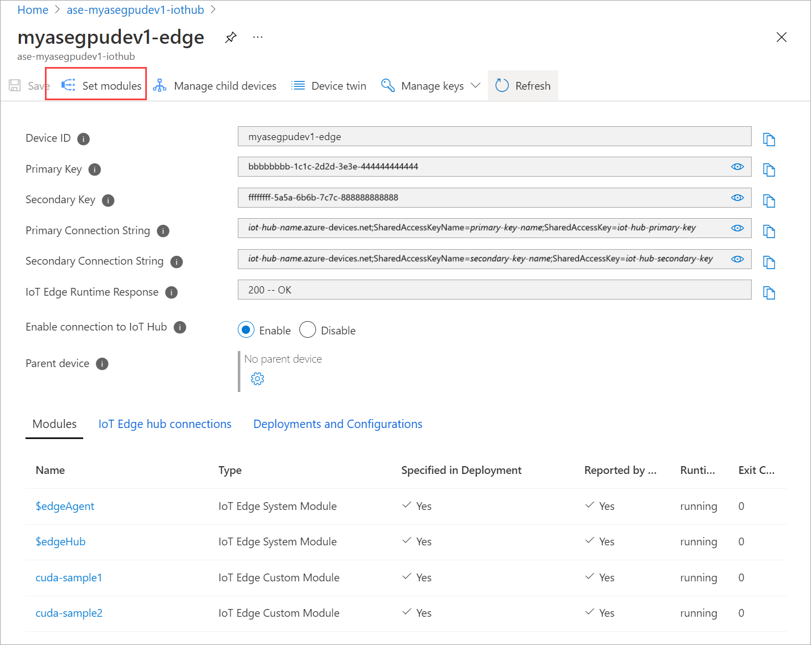

    1. On the **Modules** tab, select a module.
    
        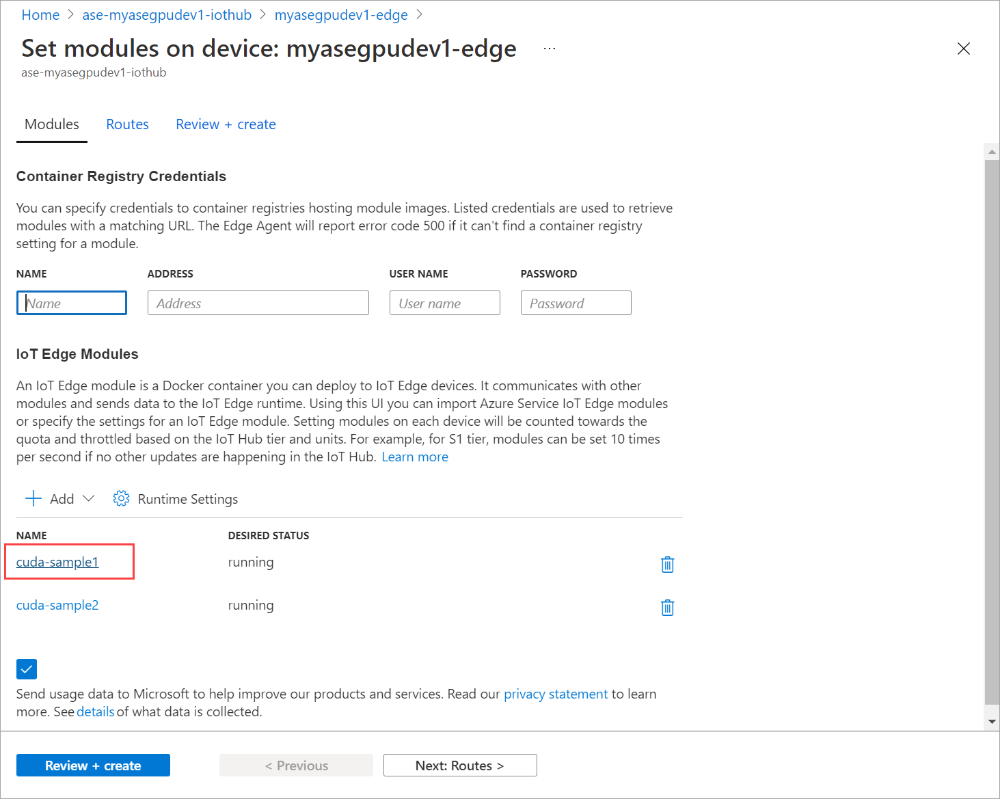

    1.  On the **Module settings** tab, set **Desired status** to stopped. Select **Update**.

        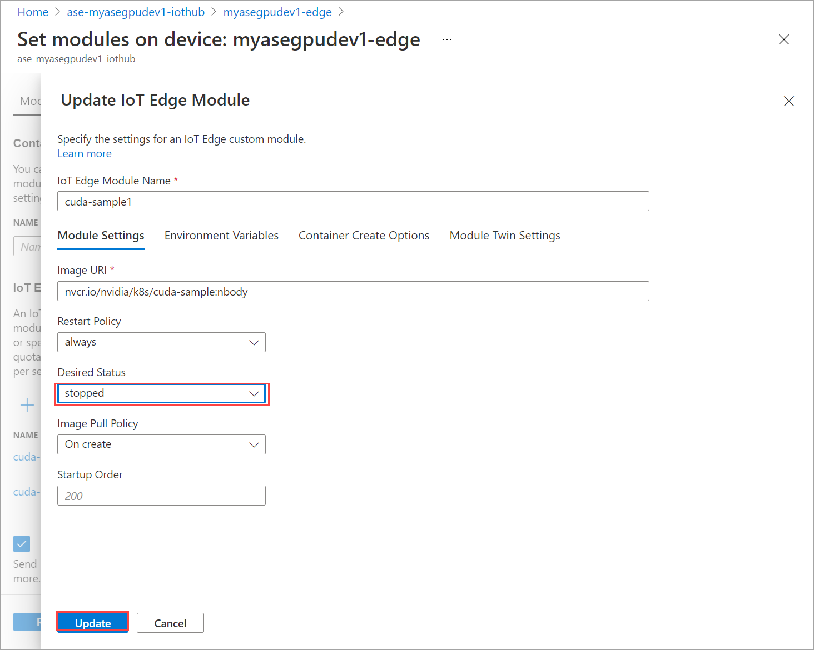

    1. Repeat the steps to stop the second module deployed on the device. Select **Review + create** and then select **Create**. This should update the deployment.

        
 
    1. Refresh **Set modules** page multiple times. until the module **Runtime status** shows as **Stopped**.

        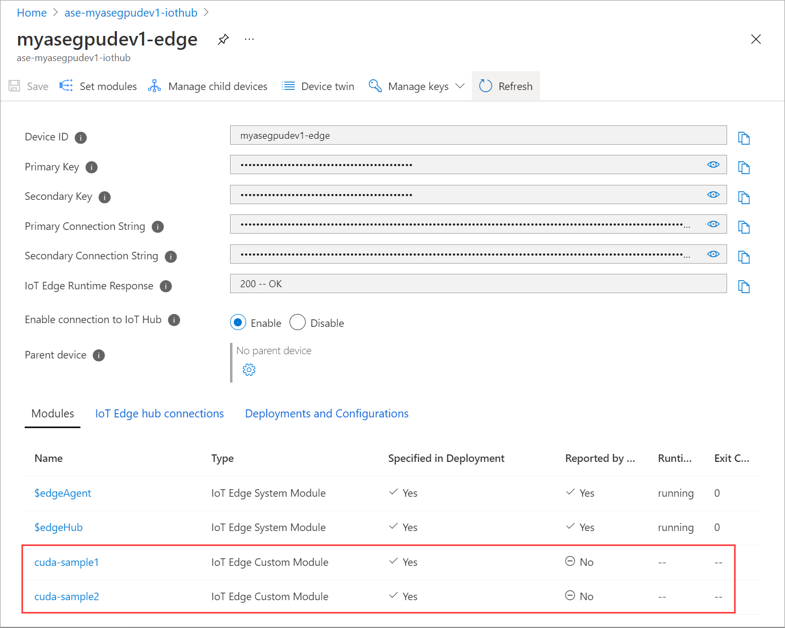 
    

## Deploy with context-sharing

You can now deploy the n-body simulation on two CUDA containers when MPS is running on your device. First, you'll enable MPS on the device.


1. [Connect to the PowerShell interface of your device](azure-stack-edge-gpu-connect-powershell-interface.md).

1. To enable MPS on your device, run the `Start-HcsGpuMPS` command.

    ```powershell
    [10.100.10.10]: PS>Start-HcsGpuMPS
    K8S-1HXQG13CL-1HXQG13:
    Set compute mode to EXCLUSIVE_PROCESS for GPU 0000191E:00:00.0.
    All done.
    Created nvidia-mps.service
    [10.100.10.10]: PS>    
    ```
1. Get the Nvidia smi output from the PowerShell interface of the device. You can see the `nvidia-cuda-mps-server` process or the MPS service is running on the device.

    Here is an example output:

    ```yml
    [10.100.10.10]: PS>Get-HcsGpuNvidiaSmi
    K8S-1HXQG13CL-1HXQG13:
    
    Thu Mar  4 12:37:39 2021
    +-----------------------------------------------------------------------------+
    | NVIDIA-SMI 460.32.03    Driver Version: 460.32.03    CUDA Version: 11.2     |
    |-------------------------------+----------------------+----------------------+
    | GPU  Name        Persistence-M| Bus-Id        Disp.A | Volatile Uncorr. ECC |
    | Fan  Temp  Perf  Pwr:Usage/Cap|         Memory-Usage | GPU-Util  Compute M. |
    |                               |                      |               MIG M. |
    |===============================+======================+======================|
    |   0  Tesla T4            On   | 00002C74:00:00.0 Off |                    0 |
    | N/A   36C    P8     9W /  70W |     28MiB / 15109MiB |      0%   E. Process |
    |                               |                      |                  N/A |
    +-------------------------------+----------------------+----------------------+
    
    +-----------------------------------------------------------------------------+
    | Processes:                                                                  |
    |  GPU   GI   CI        PID   Type   Process name                  GPU Memory |
    |        ID   ID                                                   Usage      |
    |=============================================================================|
    |    0   N/A  N/A    122792      C   nvidia-cuda-mps-server             25MiB |
    +-----------------------------------------------------------------------------+
    [10.100.10.10]: PS>Get-HcsGpuNvidiaSmi
    ```

1. Deploy the modules that you stopped earlier. Set the **Desired status** to running via **Set modules**.

    Here is the example output:

    ```yml
    PS C:\WINDOWS\system32> kubectl get pods -n iotedge --kubeconfig C:\GPU-sharing\kubeconfigs\configiotuser1
    NAME                            READY   STATUS    RESTARTS   AGE
    cuda-sample1-869989578c-2zxh6   2/2     Running   0          44s
    cuda-sample2-6db6d98689-fn7mx   2/2     Running   0          44s
    edgeagent-79f988968b-7p2tv      2/2     Running   0          5d20h
    edgehub-d6c764847-l8v4m         2/2     Running   0          27m
    iotedged-55fdb7b5c6-l9zn8       1/1     Running   1          5d20h
    PS C:\WINDOWS\system32>
    ```
    You can see that the modules are deployed and running on your device.

1. When the modules are deployed, the n-body simulation also starts running on both the containers. Here is the example output when the simulation has completed on the first container:

    ```powershell
    PS C:\WINDOWS\system32> kubectl -n iotedge logs cuda-sample1-869989578c-2zxh6 cuda-sample1
    Run "nbody -benchmark [-numbodies=<numBodies>]" to measure performance.
    ==============// snipped //===================//  snipped  //=============
    
    > Windowed mode
    > Simulation data stored in video memory
    > Single precision floating point simulation
    > 1 Devices used for simulation
    GPU Device 0: "Turing" with compute capability 7.5
    
    > Compute 7.5 CUDA device: [Tesla T4]
    40960 bodies, total time for 10000 iterations: 155256.062 ms
    = 108.062 billion interactions per second
    = 2161.232 single-precision GFLOP/s at 20 flops per interaction
    no-op
    PS C:\WINDOWS\system32> 
    ```
    Here is the example output when the simulation has completed on the second container:

    ```powershell
    PS C:\WINDOWS\system32> kubectl -n iotedge  --kubeconfig C:\GPU-sharing\kubeconfigs\configiotuser1 logs cuda-sample2-6db6d98689-fn7mx cuda-sample2
    Run "nbody -benchmark [-numbodies=<numBodies>]" to measure performance.
    ==============// snipped //===================//  snipped  //=============
    
    > Windowed mode
    > Simulation data stored in video memory
    > Single precision floating point simulation
    > 1 Devices used for simulation
    GPU Device 0: "Turing" with compute capability 7.5
    
    > Compute 7.5 CUDA device: [Tesla T4]
    40960 bodies, total time for 10000 iterations: 155366.359 ms
    = 107.985 billion interactions per second
    = 2159.697 single-precision GFLOP/s at 20 flops per interaction
    no-op
    PS C:\WINDOWS\system32>    
    ```      

1. Get the Nvidia smi output from the PowerShell interface of the device when both the containers are running the n-body simulation. Here is an example output. There are three processes, the `nvidia-cuda-mps-server` process (type C) corresponds to the MPS service and the `/tmp/nbody` processes (type M + C) correspond to the n-body workloads deployed by the modules. 

    ```powershell
    [10.100.10.10]: PS>Get-HcsGpuNvidiaSmi
    K8S-1HXQG13CL-1HXQG13:
    
    Thu Mar  4 12:59:44 2021
    +-----------------------------------------------------------------------------+
    | NVIDIA-SMI 460.32.03    Driver Version: 460.32.03    CUDA Version: 11.2     |
    |-------------------------------+----------------------+----------------------+
    | GPU  Name        Persistence-M| Bus-Id        Disp.A | Volatile Uncorr. ECC |
    | Fan  Temp  Perf  Pwr:Usage/Cap|         Memory-Usage | GPU-Util  Compute M. |
    |                               |                      |               MIG M. |
    |===============================+======================+======================|
    |   0  Tesla T4            On   | 00002C74:00:00.0 Off |                    0 |
    | N/A   54C    P0    69W /  70W |    242MiB / 15109MiB |    100%   E. Process |
    |                               |                      |                  N/A |
    +-------------------------------+----------------------+----------------------+
    
    +-----------------------------------------------------------------------------+
    | Processes:                                                                  |
    |  GPU   GI   CI        PID   Type   Process name                  GPU Memory |
    |        ID   ID                                                   Usage      |
    |=============================================================================|
    |    0   N/A  N/A     56832    M+C   /tmp/nbody                        107MiB |
    |    0   N/A  N/A     56900    M+C   /tmp/nbody                        107MiB |
    |    0   N/A  N/A    122792      C   nvidia-cuda-mps-server             25MiB |
    +-----------------------------------------------------------------------------+
    [10.100.10.10]: PS>Get-HcsGpuNvidiaSmi
    ```
    
## Next steps

- [Deploy a shared GPU Kubernetes workload on your Azure Stack Edge Pro](azure-stack-edge-gpu-deploy-kubernetes-gpu-sharing.md).
